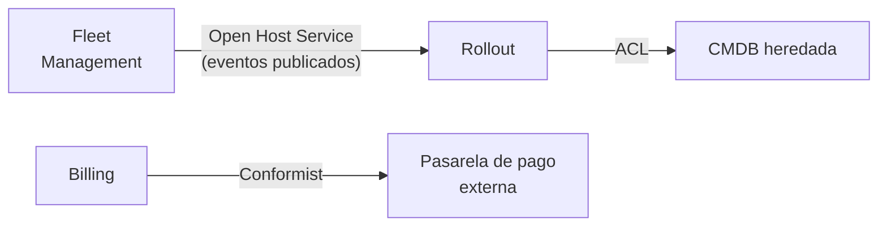

# Domain-Driven Design <span class="nivel avanzado">Avanzado</span>

> *Eric Evans, 2003.* Idea central: en software complejo, la mayor dificultad no es técnica sino **entender el dominio
> de negocio**. El código debe modelar ese dominio, construido junto a los expertos, con un **lenguaje común**.

DDD tiene dos partes: el **diseño estratégico** (cómo dividir un sistema grande en partes con sentido de negocio) y el
**diseño táctico** (cómo modelar el interior de cada parte). Para un arquitecto, la estratégica es la más importante.

---

## 1. Diseño estratégico

### Dominio y subdominios

El **dominio** es el área de negocio que el software resuelve. Se divide en **subdominios** que no tienen la misma importancia:

| Tipo | Qué es | Estrategia | Ejemplo en una plataforma edge |
|---|---|---|---|
| **Core** (principal) | Lo que diferencia a la empresa; ventaja competitiva | Construirlo con el mejor equipo, invertir en diseño | Orquestación de *rollouts* sobre la flota |
| **Supporting** (de apoyo) | Necesario y específico, pero no diferencia | Construirlo de forma sencilla | Inventario de hardware de los sitios |
| **Generic** (genérico) | Problema resuelto en el mercado | **Comprar o usar un servicio** | Identidad (Entra ID, Keycloak), facturación, email |

!!! tip "Dónde invertir"
    Construir a medida un subdominio genérico (tu propio sistema de autenticación) desperdicia esfuerzo; tratar el core
    como genérico (comprar algo que te iguala a la competencia) pierde la ventaja.

### Lenguaje ubicuo

Un vocabulario **compartido y preciso** entre expertos de negocio y desarrolladores, que se usa igual en conversaciones,
documentación, código y tests. Si negocio dice "oleada" y el código dice `batch`, cada conversación requiere traducción y
aparecen malentendidos. El código debe decir `Wave`.

### Bounded context (contexto delimitado)

Una frontera **explícita** dentro de la cual un modelo y su lenguaje son coherentes. Fuera de ella, la misma palabra
puede significar otra cosa.

!!! example "La misma palabra, dos modelos"
    En el contexto **Fleet**, un *Node* es un dispositivo físico: número de serie, hardware, ubicación, garantía.
    En el contexto **Rollout**, un *Node* es un destino de despliegue: versión actual, oleada asignada, resultado.
    Forzar un único `Node` con todos esos campos crea una clase enorme que cambia por motivos de ambos equipos.
    Con dos contextos, cada uno tiene su propio modelo, y se relacionan por el identificador del nodo.

Un *bounded context* es el mejor candidato a **módulo** de un monolito modular o a **servicio** independiente, y
normalmente lo mantiene **un equipo**.

### Context map (mapa de contextos)

Documenta cómo se relacionan los contextos. Las relaciones reflejan también relaciones **entre equipos**:

| Patrón | Significado | Cuándo |
|---|---|---|
| **Customer / Supplier** | El de abajo (*downstream*) depende del de arriba (*upstream*) y puede negociar sus necesidades | Equipos que colaboran |
| **Conformist** | El de abajo acepta el modelo del de arriba tal cual | No tienes influencia (proveedor externo) y su modelo es aceptable |
| **Anticorruption Layer (ACL)** | El de abajo traduce el modelo externo al suyo para no "contaminarse" | Sistemas heredados o externos con modelos confusos |
| **Open Host Service / Published Language** | El de arriba ofrece una API o formato estable y documentado para todos | Un contexto con muchos consumidores |
| **Shared Kernel** | Dos contextos comparten una parte pequeña del modelo | Equipos muy próximos; acoplamiento fuerte, con cuidado |
| **Separate Ways** | No se integran | La integración cuesta más que lo que aporta |



---

## 2. Diseño táctico

Bloques para modelar el interior de un *bounded context*:

| Bloque | Qué es | Cómo reconocerlo | Ejemplo |
|---|---|---|---|
| **Entidad** | Objeto con **identidad** que perdura aunque cambien sus atributos | Importa **cuál** es, no solo cómo es | `EdgeNode(id)`, `Rollout(id)` |
| **Value Object** | Definido **solo por sus valores**; inmutable y reemplazable | Dos con los mismos valores son intercambiables | `Money`, `SemVer`, `GeoLocation`, `IpRange` |
| **Agregado** | Grupo de entidades y value objects con una **raíz** que garantiza las reglas (invariantes); unidad de consistencia transaccional | "Esta regla debe cumplirse siempre, dentro de una transacción" | `Rollout` con sus `Waves` |
| **Repositorio** | Abstracción para guardar y recuperar **agregados completos** (uno por agregado) | Métodos en lenguaje de negocio | `RolloutRepository.findActiveFor(region)` |
| **Evento de dominio** | Algo relevante para el negocio que ocurrió | Nombre en pasado | `WaveCompleted`, `RolloutHalted` |
| **Servicio de dominio** | Lógica de negocio que no pertenece a una sola entidad | Operación sobre varios agregados o sin estado | `CompatibilityChecker` |
| **Fábrica** | Crea agregados complejos válidos | Construcción con muchas reglas | `RolloutFactory.plan(fleet, release)` |

### Ejemplo: agregado Rollout

```java
public class Rollout {                                  // raíz del agregado: la única puerta de entrada
    private final RolloutId id;
    private final SemVer targetVersion;
    private final List<Wave> waves;                     // no se exponen para modificarlas desde fuera
    private RolloutStatus status = RolloutStatus.PLANNED;
    private final List<DomainEvent> events = new ArrayList<>();

    public void start() {
        if (status != RolloutStatus.PLANNED) throw new IllegalStateException("Solo se inicia un rollout planificado");
        status = RolloutStatus.IN_PROGRESS;
        events.add(new RolloutStarted(id, targetVersion));
    }

    public void completeWave(int index, double errorRate) {
        if (status != RolloutStatus.IN_PROGRESS) throw new IllegalStateException("Rollout no activo");
        if (errorRate > 0.02) {                          // invariante de negocio protegida por la raíz
            status = RolloutStatus.HALTED;
            events.add(new RolloutHalted(id, index, errorRate));
            return;
        }
        waves.get(index).markCompleted();
        events.add(new WaveCompleted(id, index));
        if (waves.stream().allMatch(Wave::isCompleted)) status = RolloutStatus.DONE;
    }

    public List<DomainEvent> pullEvents() {              // el servicio de aplicación los publica tras guardar
        var copy = List.copyOf(events);
        events.clear();
        return copy;
    }
}

public record SemVer(int major, int minor, int patch) implements Comparable<SemVer> {   // value object
    public SemVer {
        if (major < 0 || minor < 0 || patch < 0) throw new IllegalArgumentException("SemVer inválido");
    }
    public int compareTo(SemVer o) {
        return Comparator.comparingInt(SemVer::major).thenComparingInt(SemVer::minor)
                         .thenComparingInt(SemVer::patch).compare(this, o);
    }
}
```

Fíjate en que **las reglas viven en el agregado**, no en un servicio: nadie puede marcar una oleada como completada sin
pasar por la comprobación del umbral de errores. Un modelo donde las entidades solo tienen *getters* y *setters* y toda
la lógica está en servicios se llama **modelo anémico** y pierde esa protección.

### Reglas de diseño de agregados (Vaughn Vernon)

1. **Modela invariantes reales** dentro del límite del agregado: solo lo que debe ser consistente **en la misma transacción**.
2. **Diseña agregados pequeños**: agregados grandes generan contención (dos usuarios modificando partes distintas chocan)
   y cargas costosas.
3. **Referencia otros agregados por identidad** (`NodeId`), no por objeto: evita cargar grafos enormes y deja claro el límite.
4. **Usa consistencia eventual fuera del agregado**: si otro agregado debe reaccionar, publica un evento de dominio.

---

## 3. Event Storming

Taller visual (Alberto Brandolini) para descubrir el dominio con expertos de negocio y técnicos en la misma sala:

1. **Eventos de dominio** (notas naranjas) en una línea temporal: "Sitio dado de alta", "Oleada completada"…
2. **Comandos** (azules) que los provocan y **actores** (amarillas pequeñas) que los lanzan.
3. **Políticas** ("cuando ocurra X, hacer Y") y **sistemas externos**.
4. **Agregados** que reciben los comandos y producen los eventos.
5. Agrupar y trazar **límites**: aparecen los *bounded contexts* candidatos.

Es especialmente útil para partir un monolito o arrancar un proyecto con un dominio poco conocido.

## Preguntas de repaso

??? question "¿Entidad o Value Object?"
    La **entidad** tiene identidad estable (dos `EdgeNode` con los mismos datos pero distinto ID son distintos y el mismo
    nodo sigue siéndolo aunque cambie su IP). El **value object** se define por sus valores, es inmutable y se reemplaza
    entero (`Money(10, EUR)` es igual a cualquier otro `Money(10, EUR)`).

??? question "¿Por qué una transacción no debería modificar varios agregados?"
    Cada agregado es una unidad de consistencia. Modificar varios en una transacción aumenta la contención, el acoplamiento
    y el riesgo de conflictos; se modifica uno y se propaga el cambio a los demás con eventos de dominio.

??? question "¿Qué es una Anticorruption Layer?"
    Una capa de traducción que protege tu modelo del de otro sistema (a menudo heredado o externo), convirtiendo sus
    conceptos a tu lenguaje ubicuo para que sus rarezas no se filtren a tu código.

??? question "¿Qué es un modelo anémico y por qué es un problema?"
    Entidades que solo tienen datos (*getters/setters*) mientras la lógica vive en servicios. Las reglas de negocio quedan
    dispersas y cualquiera puede dejar un objeto en un estado inválido.

## Ejercicios

!!! exercise "Ejercicio 1 · Básico — Clasificar subdominios"
    Para una empresa que vende una plataforma de gestión de flotas edge, clasifica: gestión de *rollouts*, autenticación
    de usuarios, inventario de hardware, facturación, detección de anomalías en telemetría, envío de emails.

    ??? success "Solución"
        **Core**: gestión de *rollouts* y detección de anomalías (lo que el cliente paga y diferencia el producto).
        **Supporting**: inventario de hardware (específico pero no diferencia). **Generic**: autenticación, facturación y
        emails (usar productos existentes: IdP, plataforma de facturación, servicio de email).

!!! exercise "Ejercicio 2 · Básico — Entidad o Value Object"
    Clasifica: `SiteId`, `Site`, `IpRange`, `Certificate` (con número de serie, puede revocarse), `Coordinates`, `Deployment`.

    ??? success "Solución"
        Value objects: `SiteId` (un identificador es un valor), `IpRange`, `Coordinates`. Entidades: `Site`, `Deployment`,
        `Certificate` (tiene identidad —número de serie— y ciclo de vida: emitido, revocado, caducado).

!!! exercise "Ejercicio 3 · Medio — Límites de un agregado"
    Regla de negocio: "un sitio no puede tener dos despliegues en curso a la vez". Un compañero propone un agregado
    `Region` que contiene todos sus sitios y despliegues para poder comprobarlo. ¿Qué opinas y qué propones?

    ??? success "Solución"
        El agregado `Region` sería enorme (miles de sitios y su histórico): cargas costosas y contención (dos despliegues en
        sitios distintos de la región chocarían). La invariante es **por sitio**, así que basta un agregado `Site` (o
        `SiteDeploymentSlot`) que registre el despliegue activo: `site.startDeployment(deploymentId)` falla si ya hay uno.
        Los despliegues se referencian por ID. Refuerzo técnico: bloqueo optimista en `Site` o un índice único parcial en la
        base de datos (`UNIQUE (site_id) WHERE status = 'RUNNING'`).

!!! exercise "Ejercicio 4 · Avanzado — Diseñar un context map"
    Tu plataforma tiene: Fleet (inventario de sitios), Rollout (despliegues), Observability (telemetría y alertas), Billing
    (facturación por sitio activo) y una CMDB corporativa heredada que no controlas. Dibuja las relaciones y justifícalas.

    ??? success "Solución"
        - **Fleet → Rollout, Observability, Billing**: *Open Host Service* con *Published Language* (eventos `SiteRegistered`,
          `SiteDecommissioned` con esquema versionado): Fleet es la fuente de verdad de qué sitios existen y tiene varios consumidores.
        - **Rollout → Observability**: *Customer/Supplier*: Rollout necesita métricas de error por sitio para decidir oleadas
          y puede negociar qué expone Observability.
        - **Fleet → CMDB**: *Anticorruption Layer*: la CMDB tiene un modelo propio (CIs, relaciones genéricas); un adaptador
          traduce a/desde el modelo de Fleet para no contaminarlo.
        - **Billing**: *Conformist* respecto a la plataforma de facturación externa que use.
        Cada relación implica también una relación entre equipos: quién decide los cambios del contrato y quién se adapta.
