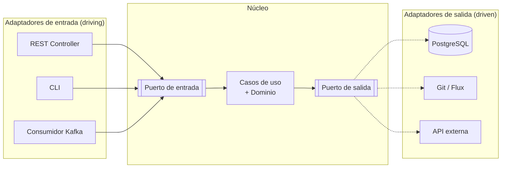
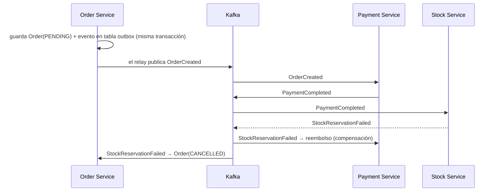
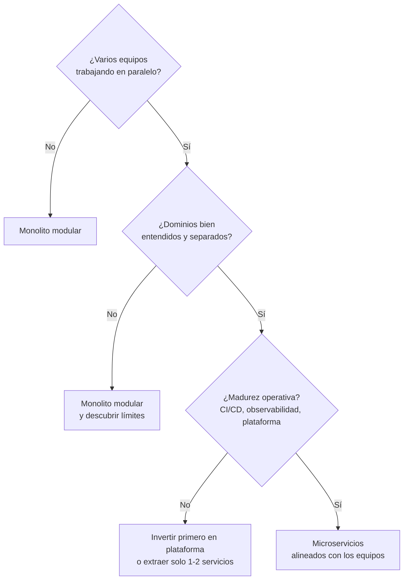

# Estilos de arquitectura <span class="nivel medio">Medio</span>

Un **estilo de arquitectura** es la forma general de organizar un sistema: cómo se divide en partes, cómo se comunican
y cómo se despliegan. No hay un estilo "mejor": cada uno optimiza unas **características** (escalabilidad, simplicidad,
autonomía de equipos…) y sacrifica otras. La pregunta que siempre hay que saber responder es **"¿por qué X y no Y?"**.

## Mapa rápido

| Estilo | Optimiza | Sacrifica | Cuándo |
|---|---|---|---|
| Monolito en capas | Simplicidad, coste | Modularidad, escalado independiente | Aplicaciones pequeñas, un equipo |
| **Monolito modular** | Simplicidad + límites claros | Despliegue independiente | **Punto de partida por defecto** hoy |
| **Hexagonal / Clean** | Testabilidad, independencia de la infraestructura | Más código (interfaces, *mappers*) | Dominio con lógica rica |
| **Microservicios** | Despliegue y escalado independientes, autonomía de equipos | Complejidad operativa, consistencia de datos | Varios equipos, dominios bien separados |
| **Dirigido por eventos** | Desacoplamiento, escalabilidad, reacción en tiempo real | Trazabilidad, consistencia eventual | Integración entre dominios, flujos asíncronos |
| Serverless | Coste por uso, cero operación de servidores | Arranques en frío, dependencia del proveedor, límites | Cargas esporádicas, *glue code* |
| Basado en celdas | Aislamiento de fallos, escalado casi ilimitado | Complejidad de enrutado y operación | Multi-tenant a gran escala |

---

## Monolito en capas

La organización clásica: **presentación** (controladores) → **negocio** (servicios) → **persistencia** (repositorios)
→ base de datos. Cada capa solo llama a la inferior.

- **Ventajas**: fácil de entender, un único despliegue, transacciones locales, depuración sencilla.
- **Problemas**: las capas son **técnicas**, no de negocio. Con el tiempo, cualquier servicio llama a cualquier
  repositorio y el código se convierte en una "gran bola de barro" donde todo depende de todo.

## Monolito modular

Un único desplegable, pero dividido en **módulos de negocio con límites estrictos**: cada módulo tiene una API pública
y un interior privado, y (idealmente) sus propias tablas.

```text
app/
├── billing/        api/  (lo que otros módulos pueden usar)  internal/ (privado)
├── fleet/          api/  internal/
└── rollout/        api/  internal/   ← rollout solo usa fleet.api, nunca fleet.internal
```

- **Por qué es el punto de partida recomendado**: obtienes límites claros (como en microservicios) sin pagar el coste de
  la red, la consistencia distribuida y la operación de muchos servicios. Si más adelante un módulo necesita escalar o
  desplegarse aparte, **extraerlo** es mucho más fácil porque sus límites ya existen.
- **Cómo hacer cumplir los límites**: Spring Modulith, módulos de Java (JPMS), módulos de Maven/Gradle separados, reglas de ArchUnit en CI.

## Hexagonal (Ports & Adapters) { #hexagonal-ports-adapters }

Propuesta por Alistair Cockburn. La aplicación (dominio + casos de uso) está en el **centro** y se comunica con el
exterior solo a través de **puertos** (interfaces). Cada tecnología concreta es un **adaptador** que se enchufa a un puerto.



| Concepto | Qué es | Ejemplo |
|---|---|---|
| **Puerto de entrada** | Lo que la aplicación **ofrece** (sus casos de uso) | `StartRollout` |
| **Puerto de salida** | Lo que la aplicación **necesita** del exterior | `NodeRegistry`, `GitRepository` |
| **Adaptador de entrada** | Traduce una tecnología a una llamada al puerto | Controlador REST, consumidor de Kafka |
| **Adaptador de salida** | Implementa un puerto de salida con una tecnología | Repositorio JPA, cliente de GitHub |

**Beneficios**: el núcleo se prueba con adaptadores en memoria (tests rápidos), la tecnología se puede cambiar sin tocar
el negocio, y el mismo caso de uso sirve a varios canales (REST, CLI, eventos). Ver el detalle en
[Arquitectura Limpia](../libros/clean-architecture.md).

---

## Microservicios

Servicios **pequeños** y **desplegables de forma independiente**, organizados alrededor de **capacidades de negocio**,
cada uno **dueño de sus datos** y mantenido por un equipo.

### Qué se gana

- **Despliegue independiente**: un equipo publica su servicio sin coordinarse con los demás.
- **Escalado independiente**: se escala solo lo que lo necesita.
- **Aislamiento de fallos** (si se diseña bien): la caída de un servicio no tumba todo.
- **Autonomía tecnológica** y de organización: equipos pequeños con propiedad clara.

### Qué se paga

!!! warning "Los costes que hay que saber defender"
    - **La red**: latencia, fallos parciales, *timeouts* → se necesitan reintentos, *circuit breakers* e idempotencia.
    - **Los datos**: no hay transacciones baratas entre servicios → **Saga** y consistencia eventual.
    - **La operación**: observabilidad distribuida, CI/CD por servicio, versionado de APIs, descubrimiento de servicios.
    - **La organización**: **Ley de Conway** — la arquitectura acaba reflejando la estructura de comunicación de los
      equipos. Microservicios sin equipos autónomos suelen convertirse en un **monolito distribuido** (todo hay que
      desplegarlo junto, pero ahora con red de por medio).

### Patrones clave

| Patrón | Problema que resuelve | Cómo |
|---|---|---|
| **API Gateway** / BFF | Los clientes no deben conocer decenas de servicios | Un punto de entrada que enruta, autentica y agrega; un BFF por tipo de cliente |
| **Database per service** | Acoplamiento por base de datos compartida | Cada servicio es el único que accede a sus tablas; los demás usan su API o sus eventos |
| **Saga** | Una operación de negocio que abarca varios servicios | Secuencia de transacciones locales con **acciones compensatorias** si algo falla |
| **Outbox transaccional** | Guardar en BBDD y publicar un evento no es atómico (*dual write*) | Guardar el evento en una tabla en la misma transacción y publicarlo aparte |
| **CQRS** | El modelo óptimo para escribir no es el óptimo para leer | Separar modelo de escritura y vistas de lectura (actualizadas por eventos) |
| **Circuit breaker** | Un servicio caído provoca esperas y fallos en cascada | Tras N fallos, dejar de llamar durante un tiempo y responder rápido con error o alternativa |
| **Strangler Fig** | Migrar un monolito sin reescribirlo de golpe | Desviar rutas poco a poco a los servicios nuevos hasta "estrangular" el monolito |
| **Service mesh** | mTLS, reintentos, telemetría en cada servicio | Proxies de infraestructura (Istio, Linkerd) que lo hacen sin tocar el código |

### Saga con outbox: ejemplo paso a paso



1. El servicio de pedidos crea el pedido en estado pendiente y registra el evento `OrderCreated` en la **misma transacción**.
2. Pagos cobra y publica `PaymentCompleted`.
3. Stock intenta reservar; si no hay existencias publica `StockReservationFailed`.
4. Pagos **compensa** (reembolsa) y Pedidos marca el pedido como cancelado.

Nunca hubo una transacción global: la consistencia se alcanza **eventualmente** mediante eventos y compensaciones.

---

## Arquitectura dirigida por eventos (EDA)

Los componentes se comunican **publicando eventos** en lugar de llamarse directamente.

| Concepto | Significado | Ejemplo |
|---|---|---|
| **Evento** | Hecho **pasado** e inmutable; el emisor no sabe quién lo usará | `NodeProvisioned` |
| **Comando** | **Intención** dirigida a un destinatario concreto; puede rechazarse | `ProvisionNode` |
| **Notificación de evento** | Evento ligero ("algo cambió"); el receptor consulta el detalle | `SiteUpdated(siteId)` |
| **Transferencia de estado** | El evento lleva todos los datos necesarios | `SiteUpdated(siteId, region, version, …)` |

### Coreografía vs. orquestación

| | Coreografía | Orquestación |
|---|---|---|
| Cómo | Cada servicio reacciona a eventos y emite los suyos; no hay director | Un coordinador indica a cada servicio qué hacer y cuándo |
| Ventaja | Muy desacoplado; añadir un participante no toca a los demás | El flujo es **explícito**, visible y fácil de monitorizar |
| Inconveniente | El flujo global es implícito: difícil saber "dónde está" un proceso | El orquestador concentra lógica y acoplamiento |
| Herramientas | Kafka, bus de eventos | Temporal, Step Functions, Camunda, Argo Workflows |

### Event sourcing

En lugar de guardar el **estado actual**, se guarda la **secuencia de eventos** que lo produjo; el estado se reconstruye
reproduciéndolos. Ventajas: auditoría completa, poder reconstruir cualquier estado pasado, nuevas vistas a partir del
histórico. Costes: versionado de eventos, proyecciones que mantener, consultas más complejas. Se usa en dominios donde el
historial **es** el negocio (contabilidad, auditoría), no como opción por defecto.

!!! tip "Garantías de entrega"
    *At-most-once* (puede perder), *at-least-once* (puede duplicar → **consumidores idempotentes**), *exactly-once*
    (caro y con matices; en la práctica = *at-least-once* + idempotencia).

---

## Serverless

Código que se ejecuta en respuesta a eventos (peticiones HTTP, mensajes, ficheros) en una plataforma que gestiona
servidores y escalado; se paga por ejecución.

- **Encaja**: tráfico irregular o esporádico, procesamiento de eventos, tareas programadas, *glue code* entre servicios.
- **No encaja**: cargas constantes y altas (sale más caro que contenedores), latencia muy estricta (arranques en frío),
  procesos largos (límites de duración), necesidad de portabilidad entre proveedores.

## Arquitectura basada en celdas

El sistema se replica en **celdas** independientes (cada una con todos sus servicios y datos) y cada cliente se asigna a
una celda. Un fallo o un despliegue defectuoso afecta solo a una celda (**radio de impacto** limitado). Es el mismo
principio que los *rollouts* por anillos de una flota edge.

---

## Cómo elegir: heurística



1. **¿Cuántos equipos?** Uno → monolito modular. Varios con dominios separados → considerar servicios.
2. **¿Partes con necesidades muy distintas** de escalado, disponibilidad o ritmo de despliegue? → extraer esas.
3. **¿Se entiende el dominio?** Si no, los límites de los servicios saldrán mal y moverlos después es carísimo.
4. **¿Hay madurez operativa?** Sin CI/CD, observabilidad y plataforma, los microservicios duelen.

## Preguntas de repaso

??? question "¿Por qué no empezar siempre con microservicios?"
    Porque se paga desde el primer día la complejidad distribuida (red, datos, operación) antes de conocer bien los límites
    del dominio. Un monolito modular permite descubrir esos límites y extraer servicios cuando haya una razón concreta.

??? question "¿Qué problema resuelve el patrón Outbox?"
    El *dual write*: guardar en la base de datos y publicar en el *broker* son dos operaciones que pueden fallar por
    separado. Con outbox, el evento se guarda en una tabla en la **misma transacción** y otro proceso (o CDC con Debezium) lo publica.

??? question "¿Qué es un monolito distribuido y cómo se reconoce?"
    Un sistema partido en servicios que, en la práctica, deben desplegarse juntos o fallan juntos: comparten base de datos,
    se llaman síncronamente en cadena o cambian a la vez. Tiene los costes de los microservicios sin sus beneficios.

??? question "¿Qué dice la Ley de Conway y qué es la maniobra inversa?"
    Los sistemas reflejan la estructura de comunicación de la organización que los diseña. La maniobra inversa consiste en
    **organizar los equipos** según la arquitectura que se quiere obtener.

## Ejercicios

!!! exercise "Ejercicio 1 · Básico — Elegir estilo"
    Una startup de 6 personas construye una plataforma de gestión de flotas IoT. Quieren "empezar con microservicios para
    escalar". ¿Qué les recomiendas y por qué?

    ??? success "Solución"
        **Monolito modular**: un equipo, un dominio aún por descubrir y sin plataforma madura. Módulos por capacidad
        (inventario, despliegues, telemetría, facturación) con límites verificados por ArchUnit o Spring Modulith y tablas
        separadas por módulo. La telemetría, que tiene un perfil de carga muy distinto (alta ingesta), es la candidata natural
        a extraerse primero **cuando** el volumen lo justifique. Escalar un monolito horizontalmente (varias réplicas sin
        estado) cubre mucho más de lo que suelen pensar.

!!! exercise "Ejercicio 2 · Medio — Diseñar una saga"
    Proceso "dar de alta un sitio edge": (1) reservar IPs en el IPAM, (2) emitir certificados, (3) crear el directorio del
    sitio en el repositorio GitOps, (4) registrar el sitio en facturación. Si falla el paso 4, ¿qué hay que hacer? Diseña la
    saga (orquestada) con sus compensaciones.

    ??? success "Solución"
        | Paso | Acción | Compensación |
        |---|---|---|
        | 1 | Reservar rango en IPAM | Liberar el rango |
        | 2 | Emitir certificados | Revocar certificados |
        | 3 | PR/commit con `clusters/site-NNN/` | Revertir el commit (Flux eliminará lo creado si `prune: true`) |
        | 4 | Registrar en facturación | — (último paso) |

        Un orquestador (por ejemplo Temporal o un servicio con máquina de estados persistida) ejecuta los pasos en orden y,
        si el 4 falla tras reintentos, ejecuta las compensaciones **en orden inverso**: 3, 2, 1. Cada acción y compensación
        debe ser **idempotente** (el orquestador puede reintentarlas) y el estado de la saga se guarda para retomarla si el
        propio orquestador se reinicia. Orquestación mejor que coreografía aquí: el proceso es secuencial y conviene ver en qué paso está cada alta.

!!! exercise "Ejercicio 3 · Medio — Evento o comando"
    Clasifica y nombra correctamente: (a) "que el servicio de certificados emita un certificado para site-042";
    (b) "el sitio 042 ha completado su reconciliación"; (c) "avisar a todos de que cambió la configuración de la región norte".

    ??? success "Solución"
        (a) **Comando**, dirigido a un destinatario que puede rechazarlo: `IssueCertificate(siteId)`. (b) **Evento**, hecho
        pasado: `SiteReconciled(siteId, revision, at)`. (c) **Evento**: `RegionConfigChanged(region, version)`; si los
        consumidores necesitan todos los datos, transferencia de estado con la configuración completa. Los eventos se nombran
        en pasado; los comandos, en imperativo.

!!! exercise "Ejercicio 4 · Avanzado — Estrangular un monolito"
    Tienes un monolito que gestiona inventario, despliegues y facturación de la flota, con una única base de datos.
    Quieres extraer **despliegues** como servicio independiente sin parar el sistema. Describe las fases.

    ??? success "Solución"
        1. **Modularizar dentro del monolito**: aislar el código de despliegues tras una interfaz y eliminar accesos directos
           de otros módulos a sus tablas (usan la interfaz).
        2. **Separar los datos**: mover las tablas de despliegues a su propio esquema; lo que otros módulos necesitaban por
           *joins* pasa a obtenerse por la interfaz o a replicarse mediante eventos.
        3. **Crear el servicio nuevo** con la misma API; el monolito publica eventos de los datos que el servicio necesita (outbox).
        4. **Desviar tráfico** progresivamente en el *gateway* (Strangler Fig): primero lecturas, luego escrituras, con
           posibilidad de volver atrás.
        5. **Migrar los datos** definitivamente y eliminar el módulo del monolito.
        Cada fase es desplegable y reversible por separado; nunca hay un "gran cambio" único.
