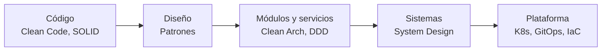

# Arquitectura de software

La arquitectura es el conjunto de **decisiones difíciles de cambiar** y los **límites** que las protegen.
Un arquitecto no elige "la mejor tecnología": elige el **trade-off adecuado** para el contexto y lo documenta.

| Página | Qué cubre |
|---|---|
| [Estilos de arquitectura](estilos.md) | Monolito modular, hexagonal, microservicios, eventos, serverless |
| [Domain-Driven Design](ddd.md) | Diseño estratégico y táctico |
| [Diseño de APIs](apis.md) | REST, gRPC, contratos, idempotencia, paginación, versionado, seguridad |
| [ADRs y trade-offs](adr.md) | Cómo documentar y defender decisiones |
| [El rol del arquitecto](rol-del-arquitecto.md) | Responsabilidades, toma de decisiones y liderazgo técnico |
| [Arquitectura Limpia](../libros/clean-architecture.md) | Regla de dependencias y límites (en Biblioteca) |

SOLID y patrones están en [Diseño y código](../diseno/index.md).

## Características de calidad ("-ilities")

Un arquitecto prioriza **pocas** características; optimizarlas todas es imposible.

| Característica | Pregunta que responde | Tácticas típicas |
|---|---|---|
| Escalabilidad | ¿Aguanta ×10 de carga? | *Stateless*, escalado horizontal, *sharding* |
| Disponibilidad | ¿Cuánto tiempo está arriba? | Redundancia, *failover*, multi-AZ |
| Rendimiento | ¿Cuánto tarda? | Caché, asincronía, índices |
| Mantenibilidad | ¿Es barato cambiarlo? | Modularidad, tests, límites claros |
| Seguridad | ¿Resiste ataques? | *Zero trust*, mínimo privilegio, cifrado |
| Observabilidad | ¿Sé qué está pasando? | Logs, métricas, trazas |
| Desplegabilidad | ¿Puedo desplegar a menudo sin miedo? | CI/CD, GitOps, *feature flags* |
| Coste | ¿Cuánto cuesta operarlo? | *Autoscaling*, *right-sizing*, FinOps |

!!! tip "Primera ley de la arquitectura (Richards & Ford)"
    **Todo en arquitectura es un trade-off.** Si crees haber encontrado algo sin trade-off,
    es que aún no lo has identificado.
