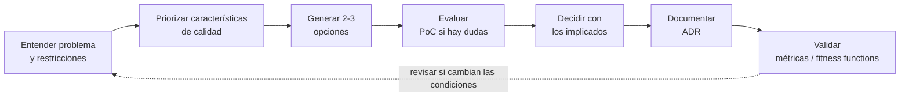

# El rol del arquitecto <span class="nivel avanzado">Avanzado</span>

Un arquitecto de software no es "el que más sabe de tecnología", sino quien **toma y hace tomar buenas
decisiones estructurales**, las comunica y se asegura de que se cumplen, equilibrando negocio, equipo y técnica.

## Responsabilidades

| Área | Qué implica en la práctica |
|---|---|
| **Decidir** | Elegir estilos, límites, tecnologías y patrones; documentarlo (ADRs) |
| **Analizar características** | Traducir necesidades de negocio en características de calidad (escalabilidad, disponibilidad, coste…) |
| **Mantener la vigencia técnica** | Conocer tendencias sin perseguir modas; radar tecnológico |
| **Asegurar el cumplimiento** | *Fitness functions*, revisiones, *golden paths* |
| **Comunicar** | Diagramas (C4), RFCs, presentaciones a negocio y a ingeniería |
| **Liderar sin autoridad** | Influencia, *mentoring*, facilitar consensos |
| **Entender el negocio** | Dominio, costes, riesgos, *time to market* |
| **Seguir programando** | Lo suficiente para no perder el contacto (PoCs, *spikes*, código de plataforma) |

!!! tip "Amplitud técnica vs. profundidad"
    El desarrollador necesita **profundidad** en pocas tecnologías; el arquitecto necesita **amplitud**: saber
    que existen muchas soluciones, cuándo aplica cada una y sus trade-offs, aunque no domine todas a fondo.

## Tipos de arquitecto

| Rol | Foco |
|---|---|
| **Enterprise architect** | Estrategia tecnológica de la organización, portfolio, gobierno (TOGAF) |
| **Solution architect** | Diseñar la solución para un producto o iniciativa concreta |
| **Software / application architect** | Estructura interna de aplicaciones y servicios |
| **Platform / cloud architect** | Infraestructura, plataforma interna, cloud, operación a escala |
| **Staff / principal engineer** | Liderazgo técnico transversal desde el código, sin gestión de personas |

## Proceso de decisión



- **Decisiones reversibles vs. irreversibles** ("puertas de una o dos direcciones"): decide rápido las reversibles;
  invierte análisis en las irreversibles (modelo de datos, contratos públicos, proveedor cloud).
- **Último momento responsable**: retrasa las decisiones hasta tener suficiente información, pero no más.
- **Arquitectura evolutiva**: diseña para el cambio con límites claros y *fitness functions* que protejan lo importante.

## Fitness functions

Comprobaciones automáticas que verifican que la arquitectura mantiene sus características.

| Característica | Fitness function |
|---|---|
| Modularidad | ArchUnit: `domain` no depende de `infrastructure`; sin ciclos entre módulos |
| Rendimiento | Test de carga en CI: p95 < 200 ms con 500 RPS |
| Seguridad | Escaneo de dependencias sin CVEs críticos; políticas Kyverno en el clúster |
| Disponibilidad | Chaos testing periódico; SLO de 99,9 % con *error budget* |
| Coste | Alerta si el coste mensual del servicio sube > 20 % |
| Operabilidad | Todo servicio expone `/health`, métricas y trazas (validado en CI) |

```java
@ArchTest
static final ArchRule noCycles = slices().matching("com.acme.(*)..").should().beFreeOfCycles();
```

## Comunicación

- **Modelo C4**: contexto → contenedores → componentes → código; cada audiencia ve el nivel que necesita.
- **Negocio** entiende de riesgo, coste y plazos; **ingeniería** de trade-offs y detalles. Traduce entre ambos.
- **RFC / design doc**: para decisiones amplias, antes de decidir; el **ADR** registra lo decidido.
- Explica una historia: **problema → opciones → decisión → consecuencias → cómo sabremos si funciona**.

## Antipatrones del arquitecto

| Antipatrón | Descripción |
|---|---|
| **Torre de marfil** | Diseña sin programar ni escuchar a los equipos; sus diagramas no se parecen al sistema real |
| **Arquitectura por currículum** | Elige tecnologías por lo que quiere aprender, no por lo que el problema necesita |
| **Parálisis por análisis** | No decide nunca por miedo a equivocarse |
| **Cuello de botella** | Todas las decisiones pasan por él; los equipos no tienen autonomía |
| **Groundhog day** | Las decisiones se rediscuten una y otra vez porque no se documentaron |
| **Sobreingeniería** | Diseña para una escala o flexibilidad que nunca llegará |

## Preguntas de repaso

??? question "¿Cómo equilibras deuda técnica y entrega de funcionalidades?"
    Hacer la deuda **visible** y cuantificada (impacto en *lead time*, incidentes), reservar un porcentaje de
    capacidad (p. ej. 15-20 %), abordarla junto a las funcionalidades que tocan ese código (*boy scout rule*) y
    priorizar la deuda que frena lo que el negocio quiere hacer después.

??? question "¿Cómo garantizas la consistencia de datos entre microservicios?"
    Evitar transacciones distribuidas (2PC). **Saga** con compensaciones, **outbox** para publicar eventos de forma
    atómica, consumidores **idempotentes** y consistencia eventual donde el negocio lo tolere.

??? question "¿Cómo diseñarías para alta disponibilidad?"
    Eliminar puntos únicos de fallo (multi-AZ), servicios *stateless*, *health checks* y *failover* automático,
    degradación elegante, timeouts/reintentos/circuit breakers, *backups* probados, RPO/RTO definidos y
    **practicar** fallos (chaos engineering, *game days*).

??? question "¿Cómo versionas una API sin romper clientes?"
    Cambios aditivos compatibles por defecto (campos opcionales, *tolerant reader*), versión en URL o cabecera para
    cambios incompatibles, deprecación comunicada con plazo, *contract testing* (Pact) y métricas de uso por versión.

??? question "Un servicio tiene latencia alta en p99. ¿Cómo lo investigas?"
    Confirmar con métricas (qué endpoint, desde cuándo, ¿coincide con un despliegue o con carga?) → trazas distribuidas
    para ver qué *span* domina → dependencias (consultas lentas, *locks*, *pool* agotado, llamadas externas) → GC,
    *throttling* de CPU, saturación → hipótesis, cambio, medir de nuevo.

??? question "¿Por qué GitOps y no un pipeline que haga `kubectl apply`?"
    Sin credenciales de clúster en CI, detección y corrección de deriva, auditoría en Git, *rollback* con
    `git revert`, y funciona con clústeres tras NAT o con conectividad intermitente. Ver [GitOps](../plataforma/gitops.md).

??? question "¿Qué es platform engineering y en qué se diferencia de DevOps?"
    DevOps es una cultura (quien construye, opera). Platform engineering construye una **plataforma interna como
    producto** que reduce la carga cognitiva de los equipos con autoservicio y *golden paths*.

??? question "¿Cómo convences a un equipo que no está de acuerdo con tu propuesta?"
    Escuchar sus objeciones (suelen tener información que te falta), apoyarte en datos o una PoC, explicitar los
    trade-offs, decidir con un proceso transparente (RFC/ADR) y aceptar *disagree and commit*.

## Ejercicios

!!! exercise "Ejercicio 1 · Básico — Reversible o irreversible"
    Clasifica y di cuánto análisis merece cada decisión: (a) elegir la librería de logs; (b) el formato de los eventos
    publicados que consumirán otros 6 equipos; (c) el proveedor cloud principal; (d) el nombre de un *endpoint* interno;
    (e) el modelo de datos del registro de sitios.

    ??? success "Solución"
        Reversibles (decidir rápido, poco análisis): (a) y (d). Irreversibles o caras de revertir (análisis, ADR y revisión):
        (b) contrato con muchos consumidores, (c) proveedor cloud (datos, contratos, competencias) y (e) modelo de datos
        (migraciones y dependencias). La habilidad está en no tratar las primeras como las segundas: eso paraliza al equipo.

!!! exercise "Ejercicio 2 · Medio — Escribir fitness functions"
    Escribe tres *fitness functions* ejecutables en CI: (a) el paquete `domain` no depende de Spring; (b) ningún módulo
    accede a paquetes `internal` de otro; (c) todos los manifiestos de `apps/` declaran límites de memoria.

    ??? success "Solución"
        ```java
        // (a) y (b) con ArchUnit
        @ArchTest
        static final ArchRule domainIsFrameworkFree = noClasses().that().resideInAPackage("..domain..")
            .should().dependOnClassesThat().resideInAnyPackage("org.springframework..", "jakarta.persistence..");

        @ArchTest
        static final ArchRule noAccessToOtherModulesInternals = noClasses()
            .that().resideInAPackage("com.acme.(*)..")
            .should().dependOnClassesThat().resideInAPackage("com.acme.(*).internal..")
            .because("los módulos solo se comunican por su api");
        ```
        (La regla (b) exacta, que distinga "otro módulo" del propio, es más sencilla con Spring Modulith, que la verifica de serie.)
        ```yaml
        # (c) con Kyverno CLI en CI: kyverno apply policy.yaml --resource <(kustomize build apps/)
        apiVersion: kyverno.io/v1
        kind: ClusterPolicy
        metadata: { name: require-memory-limits }
        spec:
          validationFailureAction: Enforce
          rules:
            - name: memory-limits
              match: { any: [{ resources: { kinds: [Deployment, StatefulSet] } }] }
              validate:
                message: "Todos los contenedores deben declarar limits.memory"
                pattern:
                  spec: { template: { spec: { containers: [{ resources: { limits: { memory: "?*" } } }] } } }
        ```

!!! exercise "Ejercicio 3 · Medio — Comunicar una decisión"
    Tienes que explicar a dirección (no técnica) por qué conviene invertir 3 meses en migrar los secretos a un gestor
    centralizado. Escribe el mensaje en 5 frases.

    ??? success "Solución"
        "Hoy los secretos de acceso a nuestros sistemas están repartidos en 300 sitios y cambiarlos exige intervenir en cada
        uno, lo que supone un **riesgo** si alguno se filtra. En el último año tuvimos 2 incidentes relacionados que costaron
        X horas de trabajo y exposición. La propuesta es centralizarlos para poder **rotarlos en minutos y auditarlos**. Cuesta
        3 meses de 2 personas y reduce el riesgo de brecha y el esfuerzo de las auditorías de cumplimiento. Si no lo hacemos,
        la próxima rotación obligatoria costará aproximadamente lo mismo que el proyecto, sin resolver el problema."
        Claves: problema en términos de **riesgo y coste**, cifras, qué se pide, qué pasa si no se hace; sin jerga técnica.

!!! exercise "Ejercicio 4 · Avanzado — Gestionar un desacuerdo técnico"
    Un equipo senior quiere introducir un *service mesh* en todos los clústeres edge; tú crees que su coste de recursos y
    operación no compensa. ¿Cómo lo gestionas para llegar a una decisión?

    ??? success "Solución"
        1. **Entender** qué problema quieren resolver (¿mTLS?, ¿observabilidad?, ¿reintentos?): a menudo el desacuerdo es
           sobre el problema, no sobre la solución.
        2. **Criterios compartidos**: acordar qué importa (memoria por nodo, complejidad operativa, requisitos de seguridad).
        3. **Datos**: PoC acotada en 3 sitios midiendo consumo y esfuerzo, y comparar con alternativas más ligeras (mTLS con
           cert-manager y Cilium, *mesh ambient* sin *sidecars*).
        4. **Decidir** con un proceso transparente (RFC → ADR), registrando los argumentos de ambas partes.
        5. ***Disagree and commit*** + **punto de revisión** ("si en 6 meses necesitamos X, se reabre").
        Lo que no hay que hacer: imponer por jerarquía ni dejar la decisión abierta indefinidamente.
