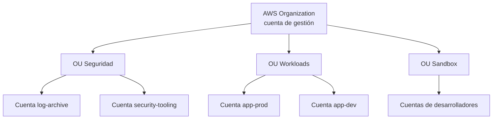
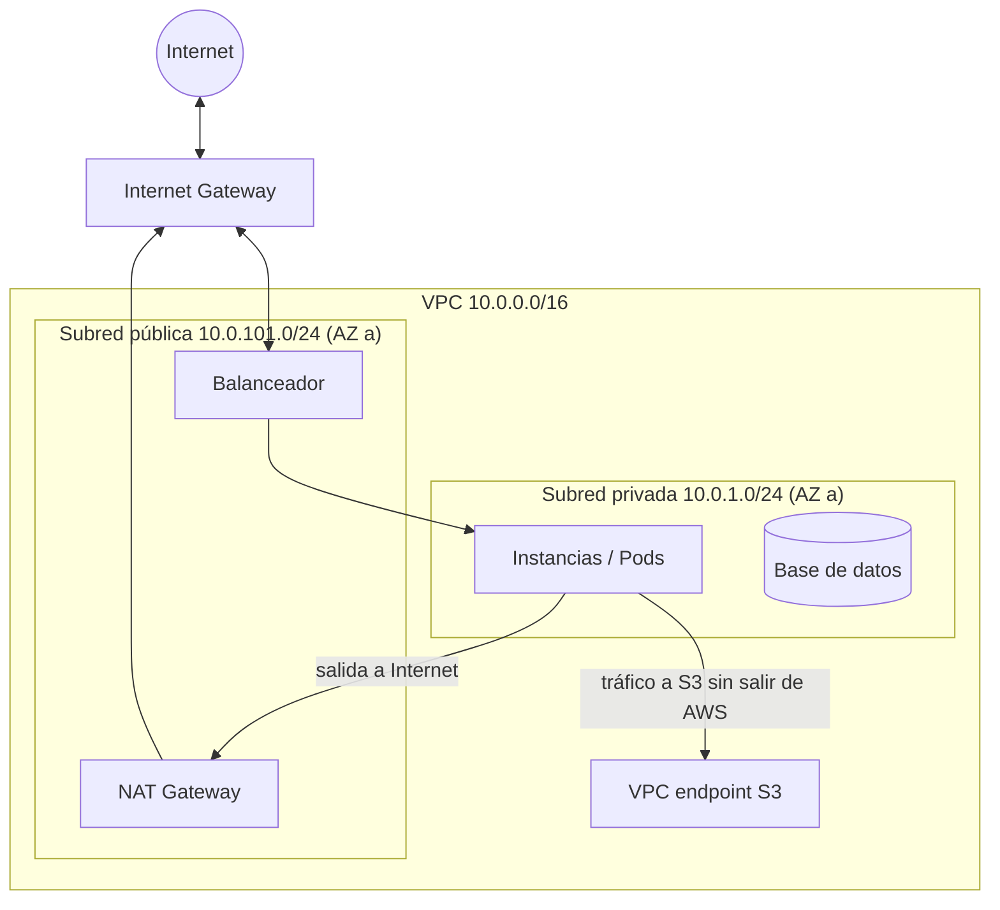
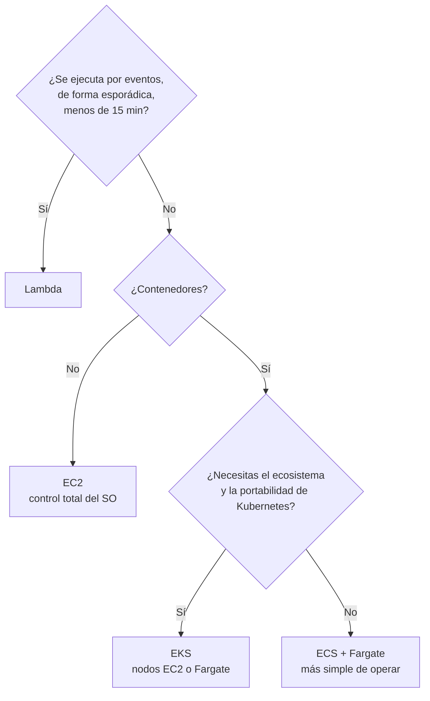
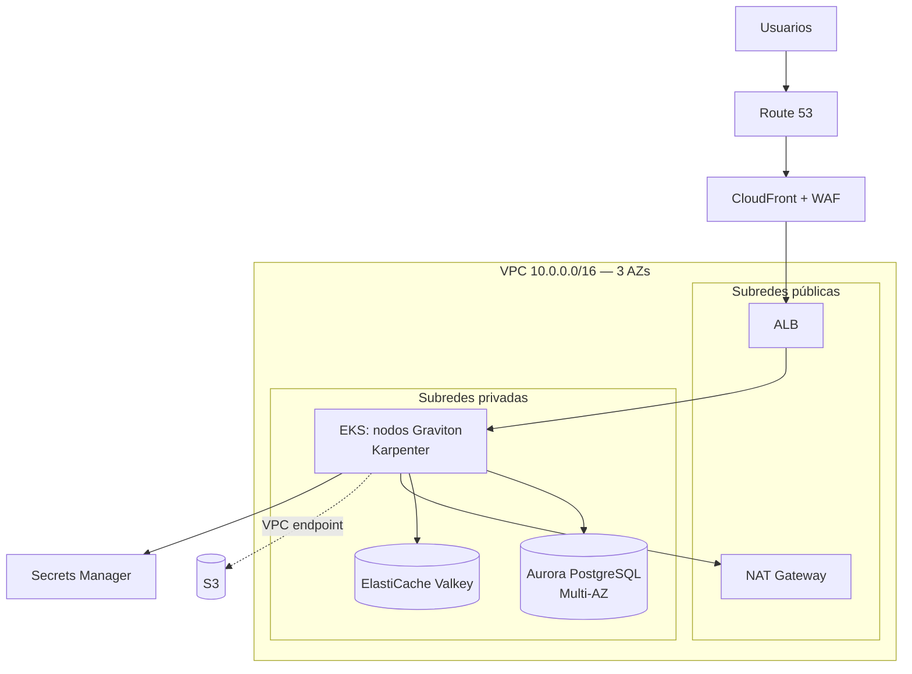

# Amazon Web Services (AWS)

El proveedor pionero (2006) y el de mayor cuota de mercado: el catálogo más amplio (más de 200 servicios),
la mayor comunidad y el ecosistema de terceros más grande.

!!! warning "Precios orientativos"
    Referencia `us-east-1`, bajo demanda, Linux, 2025-2026. Las regiones europeas suelen ser un 5-15 % más caras.
    Verifica siempre en [AWS Pricing Calculator](https://calculator.aws/).

## Organización y cuentas



- **La cuenta es la frontera de aislamiento** (seguridad, cuotas, facturación). Buena práctica: muchas cuentas pequeñas.
- **Organizations** agrupa cuentas en OUs; **SCPs** (*Service Control Policies*) ponen límites máximos de permisos.
- **Control Tower** monta una *landing zone* con cuentas base, *guardrails* y registro centralizado.
- **IAM Identity Center** da SSO a las personas; nunca uses el usuario *root* en el día a día (MFA y guardado).

## IAM: cómo se evalúan los permisos

1. Por defecto todo está **denegado**.
2. Un `Allow` explícito en alguna política aplicable lo permite…
3. …salvo que haya un `Deny` explícito en cualquier sitio (**el Deny siempre gana**).
4. SCPs, *permission boundaries* y políticas de sesión **limitan** el máximo; no conceden nada por sí mismas.

```json
{
  "Version": "2012-10-17",
  "Statement": [{
    "Sid": "LeerSoloSuPrefijo",
    "Effect": "Allow",
    "Action": ["s3:GetObject"],
    "Resource": "arn:aws:s3:::edge-telemetry/site-042/*",
    "Condition": { "Bool": { "aws:SecureTransport": "true" } }
  }]
}
```

!!! tip "Identidades de máquinas"
    Usa **roles** (credenciales temporales vía STS), nunca claves de acceso fijas. En EKS: **EKS Pod Identity** o IRSA.
    Desde GitHub Actions: federación OIDC con un rol, sin secretos guardados.

## Servicios principales

### Cómputo

| Servicio | Qué hace | Cuándo | Modelo de precio |
|---|---|---|---|
| **EC2** | Máquinas virtuales. Familias: `t` (ráfagas), `m` (general), `c` (CPU), `r`/`x` (memoria), `g`/`p` (GPU), `i` (disco local rápido). Sufijo `g` = Graviton (ARM) | Control total del SO, cargas estables | Por segundo. `m7g.large` (2 vCPU, 8 GB) ≈ 0,08 $/h ≈ 60 $/mes |
| **Auto Scaling** | Ajusta el nº de instancias según métricas o calendario | Cargas variables | Gratis (pagas las instancias) |
| **Lambda** | Funciones por evento; hasta 15 min y 10 GB de memoria | Eventos, *glue code*, APIs de tráfico irregular | 0,20 $/millón de peticiones + ~0,0000167 $/GB-s. Capa gratuita: 1 M peticiones y 400 000 GB-s/mes |
| **ECS** | Orquestador de contenedores propio de AWS, más simple que K8s | Contenedores sin necesitar Kubernetes | Gratis (pagas cómputo) |
| **Fargate** | Cómputo serverless para ECS/EKS: sin gestionar nodos | Evitar operar nodos | Por vCPU-h y GB-h (~20-30 % más caro que EC2 equivalente) |
| **EKS** | Kubernetes gestionado (plano de control) | Estándar K8s, portabilidad, ecosistema CNCF | 0,10 $/h por clúster (≈ 73 $/mes); 0,60 $/h en soporte extendido de versiones antiguas |
| **Elastic Beanstalk / App Runner** | PaaS para desplegar apps web o contenedores sin gestionar infraestructura | Equipos pequeños, prototipos | Pagas los recursos subyacentes |
| **Lightsail** | VPS sencillos con precio fijo | Webs pequeñas | Desde pocos $/mes |

### Almacenamiento

| Servicio | Qué hace | Precio orientativo |
|---|---|---|
| **S3** | Almacenamiento de objetos; 11 nueves de durabilidad; consistencia fuerte lectura-tras-escritura | Standard ≈ 0,023 $/GB-mes + peticiones |
| S3 Standard-IA / One Zone-IA | Acceso infrecuente (mín. 30 días) | ≈ 0,0125 / 0,01 $/GB-mes + coste por recuperación |
| S3 Glacier Instant / Flexible / Deep Archive | Archivo (ms / minutos-horas / hasta 12-48 h) | ≈ 0,004 / 0,0036 / 0,00099 $/GB-mes |
| S3 Intelligent-Tiering | Mueve objetos entre niveles automáticamente | Pequeña cuota de monitorización por objeto |
| **EBS** | Discos de bloque para EC2 (`gp3` general, `io2` IOPS garantizadas) | `gp3` ≈ 0,08 $/GB-mes |
| **EFS** | NFS gestionado, compartido entre instancias | ≈ 0,30 $/GB-mes (Standard) |
| **FSx** | Ficheros gestionados: Windows, Lustre, NetApp ONTAP, OpenZFS | Según tipo |

### Bases de datos

| Servicio | Qué hace | Cuándo |
|---|---|---|
| **RDS** | PostgreSQL, MySQL, MariaDB, Oracle, SQL Server, Db2 gestionados; Multi-AZ, réplicas de lectura, *backups* | Relacional estándar |
| **Aurora** | Motor compatible MySQL/PostgreSQL con almacenamiento distribuido (6 copias en 3 AZs); Serverless v2; Global Database | Alto rendimiento y disponibilidad relacional |
| **Aurora DSQL** | SQL distribuido serverless, activo-activo multi-región | Relacional global con consistencia fuerte |
| **DynamoDB** | Clave-valor/documento serverless, latencia de un dígito de ms a cualquier escala | Patrones de acceso conocidos, escala masiva |
| **ElastiCache / MemoryDB** | Valkey/Redis OSS/Memcached gestionado; MemoryDB es duradero | Caché, sesiones, *rate limiting* |
| **DocumentDB, Neptune, Keyspaces, Timestream** | Documento (API MongoDB), grafos, Cassandra, series temporales | Casos específicos |
| **Redshift** | Data warehouse columnar | Analítica a gran escala |

!!! tip "DynamoDB: diseña desde las consultas"
    Primero enumeras los **patrones de acceso**, luego diseñas la clave de partición (alta cardinalidad, reparto uniforme)
    y la de ordenación. Es habitual el **single-table design**: varias entidades en una tabla con claves compuestas
    (`PK = SITE#042`, `SK = NODE#17`). Modos de capacidad: *on-demand* (pago por petición) o *provisioned*.

### Red

| Servicio | Qué hace |
|---|---|
| **VPC** | Red privada regional: subredes públicas/privadas por AZ, tablas de rutas |
| Internet Gateway / **NAT Gateway** | Salida a Internet (NAT para subredes privadas: ≈ 0,045 $/h + 0,045 $/GB procesado) |
| **Security Groups** / NACLs | Firewall *stateful* por recurso / *stateless* por subred |
| **ELB**: ALB (L7), NLB (L4), GWLB | Balanceo de carga (ALB ≈ 16 $/mes + unidades de capacidad) |
| **Route 53** | DNS con enrutado por latencia, geolocalización, *failover* y pesos |
| **CloudFront** | CDN global con funciones en el borde |
| **Transit Gateway** | *Hub* que interconecta VPCs y redes on-prem |
| **PrivateLink** / VPC Endpoints | Acceso privado a servicios sin pasar por Internet (evita coste de NAT hacia S3/DynamoDB) |
| **Direct Connect** / Site-to-Site VPN | Conexión dedicada o cifrada con tu CPD |
| **API Gateway** | APIs REST/HTTP/WebSocket gestionadas, *throttling*, autorización |

### Integración

| Servicio | Qué hace |
|---|---|
| **SQS** | Colas: Standard (*at-least-once*, sin orden estricto) y FIFO (orden y deduplicación) |
| **SNS** | Pub/sub y notificaciones (*fan-out* a SQS, Lambda, email, SMS) |
| **EventBridge** | Bus de eventos con reglas, *schemas*, *pipes* y *scheduler* |
| **Step Functions** | Orquestación de flujos (máquinas de estado) con reintentos y compensaciones |
| **Kinesis** / **MSK** | Streaming de datos / Kafka gestionado |

### Seguridad y gobierno

| Servicio | Qué hace |
|---|---|
| **KMS** | Claves de cifrado gestionadas; cifrado *envelope* integrado en casi todos los servicios |
| **Secrets Manager** / Parameter Store | Secretos con rotación / parámetros y secretos simples (más barato) |
| **GuardDuty** | Detección de amenazas analizando logs (CloudTrail, VPC Flow Logs, DNS) |
| **Security Hub** | Panel central de hallazgos y cumplimiento (CIS, AWS Foundational Best Practices) |
| **Inspector** | Escaneo de vulnerabilidades en EC2, imágenes de contenedor y Lambda |
| **CloudTrail** | Auditoría de todas las llamadas a la API |
| **Config** | Inventario e historial de configuración, reglas de cumplimiento |
| **WAF / Shield** | Firewall de aplicación / protección DDoS |
| **Cognito** | Autenticación de usuarios finales (OIDC, social login) |

### Observabilidad e IaC

| Servicio | Qué hace |
|---|---|
| **CloudWatch** | Métricas, logs (Logs Insights), alarmas, dashboards. Ojo: la ingesta de logs (~0,50 $/GB) es un coste habitual |
| **X-Ray** / ADOT | Trazas distribuidas; distribución de OpenTelemetry de AWS |
| Managed Prometheus / Grafana | Stack Prometheus/Grafana gestionado |
| **CloudFormation** | IaC nativo (YAML/JSON) con *stacks* y *drift detection* |
| **CDK** | IaC en TypeScript, Python, Java… que genera CloudFormation |
| **Systems Manager** | Gestión de flota: parches, sesiones sin SSH, inventario, parámetros |

### Datos e IA

| Servicio | Qué hace |
|---|---|
| **Athena** | SQL serverless sobre S3 (≈ 5 $/TB escaneado) |
| **Glue** | Catálogo de datos y ETL serverless |
| **EMR** | Spark/Hadoop gestionado |
| **Lake Formation** | Gobierno y permisos de data lakes |
| **Bedrock** | API de modelos fundacionales de varios proveedores (Anthropic Claude, Amazon Nova, Llama, Mistral…), *Knowledge Bases* (RAG), *Agents*, *Guardrails* |
| **SageMaker AI** | Plataforma completa para entrenar y desplegar modelos propios |
| Rekognition, Textract, Transcribe, Comprehend, Translate | IA preentrenada: imagen, documentos, voz, texto |

### Híbrido y edge

| Servicio | Qué hace |
|---|---|
| **Outposts** | Hardware de AWS instalado en tu CPD, gestionado por AWS |
| **EKS Anywhere** / **EKS Hybrid Nodes** | Clústeres EKS en tu infraestructura / nodos on-prem unidos a un EKS en la nube |
| **IoT Core** / **IoT Greengrass** | Conexión segura de dispositivos (MQTT) / runtime de edge con despliegue de componentes |
| Local Zones / Wavelength | Infraestructura AWS en ciudades / dentro de redes 5G |

## Conceptos en profundidad

### Cómo funciona una VPC

Una **VPC** (*Virtual Private Cloud*) es tu red privada dentro de una región de AWS. Todo lo que tiene IP privada
(instancias, bases de datos, Pods de EKS) vive en una VPC.



| Pieza | Qué hace |
|---|---|
| **Subred** | Un rango de la VPC **dentro de una zona**. Para alta disponibilidad se crean subredes en 2-3 zonas |
| **Tabla de rutas** | Dice a dónde va el tráfico de cada subred. Lo que hace a una subred "pública" es tener una ruta `0.0.0.0/0 → Internet Gateway` |
| **Internet Gateway** | Puerta entre la VPC e Internet, en ambos sentidos, para recursos con IP pública |
| **NAT Gateway** | Permite a las subredes **privadas** salir a Internet (descargar paquetes, llamar APIs) sin ser accesibles desde fuera |
| **Security Group** | Firewall de cada recurso. *Stateful*: si permites la entrada, la respuesta sale sola. Solo reglas de permitir. Puede referenciar otros grupos ("permitir desde el grupo del balanceador") |
| **NACL** | Firewall de la subred. *Stateless*: hay que permitir ida y vuelta. Admite reglas de denegar. Se usa poco |
| **VPC endpoint** | Acceso privado a servicios de AWS (S3, ECR, Secrets Manager) sin pasar por Internet ni por el NAT |

**Patrón estándar**: balanceadores y NAT en subredes **públicas**; aplicaciones y bases de datos en subredes
**privadas**; todo repetido en al menos dos zonas.

### S3 en detalle

- Se guardan **objetos** (ficheros con metadatos) en **buckets**, identificados por una **clave** (`telemetry/2026/09/26/site-042.json`).
  No hay carpetas reales: los `/` son parte de la clave, y las consolas los muestran como carpetas.
- **Durabilidad** de 11 nueves (se replica en varias zonas) y consistencia fuerte: tras escribir, cualquier lectura ve el dato nuevo.
- **Clases de almacenamiento**: cuanto más fría, más barato guardar y más caro (y lento) leer. Las clases infrecuentes y de
  archivo cobran un **mínimo de días** almacenado y un coste por recuperación: mover datos que se leen a menudo a Glacier
  sale más caro, no más barato.
- **Reglas de ciclo de vida**: mover automáticamente a clases frías tras N días y borrar tras M días.
- **Seguridad**: *Block Public Access* activado a nivel de cuenta; cifrado por defecto (SSE-S3 o con KMS); políticas de bucket;
  **URLs prefirmadas** para dar acceso temporal a un objeto concreto sin credenciales.
- **Versionado** y **Object Lock** (inmutabilidad) para protegerse de borrados accidentales o *ransomware*.

### Elegir dónde ejecutar código en AWS



### Lambda por dentro

- Cada invocación se ejecuta en un **entorno aislado** (micro-VM Firecracker). Si no hay uno libre, se crea: es el
  **arranque en frío** (*cold start*), de decenas de ms a segundos (más en Java; se mitiga con SnapStart o concurrencia provisionada).
- Un entorno atiende **una petición a la vez**; 100 peticiones simultáneas = 100 entornos. La **concurrencia** tiene un
  límite por cuenta y región (por defecto 1 000) que conviene vigilar.
- Límites: 15 minutos por ejecución, hasta 10 GB de memoria (la CPU crece proporcionalmente a la memoria asignada).
- Se paga por petición y por **GB-segundo**: una función de 1 GB que tarda 200 ms cuesta el doble que una de 512 MB con el mismo tiempo.

## Arquitectura de referencia: API en EKS multi-AZ



```hcl
# Terraform: VPC de 3 AZs con el módulo de la comunidad
module "vpc" {
  source  = "terraform-aws-modules/vpc/aws"
  version = "~> 5.0"

  name = "platform"
  cidr = "10.0.0.0/16"
  azs             = ["eu-west-1a", "eu-west-1b", "eu-west-1c"]
  private_subnets = ["10.0.1.0/24", "10.0.2.0/24", "10.0.3.0/24"]
  public_subnets  = ["10.0.101.0/24", "10.0.102.0/24", "10.0.103.0/24"]

  enable_nat_gateway = true
  single_nat_gateway = true     # ahorro en dev; en prod, uno por AZ para no depender de una sola
}
```

## Costes ocultos habituales

| Trampa | Por qué | Mitigación |
|---|---|---|
| **NAT Gateway** | Cobra por hora y por GB procesado; el tráfico a S3/ECR desde subredes privadas pasa por él | VPC *gateway endpoints* (S3, DynamoDB gratis), *interface endpoints* para ECR |
| **Transferencia entre AZs** | ≈ 0,01 $/GB en cada sentido | Enrutado consciente de topología, réplicas locales |
| **Salida a Internet** | ≈ 0,09 $/GB tras 100 GB/mes gratis | CDN, compresión |
| **IPv4 públicas** | ≈ 0,005 $/h por IP (≈ 3,6 $/mes) desde 2024 | IPv6, menos IPs públicas, balanceadores compartidos |
| **CloudWatch Logs** | Ingesta por GB | Filtrar, niveles de log, retención, enviar a S3 |
| **EKS en soporte extendido** | El plano de control pasa de 0,10 a 0,60 $/h | Actualizar versiones de K8s a tiempo |
| **Recursos olvidados** | Volúmenes EBS sueltos, *snapshots*, entornos de prueba | Etiquetado, AWS Config, apagado programado |

## Preguntas de repaso

??? question "Security Group vs. NACL"
    El Security Group se aplica a la interfaz de red del recurso, es *stateful* (la respuesta se permite sola) y solo
    tiene reglas `allow`. La NACL se aplica a la subred, es *stateless* (hay que permitir ida y vuelta) y admite `deny`.

??? question "¿Cómo accede un Pod de EKS a S3 sin claves?"
    Con **EKS Pod Identity** (o IRSA): se asocia un rol IAM a la ServiceAccount del Pod y el SDK obtiene
    credenciales temporales de STS automáticamente.

??? question "¿Aurora o RDS PostgreSQL?"
    RDS es más barato y suficiente para muchas cargas. Aurora aporta almacenamiento distribuido (6 copias/3 AZs),
    *failover* más rápido, hasta 15 réplicas de baja latencia, Serverless v2 y Global Database; cuesta más.

??? question "¿Qué es un SCP y qué NO hace?"
    Una política de Organizations que define el **máximo** de permisos de las cuentas de una OU (p. ej. prohibir
    regiones fuera de la UE). No concede permisos: sigue haciendo falta una política IAM que los permita.

## Ejercicios

!!! exercise "Ejercicio 1 · Básico — Política IAM de mínimo privilegio"
    Un servicio debe leer y escribir objetos solo bajo el prefijo `telemetry/` del bucket `acme-edge` y nada más. Escribe
    la política IAM.

    ??? success "Solución"
        ```json
        {
          "Version": "2012-10-17",
          "Statement": [
            {
              "Sid": "ObjetosDelPrefijo",
              "Effect": "Allow",
              "Action": ["s3:GetObject", "s3:PutObject"],
              "Resource": "arn:aws:s3:::acme-edge/telemetry/*"
            },
            {
              "Sid": "ListarSoloElPrefijo",
              "Effect": "Allow",
              "Action": "s3:ListBucket",
              "Resource": "arn:aws:s3:::acme-edge",
              "Condition": { "StringLike": { "s3:prefix": ["telemetry/*"] } }
            }
          ]
        }
        ```
        `ListBucket` se aplica al **bucket** (no a los objetos) y se limita con la condición de prefijo. Se asigna a un
        **rol** que asume el servicio (Pod Identity en EKS), nunca con claves fijas.

!!! exercise "Ejercicio 2 · Medio — Reducir el coste del NAT Gateway"
    La factura muestra 2 500 $/mes de NAT Gateway. Los Pods de EKS en subredes privadas descargan imágenes de ECR (1,5 TB/mes),
    escriben en S3 (3 TB/mes) y llaman a una API externa (200 GB/mes). ¿Cómo lo reduces?

    ??? success "Solución"
        - **S3**: *gateway endpoint* de VPC (gratuito) → el tráfico a S3 deja de pasar por el NAT: −3 TB.
        - **ECR**: *interface endpoints* (`ecr.api`, `ecr.dkr`) + el de S3 (las capas de ECR se sirven desde S3); los
          *interface endpoints* cuestan por hora y GB, pero bastante menos que el procesado del NAT para este volumen.
        - La API externa sí necesita NAT (200 GB). Resultado: el tráfico por el NAT baja de ~4,7 TB a ~0,2 TB; el coste
          por GB procesado cae ~95 %. Revisar además si hay un NAT por AZ (resiliencia) o uno solo (ahorro con riesgo).

!!! exercise "Ejercicio 3 · Avanzado — Organización multi-cuenta"
    Diseña la estructura de cuentas AWS para una plataforma con 3 entornos, un equipo de seguridad y 5 equipos de producto.

    ??? success "Solución"
        - **Organization** con cuenta de gestión dedicada (solo facturación y Organizations, nadie trabaja en ella).
        - **OU Security**: cuenta `log-archive` (CloudTrail y logs centralizados, inmutables) y `security-tooling`
          (GuardDuty, Security Hub como administrador delegado).
        - **OU Infrastructure**: cuenta `network` (Transit Gateway, conectividad, DNS compartido) y `shared-services` (CI/CD, registros).
        - **OU Workloads** con sub-OUs `prod` y `non-prod`: una cuenta por equipo y entorno (p. ej. `payments-prod`, `payments-dev`).
        - **OU Sandbox** para experimentos con presupuesto limitado.
        - **SCPs**: denegar regiones fuera de la UE, impedir desactivar CloudTrail/GuardDuty, impedir salir de la organización.
        - Acceso de personas con **IAM Identity Center** (SSO) y permisos por grupo; todo creado con Control Tower o
          Account Factory for Terraform.
