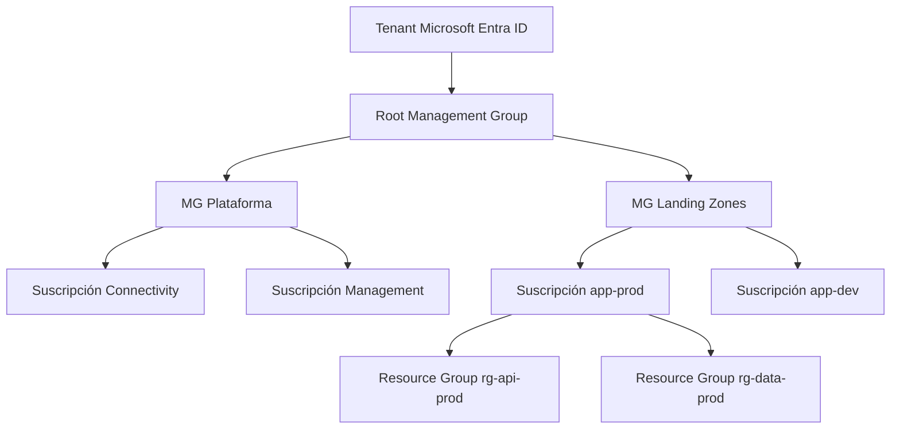
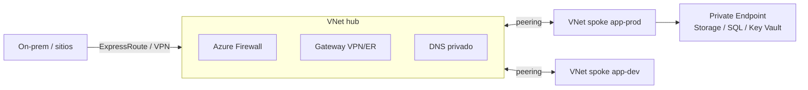

# Microsoft Azure

Segundo proveedor por cuota. Su gran baza es la **empresa Microsoft**: identidad con Entra ID, Microsoft 365,
Windows Server, SQL Server, .NET, GitHub, y una estrategia **híbrida** muy fuerte con Azure Arc.

!!! warning "Precios orientativos"
    Referencia East US / West Europe, pago por uso, Linux, 2025-2026. Verifica en la
    [calculadora de precios de Azure](https://azure.microsoft.com/pricing/calculator/).

## Jerarquía de recursos



- **Tenant** (Entra ID): el directorio de identidades de la organización.
- **Management Groups**: agrupan suscripciones para aplicar políticas y RBAC en cascada.
- **Suscripción**: unidad de facturación y de límites (cuotas); frontera habitual de entornos.
- **Resource Group**: contenedor lógico de recursos con el mismo ciclo de vida (se borran juntos).
- **Azure Landing Zones** (Cloud Adoption Framework): arquitectura de referencia de todo lo anterior.

## Identidad y permisos

| Concepto | Qué es |
|---|---|
| **Microsoft Entra ID** | Identidad de personas y aplicaciones (antes Azure AD): SSO, MFA, acceso condicional |
| **Azure RBAC** | Asigna **roles** (Owner, Contributor, Reader o personalizados) a identidades en un **ámbito** (MG, suscripción, RG, recurso) |
| **Managed Identity** | Identidad gestionada para un recurso (VM, App Service, Function): sin secretos |
| **Workload Identity** (AKS) | Federación OIDC: un Pod usa una identidad de Entra ID sin credenciales |
| **Azure Policy** | Reglas que auditan o impiden configuraciones (p. ej. "solo regiones de la UE", "etiquetas obligatorias") |
| **PIM** | *Privileged Identity Management*: permisos elevados solo *just-in-time* y con aprobación |

!!! tip "RBAC vs. Policy"
    RBAC decide **quién** puede hacer algo; Policy decide **qué configuraciones** se permiten, sea quien sea.

## Servicios principales

### Cómputo

| Servicio | Qué hace | Cuándo | Modelo de precio |
|---|---|---|---|
| **Virtual Machines** | Series B (ráfagas), D (general), E (memoria), F (CPU), N (GPU), M (SAP/memoria enorme). Sufijo `p` = ARM (Cobalt/Ampere) | Control del SO, *lift & shift*, Windows | Por segundo. D2s v5 (2 vCPU, 8 GB) ≈ 0,096 $/h ≈ 70 $/mes |
| **VM Scale Sets** | Grupos de VMs con autoescalado | Cargas variables en IaaS | Pagas las VMs |
| **App Service** | PaaS para webs y APIs (.NET, Java, Node, Python, contenedores), *slots* de despliegue | Apps web sin gestionar infra | Por plan (instancias reservadas para el plan) |
| **Azure Functions** | Serverless por eventos. Planes: *Flex Consumption*, *Premium*, *Dedicated* | Eventos, integraciones | Consumo: 0,20 $/M ejecuciones + 0,000016 $/GB-s; gratis 1 M ejecuciones y 400 000 GB-s/mes |
| **AKS** | Kubernetes gestionado | K8s estándar, integración con Entra ID | *Free*: 0 $ (sin SLA); *Standard* (con SLA): 0,10 $/h; *Premium* (con soporte LTS): 0,60 $/h por clúster |
| **Container Apps** | Contenedores serverless sobre K8s (con KEDA y Dapr integrados), escala a cero | Microservicios sin operar K8s | Por vCPU-s y GiB-s, con capa gratuita mensual |
| **Container Instances** | Contenedores sueltos bajo demanda | Tareas puntuales | Por segundo |
| **Azure Virtual Desktop** | Escritorios virtuales | Puestos remotos | Pagas las VMs + licencias |

### Almacenamiento

| Servicio | Qué hace | Precio orientativo |
|---|---|---|
| **Storage Account** | Contenedor de: Blob, Files, Queues, Tables. Redundancia LRS, ZRS, GRS, GZRS | — |
| **Blob Storage** | Objetos. Niveles Hot / Cool (30 días) / Cold (90) / Archive (180, rehidratación en horas) | Hot LRS ≈ 0,018-0,021 $/GB-mes; Archive ≈ 0,001-0,002 $/GB-mes |
| **Data Lake Storage Gen2** | Blob con espacio de nombres jerárquico, para analítica | Como Blob |
| **Managed Disks** | Standard HDD/SSD, Premium SSD (v2), Ultra Disk | Según tipo y tamaño |
| **Azure Files** | SMB/NFS gestionado | Por GB provisionado o usado |
| **Azure NetApp Files** | Ficheros empresariales de alto rendimiento | Alto |

### Bases de datos

| Servicio | Qué hace | Cuándo |
|---|---|---|
| **Azure SQL Database** | SQL Server como PaaS: *serverless*, *Hyperscale* (hasta 100+ TB) | Apps .NET/SQL Server, nuevas cargas relacionales |
| **SQL Managed Instance** | Compatibilidad casi total con SQL Server on-prem | Migrar SQL Server sin cambios |
| **Database for PostgreSQL / MySQL (Flexible Server)** | Open source gestionado, alta disponibilidad por zonas | Stacks open source |
| **Cosmos DB** | NoSQL distribuido globalmente, multi-modelo (API NoSQL, MongoDB, Cassandra, Gremlin, Table), SLA de latencia | Escala global, multi-región con escritura |
| **Azure Managed Redis** / Cache for Redis | Caché en memoria | Caché, sesiones |
| **Microsoft Fabric** | Plataforma de analítica unificada (OneLake, data engineering, warehouse, Power BI); evolución de Synapse | Analítica empresarial |

!!! tip "Cosmos DB: 5 niveles de consistencia"
    **Strong** → **Bounded staleness** → **Session** (el predeterminado: lees tus propias escrituras) →
    **Consistent prefix** → **Eventual**. De más consistente y lento a más disponible y rápido. Se paga en
    *Request Units* (RU/s), provisionadas, con autoescalado o serverless.

### Red

| Servicio | Qué hace |
|---|---|
| **Virtual Network (VNet)** | Red privada regional con subredes; *peering* entre VNets |
| **Network Security Group** | Reglas de firewall por subred o NIC |
| **Azure Firewall** | Firewall gestionado centralizado (típico en arquitectura *hub-spoke*) |
| **Load Balancer** | L4 regional |
| **Application Gateway** | L7 regional con WAF; también controlador de Ingress para AKS |
| **Front Door** | L7 **global** + CDN + WAF |
| **Traffic Manager** | Balanceo global basado en DNS |
| **Private Link / Private Endpoint** | Acceso a servicios PaaS por IP privada dentro de tu VNet |
| **ExpressRoute** / VPN Gateway | Conexión dedicada / VPN con on-prem |
| **Virtual WAN** | *Hub* gestionado para conectar sucursales, VNets y usuarios |
| **API Management** | Gateway de APIs, portal de desarrolladores, políticas |

### Integración

| Servicio | Qué hace |
|---|---|
| **Service Bus** | Mensajería empresarial: colas y *topics*, sesiones (orden), transacciones, *dead-letter* |
| **Event Grid** | Enrutado de eventos (push) de recursos Azure y propios; soporta MQTT |
| **Event Hubs** | Ingesta de *streaming* de alto volumen; compatible con el protocolo Kafka |
| **Logic Apps** | Flujos de integración *low-code* con cientos de conectores |
| **Durable Functions** | Orquestación con código (sagas, *fan-out/fan-in*) |

### Seguridad

| Servicio | Qué hace |
|---|---|
| **Key Vault** | Secretos, claves y certificados; HSM gestionado |
| **Defender for Cloud** | Postura de seguridad (CSPM) y protección de cargas (servidores, contenedores, BBDD) |
| **Microsoft Sentinel** | SIEM/SOAR en la nube |
| **DDoS Protection** / WAF | Protección de red y aplicaciones |

### Observabilidad, DevOps e IaC

| Servicio | Qué hace |
|---|---|
| **Azure Monitor** | Métricas, alertas y logs; **Log Analytics** con consultas **KQL** |
| **Application Insights** | APM: trazas, dependencias, excepciones (compatible con OpenTelemetry) |
| **Bicep** | Lenguaje IaC nativo, declarativo y más legible que ARM JSON (compila a ARM) |
| **Azure DevOps** | Repos, Pipelines, Boards, Artifacts |
| **GitHub** (de Microsoft) | Actions, Advanced Security, Copilot; integración nativa con Azure vía OIDC |

```bicep
// Bicep: storage account seguro por defecto
param location string = resourceGroup().location

resource sa 'Microsoft.Storage/storageAccounts@2023-05-01' = {
  name: 'stedgetelemetry${uniqueString(resourceGroup().id)}'
  location: location
  sku: { name: 'Standard_ZRS' }          // redundante entre zonas
  kind: 'StorageV2'
  properties: {
    minimumTlsVersion: 'TLS1_2'
    allowBlobPublicAccess: false
    supportsHttpsTrafficOnly: true
  }
}
```

### Datos e IA

| Servicio | Qué hace |
|---|---|
| **Azure AI Foundry** | Plataforma para construir apps y agentes de IA; catálogo de modelos (OpenAI GPT, y otros proveedores), evaluación, seguridad de contenido |
| **Azure OpenAI** | Modelos de OpenAI con garantías empresariales (red privada, datos no usados para entrenar) |
| **Azure AI Search** | Búsqueda con vectores e híbrida, base habitual del RAG |
| Azure AI services | Visión, voz, lenguaje, traducción, **Document Intelligence** |
| **Azure Machine Learning** | MLOps: entrenamiento, registro y despliegue de modelos |
| Data Factory, Databricks, Fabric, Power BI | Integración de datos, Spark, analítica y BI |

### Híbrido y edge

| Servicio | Qué hace |
|---|---|
| **Azure Arc** | Proyecta servidores, clústeres Kubernetes y bases de datos de **cualquier sitio** (on-prem, edge, otras nubes) en Azure para gestionarlos con Policy, RBAC, Monitor y **GitOps** |
| **Azure Local** (antes Azure Stack HCI) | Infraestructura hiperconvergente en tu CPD gestionada desde Azure |
| **AKS enabled by Azure Arc** | AKS en Azure Local o Windows Server |
| **IoT Hub** / **Azure IoT Operations** | Conectividad de dispositivos / plataforma de edge industrial sobre Kubernetes con Arc |

!!! tip "Arc + Flux: tu modelo, como servicio"
    La extensión **GitOps de Azure Arc/AKS** instala y gestiona **Flux v2** en cada clúster. Declaras una
    `fluxConfiguration` desde Azure (o con Azure Policy para toda la flota) y cada clúster reconcilia desde Git.
    Es exactamente el patrón de una plataforma GitOps edge, gestionado por Microsoft.

```bash
az k8s-configuration flux create \
  --resource-group rg-edge --cluster-name site-042 --cluster-type connectedClusters \
  --name platform --namespace flux-system --scope cluster \
  --url https://github.com/acme/cac-gitops-platform --branch main \
  --kustomization name=infra path=./infrastructure prune=true \
  --kustomization name=apps path=./apps/overlays/edge prune=true dependsOn=["infra"]
```

## Conceptos en profundidad

### Identidades en Microsoft Entra ID

| Objeto | Qué es | Uso |
|---|---|---|
| **Usuario** | Una persona | Iniciar sesión con MFA y acceso condicional |
| **Grupo** | Conjunto de usuarios (o de otras identidades) | Asignar roles a grupos, nunca a personas sueltas |
| **App registration** | La **definición** de una aplicación (sus credenciales, permisos, URLs de redirección) | Aplicaciones que usan OAuth/OIDC |
| **Service principal** | La **instancia** de esa aplicación en un tenant, a la que se asignan roles | Automatizaciones, CI/CD |
| **Managed identity** | Service principal gestionado por Azure y ligado a un recurso; sin secretos que guardar ni rotar | Lo preferido para que una VM, Function o App Service acceda a otros servicios |
| **Workload identity federation** | Confianza en tokens de otro emisor (GitHub Actions, Kubernetes) | CI y Pods sin secretos |

### Red: hub-spoke y Private Endpoints



- **Hub-spoke**: una VNet central (*hub*) con los servicios compartidos (firewall, conectividad con on-prem, DNS) y una
  VNet por carga de trabajo (*spoke*) conectada al hub mediante *peering*. El tráfico entre *spokes* pasa por el firewall.
- **Private Endpoint**: da a un servicio PaaS (Storage, SQL, Key Vault) una **IP privada dentro de tu VNet**, de modo que
  se accede sin pasar por Internet y se puede desactivar su acceso público.
- **Zonas DNS privadas**: imprescindibles con Private Endpoints para que `mystorage.blob.core.windows.net` resuelva a la IP
  privada desde dentro de la red. Es la causa más frecuente de "funciona desde el portal pero no desde la VNet".

### Redundancia del almacenamiento

| Opción | Copias | Protege frente a |
|---|---|---|
| **LRS** | 3 en un centro de datos | Fallo de disco o servidor |
| **ZRS** | 3 en zonas distintas de la región | Caída de una zona |
| **GRS** | LRS + 3 en la región emparejada (asíncrono) | Caída de la región |
| **GZRS** | ZRS + copia en la región emparejada | Zona y región |

### Elegir dónde ejecutar código en Azure

| Si necesitas… | Usa |
|---|---|
| Control total del sistema operativo o migrar tal cual | Virtual Machines / VM Scale Sets |
| Una web o API sin gestionar infraestructura | App Service |
| Microservicios en contenedores, escalar a cero, sin operar Kubernetes | **Container Apps** |
| Kubernetes completo (ecosistema, portabilidad, GitOps) | **AKS** |
| Código por eventos y de corta duración | Azure Functions |

### Niveles de AKS

| Nivel | Precio del plano de control | Para qué |
|---|---|---|
| **Free** | 0 $ (sin SLA) | Desarrollo, pruebas, clústeres pequeños no críticos |
| **Standard** | 0,10 $/h por clúster | Producción: SLA de disponibilidad del API server (99,95 % con zonas) |
| **Premium** | 0,60 $/h por clúster | Todo lo de Standard + **soporte de largo plazo (LTS)** de versiones de Kubernetes durante 2 años |

## Licencias y descuentos propios de Azure

- **Azure Hybrid Benefit**: reutiliza licencias de Windows Server y SQL Server con Software Assurance →
  ahorros de hasta ~40 % (VMs Windows) y más combinado con reservas.
- **Precios Dev/Test**: tarifas reducidas para suscripciones de desarrollo con Visual Studio.
- **Reservas** (1-3 años, hasta ~72 %) y **Savings Plan for Compute** (hasta ~65 %). Ver [Costes](costes.md).

## Costes ocultos habituales

| Trampa | Mitigación |
|---|---|
| Ingesta en Log Analytics (por GB) | Tablas *Basic/Auxiliary logs*, filtros de recogida, retención |
| Salida de datos (≈ 0,087 $/GB tras 100 GB gratis) y entre regiones | Front Door/CDN, arquitectura regional |
| Discos y IPs públicas huérfanas tras borrar VMs | Borrar por Resource Group, Azure Advisor |
| App Service Plans infrautilizados | Consolidar apps en un plan, escalar hacia abajo |
| Private Endpoints (cargo por hora y por GB) | Compartirlos en *hub*, usarlos donde aporten |

## Preguntas de repaso

??? question "¿Qué es un Resource Group y por qué importa su diseño?"
    Contenedor lógico de recursos que comparten ciclo de vida. Se usa como ámbito de RBAC, políticas y costes, y se
    borra entero. Agrupar mal (p. ej. la BBDD con recursos efímeros) provoca borrados accidentales o permisos excesivos.

??? question "¿Service Bus, Event Grid o Event Hubs?"
    **Service Bus**: mensajes de negocio que no se pueden perder (órdenes, pagos), con orden y transacciones.
    **Event Grid**: notificación reactiva de eventos discretos ("se creó un blob"). **Event Hubs**: *streaming* de
    telemetría a gran volumen (millones de eventos/s), con retención y *replay*.

??? question "¿Cómo accede una app en AKS a Key Vault sin secretos?"
    Con **Workload Identity**: la ServiceAccount del Pod se federa con una identidad gestionada de Entra ID que tiene
    permisos sobre Key Vault; opcionalmente se montan los secretos con el *Secrets Store CSI Driver*.

??? question "¿Qué aporta Azure Arc a una flota edge?"
    Un plano de control único: inventario, RBAC, Azure Policy, monitorización y GitOps (Flux) sobre clústeres y
    servidores que están fuera de Azure, sin exponer puertos entrantes (el agente sale hacia Azure).

## Ejercicios

!!! exercise "Ejercicio 1 · Básico — Asignar permisos"
    Un equipo de desarrollo debe poder desplegar y modificar recursos en su Resource Group de desarrollo, solo leer en
    producción, y nadie debe poder crear recursos fuera de West Europe y North Europe. ¿Cómo lo configuras?

    ??? success "Solución"
        - **RBAC**: rol `Contributor` para el grupo de Entra ID del equipo con ámbito en el Resource Group de desarrollo;
          rol `Reader` en la suscripción (o Resource Group) de producción.
        - **Azure Policy** "Allowed locations" asignada en el Management Group raíz con `westeurope` y `northeurope`: se aplica
          a todos, sean cuales sean sus permisos.
        - Permisos elevados en producción solo *just-in-time* con **PIM** y aprobación.

!!! exercise "Ejercicio 2 · Medio — Elegir mensajería"
    Elige servicio para: (a) pedidos que no pueden perderse y deben procesarse en orden por cliente; (b) reaccionar cuando
    se sube un fichero a Blob Storage; (c) ingerir 200 000 eventos/s de telemetría para analítica.

    ??? success "Solución"
        (a) **Service Bus** con **sesiones** (el ID de cliente como `SessionId` garantiza el orden por cliente) y *dead-letter*.
        (b) **Event Grid**: Blob Storage publica `BlobCreated` de forma nativa. (c) **Event Hubs** (particionado, alto volumen,
        retención y compatible con Kafka), con captura a Data Lake o procesamiento en *streaming*.

!!! exercise "Ejercicio 3 · Avanzado — Flota con Azure Arc"
    Diseña cómo gestionar 400 clústeres K3s en fábricas con Azure Arc: registro, configuración común, excepciones por
    fábrica y cumplimiento.

    ??? success "Solución"
        1. **Registro**: al instalar cada clúster, `az connectedk8s connect` (automatizado en el aprovisionamiento) con
           etiquetas (`region`, `hardware`, `ring`). El agente de Arc sale hacia Azure: sin puertos entrantes.
        2. **Configuración común**: **Azure Policy** que asigna automáticamente la extensión GitOps (Flux) con una
           `fluxConfiguration` que apunta a la base de la flota, a todos los clústeres del Resource Group o con cierta etiqueta.
        3. **Excepciones**: `fluxConfigurations` adicionales para los grupos especiales (*overlays* por anillo o hardware).
        4. **Cumplimiento**: Azure Policy para Kubernetes (Gatekeeper gestionado) con las políticas de seguridad; informes de
           cumplimiento por clúster en el portal.
        5. **Observabilidad**: Container Insights / Managed Prometheus con reglas de recogida mínimas para controlar el coste.
