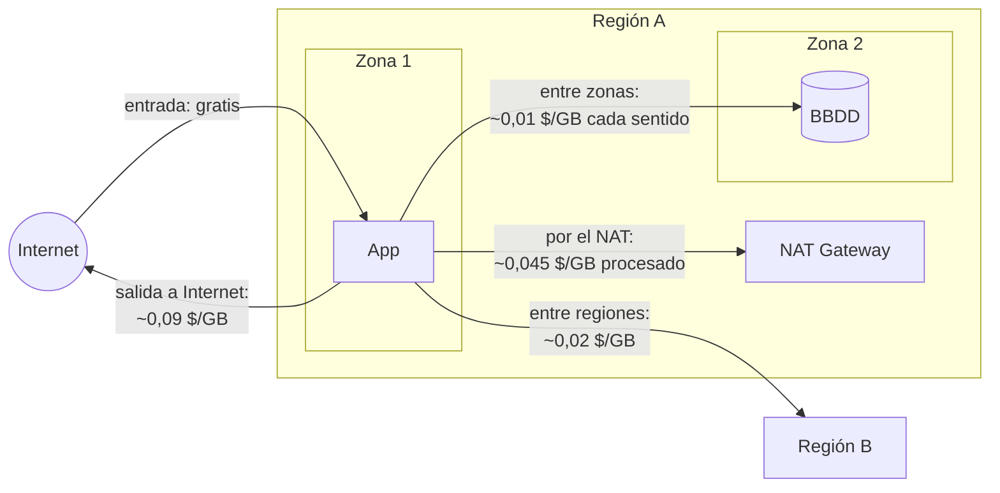
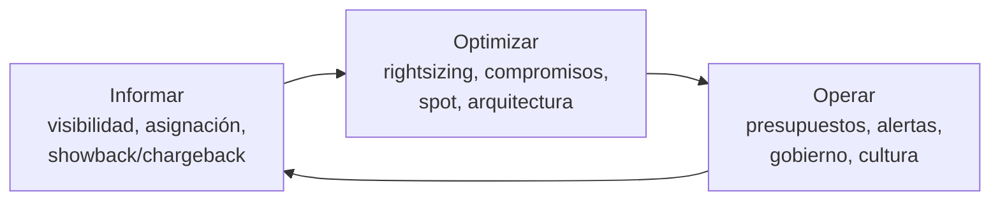

# Costes y FinOps

En cloud el coste es una **característica de la arquitectura** más, como la latencia o la disponibilidad. Cada
decisión de diseño (servicio gestionado o no, región, topología de red, retención de logs) tiene precio.

!!! warning "Cifras orientativas"
    Precios de lista aproximados (EE. UU./UE, 2025-2026), sin descuentos ni impuestos. Sirven para comparar órdenes
    de magnitud; para presupuestar, usa las calculadoras oficiales:
    [AWS](https://calculator.aws/) · [Azure](https://azure.microsoft.com/pricing/calculator/) ·
    [Google Cloud](https://cloud.google.com/products/calculator).

## Qué se paga

| Dimensión | Ejemplos |
|---|---|
| **Cómputo** | Horas/segundos de VM, vCPU-s y GB-s en serverless, nodos de clúster |
| **Almacenamiento** | GB-mes, clase de almacenamiento, IOPS provisionadas, *snapshots* |
| **Peticiones / operaciones** | PUT/GET en almacenamiento de objetos, invocaciones, RU en Cosmos DB, TB escaneados en BigQuery/Athena |
| **Red** | **Salida a Internet**, tráfico entre zonas y regiones, NAT, balanceadores, IPs públicas |
| **Servicios gestionados** | Tarifa del plano de control (EKS/GKE), instancias de BBDD, *throughput* de colas |
| **Licencias y soporte** | Windows/SQL Server, planes de soporte (a menudo un % de la factura) |

!!! tip "La entrada suele ser gratis; la salida no"
    Subir datos a la nube no cuesta; sacarlos a Internet o a otra región, sí. Esto condiciona arquitecturas
    multicloud, híbridas y de edge (dónde se procesan y agregan los datos).

## Transferencia de datos: qué se cobra exactamente

La red es la partida más difícil de prever porque depende de **por dónde** viaja cada byte:

| Tipo de tráfico | Coste típico | Cómo reducirlo |
|---|---|---|
| Entrada desde Internet | Gratis | — |
| Dentro de la misma zona (IP privada) | Gratis | Colocar juntos los servicios que hablan mucho entre sí |
| Entre zonas de la misma región | ~0,01 $/GB en cada sentido (AWS) | Enrutado consciente de zona, réplicas de lectura locales |
| Entre regiones | ~0,02 $/GB o más | Procesar donde están los datos; replicar solo lo necesario |
| Salida a Internet | ~0,08-0,12 $/GB (primeros 100 GB/mes gratis en AWS y Azure) | CDN, compresión, cachés |
| Por un NAT gestionado | ~0,045 $/GB **además** de la salida | *Endpoints* privados para servicios de la nube |

## Cómo funcionan los descuentos por compromiso

- **Reserva o compromiso por recurso**: te comprometes a pagar un tipo de instancia (o vCPU y memoria) en una región
  durante 1 o 3 años. El descuento se aplica **automáticamente** a las instancias que coinciden; si no las usas, se paga igual.
- **Compromiso de gasto** (Savings Plans en AWS, Savings Plan for Compute en Azure, CUD flexibles en GCP): te comprometes
  a gastar X $/hora en cómputo, sea cual sea la familia o región. Algo menos de descuento, mucha más flexibilidad.
- **Opciones de pago**: todo por adelantado (más descuento), parcial o mensual.
- **Riesgo**: comprometerse de más. Por eso se cubre solo la **base estable** medida en los últimos meses.

## Instancias Spot: cómo funcionan

- Usan **capacidad sobrante** del proveedor con descuentos del 60-90 %.
- El proveedor puede **recuperarlas** cuando necesita la capacidad, con un aviso previo muy corto (unos **2 minutos** en
  AWS; unos **30 segundos** en Azure y Google Cloud).
- Adecuadas para cargas **interrumpibles**: CI, procesamiento por lotes con *checkpoints*, réplicas sin estado de un
  servicio, nodos de Kubernetes para cargas tolerantes (con varios tipos de instancia para reducir interrupciones).
- En Kubernetes: Karpenter o el Cluster Autoscaler mezclan nodos Spot y bajo demanda; el aviso de interrupción se usa para
  drenar el nodo de forma ordenada.

## Comparativa de precios de referencia

| Recurso | AWS | Azure | Google Cloud |
|---|---|---|---|
| VM general 2 vCPU / 8 GB (x86) | `m7i.large` ≈ 0,10 $/h | D2s v5 ≈ 0,096 $/h | `n2-standard-2` ≈ 0,097 $/h |
| VM económica 2 vCPU / 8 GB | `m7g.large` (ARM) ≈ 0,08 $/h | D2ps v5 (ARM) ≈ 0,077 $/h | `e2-standard-2` ≈ 0,067 $/h |
| Plano de control Kubernetes | EKS 0,10 $/h (≈ 73 $/mes); 0,60 $/h en soporte extendido | AKS Free: 0 · Standard: 0,10 $/h · Premium (LTS): 0,60 $/h | GKE 0,10 $/h; crédito de 74,40 $/mes cubre 1 clúster |
| Objetos, nivel estándar | S3 ≈ 0,023 $/GB-mes | Blob Hot ≈ 0,018-0,021 $/GB-mes | GCS ≈ 0,020-0,026 $/GB-mes |
| Objetos, archivo | Deep Archive ≈ 0,001 $/GB-mes | Archive ≈ 0,001-0,002 $/GB-mes | Archive ≈ 0,0012 $/GB-mes |
| Funciones (peticiones) | 0,20 $/M | 0,20 $/M | 0,40 $/M (Cloud Run) |
| Salida a Internet (primer tramo) | ≈ 0,09 $/GB (100 GB/mes gratis) | ≈ 0,087 $/GB (100 GB/mes gratis) | ≈ 0,12 $/GB Premium · ≈ 0,085 Standard |
| NAT gestionado | 0,045 $/h + 0,045 $/GB | 0,045 $/h + 0,045 $/GB | Por VM/hora + 0,045 $/GB |
| IPv4 pública | ≈ 3,6 $/mes | ≈ 3,6 $/mes | ≈ 3,6 $/mes |

Las diferencias de precio de lista entre los tres suelen ser **pequeñas**; lo que cambia la factura es la
**arquitectura**, los **descuentos** negociados y el **uso real** (ocupación de lo que pagas).

## Modelos de compra

| Modelo | AWS | Azure | Google Cloud | Descuento típico | Para |
|---|---|---|---|---|---|
| **Bajo demanda** | On-Demand | Pay-as-you-go | On-demand | — | Cargas nuevas o imprevisibles |
| **Compromiso de uso** | Savings Plans (Compute / EC2 Instance), Reserved Instances | Reservations, Savings Plan for Compute | Committed Use Discounts (por recurso o por gasto) | 30-72 % (1-3 años) | Base estable de consumo |
| **Automático por uso sostenido** | — | — | Sustained Use Discounts | hasta ~30 % | VMs encendidas casi todo el mes |
| **Capacidad sobrante** | Spot Instances | Spot VMs | Spot VMs | 60-90 % | Cargas tolerantes a interrupción: CI, *batch*, nodos K8s sin estado |
| **Licencias** | BYOL | Azure Hybrid Benefit | BYOL | Variable | Windows / SQL Server / Oracle |
| **Acuerdos empresariales** | EDP / PPA | MACC | Commit contracts | Negociado | Gasto anual grande |

!!! tip "Estrategia típica"
    Cubre con **compromisos** el ~60-80 % de la base estable, deja la variable **bajo demanda** y mueve lo tolerante
    a fallos a **Spot**. Revisa la cobertura cada trimestre.

## Capas gratuitas { #capas-gratuitas }

| | AWS | Azure | Google Cloud |
|---|---|---|---|
| Crédito inicial | Hasta 200 $ para cuentas nuevas (plan gratuito de hasta 6 meses) | 200 $ durante 30 días | 300 $ durante 90 días |
| Servicios gratis 12 meses | Sustituido por el modelo de créditos (cuentas creadas desde julio de 2025) | Selección de servicios populares | — |
| Siempre gratis (ejemplos) | Lambda 1 M peticiones/mes, DynamoDB 25 GB | Functions 1 M ejecuciones/mes, varios servicios | VM `e2-micro` en algunas regiones de EE. UU., 5 GB en Cloud Storage (EE. UU.), 1 TiB/mes de consultas BigQuery, cuota de Cloud Run |

## Estimación de ejemplo: plataforma web pequeña en AWS

API en Kubernetes, alta disponibilidad básica, `us-east-1`, precios de lista mensuales (730 h).

| Componente | Cálculo | ≈ $/mes |
|---|---|---|
| EKS (plano de control) | 0,10 × 730 | 73 |
| 3 nodos `m7g.large` | 3 × 0,0816 × 730 | 179 |
| ALB | Hora + unidades de capacidad | 25 |
| NAT Gateway (1) + 200 GB procesados | 0,045 × 730 + 200 × 0,045 | 42 |
| PostgreSQL gestionado Multi-AZ (2 vCPU, 8 GB) + 100 GB | Instancia × 2 + almacenamiento | 250-300 |
| S3 500 GB | 500 × 0,023 | 12 |
| Salida a Internet 1 TB | (1 024 − 100) × 0,09 | 83 |
| CloudWatch (logs, métricas) | Ingesta y retención | 30-60 |
| **Total** | | **≈ 700-800** |

Palancas: Savings Plan de cómputo (−30-40 % en nodos), nodos Spot para réplicas sin estado, CloudFront para la
salida, endpoints de VPC para quitar tráfico del NAT, retención de logs corta. Con todo ello, un −30 % es realista.

!!! exercise "Ejercicio · Medio — Comparar la misma plataforma en tres nubes"
    Reproduce esta estimación en la calculadora oficial de AWS, luego la equivalente en Azure (AKS + Flexible Server)
    y en Google Cloud (GKE Autopilot + Cloud SQL). ¿Dónde está la mayor diferencia y por qué?

    ??? success "Qué deberías encontrar"
        Las cifras exactas dependen del momento y la región, pero el patrón suele ser:
        - **Plano de control de Kubernetes**: AKS en nivel Free no cobra; GKE cubre un clúster con su crédito mensual; EKS
          cobra ~73 $/mes. Diferencia pequeña en términos absolutos.
        - **Cómputo**: con GKE **Autopilot** pagas por los recursos que piden los Pods, no por nodos: si los Pods están bien
          dimensionados, suele salir más barato que nodos medio vacíos; si piden de más, más caro.
        - **Base de datos gestionada Multi-AZ/HA**: suele ser la **partida mayor** y la que más varía entre proveedores y
          tamaños; la alta disponibilidad duplica aproximadamente el coste de la instancia en los tres.
        - **Salida de datos**: GCP en nivel Premium es algo más cara por GB; con 1 TB/mes la diferencia es de decenas de dólares.
        Conclusión esperada: las diferencias de lista son moderadas; lo que más cambia la factura es el **dimensionado**, los
        **descuentos por compromiso** y la **arquitectura de red** (NAT, tráfico entre zonas).

## FinOps

**FinOps** es la práctica de gestionar el gasto cloud de forma colaborativa entre ingeniería, finanzas y negocio,
para tomar decisiones basadas en el valor que aporta cada euro.

### Ciclo (FinOps Foundation)

### Prácticas esenciales

| Práctica | Cómo |
|---|---|
| **Etiquetado obligatorio** | `owner`, `cost-center`, `env`, `service`; forzado con SCP / Azure Policy / Org Policy y validado en CI |
| **Asignación de costes** | *Showback* (mostrar a cada equipo lo que gasta) → *chargeback* (cobrárselo) |
| **Presupuestos y anomalías** | AWS Budgets + Cost Anomaly Detection · Azure Cost Management · GCP Budgets |
| ***Rightsizing*** | Compute Optimizer · Azure Advisor · GCP Recommender |
| **Apagar lo que no se usa** | Entornos no productivos fuera de horario (−65 % de horas), entornos efímeros por PR |
| **Ciclo de vida del almacenamiento** | Mover a clases frías y borrar automáticamente |
| **Kubernetes** | *Requests* ajustadas a uso real, autoescalado de nodos (Karpenter, Cluster Autoscaler), **OpenCost** para coste por namespace |
| **Economía unitaria** | Coste por cliente, por transacción, por nodo edge: permite saber si crecer es rentable |
| **FOCUS** | Formato abierto de datos de facturación, soportado por los tres proveedores, para analizar gasto multicloud |
| **Policy as code** | Impedir instancias enormes o regiones caras sin aprobación |

## Preguntas de repaso

??? question "¿Por qué el tráfico de salida influye tanto en la arquitectura?"
    Porque es de los pocos costes que crecen con el éxito del producto y que no desaparecen con descuentos de cómputo.
    Condiciona dónde procesar datos (en el edge o en la región), el uso de CDN, la ubicación de réplicas y el multicloud.

??? question "Savings Plan vs. Reserved Instance en AWS"
    La RI se compromete con un tipo de instancia (más descuento, menos flexibilidad). El Compute Savings Plan se
    compromete con un gasto por hora ($/h) aplicable a cualquier familia, región, Fargate y Lambda (algo menos de descuento).

??? question "¿Qué cargas NO pondrías en instancias Spot?"
    Las que no toleran interrupción con poco aviso: bases de datos con estado sin réplicas, trabajos largos sin
    *checkpoints*, o el único nodo de un servicio crítico.

??? question "¿Qué es la economía unitaria y por qué importa más que la factura total?"
    Expresar el coste por unidad de valor (por cliente, pedido, dispositivo). Una factura que crece puede ser buena
    noticia si el coste unitario baja; permite decidir con criterio de negocio y no solo recortar.

## Ejercicios

!!! exercise "Ejercicio 1 · Básico — Reserva o bajo demanda"
    Una VM cuesta 0,10 $/h bajo demanda y 0,06 $/h con compromiso de 1 año (se paga todo el año, se use o no). ¿A partir
    de qué porcentaje de uso compensa el compromiso?

    ??? success "Solución"
        Compromiso: 0,06 × 8 760 h = 525,6 $/año. Bajo demanda a un uso u: 0,10 × 8 760 × u = 876 × u. Compensa si
        876 × u > 525,6 → **u > 60 %** del tiempo. Para cargas encendidas siempre (100 %), el ahorro es del 40 %; para
        entornos de desarrollo apagados de noche (~35 % de uso), mejor bajo demanda con apagado programado.

!!! exercise "Ejercicio 2 · Medio — Etiquetado y asignación"
    Finanzas quiere saber cuánto cuesta cada producto, pero el 40 % del gasto no tiene etiquetas. Diseña un plan.

    ??? success "Solución"
        1. Definir el **estándar** de etiquetas obligatorias (`owner`, `cost-center`, `product`, `env`).
        2. **Impedir** crear recursos sin ellas: SCP/Tag Policies (AWS), Azure Policy con efecto `deny`, Org Policies o
           validación en CI (Conftest/Checkov en Terraform).
        3. **Corregir lo existente**: informe de recursos sin etiquetas por cuenta/suscripción, con fecha límite por equipo.
        4. **Costes compartidos** (red, observabilidad, plataforma): repartir con una regla acordada (proporcional al uso o al gasto).
        5. **Kubernetes**: los clústeres compartidos no se reparten con etiquetas cloud; usar OpenCost para el coste por *namespace*.
        6. *Showback* mensual por producto y, más adelante, *chargeback*.

!!! exercise "Ejercicio 3 · Avanzado — Coste unitario de la flota"
    Tu plataforma cuesta 42 000 $/mes (hub cloud 30 000 $ + telemetría 12 000 $) y gestiona 6 000 sitios. El año que viene
    habrá 15 000 sitios. Calcula el coste unitario, estima el futuro y propón cómo mejorarlo.

    ??? success "Solución"
        Coste unitario actual: 42 000 / 6 000 = **7 $/sitio/mes**. Si el hub escala poco (supongamos +30 % → 39 000 $) y la
        telemetría escala linealmente (12 000 × 2,5 = 30 000 $), el total sería 69 000 $ → **4,6 $/sitio/mes**: el coste
        unitario baja, pero la telemetría pasa a dominar. Mejoras: agregación y *downsampling* en el sitio (enviar
        agregados de 1 min en lugar de datos brutos), retención por niveles, métricas de alta cardinalidad solo bajo
        demanda. Presentarlo como coste por sitio permite a negocio fijar precios y ver si crecer es rentable.

## Fuentes de los precios verificados

Verificados en septiembre de 2026 (el resto de cifras son aproximaciones de lista para razonar órdenes de magnitud):

- [Amazon EKS: precios de soporte estándar y extendido](https://aws.amazon.com/blogs/containers/amazon-eks-extended-support-for-kubernetes-versions-pricing/)
- [Niveles de precio de AKS (Free, Standard, Premium)](https://learn.microsoft.com/en-us/azure/aks/free-standard-pricing-tiers)
- [Precios de GKE](https://cloud.google.com/kubernetes-engine/pricing)
- [AWS Free Tier: 200 $ en créditos y plan gratuito de 6 meses](https://aws.amazon.com/about-aws/whats-new/2025/07/aws-free-tier-credits-month-free-plan/)

