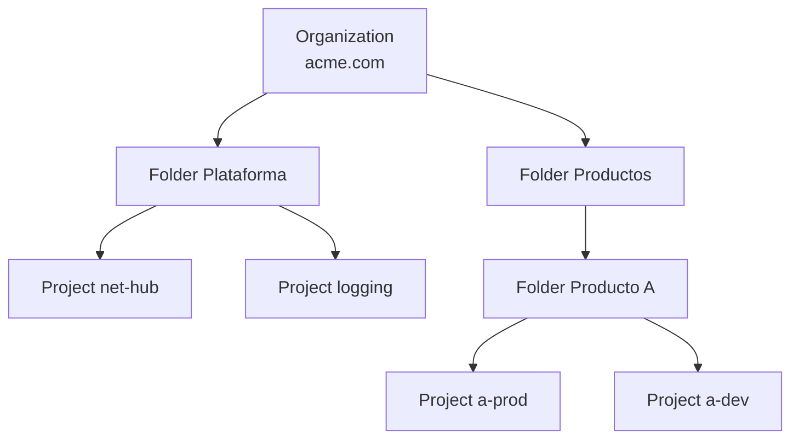

# Google Cloud (GCP)

Tercer proveedor por cuota, construido sobre la infraestructura que usa Google para sus propios productos.
Destaca en **datos y analítica** (BigQuery), **IA** (Gemini, TPUs), **Kubernetes** (nació en Google) y su **red
global** propia.

!!! warning "Precios orientativos"
    Referencia `us-central1` / `europe-west1`, bajo demanda, 2025-2026. Verifica en la
    [calculadora de Google Cloud](https://cloud.google.com/products/calculator).

## Jerarquía de recursos



- **Project**: unidad básica de recursos, APIs habilitadas, cuotas y facturación. Identificado por un *project ID* único global.
- **Folders**: agrupan proyectos (por equipo, entorno) para heredar políticas e IAM.
- **Organization Policies**: restricciones (regiones permitidas, prohibir IPs públicas, prohibir claves de *service account*).
- **Shared VPC**: una red central (proyecto *host*) usada por muchos proyectos de servicio.

## Identidad y permisos

| Concepto | Qué es |
|---|---|
| **Cloud IAM** | *Quién* (principal) tiene *qué rol* sobre *qué recurso*; se hereda hacia abajo en la jerarquía |
| Roles | Básicos (Owner/Editor/Viewer: evitar), **predefinidos** (granulares) y personalizados |
| **Service Account** | Identidad de una carga de trabajo |
| **Workload Identity Federation** | Credenciales externas (GitHub Actions, AWS, Azure, on-prem) → acceso a GCP sin claves |
| **Workload Identity for GKE** | Un Pod actúa como una service account sin claves montadas |
| **IAP** (*Identity-Aware Proxy*) | Acceso a apps y VMs según identidad y contexto, sin VPN (modelo BeyondCorp / zero trust) |
| **VPC Service Controls** | Perímetros que impiden exfiltrar datos de servicios gestionados (BigQuery, GCS) fuera del perímetro |

## Servicios principales

### Cómputo

| Servicio | Qué hace | Cuándo | Modelo de precio |
|---|---|---|---|
| **Compute Engine** | VMs. Familias: E2 (coste), N2/N4 (general), C3/C4 (rendimiento), M (memoria), A3/G2 (GPU), **C4A (Axion, ARM)**. Tipos personalizados de vCPU/memoria | IaaS, control del SO | Por segundo. `e2-standard-2` (2 vCPU, 8 GB) ≈ 0,067 $/h ≈ 49 $/mes |
| **Managed Instance Groups** | Grupos de VMs con autoescalado y auto-reparación | IaaS escalable | Pagas las VMs |
| **GKE** | Kubernetes gestionado. **Autopilot**: Google gestiona los nodos y pagas por Pod; **Standard**: gestionas los *node pools* | K8s de referencia | 0,10 $/h por clúster; un crédito mensual gratuito cubre un clúster zonal o Autopilot |
| **Cloud Run** | Contenedores serverless (servicios, *jobs* y *functions*); escala a cero; basado en Knative | APIs y *workers* sin operar infra | Por vCPU-s, GiB-s y peticiones (0,40 $/M); capa gratuita de 2 M peticiones/mes |
| **Cloud Run functions** (antes Cloud Functions) | Funciones por evento | *Glue code*, eventos | Igual que Cloud Run |
| **App Engine** | PaaS clásico | Apps heredadas; para nuevas, Cloud Run | Por instancia |
| **Batch** | Trabajos por lotes en VMs | HPC, procesamiento | Pagas las VMs |

### Almacenamiento

| Servicio | Qué hace | Precio orientativo |
|---|---|---|
| **Cloud Storage** | Objetos; ubicación regional, *dual-region* o *multi-region* | Standard ≈ 0,020 $/GB-mes (regional) a 0,026 (multi-región) |
| Nearline / Coldline / Archive | Clases frías (mínimo 30 / 90 / 365 días), **lectura en milisegundos** también en Archive | ≈ 0,010 / 0,004 / 0,0012 $/GB-mes + coste por recuperación |
| **Persistent Disk / Hyperdisk** | Discos de bloque (Hyperdisk permite ajustar IOPS y *throughput* por separado) | Según tipo |
| **Filestore** | NFS gestionado | Por capacidad provisionada |

### Bases de datos

| Servicio | Qué hace | Cuándo |
|---|---|---|
| **Cloud SQL** | PostgreSQL, MySQL y SQL Server gestionados | Relacional estándar |
| **AlloyDB** | Compatible con PostgreSQL, con motor columnar para analítica y mayor rendimiento; también *AlloyDB Omni* para ejecutarlo en cualquier sitio | PostgreSQL exigente, HTAP |
| **Spanner** | Relacional **distribuida globalmente con consistencia fuerte** (relojes TrueTime) y 99,999 % de SLA; también grafos y vectores | Escala global sin renunciar a SQL y transacciones |
| **Firestore** | Documentos serverless con sincronización en tiempo real para móvil/web | Apps móviles, backends ligeros |
| **Bigtable** | Columnar ancha de baja latencia a escala de petabytes (el origen de HBase) | Series temporales, IoT, *ad tech* |
| **Memorystore** | Valkey, Redis y Memcached gestionados | Caché |
| **BigQuery** | Data warehouse **serverless**: separa almacenamiento y cómputo, SQL estándar, ML en SQL (BigQuery ML) | Analítica a cualquier escala |

!!! tip "BigQuery: cómo se paga"
    *On-demand*: ≈ 6,25 $/TiB escaneado (el primer TiB/mes gratis) → particiona y agrupa (*clustering*) las tablas
    y selecciona solo las columnas necesarias (`SELECT *` es caro). Alternativa: **Editions** con capacidad reservada
    en *slots*. Almacenamiento ≈ 0,02 $/GB-mes activo, la mitad si no se modifica en 90 días.

### Red

| Servicio | Qué hace |
|---|---|
| **VPC** | Red privada **global**: subredes regionales dentro de una única VPC mundial |
| Firewall rules / policies | Reglas por etiquetas o *service accounts*; políticas jerárquicas por organización/carpeta |
| **Cloud Load Balancing** | Balanceo global con una única IP *anycast* (L7 HTTP(S) y L4) |
| **Cloud CDN** / Media CDN | Caché en el borde de la red de Google |
| **Cloud Armor** | WAF y protección DDoS |
| **Cloud NAT** | Salida a Internet gestionada, sin VMs proxy |
| **Cloud DNS** | DNS gestionado |
| **Cloud Interconnect** / Cloud VPN | Conexión dedicada / VPN |
| **Private Service Connect** | Acceso privado a servicios de Google o de terceros |
| Niveles de red **Premium / Standard** | El tráfico viaja por la red de Google (Premium) o por Internet público (Standard, más barato) |
| **Apigee** / API Gateway | Gestión de APIs empresarial / gateway ligero |

### Integración y datos

| Servicio | Qué hace |
|---|---|
| **Pub/Sub** | Mensajería global serverless (pub/sub y colas) con *at-least-once* y opción *exactly-once* |
| **Eventarc** | Enrutado de eventos (CloudEvents) hacia Cloud Run, GKE, Workflows |
| **Workflows** | Orquestación de llamadas a servicios |
| **Cloud Tasks** / Cloud Scheduler | Colas de tareas HTTP / cron gestionado |
| **Dataflow** | Procesamiento *batch* y *streaming* (Apache Beam) serverless |
| **Dataproc** | Spark/Hadoop gestionado |
| **Managed Service for Apache Kafka** | Kafka gestionado |
| **Looker** | BI y capa semántica |

### Seguridad y operación

| Servicio | Qué hace |
|---|---|
| **Secret Manager** / **Cloud KMS** / Cloud HSM | Secretos y claves |
| **Security Command Center** | Postura de seguridad, amenazas, vulnerabilidades |
| **Binary Authorization** | Solo se despliegan en GKE/Cloud Run imágenes firmadas o aprobadas |
| **Google Cloud Observability** | Cloud Monitoring, Logging, Trace, Profiler; **Managed Service for Prometheus** |
| **Cloud Build** / **Cloud Deploy** / **Artifact Registry** | CI, entrega continua con promoción entre entornos, repositorio de artefactos |
| **Infrastructure Manager** | Terraform gestionado por Google (sustituye a Deployment Manager) |
| **Config Connector** | Gestiona recursos de GCP como CRDs de Kubernetes (infra reconciliada vía GitOps) |

### IA

| Servicio | Qué hace |
|---|---|
| **Vertex AI** | Plataforma de IA: **Model Garden** (Gemini, Claude, Llama y otros), ajuste fino, evaluación, despliegue, MLOps |
| **Gemini** (API) | Modelos multimodales de Google |
| **Vertex AI Agent Builder / Agent Engine** | Construir y desplegar agentes |
| **Vertex AI Search** / Vector Search | Búsqueda empresarial y vectorial (RAG) |
| **TPU** | Aceleradores propios para entrenamiento e inferencia |
| Document AI, Speech-to-Text, Vision, Translation | IA preentrenada |

### Híbrido y edge

| Servicio | Qué hace |
|---|---|
| **GKE Enterprise** (antes Anthos) | Gestión de flotas de clústeres (GKE, on-prem, otras nubes): políticas, service mesh, **Config Sync** (GitOps) |
| **Google Distributed Cloud** | Hardware y software de Google en tu CPD o en el edge, incluida versión totalmente desconectada (*air-gapped*) |
| GKE attached clusters | Registrar EKS/AKS u otros clústeres en la flota de GKE |

```yaml
# Config Sync: sincronizar un clúster de la flota desde Git
apiVersion: configsync.gke.io/v1beta1
kind: RootSync
metadata:
  name: root-sync
  namespace: config-management-system
spec:
  sourceFormat: unstructured
  git:
    repo: https://github.com/acme/cac-gitops-platform
    branch: main
    dir: clusters/edge
    auth: none
```

## Conceptos en profundidad

### Red global

- **Una VPC es global**: sus subredes son regionales, pero todas forman parte de la misma red y se comunican por IP
  privada sin *peering* ni VPN. En AWS y Azure harían falta varias redes interconectadas.
- **Shared VPC**: un proyecto *host* posee la red y otros proyectos (*service projects*) despliegan en ella. El equipo de
  red controla subredes y reglas; los equipos de producto solo usan la red.
- **Cloud Load Balancing global**: una única IP *anycast* para todo el mundo; el usuario entra por el punto de presencia de
  Google más cercano y viaja por la red privada de Google hasta la región con capacidad.
- **Niveles de red**: *Premium* (el tráfico viaja por la red de Google casi todo el camino, menor latencia) y *Standard*
  (sale a Internet público cerca de la región, más barato).

### IAM: cómo se conceden permisos

1. Un **principal** (usuario, grupo, *service account*, identidad federada) recibe un **rol** sobre un **recurso**.
2. Los permisos se **heredan** hacia abajo: un rol en una carpeta se aplica a todos sus proyectos y recursos.
3. No se puede "quitar" en un nivel inferior un permiso heredado (salvo con **políticas de denegación**, IAM Deny):
   por eso los permisos amplios deben darse lo más abajo posible.
4. Tipos de rol: **básicos** (Owner, Editor, Viewer: demasiado amplios, evitarlos), **predefinidos** (granulares, por
   servicio) y **personalizados**.
5. **Service accounts**: identidades de las cargas. Mejor **suplantarlas** (*impersonation*) de forma temporal que
   descargar claves; las claves de *service account* se pueden prohibir con una política de organización.

### Elegir dónde ejecutar código en Google Cloud

| Si necesitas… | Usa |
|---|---|
| Control del SO, cargas heredadas | Compute Engine |
| Contenedores HTTP o *jobs* sin gestionar nada, escalar a cero | **Cloud Run** |
| Kubernetes sin gestionar nodos, pago por Pod | **GKE Autopilot** |
| Kubernetes con control total de los nodos (GPU, DaemonSets, ajustes de kernel) | **GKE Standard** |
| Código por eventos | Cloud Run functions |

### BigQuery por dentro

- **Almacenamiento y cómputo separados**: los datos están en almacenamiento columnar distribuido; las consultas usan
  **slots** (unidades de CPU) de un *pool* enorme compartido, asignados al vuelo.
- Por eso no hay que dimensionar servidores: una consulta sobre 10 TB puede usar miles de *slots* durante segundos.
- El coste *on-demand* depende de los **bytes leídos**, así que el diseño de tablas es el principal factor de coste:
  - **Particionado** (normalmente por fecha): la consulta solo lee las particiones filtradas.
  - **Clustering** (por columnas de filtro frecuente): dentro de cada partición, los datos se ordenan y se saltan bloques.
  - Leer solo las **columnas** necesarias (almacenamiento columnar: cada columna es un fichero aparte).

## Rasgos diferenciales en precios

- **Facturación por segundo** y tipos de máquina **personalizados** (pagas exactamente las vCPU/GB que pides).
- **Sustained Use Discounts**: descuento **automático** (hasta ~30 %) en VMs que funcionan gran parte del mes (familias N1/N2, no E2).
- **Committed Use Discounts**: por recursos (hasta ~55-70 %) o flexibles por gasto (hasta ~46 %).
- **Spot VMs**: 60-91 % de descuento, pueden ser reclamadas.

## Costes ocultos habituales

| Trampa | Mitigación |
|---|---|
| Consultas BigQuery on-demand con `SELECT *` sobre tablas grandes | Particionado, *clustering*, `--maximum_bytes_billed`, vistas materializadas |
| Salida a Internet en nivel Premium (≈ 0,12 $/GB el primer TB) | CDN, nivel Standard donde la latencia no sea crítica |
| Ingesta de logs por encima de la cuota gratuita | Exclusiones y *sinks* a Cloud Storage |
| Clústeres GKE Standard sobredimensionados | Autopilot (pago por Pod), autoescalado de nodos, VMs Spot para cargas tolerantes |

## Preguntas de repaso

??? question "¿Qué implica que la VPC de Google sea global?"
    Una sola VPC puede tener subredes en todas las regiones y comunicarse por IP privada sin *peering* ni VPN entre
    regiones. En AWS y Azure la VPC/VNet es regional y hay que interconectarlas.

??? question "¿GKE Autopilot o Standard?"
    **Autopilot**: Google gestiona nodos, seguridad y escalado; pagas los recursos pedidos por los Pods; menos control
    (sin DaemonSets arbitrarios ni nodos privilegiados). **Standard**: control total de los *node pools*; tú optimizas
    la ocupación.

??? question "¿Por qué Spanner puede ofrecer consistencia fuerte global?"
    Porque usa **TrueTime** (relojes atómicos y GPS con incertidumbre acotada) para asignar *timestamps* globalmente
    ordenados a las transacciones, junto con Paxos para replicar. Paga latencia de escritura a cambio.

??? question "¿Cómo reduces el coste de BigQuery?"
    Particionar por fecha, *clustering* por columnas filtradas, leer solo las columnas necesarias, limitar bytes
    facturados, cachear resultados, vistas materializadas, y pasar a *Editions* si el gasto es estable y alto.

## Ejercicios

!!! exercise "Ejercicio 1 · Básico — Jerarquía de recursos"
    Organiza en carpetas y proyectos: 2 productos (A y B), cada uno con dev y prod, más la red compartida y el registro
    centralizado de logs. ¿Dónde aplicarías la política "prohibir IPs externas en VMs"?

    ??? success "Solución"
        ```text
        Organization
        ├── Folder platform → projects: net-host (Shared VPC), logging
        ├── Folder product-a → projects: a-dev, a-prod
        └── Folder product-b → projects: b-dev, b-prod
        ```
        La restricción `compute.vmExternalIpAccess` en la **organización** (se hereda en todo), con excepciones explícitas
        solo en proyectos que lo justifiquen. Los proyectos de producto son "proyectos de servicio" de la Shared VPC.

!!! exercise "Ejercicio 2 · Medio — Coste de BigQuery"
    Una tabla de telemetría de 50 TB, sin particionar, se consulta 200 veces al día con `SELECT * … WHERE date = '2026-09-25'`.
    Calcula el coste aproximado *on-demand* y cómo reducirlo.

    ??? success "Solución"
        Cada consulta escanea los 50 TB completos (~45,5 TiB) × ~6,25 $/TiB ≈ **284 $** por consulta → ~57 000 $/día.
        Correcciones: **particionar por fecha** (la consulta lee solo un día: ~0,14 TB), **clustering** por `site_id`,
        seleccionar solo las columnas necesarias en vez de `SELECT *`, y limitar bytes facturados por consulta. Coste
        resultante: céntimos por consulta. Con este volumen de uso, valorar también capacidad reservada (Editions).

!!! exercise "Ejercicio 3 · Avanzado — CI sin claves hacia GCP"
    Un *workflow* de GitHub Actions debe desplegar en Cloud Run sin guardar claves de *service account* en GitHub. ¿Cómo?

    ??? success "Solución"
        **Workload Identity Federation**: crear un *pool* de identidades con un proveedor OIDC de GitHub, con una condición
        de atributos que limite a tu repositorio y rama (`assertion.repository == 'acme/java-api' && assertion.ref ==
        'refs/heads/main'`), y permitir que esa identidad **suplante** a una *service account* con solo los permisos de
        despliegue en Cloud Run. En el *workflow*, `google-github-actions/auth` intercambia el token OIDC de GitHub por
        credenciales de corta duración. Además, la política de organización que prohíbe crear claves de *service account*.
