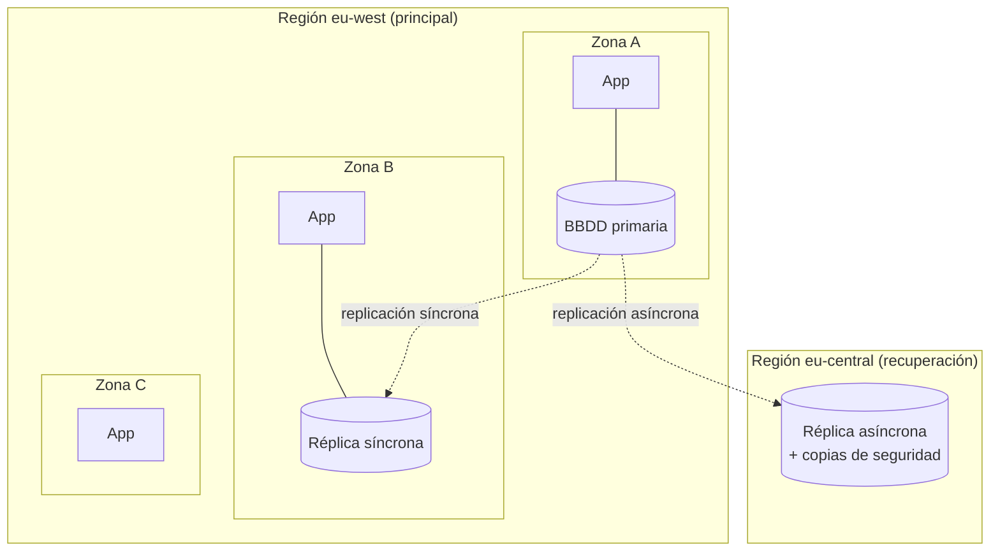

# Cloud

Conceptos comunes a todos los proveedores, cómo compararlos y cuándo elegir cada uno. El detalle de cada
nube está en su página: [AWS](aws.md) · [Azure](azure.md) · [Google Cloud](gcp.md).

!!! warning "Datos que caducan"
    Catálogos de servicios, precios y certificaciones cambian varias veces al año. Las cifras de esta sección son
    **orientativas (2025-2026)** para razonar órdenes de magnitud; antes de decidir, verifica en la documentación y
    las calculadoras oficiales.

## Modelos de servicio

| Capa | On-prem | IaaS | PaaS | FaaS | SaaS |
|---|:-:|:-:|:-:|:-:|:-:|
| Datos y accesos | 🧑 | 🧑 | 🧑 | 🧑 | 🧑 |
| Aplicación | 🧑 | 🧑 | 🧑 | 🧑 | ☁️ |
| Runtime / middleware | 🧑 | 🧑 | ☁️ | ☁️ | ☁️ |
| Sistema operativo | 🧑 | 🧑 | ☁️ | ☁️ | ☁️ |
| Virtualización | 🧑 | ☁️ | ☁️ | ☁️ | ☁️ |
| Hardware, red física, CPD | 🧑 | ☁️ | ☁️ | ☁️ | ☁️ |

🧑 = lo gestionas tú · ☁️ = lo gestiona el proveedor.

| Modelo | Tú gestionas | Ejemplos |
|---|---|---|
| **IaaS** | SO, runtime, app, datos | EC2, Azure VMs, Compute Engine |
| **CaaS** (contenedores) | Contenedores y su configuración | EKS, AKS, GKE, ECS, Container Apps |
| **PaaS** | Código y datos | Elastic Beanstalk, App Service, App Engine |
| **FaaS / serverless** | Funciones; pagas por ejecución | Lambda, Azure Functions, Cloud Run functions |
| **SaaS** | Uso y configuración | Microsoft 365, Google Workspace, Salesforce |

## Modelo de responsabilidad compartida

- El proveedor es responsable de la seguridad **DE** la nube (centros de datos, hardware, hipervisor, red física).
- Tú eres responsable de la seguridad **EN** la nube: identidades y permisos, configuración, datos, cifrado, red
  virtual, parches del SO en IaaS.
- La línea se mueve según el modelo: en serverless el proveedor asume más; **los datos y los accesos siempre son tuyos**.

!!! tip "La mayoría de brechas en cloud"
    No son fallos del proveedor, sino **configuraciones erróneas del cliente**: buckets públicos, claves en
    repositorios, permisos `*:*`, puertos abiertos a `0.0.0.0/0`.

## Infraestructura global

| Concepto | Qué es | Para qué |
|---|---|---|
| **Región** | Zona geográfica con varios centros de datos | Latencia, soberanía de datos, precio (varía por región) |
| **Zona de disponibilidad (AZ)** | Uno o más CPD aislados dentro de una región, con energía y red propias | Alta disponibilidad: despliega en ≥ 2-3 AZs |
| **Edge / PoP** | Puntos de presencia para CDN y DNS | Acercar contenido al usuario |
| **Zonas locales / edge zones** | Mini-regiones en ciudades u operadores 5G | Latencia de milisegundos |

## Diseñar para fallos: zonas y regiones

En cloud, **el hardware falla constantemente**; lo que cambia es si tu sistema lo nota. La disponibilidad se diseña
eligiendo **en cuántas zonas y regiones** despliegas cada pieza.

| Nivel | Protege frente a | Coste | Cuándo |
|---|---|---|---|
| **Una zona** | Nada más allá de un servidor | Mínimo | Desarrollo, pruebas |
| **Varias zonas** (multi-AZ) | Caída de un centro de datos: incendio, corte eléctrico, red | Moderado (réplicas + tráfico entre zonas) | **Producción: el mínimo razonable** |
| **Varias regiones** | Caída de una región entera, desastres, requisitos legales | Alto (duplicar infraestructura, replicar datos, complejidad) | Sistemas críticos o con usuarios globales |

Las zonas de una región están a pocos kilómetros (latencia de ~1-2 ms): se puede **replicar de forma síncrona** (sin
perder datos). Entre regiones hay decenas o cientos de ms: se replica de forma **asíncrona** (se pueden perder los últimos
segundos de datos si cae la región principal).

## Recuperación ante desastres (DR)

Dos métricas definen lo que el negocio necesita:

- **RPO** (*Recovery Point Objective*): cuántos datos se pueden perder, medido en tiempo. RPO = 1 h significa que es
  aceptable perder la última hora de cambios.
- **RTO** (*Recovery Time Objective*): cuánto tiempo puede estar el servicio caído hasta recuperarse.

| Estrategia | Cómo funciona | RPO | RTO | Coste |
|---|---|---|---|---|
| **Copia de seguridad y restauración** | Copias en otra región; ante un desastre, se crea todo y se restauran los datos | Horas | Horas o días | Bajo |
| **Piloto encendido** (*pilot light*) | En la región de recuperación solo están los datos replicados; el resto se crea con IaC al activarla | Minutos | Decenas de minutos a horas | Bajo-medio |
| **Espera en caliente** (*warm standby*) | Una copia reducida del sistema funcionando en la otra región; al activarla, se escala | Segundos-minutos | Minutos | Medio |
| **Activo-activo** (*multi-site*) | Ambas regiones sirven tráfico; si una cae, la otra asume todo | ~0 | ~0 | Alto |

!!! tip "La recuperación que no se prueba no existe"
    Las copias de seguridad sin restauraciones de prueba y los planes de DR sin simulacros fallan justo cuando se
    necesitan. Programa pruebas periódicas y mide el RPO y el RTO **reales**.

## Los tres grandes

| | AWS | Microsoft Azure | Google Cloud |
|---|---|---|---|
| Lanzamiento | 2006 | 2010 | 2008 (App Engine) |
| Cuota de mercado IaaS/PaaS (aprox., 2025) | ~30 % | ~20-22 % | ~12-13 % |
| Regiones (aprox.) | 35+ | 60+ | 40+ |
| Punto fuerte | Catálogo más amplio y maduro, ecosistema enorme | Empresa Microsoft, identidad (Entra ID), híbrido, .NET/Windows/SQL Server | Datos y analítica (BigQuery), IA (Gemini, TPUs), Kubernetes, red global |
| Kubernetes gestionado | EKS | AKS | GKE (el más maduro; K8s nació en Google) |
| IA generativa | Bedrock (modelos de varios proveedores) | Azure AI Foundry / Azure OpenAI | Vertex AI (Gemini y otros) |
| Híbrido / edge | Outposts, EKS Anywhere, EKS Hybrid Nodes | **Azure Arc** (GitOps con Flux integrado), Azure Local | GKE Enterprise (Config Sync), Google Distributed Cloud |
| Unidad organizativa | Organization → OU → Account | Tenant → Management Group → Subscription → Resource Group | Organization → Folder → Project |

### Cómo elegir

| Si la organización… | Suele encajar |
|---|---|
| Vive en Microsoft 365, Entra ID, Windows Server, SQL Server, .NET | **Azure** (integración de identidad y licencias con Azure Hybrid Benefit) |
| Quiere el catálogo más amplio, más proveedores y talento disponible | **AWS** |
| Es muy intensiva en datos, analítica o IA, o nativa en Kubernetes | **Google Cloud** |
| Tiene muchos sitios edge / on-prem que gestionar como uno solo | Azure Arc o GKE Enterprise, o una capa neutral (Flux/Argo + Cluster API, Rancher) |
| Tiene requisitos de soberanía europea | Nubes soberanas (ver abajo) o regiones/ofertas soberanas de los grandes |

!!! tip "Criterios reales de decisión"
    Habilidades del equipo, contratos y descuentos existentes, servicios gestionados diferenciales que necesitas,
    ubicación de regiones, cumplimiento normativo y **coste de salida** (datos, *lock-in* de servicios propietarios).

## Otros proveedores

| Proveedor | Destaca por |
|---|---|
| **Oracle Cloud (OCI)** | Base de datos Oracle (Autonomous DB, Exadata), salida de datos muy barata (10 TB/mes gratis), *Always Free* generoso (instancias Ampere ARM), Oracle Database@Azure/AWS/Google |
| **IBM Cloud** | Mainframe/híbrido, Red Hat OpenShift, sectores regulados |
| **Alibaba Cloud** | Mercado chino y Asia |
| **OVHcloud, Scaleway, IONOS, STACKIT, Open Telekom Cloud** | Proveedores europeos, soberanía de datos, precios predecibles |
| **Hetzner, DigitalOcean, Akamai (Linode)** | Simplicidad y precio para cargas sencillas |
| **Cloudflare** | Edge: CDN, Workers (serverless en el borde), R2 (almacenamiento sin coste de salida), Zero Trust |

## Soberanía y regulación (Europa)

- **RGPD**: dónde están los datos personales y quién puede acceder (transferencias internacionales).
- **EU Data Act** (aplicable desde septiembre de 2025): facilitar el cambio de proveedor; los grandes han eliminado
  los cargos de salida de datos cuando se **migra fuera** de su nube.
- **NIS2** y **DORA** (sector financiero): requisitos de ciberseguridad y resiliencia operativa, incluidos proveedores cloud.
- Ofertas soberanas: AWS European Sovereign Cloud, Microsoft EU Data Boundary / Sovereign Cloud, Google con socios
  locales (S3NS en Francia, T-Systems en Alemania). Iniciativas como **Gaia-X** buscan interoperabilidad y confianza.

## Frameworks de buena arquitectura

Los tres publican un *Well-Architected Framework* con pilares casi idénticos:

| Pilar | Pregunta clave |
|---|---|
| Excelencia operativa | ¿Podemos operar, observar y mejorar el sistema de forma continua? |
| Seguridad | ¿Protegemos datos, identidades y sistemas? |
| Fiabilidad | ¿Se recupera de fallos y cumple sus SLO? |
| Eficiencia de rendimiento | ¿Usamos los recursos adecuados y escalan con la demanda? |
| Optimización de costes | ¿Entregamos valor al menor coste razonable? |
| Sostenibilidad (AWS, Google) | ¿Minimizamos el impacto ambiental? |

## Multicloud e híbrido

| Estrategia | Ventaja | Coste |
|---|---|---|
| **Una nube** | Simplicidad, descuentos por volumen, profundidad en servicios gestionados | *Lock-in* |
| **Multicloud por carga** (cada sistema en la nube que mejor le va) | Mejor servicio por caso | Varios equipos de competencias, redes entre nubes |
| **Multicloud portable** (misma app en varias nubes) | Negociación, resiliencia ante un proveedor | Denominador común: renuncias a servicios diferenciales |
| **Híbrido** (on-prem/edge + cloud) | Latencia, datos locales, inversión existente | Operar dos mundos: necesitas un plano de gestión común |

!!! tip "Tu experiencia encaja aquí"
    Kubernetes + GitOps + configuración como código es precisamente la capa que hace viable el híbrido y el
    multicloud: el mismo modelo declarativo gestiona clústeres en cualquier nube y en el edge.

## Preguntas de repaso

??? question "¿Qué diferencia hay entre región y zona de disponibilidad?"
    Una región es un área geográfica; una AZ es un centro (o grupo) de datos aislado dentro de ella. Se despliega en
    varias AZs para alta disponibilidad y en varias regiones para recuperación ante desastres o latencia global.

??? question "En un servicio serverless, ¿de qué sigues siendo responsable?"
    Del código, las dependencias, los permisos (IAM) que otorgas a la función, la configuración, los secretos y la
    protección de los datos. El proveedor gestiona SO, runtime, parches y escalado.

??? question "¿Qué coste de multicloud 'portable' suele subestimarse?"
    Renunciar a los servicios gestionados diferenciales (usas el mínimo común), duplicar competencias y
    herramientas, y los costes de red y salida de datos entre nubes.

## Ejercicios

!!! exercise "Ejercicio 1 · Básico — Responsabilidad compartida"
    Para cada incidente, ¿de quién es la responsabilidad, del proveedor o del cliente? (a) Un bucket de S3 con datos de
    clientes queda público. (b) Falla el hardware de un servidor que ejecuta tu VM. (c) Una VM EC2 tiene un SO sin parches
    y la comprometen. (d) Una función Lambda usa una librería con una vulnerabilidad conocida.

    ??? success "Solución"
        (a) **Cliente**: configuración de acceso a los datos. (b) **Proveedor**: hardware (tu responsabilidad es haber
        desplegado en varias AZs para tolerarlo). (c) **Cliente**: en IaaS, el SO es tuyo. (d) **Cliente**: el código y sus
        dependencias son tuyos incluso en *serverless*; el proveedor parchea el runtime, no tus librerías.

!!! exercise "Ejercicio 2 · Medio — Elegir proveedor"
    Una empresa industrial europea usa Microsoft 365 y Entra ID, tiene 400 fábricas con equipos on-prem que quiere gestionar
    de forma centralizada, datos que no pueden salir de la UE, y un equipo que conoce Kubernetes pero no ninguna nube en
    profundidad. ¿Qué nube recomendarías y por qué? ¿Qué riesgos señalarías?

    ??? success "Solución"
        **Azure** encaja bien: identidad ya en Entra ID (SSO y RBAC sin integración extra), **Azure Arc** para gestionar las
        400 fábricas como clústeres conectados con GitOps (Flux) y Azure Policy, regiones en la UE y EU Data Boundary, y
        licencias Microsoft ya contratadas. Riesgos: dependencia de Arc (plano de control del proveedor para la flota),
        costes de Log Analytics si se envía toda la telemetría, y formación del equipo en Azure. Alternativa a considerar:
        capa neutral (Flux + Cluster API/Rancher) si la portabilidad pesa más que la integración.

!!! exercise "Ejercicio 3 · Avanzado — Estrategia multicloud"
    Dirección pide "ser multicloud para no depender de un proveedor". Plantea qué preguntas harías y qué dos estrategias
    alternativas propondrías, con sus costes.

    ??? success "Solución"
        Preguntas: ¿qué riesgo concreto se quiere mitigar (caída de un proveedor, negociación de precios, regulación, salida
        futura)? ¿Qué coste y complejidad se aceptan? ¿Qué servicios gestionados se usan hoy?
        Estrategia A — **Una nube principal + plan de salida**: arquitectura portable en las capas clave (Kubernetes, Postgres,
        Terraform, formatos abiertos), contratos que permitan salir y un ejercicio periódico de "salida en papel". Coste bajo.
        Estrategia B — **Multicloud activo por carga**: cada sistema en la nube que mejor le va (p. ej. analítica en GCP,
        corporativo en Azure). Coste medio: dos equipos de competencias y redes entre nubes.
        La opción "misma app activa en dos nubes" suele ser la más cara y rara vez está justificada.
