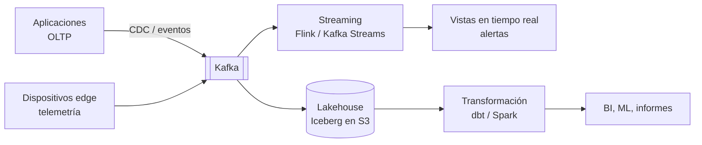

# Datos

Cómo se mueven, procesan y analizan los datos a escala: mensajería de eventos, procesamiento en *streaming* y
plataformas analíticas. Las bases de datos transaccionales están en [Fundamentos](../fundamentos/bases-de-datos.md).

| Página | Qué cubre |
|---|---|
| [Apache Kafka](kafka.md) | *Topics*, particiones, *offsets*, grupos de consumidores, replicación, garantías de entrega, Connect, Schema Registry |
| [Procesamiento en streaming](streaming.md) | Tiempo de evento, ventanas, *watermarks*, estado, Kafka Streams, Flink, CDC |
| [Plataformas de datos](plataformas-datos.md) | OLTP vs. OLAP, data warehouse, data lake, lakehouse, Iceberg, ETL/ELT, dbt, data mesh |

