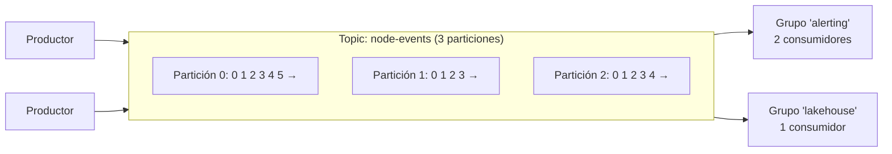

# Apache Kafka <span class="nivel medio">Medio</span>

Kafka es un **log distribuido**: una secuencia de registros **inmutable, ordenada y persistente**, particionada y
replicada entre varios servidores. No es una cola clásica: los mensajes **no se borran al leerse**; cada consumidor
lleva la cuenta de por dónde va.

## 1. Conceptos básicos



| Concepto | Qué es |
|---|---|
| **Registro** (mensaje) | Clave (opcional) + valor + cabeceras + *timestamp* |
| ***Topic*** | Categoría lógica de registros (`node-events`) |
| **Partición** | Cada *topic* se divide en particiones; cada una es un log ordenado independiente. **Unidad de paralelismo y de orden** |
| ***Offset*** | Posición de un registro dentro de su partición (0, 1, 2…) |
| ***Broker*** | Servidor de Kafka; guarda particiones |
| **Productor** | Escribe registros; elige la partición (por defecto, *hash* de la clave) |
| **Consumidor** | Lee registros de particiones y guarda (*commit*) su *offset* |
| **Grupo de consumidores** | Consumidores que se **reparten** las particiones de un *topic*: cada partición la lee un solo miembro del grupo |
| **Retención** | Tiempo o tamaño durante el que se conservan los registros (p. ej. 7 días), se lean o no |

### Reglas que hay que interiorizar

1. **El orden solo está garantizado dentro de una partición.** Si necesitas orden por nodo, usa el `nodeId` como **clave**:
   todos sus eventos irán a la misma partición.
2. **Paralelismo máximo de un grupo = número de particiones.** Con 6 particiones, un séptimo consumidor del mismo
   grupo se queda sin trabajo.
3. **Cada grupo lee de forma independiente**: `alerting` y `lakehouse` reciben **todos** los eventos (pub/sub); dentro de
   cada grupo, las particiones se reparten (cola).
4. **Releer es posible**: basta mover el *offset* hacia atrás (*replay*) mientras los datos sigan retenidos.

## 2. Replicación y durabilidad

- Cada partición tiene un **líder** y varias **réplicas seguidoras** en otros *brokers* (factor de replicación típico: 3).
- **ISR** (*in-sync replicas*): réplicas al día con el líder.
- El productor elige cuánta confirmación espera con `acks`:

| `acks` | Confirma cuando… | Riesgo |
|---|---|---|
| `0` | Nunca (dispara y olvida) | Pérdida silenciosa |
| `1` | Lo escribe el líder | Pérdida si el líder cae antes de replicar |
| **`all`** | Lo tienen todas las ISR | Ninguno si `min.insync.replicas ≥ 2` |

!!! tip "Configuración durable estándar"
    Factor de replicación **3**, `min.insync.replicas=2`, productor con `acks=all` y `enable.idempotence=true`.
    Tolera la caída de un *broker* sin perder datos ni dejar de aceptar escrituras.

Desde **Kafka 4.0** (marzo de 2025), los metadatos del clúster se gestionan exclusivamente con **KRaft** (consenso Raft
interno): ZooKeeper se eliminó por completo. Un clúster antiguo con ZooKeeper debe migrarse a KRaft en una versión 3.x
antes de actualizar a 4.x. La 4.0 trajo también el **nuevo protocolo de grupos de consumidores** (KIP-848, rebalanceos
mucho más rápidos) y, en acceso anticipado, las **colas para Kafka** (KIP-932: consumo compartido de una partición por
varios consumidores, con confirmación por mensaje).

## 3. Garantías de entrega

| Semántica | Cómo se consigue | Consecuencia |
|---|---|---|
| ***At-most-once*** | *Commit* del *offset* **antes** de procesar | Si el consumidor cae, se pierde el mensaje |
| ***At-least-once*** (habitual) | *Commit* **después** de procesar | Si cae tras procesar y antes del *commit*, se reprocesa → **consumidor idempotente** |
| ***Exactly-once*** | Productor idempotente + **transacciones** de Kafka (leer-procesar-escribir en Kafka) | Solo dentro de Kafka; con sistemas externos, se necesita idempotencia |

```java
// Consumidor at-least-once con commit manual tras procesar
props.put(ConsumerConfig.ENABLE_AUTO_COMMIT_CONFIG, false);
try (var consumer = new KafkaConsumer<String, NodeEvent>(props)) {
    consumer.subscribe(List.of("node-events"));
    while (running) {
        ConsumerRecords<String, NodeEvent> records = consumer.poll(Duration.ofMillis(500));
        for (var rec : records) {
            handler.handle(rec.value());          // debe ser idempotente: puede repetirse
        }
        consumer.commitSync();                    // solo tras procesar el lote
    }
}
```

```java
// Productor durable
props.put(ProducerConfig.ACKS_CONFIG, "all");
props.put(ProducerConfig.ENABLE_IDEMPOTENCE_CONFIG, true);   // evita duplicados por reintentos
try (var producer = new KafkaProducer<String, NodeEvent>(props)) {
    producer.send(new ProducerRecord<>("node-events", event.nodeId(), event),   // clave = nodeId → orden por nodo
        (metadata, error) -> { if (error != null) log.error("Envío fallido", error); });
}
```

## 4. Rebalanceos y consumidores lentos

Cuando un consumidor entra o sale del grupo (o deja de llamar a `poll` a tiempo), Kafka **reasigna** las particiones
(**rebalanceo**). Durante el rebalanceo, el procesamiento se detiene.

- `max.poll.interval.ms`: si procesar un lote tarda más, el consumidor se considera muerto → rebalanceo → reprocesado.
  Soluciones: lotes más pequeños (`max.poll.records`) o procesamiento más rápido.
- **Rebalanceo cooperativo** y el nuevo protocolo de grupos reducen las paradas.
- ***Lag*** del consumidor = último *offset* producido − *offset* confirmado. **Es la métrica principal** de salud de un consumidor.

## 5. Compactación de logs

Con `cleanup.policy=compact`, Kafka conserva **el último valor por clave** en lugar de borrar por tiempo. El *topic* se
comporta como una tabla: ideal para **estado actual** (configuración de cada sitio, último estado de cada nodo).
Un valor `null` (*tombstone*) borra la clave.

## 6. Esquemas y contratos

Los eventos son un **contrato** entre equipos. Con un **Schema Registry** (Avro, Protobuf o JSON Schema):

- El productor registra el esquema; el mensaje lleva solo un identificador.
- Reglas de **compatibilidad** (*backward*, *forward*, *full*) impiden publicar cambios que rompan a los consumidores.
- Evolución segura: añadir campos opcionales con valor por defecto; nunca cambiar el tipo o el significado de un campo.

## 7. Ecosistema

| Pieza | Para qué |
|---|---|
| **Kafka Connect** | Mover datos entre Kafka y otros sistemas sin código (conectores *source* y *sink*: bases de datos, S3, Elasticsearch) |
| **Debezium** | CDC: convierte los cambios de una base de datos (leyendo su WAL/binlog) en eventos |
| **Kafka Streams** | Librería Java para procesar *streams* dentro de tu aplicación → [Streaming](streaming.md) |
| **MirrorMaker 2** | Replicar *topics* entre clústeres (multi-región, DR) |
| **Strimzi** | Operador para gestionar Kafka en Kubernetes de forma declarativa (encaja con GitOps) |
| Gestionados | Confluent Cloud, Amazon MSK, Azure Event Hubs (API Kafka), Google Managed Kafka |

## 8. Kafka frente a otras opciones

| | Kafka | RabbitMQ | SQS / Service Bus / Pub/Sub |
|---|---|---|---|
| Modelo | Log persistente con *replay* | *Broker* de colas con enrutado flexible | Colas gestionadas |
| Orden | Por partición | Por cola | Limitado (FIFO opcional) |
| *Throughput* | Muy alto | Medio-alto | Alto, gestionado |
| Operación | Compleja si es propio | Media | Nula |
| Ideal para | *Streaming*, eventos entre dominios, CDC, telemetría | Tareas, RPC asíncrono, enrutado complejo | Desacoplar servicios sin operar nada |

## Preguntas de repaso

??? question "¿Cómo garantizas que los eventos de un mismo nodo se procesen en orden?"
    Usando el ID del nodo como **clave** del mensaje: el particionador envía todos sus eventos a la misma partición, y
    dentro de una partición el orden está garantizado y la lee un único consumidor del grupo.

??? question "Tienes 4 particiones y 8 consumidores en el mismo grupo. ¿Qué pasa?"
    Solo 4 consumidores reciben particiones; los otros 4 quedan ociosos (sirven de reserva ante fallos). Para más
    paralelismo hay que aumentar las particiones.

??? question "¿Qué significa exactly-once en Kafka y cuál es su límite?"
    Que un flujo leer-procesar-escribir **dentro de Kafka** produce cada resultado una sola vez, usando productor idempotente
    y transacciones. Si el efecto es en un sistema externo (una BBDD, un email), hace falta idempotencia en ese sistema.

??? question "¿Para qué sirve un topic compactado?"
    Para conservar el último valor de cada clave indefinidamente: representa el estado actual (una tabla) y permite a un
    consumidor nuevo reconstruirlo leyendo el *topic* desde el principio.

## Ejercicios

!!! exercise "Ejercicio 1 · Básico — Elegir la clave"
    Diseñas un *topic* `deployment-events` con eventos `Started`, `WaveCompleted`, `Finished` de *rollouts* sobre miles de
    sitios. Necesitas procesar en orden los eventos de cada *rollout*. ¿Qué clave usas y cuántas particiones?

    ??? success "Solución"
        Clave = `rolloutId`: todos los eventos de un *rollout* van a la misma partición y se procesan en orden.
        Particiones: suficientes para el paralelismo máximo previsto de los consumidores y el *throughput* (p. ej. 12-24);
        aumentar particiones después cambia el reparto de claves (rompe el orden durante la transición), así que conviene
        dimensionar con margen desde el principio.

!!! exercise "Ejercicio 2 · Básico — Calcular el lag"
    En la partición 3, el último *offset* producido es 18 450 y el confirmado por el grupo `alerting` es 17 950. Los
    productores escriben 50 mensajes/s en esa partición y el consumidor procesa 70/s. ¿Cuánto *lag* hay y cuánto tarda en recuperarse?

    ??? success "Solución"
        *Lag* = 18 450 − 17 950 = **500 mensajes**. El consumidor recupera 70 − 50 = 20 mensajes/s netos → 500 / 20 = **25 s**.
        Si el consumidor procesara menos de 50/s, el *lag* crecería sin límite: habría que escalar (más particiones y consumidores) u optimizar.

!!! exercise "Ejercicio 3 · Medio — Consumidor idempotente"
    Un consumidor recibe `NodeRebooted(eventId, nodeId)` y suma 1 a un contador de reinicios en PostgreSQL. Con
    *at-least-once* puede recibir duplicados. Hazlo idempotente.

    ??? success "Solución"
        Registrar los eventos procesados en la **misma transacción** que el efecto:
        ```sql
        CREATE TABLE processed_event (event_id UUID PRIMARY KEY, processed_at TIMESTAMPTZ NOT NULL DEFAULT now());
        ```
        ```java
        @Transactional
        public void handle(NodeRebooted e) {
            int inserted = jdbc.update(
                "INSERT INTO processed_event(event_id) VALUES (?) ON CONFLICT DO NOTHING", e.eventId());
            if (inserted == 0) return;                                    // duplicado: ya procesado
            jdbc.update("UPDATE node SET reboots = reboots + 1 WHERE id = ?", e.nodeId());
        }
        ```
        Si el mensaje llega dos veces, el segundo `INSERT` no inserta nada y se ignora. Limpia la tabla periódicamente
        (conservando más tiempo que la ventana posible de duplicados).

!!! exercise "Ejercicio 4 · Medio — Configuración durable"
    Escribe la configuración de *topic*, productor y consumidor para eventos de facturación que **no pueden perderse** en
    un clúster de 3 *brokers*.

    ??? success "Solución"
        ```text
        Topic:     replication.factor=3, min.insync.replicas=2, retention.ms=604800000 (7 días)
        Productor: acks=all, enable.idempotence=true, retries alto (por defecto), delivery.timeout.ms=120000
        Consumidor: enable.auto.commit=false, commit tras procesar, isolation.level=read_committed (si hay transacciones)
        ```
        Con `acks=all` y `min.insync.replicas=2`, un mensaje confirmado está al menos en 2 *brokers*; si solo queda 1 ISR,
        el productor recibe error en lugar de arriesgarse a perder datos.

!!! exercise "Ejercicio 5 · Avanzado — Topic compactado como estado de la flota"
    Quieres que cualquier servicio nuevo pueda conocer al arrancar el estado actual de 20 000 sitios (versión desplegada,
    salud), y después recibir los cambios. Diseña la solución con Kafka.

    ??? success "Solución"
        *Topic* `site-state` **compactado** (`cleanup.policy=compact`), clave = `siteId`, valor = estado completo del sitio.
        Cada cambio publica el estado nuevo completo (no un *delta*). Un servicio nuevo lee el *topic* **desde el principio**
        (`auto.offset.reset=earliest`): tras la compactación hay ≈ 20 000 registros, uno por sitio, y construye su vista en
        memoria o en una tabla local; luego sigue consumiendo cambios. Dar de baja un sitio = publicar un *tombstone*
        (valor `null`). Kafka Streams ofrece esto directamente como `KTable`.
