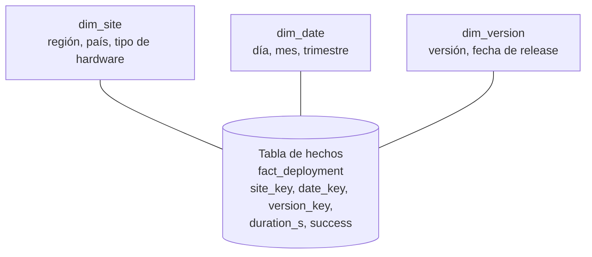

# Plataformas de datos <span class="nivel medio">Medio</span>

Dónde y cómo se almacenan los datos para **analizarlos**: informes, BI, ciencia de datos, entrenamiento de modelos.

## 1. OLTP vs. OLAP

| | OLTP (transaccional) | OLAP (analítico) |
|---|---|---|
| Uso | Operar el negocio: crear un pedido, actualizar un nodo | Analizar: ¿cuántos fallos por región este trimestre? |
| Consultas | Muchas, pequeñas, por clave | Pocas, enormes, agregaciones sobre millones de filas |
| Almacenamiento | **Por filas** | **Por columnas** |
| Esquema | Normalizado | Desnormalizado (estrella) |
| Ejemplos | PostgreSQL, MySQL | BigQuery, Snowflake, Redshift, ClickHouse, Databricks |

### ¿Por qué columnar?

Una consulta analítica lee pocas columnas de muchas filas (`SELECT region, avg(cpu) FROM telemetria`). Guardando cada
columna junta, solo se leen del disco las columnas usadas, y los valores parecidos juntos **comprimen** muchísimo mejor.

## 2. Modelado analítico: esquema en estrella



- **Hechos**: eventos medibles (un despliegue, con su duración y resultado). Muchas filas.
- **Dimensiones**: el contexto por el que se filtra y agrupa (sitio, fecha, versión). Pocas filas, muchos atributos.
- **Dimensiones que cambian** (*slowly changing dimensions*): si un sitio cambia de región, ¿se reescribe (tipo 1) o se
  guarda el histórico con fechas de validez (tipo 2)?

## 3. Evolución: warehouse → lake → lakehouse

| Arquitectura | Idea | Pros | Contras |
|---|---|---|---|
| **Data warehouse** | Base de datos analítica con esquema definido | SQL rápido, gobierno, calidad | Caro, poco flexible, datos no estructurados fuera |
| **Data lake** | Ficheros de todo tipo en almacenamiento de objetos (S3, ADLS, GCS) | Barato, flexible, cualquier dato | Sin transacciones ni esquema → "pantano de datos" |
| **Lakehouse** | Ficheros abiertos en el *lake* + **formato de tabla** que añade transacciones, esquema y versiones | Lo mejor de ambos, formatos abiertos, varios motores sobre los mismos datos | Más piezas que integrar |

### Formatos

| Capa | Opciones | Qué aporta |
|---|---|---|
| Fichero | **Parquet**, ORC | Columnar, comprimido, con estadísticas por bloque |
| **Tabla** | **Apache Iceberg**, Delta Lake, Apache Hudi | Transacciones ACID, evolución de esquema, *time travel* (consultar una versión pasada), particionado oculto |
| Catálogo | Glue, Unity Catalog, Polaris, Nessie | Dónde están las tablas y quién puede acceder |
| Motor | Spark, Trino, Flink, DuckDB, BigQuery, Snowflake | Leen y escriben las mismas tablas |

!!! tip "Iceberg como estándar de facto"
    Los grandes proveedores soportan Iceberg (tablas S3 en AWS, BigLake en Google, Snowflake, Databricks): tus datos
    quedan en un formato abierto y puedes cambiar de motor sin migrarlos.

## 4. ETL vs. ELT

| | ETL | ELT |
|---|---|---|
| Orden | Extraer → **transformar** fuera → cargar | Extraer → **cargar** en bruto → transformar dentro del warehouse |
| Dónde se transforma | Servidor o herramienta de ETL | En el propio motor analítico (SQL) |
| Tendencia | Clásico | **Actual**: el cómputo analítico es barato y escalable |

### Capas (arquitectura medallón)

| Capa | Contenido |
|---|---|
| **Bronce** | Datos en bruto tal como llegan (auditables, reprocesables) |
| **Plata** | Limpios, deduplicados, tipados, unidos |
| **Oro** | Agregados listos para negocio (métricas, tablas para dashboards) |

### dbt

Herramienta para escribir las transformaciones como **SQL versionado**, con dependencias entre modelos, **tests de
datos** y documentación generada: aplica prácticas de ingeniería de software al análisis.

```sql
-- models/gold/deployments_by_region.sql
select
    s.region,
    date_trunc('day', d.started_at) as day,
    count(*)                                   as deployments,
    avg(case when d.success then 1 else 0 end) as success_rate
from {{ ref('silver_deployments') }} d
join {{ ref('silver_sites') }} s on s.site_id = d.site_id
group by 1, 2
```

```yaml
# models/gold/schema.yml — tests de datos que se ejecutan en CI
models:
  - name: deployments_by_region
    columns:
      - name: region
        tests: [not_null]
      - name: success_rate
        tests:
          - dbt_utils.accepted_range: { min_value: 0, max_value: 1 }
```

## 5. Orquestación

Los *pipelines* de datos tienen dependencias ("el modelo oro necesita que termine la carga de plata"). Orquestadores:
**Airflow**, Dagster, Prefect, Argo Workflows (en Kubernetes), y los servicios de cada nube.

## 6. Organización: data mesh y contratos de datos

- **Data mesh**: en lugar de un equipo central de datos que se convierte en cuello de botella, cada **dominio** publica
  sus datos como un **producto** (con dueño, documentación, calidad y SLA), sobre una **plataforma** común de autoservicio
  y con **gobierno federado**. Es DDD aplicado a los datos.
- **Contratos de datos**: acuerdo explícito (esquema, semántica, calidad, frecuencia) entre quien produce y quien consume
  datos, validado automáticamente. Evita que un cambio en la aplicación rompa silenciosamente los informes.

## 7. Calidad y gobierno

| Tema | Prácticas |
|---|---|
| **Calidad** | Tests (nulos, unicidad, rangos, frescura), alertas cuando fallan |
| **Linaje** | Saber de dónde viene cada dato y qué depende de él (OpenLineage) |
| **Catálogo** | Qué datos existen, qué significan, quién es el dueño |
| **Acceso** | Permisos por columna/fila, enmascarado de datos personales |
| **Privacidad** | Minimización, retención, derecho al olvido (difícil en ficheros inmutables: los formatos de tabla ayudan con borrados) |

## Preguntas de repaso

??? question "¿Por qué el almacenamiento columnar acelera las consultas analíticas?"
    Porque solo lee las columnas que usa la consulta y comprime mucho mejor valores del mismo tipo juntos; además permite
    procesar vectores de valores de una columna a la vez.

??? question "¿Qué aporta un formato de tabla como Iceberg sobre ficheros Parquet sueltos?"
    Transacciones atómicas (lectores nunca ven escrituras a medias), evolución de esquema, *time travel*, particionado
    gestionado y la posibilidad de que varios motores lean y escriban las mismas tablas de forma segura.

??? question "¿ETL o ELT hoy?"
    Normalmente **ELT**: cargar en bruto al *lakehouse* o *warehouse* y transformar con SQL (dbt) aprovechando su escala.
    ETL sigue teniendo sentido para anonimizar antes de cargar o con volúmenes que conviene reducir en origen.

## Ejercicios

!!! exercise "Ejercicio 1 · Básico — Hechos y dimensiones"
    Quieres analizar incidentes de la flota por región, tipo de hardware, severidad y mes, con su tiempo de resolución.
    Define la tabla de hechos y las dimensiones.

    ??? success "Solución"
        Hechos: `fact_incident(incident_id, site_key, date_key, severity_key, hardware_key, resolution_minutes, reopened)`.
        Dimensiones: `dim_site` (código, región, país), `dim_date` (día, mes, trimestre, año), `dim_severity` (nivel,
        descripción), `dim_hardware` (modelo, fabricante, generación). Las métricas numéricas (tiempo de resolución) van en
        los hechos; los atributos por los que agrupas, en las dimensiones.

!!! exercise "Ejercicio 2 · Medio — Diseñar el pipeline de telemetría"
    La telemetría de 20 000 sitios llega a Kafka (5 000 eventos/s). Negocio quiere un dashboard diario de disponibilidad
    por región y ciencia de datos quiere el histórico en bruto para entrenar modelos. Diseña la plataforma.

    ??? success "Solución"
        1. **Ingesta**: Kafka Connect (*sink* de Iceberg) o Flink escribe los eventos en una tabla Iceberg **bronce**
           particionada por día, en almacenamiento de objetos.
        2. **Plata**: trabajo (Spark o dbt sobre un motor SQL) que limpia, deduplica por `eventId` y normaliza.
        3. **Oro**: modelo dbt `availability_by_region_day` que alimenta el dashboard.
        4. **Ciencia de datos** lee bronce/plata directamente con su motor (Spark, DuckDB) gracias al formato abierto.
        5. Orquestación diaria (Airflow/Dagster), tests de dbt, retención del bronce según coste (p. ej. 13 meses) y
           clases de almacenamiento frías para lo antiguo.

!!! exercise "Ejercicio 3 · Medio — Dimensión que cambia"
    Un sitio se traslada de la región "norte" a "centro" en marzo. Los informes de enero deben seguir mostrándolo en
    "norte". ¿Cómo lo modelas?

    ??? success "Solución"
        Dimensión de **tipo 2**: cada cambio crea una **nueva fila** en `dim_site` con `valid_from`, `valid_to` y
        `is_current`, y una clave sustituta (`site_key`) distinta. Los hechos de enero apuntan a la fila antigua ("norte") y
        los de abril a la nueva ("centro"). Para "estado actual" se filtra `is_current = true`.

!!! exercise "Ejercicio 4 · Avanzado — Contrato de datos"
    El equipo de la API de despliegues renombra el campo `status` a `state` y el dashboard de negocio se rompe una semana
    sin que nadie lo note. Propón un mecanismo para que no vuelva a pasar.

    ??? success "Solución"
        Un **contrato de datos** versionado junto al productor (esquema, significado de cada campo, valores permitidos,
        frescura esperada) y validación automática en tres puntos: (1) en el CI del productor, un test que compara el esquema
        publicado con el contrato y **falla** ante cambios incompatibles; (2) en el Schema Registry, compatibilidad
        *backward* obligatoria; (3) en la plataforma de datos, tests de dbt y de frescura con alertas al dueño. Los cambios
        incompatibles se hacen con una versión nueva y periodo de convivencia.
