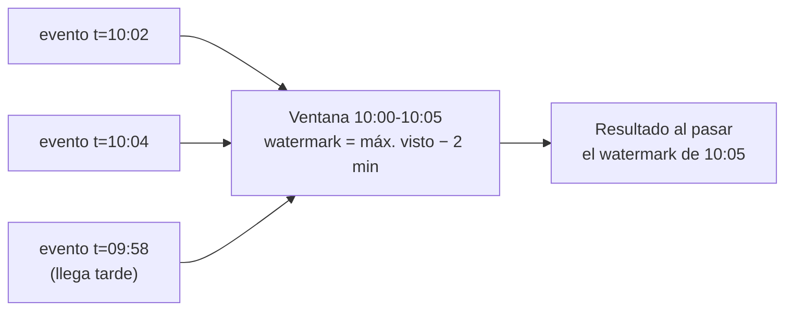

# Procesamiento en streaming <span class="nivel avanzado">Avanzado</span>

Procesar datos **a medida que llegan**, en lugar de acumularlos y procesarlos por lotes. Permite alertas en segundos,
vistas siempre actualizadas y reacciones automáticas.

## 1. Batch vs. streaming

| | Batch | Streaming |
|---|---|---|
| Datos | Conjunto acotado (el fichero de ayer) | Flujo infinito |
| Latencia | Minutos u horas | Milisegundos o segundos |
| Complejidad | Menor: todo está disponible, se puede reintentar entero | Mayor: orden, retrasos, estado, fallos a mitad |
| Ejemplos | Informe diario de costes, reentrenar un modelo | Detección de anomalías en telemetría, alertas de fraude |

!!! tip "Batch es un caso particular de streaming"
    Un lote es un *stream* acotado. Por eso los motores modernos (Flink, Spark Structured Streaming, Beam) usan la misma
    API para ambos.

## 2. Tiempo de evento vs. tiempo de procesamiento

- **Tiempo de evento**: cuándo **ocurrió** (el *timestamp* que pone el sensor del sitio edge).
- **Tiempo de procesamiento**: cuándo lo **procesa** tu sistema.

Pueden diferir mucho: un sitio sin conexión durante una hora envía sus eventos después, **tarde y desordenados**. Si
agregas por tiempo de procesamiento, esos eventos caen en la ventana equivocada. Para resultados correctos, se agrega por
**tiempo de evento**.

## 3. Ventanas

| Ventana | Forma | Ejemplo |
|---|---|---|
| **Fija** (*tumbling*) | Intervalos consecutivos sin solapar | Errores por sitio cada 5 minutos |
| **Deslizante** (*sliding / hopping*) | Intervalos que se solapan | Media de CPU de los últimos 10 min, calculada cada minuto |
| **Sesión** | Se cierra tras un periodo de inactividad | Sesiones de un operador en el dashboard |
| **Global** | Todo el flujo, con disparadores propios | Contadores acumulados |

## 4. Watermarks y datos tardíos

Un ***watermark*** es la afirmación del sistema: "ya no espero eventos con tiempo anterior a T". Cuando el *watermark*
supera el final de una ventana, esta se **cierra** y emite su resultado.



- ***Watermark* conservador** (espera mucho) → resultados más completos pero más tardíos.
- **Agresivo** → resultados rápidos, pero más eventos tardíos descartados o que obligan a corregir.
- Opciones para los tardíos: descartarlos, enviarlos a una **salida lateral** para tratarlos aparte, o **actualizar** el resultado ya emitido (*allowed lateness*).

## 5. Estado y tolerancia a fallos

Contar, agregar o unir flujos requiere **estado** (el contador por sitio, el último valor por clave). Si el procesador
cae, ese estado no puede perderse.

- **Checkpoints** (Flink): instantáneas periódicas y consistentes del estado y de las posiciones de lectura; al recuperarse,
  vuelve al último *checkpoint* y reprocesa desde ahí → resultados *exactly-once* sobre el estado.
- **Changelog topics** (Kafka Streams): el estado local (RocksDB) se respalda en un *topic* compactado; otra instancia
  puede reconstruirlo.

## 6. Motores

| Motor | Modelo | Cuándo |
|---|---|---|
| **Kafka Streams** | Librería Java dentro de tu aplicación; escala con instancias; estado en RocksDB | Procesamiento de Kafka a Kafka sin clúster adicional |
| **Apache Flink** | Clúster de procesamiento con estado, tiempo de evento y *checkpoints* de primera clase | *Streaming* complejo y a gran escala; también SQL sobre *streams* |
| **Spark Structured Streaming** | Micro-lotes (o continuo) sobre Spark | Equipos que ya usan Spark; latencias de segundos |
| **Apache Beam** | Modelo de programación que se ejecuta sobre Flink, Spark o Dataflow | Portabilidad entre motores |

### Ejemplo con Kafka Streams

```java
// Número de eventos de error por sitio en ventanas de 5 minutos (tiempo de evento)
StreamsBuilder builder = new StreamsBuilder();

builder.stream("node-events", Consumed.with(Serdes.String(), nodeEventSerde)
            .withTimestampExtractor((rec, prev) -> ((NodeEvent) rec.value()).occurredAt().toEpochMilli()))
    .filter((siteId, event) -> event.level() == Level.ERROR)
    .groupByKey()
    .windowedBy(TimeWindows.ofSizeAndGrace(Duration.ofMinutes(5), Duration.ofMinutes(2)))   // 2 min de gracia para tardíos
    .count()
    .toStream()
    .filter((window, count) -> count > 20)
    .map((window, count) -> KeyValue.pair(window.key(), new SiteAlert(window.key(), count, window.window().endTime())))
    .to("site-alerts", Produced.with(Serdes.String(), siteAlertSerde));
```

## 7. Change Data Capture (CDC)

Convertir cada cambio de una base de datos en un evento, leyendo su **log de transacciones** (WAL de PostgreSQL, binlog
de MySQL). Herramienta de referencia: **Debezium** (sobre Kafka Connect).

- Sin modificar la aplicación y sin consultas periódicas costosas.
- Base del **patrón outbox**: la aplicación escribe en una tabla `outbox` y Debezium la publica en Kafka.
- Permite alimentar cachés, índices de búsqueda y el *lakehouse* casi en tiempo real.

## 8. Arquitecturas Lambda y Kappa

| Arquitectura | Idea | Problema |
|---|---|---|
| **Lambda** | Una capa *batch* (exacta, lenta) + una capa *streaming* (aproximada, rápida), combinadas | Dos implementaciones de la misma lógica |
| **Kappa** | Solo *streaming*; para recalcular, se reprocesa el log desde el principio | Requiere retener el log y un motor capaz |

La tendencia actual se acerca a Kappa, con el log (Kafka) y el *lakehouse* como almacenamiento duradero.

## Preguntas de repaso

??? question "¿Por qué agregar por tiempo de evento y no de procesamiento?"
    Porque el tiempo de procesamiento depende de retrasos de red, desconexiones y reintentos. Agregar por tiempo de
    evento asigna cada evento a la ventana en la que realmente ocurrió, y el resultado es reproducible.

??? question "¿Qué es un watermark?"
    Una marca que indica que el sistema no espera más eventos anteriores a cierto tiempo; permite cerrar ventanas y
    emitir resultados sabiendo cuánto retraso se tolera.

??? question "¿Qué aporta CDC frente a consultar la base de datos periódicamente?"
    Captura **todos** los cambios (incluidos borrados e intermedios), con baja latencia y sin cargar la base de datos con
    consultas repetidas, y en el orden en que se confirmaron.

## Ejercicios

!!! exercise "Ejercicio 1 · Básico — Elegir la ventana"
    Indica qué tipo de ventana usarías: (a) informe de despliegues por hora; (b) alerta si la media de latencia de los
    últimos 10 minutos supera 500 ms, evaluada cada minuto; (c) agrupar las acciones de un operador hasta que pase 15 min inactivo.

    ??? success "Solución"
        (a) **Fija** de 1 hora. (b) **Deslizante** de 10 minutos con avance de 1 minuto. (c) **Sesión** con 15 minutos de inactividad.

!!! exercise "Ejercicio 2 · Medio — Sitios que se reconectan tarde"
    Los sitios edge pueden estar desconectados hasta 6 horas y luego envían sus eventos. Quieres un recuento de errores
    por sitio y hora que sea correcto. ¿Cómo configuras ventanas, *watermark* y datos tardíos?

    ??? success "Solución"
        Ventanas **fijas de 1 h por tiempo de evento**. Un *watermark* de 6 h retrasaría todos los resultados 6 h; mejor:
        *watermark* corto (p. ej. 5 min) para emitir resultados pronto + ***allowed lateness* de 6 h** para **actualizar**
        la ventana cuando lleguen tardíos (el destino debe aceptar actualizaciones: *upsert* por `siteId + hora`). Los que
        lleguen aún más tarde, a una salida lateral para una corrección *batch*. Alternativa: calcular en *streaming* una
        vista provisional y recalcular la definitiva en *batch* sobre el *lakehouse*.

!!! exercise "Ejercicio 3 · Medio — Outbox con Debezium"
    Describe el flujo completo para publicar `RolloutStarted` de forma fiable usando una tabla `outbox` y Debezium.

    ??? success "Solución"
        1. En la misma transacción: `INSERT INTO rollout …` y `INSERT INTO outbox(id, aggregate_type, aggregate_id, type, payload)`.
        2. Debezium lee el WAL de PostgreSQL, detecta la inserción en `outbox` y, con el *Outbox Event Router*, publica en
           el *topic* `rollout.events` con clave `aggregate_id`.
        3. Los consumidores procesan de forma idempotente usando `id` del evento.
        4. Una tarea borra filas antiguas de `outbox` (Debezium ya las leyó del WAL).
        Resultado: el evento se publica **si y solo si** la transacción se confirmó, sin *dual write*.

!!! exercise "Ejercicio 4 · Avanzado — Kafka Streams o Flink"
    Debes: (a) enriquecer eventos de nodos con la configuración del sitio y (b) detectar patrones complejos (3 reinicios
    seguidos de un fallo de despliegue en 30 min) sobre 2 millones de eventos/s. ¿Qué motor eliges para cada uno?

    ??? success "Solución"
        (a) **Kafka Streams**: unir el *stream* de eventos con una `KTable` (el *topic* compactado de configuración) es su
        caso de uso natural; se despliega como un servicio más, sin clúster aparte.
        (b) **Flink**: volumen muy alto, estado grande, tiempo de evento y detección de patrones (librería CEP) son su
        punto fuerte; los *checkpoints* dan tolerancia a fallos con estado grande.
