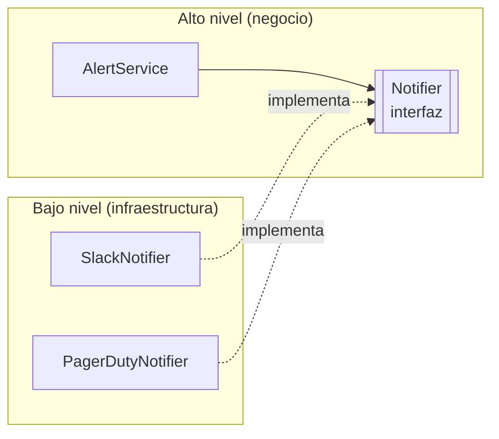

# Principios SOLID <span class="nivel basico">Básico</span>

Cinco principios de diseño orientado a objetos, recopilados por Robert C. Martin, cuyo objetivo común es que el código
sea **fácil de cambiar**: que añadir o modificar comportamiento afecte a pocas piezas y no rompa las demás.

| Letra | Principio | Idea en una línea | Síntoma de que se incumple |
|:-:|---|---|---|
| **S** | Single Responsibility | Un módulo tiene **un solo motivo para cambiar** | Una clase cambia por peticiones de áreas distintas |
| **O** | Open/Closed | Abierto a extensión, cerrado a modificación | Cada caso nuevo obliga a editar `switch` en varios sitios |
| **L** | Liskov Substitution | Un subtipo puede sustituir a su tipo base sin romper nada | `instanceof` para tratar un subtipo como caso especial |
| **I** | Interface Segregation | Nadie debe depender de métodos que no usa | Implementaciones que lanzan `UnsupportedOperationException` |
| **D** | Dependency Inversion | Depende de abstracciones, no de concreciones | La lógica de negocio crea con `new` clientes de BBDD o HTTP |

!!! tip "No son reglas absolutas"
    SOLID son **heurísticas** para gestionar el cambio. Aplicarlas donde no hay cambio previsible produce sobreingeniería
    (interfaces con una sola implementación que nunca tendrá otra). Aplícalas donde el código cambia de verdad.

---

## S — Single Responsibility { #s-single-responsibility }

### Qué dice

"Un módulo debe tener **una sola razón para cambiar**". En *Arquitectura Limpia*, Martin lo precisa: un módulo debe
responder a **un solo actor**, es decir, a un único grupo de personas que pide cambios (Finanzas, Operaciones, Seguridad…).

### Por qué importa

Si una clase atiende a dos actores, un cambio pedido por uno puede **romper lo que usa el otro**, y dos equipos acaban
modificando el mismo fichero (conflictos, regresiones, revisiones difíciles).

### Ejemplo

=== "Antes (incumple SRP)"

    ```java
    public class Employee {
        public Money calculatePay() { ... }     // lo pide Finanzas
        public Hours reportHours() { ... }      // lo pide Recursos Humanos
        public void save() { ... }              // lo piden los administradores de base de datos
    }
    ```
    Si `calculatePay` y `reportHours` comparten un método auxiliar para calcular horas extra y Finanzas pide cambiarlo,
    el informe de Recursos Humanos cambia sin que nadie lo haya pedido.

=== "Después"

    ```java
    public record Employee(EmployeeId id, String name, Rate rate) { }      // solo datos

    public class PayCalculator      { public Money calculatePay(Employee e) { ... } }
    public class HourReporter       { public Hours reportHours(Employee e) { ... } }
    public class EmployeeRepository { public void save(Employee e) { ... } }
    ```
    Cada clase cambia por un solo motivo; si se quiere una puerta de entrada única, una **fachada** puede delegar en las tres.

### Cómo detectarlo

- Describe la clase en una frase: si necesitas "y" o "además" ("calcula la nómina **y** genera el informe **y** guarda…"), hay varias responsabilidades.
- Mira el historial de Git: si los commits que tocan la clase vienen de peticiones de áreas distintas, se incumple.
- Clases con muchos imports de dominios distintos (HTTP, SQL, email, PDF) suelen mezclar responsabilidades.

!!! warning "Confusión frecuente"
    SRP **no** significa "una clase hace una sola cosa" o "tiene un solo método": eso es un principio sobre **funciones**
    (de *Código Limpio*). Una clase puede tener varios métodos cohesionados que responden al mismo actor.

---

## O — Open/Closed { #o-openclosed }

### Qué dice

Un módulo debe estar **abierto a extensión** (se le puede añadir comportamiento) pero **cerrado a modificación** (no
hace falta editar el código existente, que ya funciona y está probado, para hacerlo).

### Cómo se consigue

Con **polimorfismo**: el código estable depende de una abstracción, y cada variante nueva es una implementación nueva.
Patrones que lo materializan: *Strategy*, *Decorator*, *Template Method*, *plugins*.

=== "Antes"

    ```java
    public Money shippingCost(Order order) {
        switch (order.shippingType()) {
            case STANDARD: return Money.of(5);
            case EXPRESS:  return Money.of(15);
            default: throw new IllegalStateException();
        }
    }
    // Y probablemente otro switch igual en estimatedDays(), otro en label()...
    ```
    Cada tipo nuevo obliga a encontrar y modificar **todos** los `switch`; olvidar uno es un error en producción.

=== "Después (Strategy)"

    ```java
    public interface ShippingPolicy {
        Money costFor(Order order);
        int estimatedDays();
    }

    public class StandardShipping implements ShippingPolicy {
        public Money costFor(Order o) { return Money.of(5); }
        public int estimatedDays() { return 3; }
    }

    public class ExpressShipping implements ShippingPolicy {
        public Money costFor(Order o) { return Money.of(15); }
        public int estimatedDays() { return 1; }
    }

    // Tipo nuevo = clase nueva. Nada existente se modifica, y el compilador obliga a implementar todo.
    public class DroneShipping implements ShippingPolicy {
        public Money costFor(Order o) { return Money.of(25); }
        public int estimatedDays() { return 0; }
    }
    ```

!!! note "El switch no siempre es malo"
    Un único `switch` exhaustivo sobre un tipo **sellado** (Java 21) es perfectamente válido cuando el conjunto de casos es
    cerrado y estable: el compilador avisa si falta alguno. OCP ataca los `switch` **repetidos** sobre casos que crecen.

---

## L — Liskov Substitution

### Qué dice

Si `S` es un subtipo de `T`, cualquier código que funcione con un `T` debe funcionar igual con un `S` **sin saberlo**.
Formulado como contrato: un subtipo **no puede exigir más** (reforzar precondiciones) ni **garantizar menos**
(debilitar postcondiciones) que su tipo base.

### Ejemplo clásico: rectángulo y cuadrado

=== "Antes (incumple LSP)"

    ```java
    class Rectangle {
        protected int w, h;
        void setWidth(int w)  { this.w = w; }
        void setHeight(int h) { this.h = h; }
        int area() { return w * h; }
    }
    class Square extends Rectangle {                 // "un cuadrado ES UN rectángulo"... matemáticamente
        @Override void setWidth(int w)  { this.w = w; this.h = w; }
        @Override void setHeight(int h) { this.w = h; this.h = h; }
    }

    void resize(Rectangle r) {
        r.setWidth(5);
        r.setHeight(4);
        assert r.area() == 20;   // con un Square da 16: el código que esperaba un Rectangle se rompe
    }
    ```
    El problema no es la geometría, sino el **comportamiento**: un `Rectangle` promete que cambiar el ancho no cambia el
    alto; `Square` rompe esa promesa.

=== "Después"

    ```java
    sealed interface Shape permits Rectangle, Square { int area(); }
    record Rectangle(int width, int height) implements Shape {
        public int area() { return width * height; }
    }
    record Square(int side) implements Shape {
        public int area() { return side * side; }
    }
    ```
    Inmutables y sin relación de herencia entre ellos: no hay promesa que romper.

### Señales de que se incumple

- `if (x instanceof SubtipoRaro)` para tratarlo como caso especial.
- Métodos sobrescritos que lanzan `UnsupportedOperationException` o no hacen nada.
- Subclases que ignoran parámetros o cambian el significado de un método.
- Tests del tipo base que fallan al ejecutarse con el subtipo.

!!! tip "LSP a nivel de arquitectura"
    También aplica a servicios: si defines un contrato de API y existen varias implementaciones (p. ej. un almacén de
    objetos S3 y uno MinIO), todas deben respetar el mismo comportamiento, o los clientes acabarán con `if proveedor == …`.

---

## I — Interface Segregation

### Qué dice

Los clientes no deben verse obligados a depender de **métodos que no usan**. Es preferible varias interfaces pequeñas y
específicas que una grande y general.

### Por qué importa

Si un cliente depende de una interfaz enorme, cualquier cambio en un método que no usa le obliga a recompilar, redesplegar
o adaptar sus *mocks*, y las implementaciones parciales acaban lanzando excepciones en los métodos que no soportan.

=== "Antes"

    ```java
    interface ClusterClient {
        List<Pod> listPods();
        void deploy(Manifest m);
        void drainNode(String node);
        Metrics metrics();
    }
    // El dashboard de solo lectura depende de deploy() y drainNode(), que nunca usará;
    // su fake de test tiene que implementar los cuatro métodos.
    ```

=== "Después"

    ```java
    interface PodReader       { List<Pod> listPods(); }
    interface Deployer        { void deploy(Manifest m); }
    interface NodeMaintenance { void drainNode(String node); }
    interface MetricsSource   { Metrics metrics(); }

    // Una implementación puede cumplir varias; cada cliente pide solo lo que usa
    class KubernetesClusterClient implements PodReader, Deployer, NodeMaintenance, MetricsSource { ... }

    class Dashboard {
        Dashboard(PodReader pods, MetricsSource metrics) { ... }   // imposible que despliegue por error
    }
    ```

Un beneficio extra: la firma del constructor documenta **qué puede hacer** cada clase (principio de mínimo privilegio en el código).

---

## D — Dependency Inversion

### Qué dice

1. Los módulos de **alto nivel** (políticas de negocio) no deben depender de los de **bajo nivel** (detalles técnicos:
   base de datos, HTTP, colas). Ambos deben depender de **abstracciones**.
2. Las abstracciones no dependen de los detalles; los detalles dependen de las abstracciones.

La clave está en **quién define la interfaz**: la define el módulo de alto nivel, según **lo que necesita**, y el de bajo
nivel la implementa. Así la flecha de dependencia de código "se invierte" respecto al flujo de ejecución.



=== "Antes"

    ```java
    public class AlertService {
        private final SlackClient slack = new SlackClient("token");   // acoplado a Slack y a su configuración
        public void nodeDown(String node) { slack.post("#ops", node + " caído"); }
    }
    // No se puede probar sin Slack; cambiar a PagerDuty obliga a modificar la lógica de negocio.
    ```

=== "Después"

    ```java
    public interface Notifier { void notify(Alert alert); }       // definida junto a AlertService, en su lenguaje

    public class AlertService {
        private final Notifier notifier;
        public AlertService(Notifier notifier) { this.notifier = notifier; }   // se inyecta desde fuera
        public void nodeDown(String node) { notifier.notify(Alert.critical(node + " caído")); }
    }

    public class SlackNotifier implements Notifier { ... }      // en el paquete de infraestructura
    public class PagerDutyNotifier implements Notifier { ... }

    // En un test, sin ningún framework:
    List<Alert> sent = new ArrayList<>();
    new AlertService(sent::add).nodeDown("site-042");
    assertThat(sent).hasSize(1);
    ```

!!! tip "DIP no es lo mismo que inyección de dependencias"
    **DIP** es un principio sobre la **dirección** de las dependencias. **DI** (Spring, Guice o pasar objetos por el
    constructor) es una **técnica** para entregar las dependencias. DI facilita DIP, pero puedes usar Spring e incumplir
    DIP (por ejemplo, si `AlertService` recibe un `SlackClient` concreto inyectado).

---

## Cómo se relacionan con la arquitectura

| Principio | A nivel de código | A nivel de arquitectura |
|---|---|---|
| SRP | Una clase, un actor | Un servicio o módulo por capacidad de negocio (*bounded context*) |
| OCP | Polimorfismo, *Strategy* | *Plugins*, eventos, extensiones sin tocar el núcleo |
| LSP | Subtipos que respetan contratos | Implementaciones intercambiables de un mismo contrato de API |
| ISP | Interfaces pequeñas | APIs específicas por cliente (BFF), *scopes* mínimos |
| DIP | Interfaces definidas por quien las usa | **Puertos y adaptadores** / Arquitectura Limpia |

## Preguntas de repaso

??? question "¿Qué significa exactamente 'un motivo para cambiar'?"
    Que el módulo responde a **un único actor** (grupo de personas que solicita cambios). No significa "hacer una sola
    cosa" ni "tener un solo método".

??? question "¿Qué patrón es la forma más habitual de cumplir OCP?"
    **Strategy** (y en general el polimorfismo). También *Decorator*, *Template Method*, *plugins* y los eventos.

??? question "Da un ejemplo de incumplimiento de LSP en la librería estándar de Java"
    `Collections.unmodifiableList(...)` devuelve una `List` cuyo `add()` lanza `UnsupportedOperationException`: el código
    que espera una `List` modificable falla en ejecución.

??? question "¿Quién 'posee' la interfaz en DIP y por qué importa?"
    El módulo de **alto nivel** (el que la usa). Así la interfaz se expresa en términos del negocio y la infraestructura se
    adapta a ella; si la definiera la infraestructura, el negocio seguiría acoplado a sus conceptos.

## Ejercicios

!!! exercise "Ejercicio 1 · Básico — Identificar el principio incumplido"
    Para cada caso, di qué principio se incumple: (a) `ReportService` genera el PDF, lo envía por email y guarda el
    histórico en la base de datos; (b) `ReadOnlyRepository` implementa `Repository` y su `save()` lanza una excepción;
    (c) un `OrderService` hace `new PostgresOrderDao()`; (d) cada método de pago nuevo requiere tocar 4 `switch`.

    ??? success "Solución"
        (a) **SRP**: tres motivos de cambio (formato, canal de envío, persistencia). (b) **LSP** (y probablemente ISP): el
        subtipo no puede sustituir al tipo base; la solución es separar `ReadRepository` y `WriteRepository`. (c) **DIP**:
        la lógica de negocio depende de un detalle concreto. (d) **OCP**: añadir un caso obliga a modificar código existente.

!!! exercise "Ejercicio 2 · Básico — Separar responsabilidades"
    Refactoriza esta clase aplicando SRP:
    ```java
    class SiteHealthChecker {
        boolean check(Site s) { /* llama por HTTP al /health del sitio */ }
        String toHtml(List<Site> sites) { /* genera una tabla HTML */ }
        void emailReport(String html) { /* envía por SMTP */ }
    }
    ```

    ??? success "Solución"
        ```java
        interface HealthProbe      { HealthStatus check(Site site); }                // HTTP u otro mecanismo
        interface ReportRenderer   { String render(List<SiteHealth> results); }      // HTML, Markdown, JSON...
        interface ReportSender     { void send(String report); }                     // email, Slack...

        class HealthReportJob {                                                     // orquesta el caso de uso
            HealthReportJob(HealthProbe probe, ReportRenderer renderer, ReportSender sender) { ... }
            void run(List<Site> sites) {
                var results = sites.stream().map(s -> new SiteHealth(s, probe.check(s))).toList();
                sender.send(renderer.render(results));
            }
        }
        ```
        Cada pieza cambia por un motivo distinto y se prueba por separado; además se cumple DIP (el caso de uso depende de
        interfaces) y OCP (un formato o canal nuevo es una clase nueva).

!!! exercise "Ejercicio 3 · Medio — Eliminar switches con OCP"
    El sistema calcula el tamaño de la primera oleada de un *rollout* con un `switch (strategy)` que aparece en tres
    métodos (`firstWaveSize`, `nextWaveSize`, `maxParallel`) para `ALL_AT_ONCE`, `CANARY` y `BY_REGION`. Rediseña.

    ??? success "Solución"
        ```java
        interface RolloutStrategy {
            int firstWaveSize(int totalSites);
            int nextWaveSize(int completed, int totalSites);
            int maxParallel();
        }

        class AllAtOnce implements RolloutStrategy {
            public int firstWaveSize(int total) { return total; }
            public int nextWaveSize(int done, int total) { return 0; }
            public int maxParallel() { return 200; }
        }

        class Canary implements RolloutStrategy {
            public int firstWaveSize(int total) { return Math.max(1, total / 100); }          // 1 %
            public int nextWaveSize(int done, int total) { return Math.min(total - done, done * 4); }
            public int maxParallel() { return 50; }
        }
        // BY_REGION análogo. La elección se hace UNA vez (fábrica o configuración) y el resto del código usa la interfaz.
        ```
        Añadir una estrategia nueva es añadir una clase: los tres métodos se implementan juntos y el compilador impide olvidar uno.

!!! exercise "Ejercicio 4 · Medio — Segregar una interfaz"
    Una interfaz `GitOpsRepository` tiene `readManifest`, `listClusters`, `commit`, `push`, `createPullRequest` y
    `mergePullRequest`. La usan un validador (solo lee), un bot de promoción (lee, hace commit y abre PR) y un proceso de
    aprobación (solo fusiona PRs). Propón las interfaces.

    ??? success "Solución"
        ```java
        interface ManifestReader  { Manifest readManifest(Path p); List<String> listClusters(); }
        interface ChangeProposer  { PullRequest propose(ChangeSet changes, String title); }   // commit + push + PR
        interface ChangeApprover  { void merge(PullRequest pr); }
        ```
        Validador → `ManifestReader`; bot → `ManifestReader` + `ChangeProposer`; aprobación → `ChangeApprover`. Además de
        simplificar los *fakes*, la separación refleja **permisos** distintos (el validador ni siquiera podría empujar código).

!!! exercise "Ejercicio 5 · Avanzado — Aplicar DIP en un proyecto real"
    En tu servicio, `RolloutService` llama directamente a `KubernetesClient` (fabric8) para leer el estado de las
    `Kustomizations`. Aplica DIP y escribe un test unitario sin Kubernetes.

    ??? success "Solución"
        ```java
        // Núcleo: la interfaz habla el lenguaje del negocio
        public interface ReconciliationStatus {
            Optional<Revision> appliedRevision(SiteId site, String kustomization);
        }

        // Infraestructura: adaptador con fabric8
        class FluxReconciliationStatus implements ReconciliationStatus {
            private final KubernetesClient client;
            public Optional<Revision> appliedRevision(SiteId site, String name) {
                var ks = client.genericKubernetesResources("kustomize.toolkit.fluxcd.io/v1", "Kustomization")
                               .inNamespace("flux-system").withName(name).get();
                return Optional.ofNullable(ks)
                        .map(r -> (String) ((Map<?, ?>) r.getAdditionalProperties().get("status")).get("lastAppliedRevision"))
                        .map(Revision::new);
            }
        }

        // Test del núcleo con un fake
        @Test
        void waveIsCompleteWhenAllSitesApplyTargetRevision() {
            ReconciliationStatus status = (site, ks) -> Optional.of(new Revision("abc123"));
            var service = new RolloutService(status);
            assertThat(service.isWaveComplete(wave(site("site-1"), site("site-2")), new Revision("abc123"))).isTrue();
        }
        ```
        El núcleo no importa nada de fabric8; el adaptador se prueba aparte con un clúster `kind` o Testcontainers (k3s).
