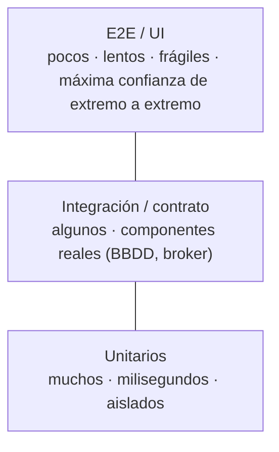
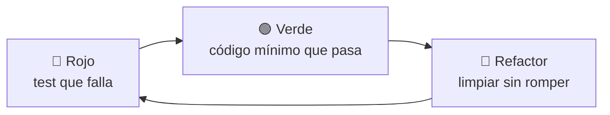
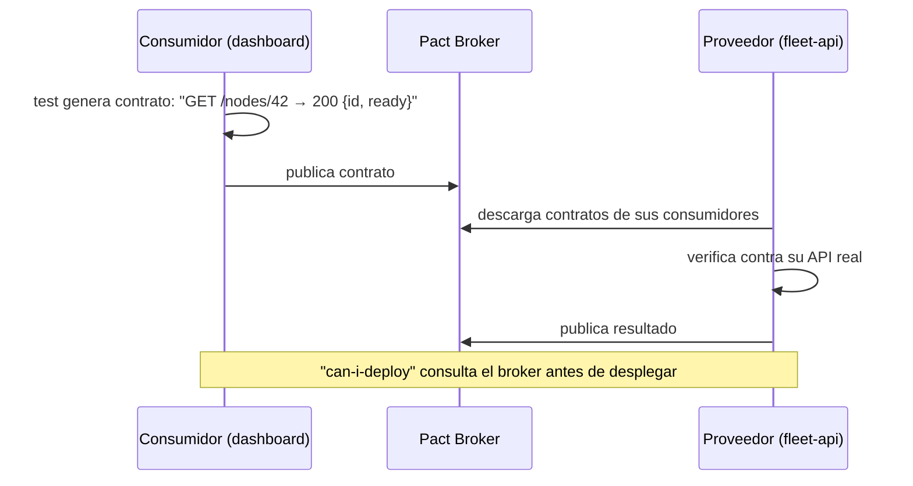

# Testing <span class="nivel medio">Medio</span>

Los tests son la **red de seguridad** que permite cambiar el código sin miedo, y la **especificación ejecutable** de lo
que el sistema debe hacer. Con agentes de IA escribiendo código, son además su principal mecanismo de verificación.

## 1. Pirámide (y alternativas)



| Nivel | Qué prueba | Velocidad | Herramientas (Java) |
|---|---|---|---|
| **Unitario** | Una unidad de comportamiento (no necesariamente una clase) sin E/S | ms | JUnit 5, AssertJ, Mockito |
| **Integración** | Tu código con infraestructura real: BBDD, Kafka, HTTP | s | **Testcontainers**, `@SpringBootTest`, WireMock |
| **Contrato** | Que proveedor y consumidor de una API siguen de acuerdo | s | **Pact**, Spring Cloud Contract |
| **E2E** | Flujos completos del usuario sobre el sistema desplegado | min | Playwright, REST Assured |
| **No funcionales** | Rendimiento, carga, resiliencia, seguridad | min-h | Gatling, k6, JMH, Chaos Mesh, OWASP ZAP |

!!! tip "Trofeo de tests"
    En servicios con poca lógica y mucha integración (típico en microservicios), muchos equipos invierten más en
    **tests de integración** con Testcontainers que en unitarios con *mocks*: dan más confianza por test escrito.

## 2. Anatomía de un buen test

```java
@Test
void rolloutHaltsWhenErrorRateExceedsThreshold() {
    // Given
    Rollout rollout = aRollout().withWaves(3).inProgress().build();

    // When
    rollout.completeWave(0, 0.05);           // 5 % de errores

    // Then
    assertThat(rollout.status()).isEqualTo(RolloutStatus.HALTED);
    assertThat(rollout.events()).containsExactly(new RolloutHalted(rollout.id(), 0, 0.05));
}
```

- **Nombre = comportamiento** esperado, legible como especificación.
- **Un concepto por test**; *Given-When-Then* visible.
- **F.I.R.S.T.**: rápido, independiente, repetible, autovalidado, oportuno.
- **Builders / Object Mothers** para crear datos de prueba legibles (`aRollout()`).
- Prueba **comportamiento público**, no detalles internos: los tests deben sobrevivir a los *refactors*.

## 3. Dobles de prueba

| Tipo | Qué hace | Ejemplo |
|---|---|---|
| **Dummy** | Se pasa pero no se usa | `null` o un objeto vacío para rellenar un parámetro |
| **Stub** | Devuelve respuestas predefinidas | `when(clock.now()).thenReturn(fixedInstant)` |
| **Spy** | Registra cómo se le llamó | Verificar que se envió una notificación |
| **Mock** | Espera interacciones concretas y falla si no ocurren | `verify(notifier).notify(any())` |
| **Fake** | Implementación funcional simplificada | `InMemoryRolloutRepository` |

```java
// Fake: más robusto que un mock para puertos de salida
class InMemoryRolloutRepository implements RolloutRepository {
    private final Map<RolloutId, Rollout> store = new HashMap<>();
    public Optional<Rollout> findById(RolloutId id) { return Optional.ofNullable(store.get(id)); }
    public void save(Rollout r) { store.put(r.id(), r); }
}
```

!!! warning "Exceso de mocks"
    Los tests que verifican **interacciones** se acoplan a la implementación y se rompen al refactorizar aunque el
    comportamiento sea correcto. Regla: *mocks* solo en los **límites** (puertos de salida hacia sistemas externos);
    dentro del dominio, objetos reales; para repositorios, *fakes*. No hagas *mock* de tipos que no son tuyos: envuélvelos.

## 4. TDD



Ejemplo, paso a paso, del algoritmo de oleadas de un *rollout*:

1. **Rojo**: `wavesFor(100 sites, [1%, 10%, 100%])` debe devolver tamaños `[1, 9, 90]`. No compila → crear el método.
2. **Verde**: implementación directa que pasa.
3. **Rojo**: con 7 sitios y 1 % debe haber **al menos 1** sitio en la primera oleada.
4. **Verde**: `Math.max(1, …)`.
5. **Refactor**: extraer el cálculo acumulado, renombrar.

Beneficios: diseño guiado por el uso (API cómoda), cobertura por construcción, pasos pequeños.
Donde brilla: lógica de dominio, algoritmos, corrección de *bugs* (primero el test que lo reproduce).

## 5. Tests de integración con Testcontainers

```java
@SpringBootTest
@Testcontainers
class DeploymentRepositoryIT {

    @Container
    @ServiceConnection                      // Spring Boot 3.1+: configura la conexión automáticamente
    static PostgreSQLContainer<?> postgres = new PostgreSQLContainer<>("postgres:16-alpine");

    @Autowired DeploymentRepository repository;

    @Test
    void findsLatestDeploymentsPerSite() {
        repository.save(deployment("site-042", "abc123", READY, minutesAgo(10)));
        repository.save(deployment("site-042", "def456", FAILED, minutesAgo(1)));

        assertThat(repository.latestFor("site-042")).extracting(Deployment::revision).isEqualTo("def456");
    }
}
```

Se prueban **consultas reales, migraciones y restricciones** contra el mismo motor que en producción (nada de H2 como sustituto).

## 6. Contract testing

En microservicios, los E2E entre todos los servicios son lentos y frágiles. Con **contratos dirigidos por el consumidor**:



## 7. Otras técnicas que marcan la diferencia

| Técnica | Qué aporta |
|---|---|
| ***Mutation testing*** (PIT) | Introduce pequeños cambios en el código; si ningún test falla, tus tests no detectan ese error. Mide la **calidad** de los tests, no solo la cobertura |
| ***Property-based testing*** (jqwik) | Genera cientos de entradas aleatorias para comprobar propiedades ("ordenar dos veces = ordenar una vez") |
| **Tests de aprobación / *snapshot*** | Comparan una salida compleja con una aprobada anteriormente |
| **Tests de arquitectura** (ArchUnit) | Verifican reglas de dependencias → *fitness functions* |
| **Tests de rendimiento** (JMH, Gatling, k6) | Detectan regresiones de latencia y *throughput* |
| **Chaos engineering** | Inyecta fallos reales (Pods muertos, latencia) para validar la resiliencia |

!!! tip "Cobertura"
    Es un indicador de lo que **no** está probado, no de calidad. Un 80 % con buenas aserciones vale más que un 100 % sin ellas.
    Úsala junto con *mutation testing*.

## 8. Tests de infraestructura y GitOps

```bash
# En CI, sobre cada PR del repositorio de plataforma
kustomize build clusters/kind-dev | kubeconform -strict -summary -kubernetes-version 1.30.0 -
conftest test --policy policy/ <(kustomize build clusters/kind-dev)       # políticas en Rego
kyverno test policy-tests/                                                 # tests de políticas Kyverno
terraform validate && tflint && terraform plan                             # IaC
```

Y **entornos efímeros** (un clúster `kind` por PR) para probar el despliegue real con Flux antes de fusionar.

## Preguntas de repaso

??? question "¿Por qué no usar H2 en memoria para los tests de repositorio?"
    Porque no es el motor de producción: SQL, tipos, índices, *locks* y restricciones se comportan distinto. Los tests
    pasan y producción falla. Testcontainers da el motor real con un coste de arranque asumible.

??? question "¿Qué mide el mutation testing que no mide la cobertura?"
    Si los tests **detectan errores**. La cobertura solo indica que una línea se ejecutó; puede ejecutarse sin ninguna
    aserción que falle si cambia su comportamiento.

??? question "¿Cuándo usar un fake en lugar de un mock?"
    Para dependencias con estado y comportamiento coherente (repositorios, colas en memoria): los tests verifican
    resultados, no llamadas, y sobreviven a los *refactors*.

??? question "¿Qué problema resuelve el contract testing?"
    Detectar incompatibilidades entre servicios **antes de desplegar**, sin mantener entornos E2E completos: cada lado
    verifica el contrato por separado.

## Ejercicios

!!! exercise "Ejercicio 1 · Básico — Mejorar un test"
    ¿Qué problemas tiene este test y cómo lo reescribirías?
    ```java
    @Test
    void test1() {
        Rollout r = new Rollout(UUID.randomUUID(), List.of(new Wave(1), new Wave(2)), Instant.now());
        r.start();
        r.completeWave(0, 0.01);
        r.completeWave(1, 0.5);
        assertTrue(r.getStatus() == RolloutStatus.HALTED);
        assertEquals(2, r.getEvents().size());
        System.out.println(r);
    }
    ```

    ??? success "Solución"
        Problemas: nombre que no dice nada, datos aleatorios y hora actual (no repetible), comprueba varias cosas a la vez,
        `assertTrue(a == b)` da mensajes de error inútiles, y el `println` sobra.
        ```java
        @Test
        void haltsWhenAWaveExceedsTheErrorThreshold() {
            Rollout rollout = aRollout().withWaves(2).started().build();
            rollout.completeWave(0, 0.01);

            rollout.completeWave(1, 0.50);

            assertThat(rollout.status()).isEqualTo(RolloutStatus.HALTED);
        }
        ```
        Los eventos emitidos se comprueban en otro test con su propio nombre.

!!! exercise "Ejercicio 2 · Básico — Elegir el doble de prueba"
    ¿Qué doble usarías para: (a) un reloj; (b) un repositorio de sitios; (c) comprobar que se envía una alerta a
    PagerDuty; (d) un parámetro obligatorio que el método no usa en este caso?

    ??? success "Solución"
        (a) **Stub** o reloj fijo: `Clock.fixed(Instant.parse(...), ZoneOffset.UTC)`. (b) **Fake** en memoria
        (`InMemorySiteRepository`). (c) **Spy o mock** del puerto `Notifier` (es un efecto externo: la interacción ES el
        resultado a verificar). (d) **Dummy** (`null` o un objeto vacío).

!!! exercise "Ejercicio 3 · Medio — TDD de una función"
    Con TDD, desarrolla `wavesFor(int totalSites, List<Integer> percentages)` que devuelve el tamaño de cada oleada
    (porcentajes acumulados, al menos 1 sitio por oleada, la última completa el total). Escribe los tests en el orden en
    que los harías.

    ??? success "Solución"
        Orden de tests (cada uno falla antes de implementar lo mínimo para pasarlo):
        1. `wavesFor(100, [100])` → `[100]`.
        2. `wavesFor(100, [10, 100])` → `[10, 90]`.
        3. `wavesFor(100, [1, 10, 100])` → `[1, 9, 90]`.
        4. `wavesFor(7, [1, 100])` → `[1, 6]` (el 1 % de 7 redondea a 0: mínimo 1).
        5. `wavesFor(0, [50, 100])` → `[]` o excepción (decidir y documentar).

        Implementación resultante:
        ```java
        static List<Integer> wavesFor(int total, List<Integer> cumulativePercentages) {
            List<Integer> waves = new ArrayList<>();
            int assigned = 0;
            for (int pct : cumulativePercentages) {
                int target = Math.max(assigned + 1, (int) Math.round(total * pct / 100.0));
                target = Math.min(target, total);
                if (target > assigned) { waves.add(target - assigned); assigned = target; }
            }
            return waves;
        }
        ```

!!! exercise "Ejercicio 4 · Medio — Test de integración con Testcontainers"
    Escribe un test que verifique que la consulta `findStaleSites(Duration)` devuelve los sitios cuya última
    reconciliación es anterior al umbral, usando PostgreSQL real.

    ??? success "Solución"
        ```java
        @DataJpaTest
        @AutoConfigureTestDatabase(replace = AutoConfigureTestDatabase.Replace.NONE)
        @Testcontainers
        class SiteRepositoryIT {
            @Container @ServiceConnection
            static PostgreSQLContainer<?> db = new PostgreSQLContainer<>("postgres:16-alpine");

            @Autowired SiteRepository sites;

            @Test
            void returnsSitesNotReconciledWithinThreshold() {
                Instant now = Instant.parse("2026-09-26T12:00:00Z");
                sites.save(site("site-1").lastReconciledAt(now.minus(Duration.ofMinutes(5))));
                sites.save(site("site-2").lastReconciledAt(now.minus(Duration.ofHours(2))));

                List<Site> stale = sites.findStaleSites(now.minus(Duration.ofMinutes(30)));

                assertThat(stale).extracting(Site::code).containsExactly("site-2");
            }
        }
        ```
        Se pasa el instante límite como parámetro (en lugar de usar `now()` en la consulta) para que el test sea determinista.

!!! exercise "Ejercicio 5 · Avanzado — Estrategia de tests de una plataforma GitOps"
    Diseña la estrategia de pruebas para el repositorio `cac-gitops-platform`: qué se prueba, con qué herramienta y en qué
    momento del *pipeline*.

    ??? success "Solución"
        | Nivel | Qué | Herramienta | Cuándo |
        |---|---|---|---|
        | Estático | YAML válido, esquemas de K8s y CRDs | `kustomize build` + `kubeconform` (con esquemas de CRDs de Flux) | Cada PR, segundos |
        | Políticas | Límites de recursos, sin `latest`, sin privilegios, etiquetas obligatorias | `conftest` / `kyverno test` | Cada PR |
        | Diferencias | Qué cambia en cada clúster | `flux diff kustomization` o `kustomize build` + `diff` contra `main` | Comentario en la PR |
        | Integración | Que Flux reconcilia y los recursos quedan *Ready* | Clúster `kind` efímero + `flux bootstrap` + `flux get all` | PRs que tocan `infrastructure/` |
        | Humo tras desplegar | Endpoints responden, métricas sanas | Pruebas HTTP + consultas a Prometheus | Tras cada promoción de entorno |

        La pirámide también aplica: muchas comprobaciones estáticas baratas, pocas de integración costosas.
