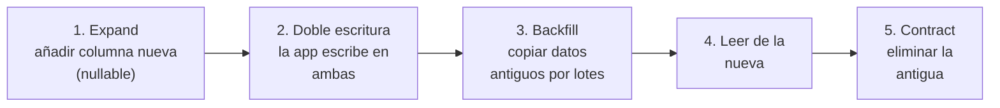

# Bases de datos <span class="nivel medio">Medio</span>

Los datos sobreviven a las aplicaciones: el modelo de datos es de las decisiones más difíciles de cambiar.
La parte distribuida (replicación, *sharding*, CAP) está en
[Fundamentos de system design](../system-design/fundamentos.md#4-bases-de-datos).

## 1. Modelo relacional y SQL

- **Tablas** con esquema, **claves primarias**, **claves ajenas** con integridad referencial.
- **Normalización**: cada dato en un solo sitio (1FN valores atómicos, 2FN sin dependencias parciales, 3FN sin
  dependencias transitivas). Evita anomalías de actualización.
- **Desnormalización** consciente: duplicar datos para acelerar lecturas (columnas calculadas, vistas materializadas,
  tablas de lectura en CQRS). Cuesta consistencia y espacio.

```sql
-- Modelo de ejemplo: flota edge
CREATE TABLE site (
  id          BIGINT PRIMARY KEY,
  code        TEXT NOT NULL UNIQUE,           -- 'site-042'
  region      TEXT NOT NULL,
  created_at  TIMESTAMPTZ NOT NULL DEFAULT now()
);

CREATE TABLE deployment (
  id          BIGSERIAL PRIMARY KEY,
  site_id     BIGINT NOT NULL REFERENCES site(id),
  revision    TEXT NOT NULL,                  -- commit de Git reconciliado
  status      TEXT NOT NULL CHECK (status IN ('PENDING','READY','FAILED')),
  started_at  TIMESTAMPTZ NOT NULL,
  version     INT NOT NULL DEFAULT 0          -- bloqueo optimista
);

CREATE INDEX idx_deployment_site_started ON deployment (site_id, started_at DESC);
```

## 2. Transacciones: ACID

| Propiedad | Significado | Cómo se implementa |
|---|---|---|
| **Atomicidad** | Todo o nada | *Undo log* / versiones |
| **Consistencia** | Se respetan las restricciones | Claves, `CHECK`, *triggers* |
| **Aislamiento** | Las transacciones concurrentes no se pisan | *Locks* y/o MVCC |
| **Durabilidad** | Lo confirmado sobrevive a caídas | **WAL** (*write-ahead log*) escrito a disco antes de confirmar |

## 3. Niveles de aislamiento y anomalías

| Anomalía | Qué ocurre |
|---|---|
| **Lectura sucia** | Lees datos que otra transacción aún no ha confirmado (y puede deshacer) |
| **Lectura no repetible** | Lees dos veces la misma fila y cambia entre medias |
| **Fantasmas** | Repites una consulta de rango y aparecen filas nuevas |
| ***Lost update*** | Dos transacciones leen, modifican y escriben: una sobrescribe a la otra |
| ***Write skew*** | Dos transacciones leen lo mismo, cada una escribe algo distinto y juntas violan una regla (p. ej. "siempre al menos un médico de guardia") |

| Nivel | Lectura sucia | No repetible | Fantasmas | Notas |
|---|:-:|:-:|:-:|---|
| Read Uncommitted | Posible | Posible | Posible | Casi nunca se usa |
| **Read Committed** | ✗ | Posible | Posible | Por defecto en PostgreSQL, Oracle, SQL Server |
| Repeatable Read | ✗ | ✗ | Posible* | Por defecto en MySQL InnoDB |
| **Serializable** | ✗ | ✗ | ✗ | Correcto siempre; más conflictos → hay que **reintentar** |

\* En PostgreSQL, Repeatable Read es *snapshot isolation*: evita fantasmas, pero no el *write skew*.

### Evitar el *lost update*

=== "Bloqueo optimista"

    ```sql
    UPDATE deployment
    SET status = 'FAILED', version = version + 1
    WHERE id = :id AND version = :expectedVersion;
    -- 0 filas → alguien lo cambió antes: recargar y reintentar
    ```
    En JPA: campo `@Version`. Ideal con poca contención.

=== "Bloqueo pesimista"

    ```sql
    BEGIN;
    SELECT * FROM deployment WHERE id = :id FOR UPDATE;   -- bloquea la fila
    UPDATE deployment SET status = 'FAILED' WHERE id = :id;
    COMMIT;
    ```
    Útil con alta contención; cuidado con *deadlocks* y transacciones largas.

=== "Actualización atómica"

    ```sql
    UPDATE counter SET value = value + 1 WHERE id = :id;  -- sin leer antes
    ```

**MVCC** (*Multi-Version Concurrency Control*): cada escritura crea una nueva versión de la fila; cada transacción lee
la instantánea que le corresponde. Lectores y escritores no se bloquean. Coste en PostgreSQL: versiones muertas que
limpia **VACUUM** (vigilar el *bloat*).

## 4. Índices

| Tipo | Para |
|---|---|
| **B-tree** (por defecto) | Igualdad, rangos, ordenación |
| Hash | Solo igualdad |
| **GIN** | JSONB, arrays, texto completo |
| GiST / SP-GiST | Geoespacial, rangos |
| BRIN | Tablas enormes ordenadas físicamente (series temporales) |
| **HNSW / IVFFlat** (pgvector) | Búsqueda de vectores por similitud |

- **Compuesto**: el orden importa. `(site_id, started_at)` sirve para `WHERE site_id = ?` y `WHERE site_id = ? ORDER BY started_at`, pero no para `WHERE started_at > ?` solo.
- **Cubriente** (`INCLUDE`): la consulta se responde solo con el índice (*index-only scan*).
- **Parcial**: `CREATE INDEX … WHERE status = 'FAILED'` → pequeño y rápido para consultas frecuentes sobre un subconjunto.
- **Coste**: cada índice ralentiza escrituras y ocupa espacio; elimina los que no se usan (`pg_stat_user_indexes`).
- **No sirve un índice** cuando la consulta devuelve gran parte de la tabla, o si aplicas una función a la columna (`WHERE lower(code) = …` necesita un índice de expresión).

```sql
EXPLAIN (ANALYZE, BUFFERS)
SELECT * FROM deployment WHERE site_id = 42 ORDER BY started_at DESC LIMIT 20;
-- Buscar: Index Scan (bien) vs Seq Scan en tablas grandes (mal), filas estimadas vs reales
```

## 5. Modelado según el tipo de base de datos

| Tipo | Modelas desde… | Ejemplos |
|---|---|---|
| Relacional | Las **entidades** y sus relaciones; las consultas se adaptan | PostgreSQL, MySQL |
| Documento | Los **agregados** que se leen juntos | MongoDB, Firestore |
| Clave-valor / columnar ancha | Los **patrones de acceso** (primero las consultas) | DynamoDB, Cassandra |
| Series temporales | Tiempo + etiquetas; retención y *downsampling* | TimescaleDB, InfluxDB, Prometheus |
| Grafos | Relaciones como ciudadanas de primera | Neo4j |
| Búsqueda | Texto, relevancia, facetas | Elasticsearch, OpenSearch |

!!! tip "PostgreSQL como navaja suiza"
    Relacional + JSONB (documentos) + extensiones (TimescaleDB, PostGIS, pgvector, colas con `SKIP LOCKED`).
    Para muchos sistemas es la mejor primera elección: menos piezas que operar.

## 6. Operación

| Tema | Buenas prácticas |
|---|---|
| **Pool de conexiones** | HikariCP en la app; PgBouncer delante de PostgreSQL con muchas instancias/Pods |
| **Migraciones de esquema** | Versionadas (Flyway, Liquibase), en CI, **compatibles hacia atrás** |
| **Copias de seguridad** | *Backups* + WAL para restaurar a un punto en el tiempo (PITR); **probar la restauración** |
| **Monitorización** | Consultas lentas (`pg_stat_statements`), *locks*, conexiones, lag de réplicas, *bloat* |
| **Kubernetes** | Operadores (CloudNativePG, Crunchy) o servicio gestionado; nunca un StatefulSet a mano sin *backups* |

### Migraciones sin parada: *expand / contract*



Nunca renombres ni borres una columna en el mismo despliegue que cambia el código: durante el *rolling update*
conviven la versión vieja y la nueva de la aplicación.

## Preguntas de repaso

??? question "¿Qué es el write skew y qué nivel lo evita?"
    Dos transacciones leen un mismo estado, cada una modifica filas distintas basándose en él, y el resultado conjunto viola
    una regla. *Snapshot isolation* no lo evita; **Serializable** sí (o bloquear explícitamente con `FOR UPDATE`).

??? question "¿Por qué un índice en (a, b) no sirve para filtrar solo por b?"
    El B-tree ordena primero por `a` y, dentro de cada valor de `a`, por `b`. Filtrar solo por `b` obliga a recorrer todo el índice.

??? question "¿Cómo garantiza la durabilidad una base de datos?"
    Escribiendo el cambio en el **WAL** y forzándolo a disco (`fsync`) antes de confirmar; tras una caída, se reproduce el WAL.

??? question "¿Por qué las migraciones deben ser compatibles hacia atrás?"
    Porque durante un despliegue progresivo conviven versiones antigua y nueva de la aplicación contra el mismo esquema,
    y porque así se puede revertir el código sin revertir la base de datos.

## Ejercicios

!!! exercise "Ejercicio 1 · Básico — Elegir el índice"
    Consultas frecuentes: (a) `WHERE site_id = ? AND status = 'FAILED' ORDER BY started_at DESC LIMIT 10`;
    (b) `WHERE status = 'PENDING'` (el 0,1 % de las filas). Propón índices.

    ??? success "Solución"
        (a) Índice compuesto `(site_id, status, started_at DESC)`: filtra por las dos igualdades y devuelve las filas ya
        ordenadas, sin ordenar en memoria. (b) Índice **parcial**
        `CREATE INDEX ON deployment (started_at) WHERE status = 'PENDING'`: pequeño (solo el 0,1 % de filas) y perfecto
        para esa consulta.

!!! exercise "Ejercicio 2 · Básico — Informe incoherente"
    Un informe calcula en varias consultas cifras que deben cuadrar entre sí (sumas por región y total general). En Read
    Committed a veces no cuadran. ¿Por qué y cómo lo arreglas?

    ??? success "Solución"
        En Read Committed **cada consulta** ve los datos confirmados en ese momento: entre la primera y la última pueden
        confirmarse cambios, así que las cifras no corresponden al mismo instante. Solución: ejecutar el informe en una
        transacción **Repeatable Read** de solo lectura (en PostgreSQL, una única instantánea para toda la transacción).

!!! exercise "Ejercicio 3 · Medio — Write skew"
    Regla de negocio: en cada región debe haber al menos un sitio "primario". Dos operadores quitan a la vez la marca a los
    dos únicos primarios de una región; cada transacción comprueba antes "hay otro primario". ¿Qué pasa en Repeatable Read
    y cómo lo evitas?

    ??? success "Solución"
        Ambas transacciones leen la misma instantánea (2 primarios), cada una actualiza **una fila distinta**, no hay
        conflicto de escritura y las dos confirman: la región queda **sin primario** (*write skew*). Soluciones:
        (1) aislamiento **Serializable** (una fallará y deberá reintentar); (2) bloquear las filas leídas con
        `SELECT … WHERE region = ? AND is_primary FOR UPDATE`; (3) materializar el conflicto con una fila de control por
        región que ambas transacciones actualicen.

!!! exercise "Ejercicio 4 · Medio — Renombrar una columna sin parada"
    Debes renombrar `deployment.revision` a `git_commit` en una tabla de 50 M de filas sin parar el servicio. Describe los
    pasos.

    ??? success "Solución"
        1. **Migración 1**: añadir `git_commit` (nullable).
        2. **Despliegue A**: la aplicación escribe en **ambas** columnas y lee de `revision`.
        3. ***Backfill*** por lotes (p. ej. 10 000 filas por transacción) copiando `revision` → `git_commit`.
        4. **Despliegue B**: la aplicación lee de `git_commit` (sigue escribiendo en ambas por si hay que volver atrás).
        5. **Despliegue C**: deja de escribir en `revision`.
        6. **Migración 2**: eliminar `revision`.

        En cada paso, la versión anterior y la nueva de la aplicación funcionan con el esquema existente.

!!! exercise "Ejercicio 5 · Avanzado — Cola de trabajos en PostgreSQL"
    Varios *workers* deben repartirse trabajos pendientes de una tabla `job` sin procesar dos veces el mismo ni esperarse
    entre sí. Escribe la consulta.

    ??? success "Solución"
        ```sql
        WITH next AS (
          SELECT id FROM job
          WHERE status = 'PENDING'
          ORDER BY created_at
          LIMIT 10
          FOR UPDATE SKIP LOCKED          -- salta filas ya bloqueadas por otro worker
        )
        UPDATE job SET status = 'RUNNING', started_at = now()
        FROM next WHERE job.id = next.id
        RETURNING job.*;
        ```
        `FOR UPDATE` bloquea las filas elegidas y `SKIP LOCKED` hace que otros *workers* tomen las siguientes en lugar de
        esperar. Complementos: índice parcial `(created_at) WHERE status = 'PENDING'` y un proceso que devuelva a PENDING
        los trabajos que lleven demasiado tiempo en RUNNING (el *worker* murió).
