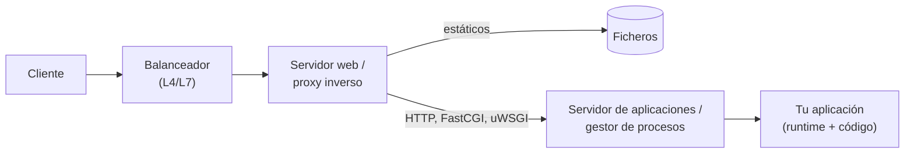

# Compilación, ejecución y servidores <span class="nivel avanzado">Avanzado</span>

Entre escribir `main()` y atender una petición HTTP en producción hay una cadena larga: compilador o intérprete,
formato del ejecutable, *runtime*, servidor, contenedor y plataforma. Conocerla permite elegir bien el modelo de
despliegue, dimensionar memoria y arranque, y diagnosticar los fallos que aparecen "entre capas".

## 1. Del código fuente al proceso


| Fase | Qué hace | Base teórica |
|---|---|---|
| **Análisis léxico** | Agrupa caracteres en *tokens* (`if`, `x`, `42`, `+`) | Expresiones regulares ≡ autómatas finitos |
| **Análisis sintáctico** | Construye el árbol de sintaxis abstracta (AST) según la gramática | Gramáticas libres de contexto ≡ autómatas de pila |
| **Análisis semántico** | Resuelve nombres, comprueba tipos, infiere | Sistemas de tipos, tablas de símbolos |
| **IR** | Traduce a una representación independiente del lenguaje y de la máquina (LLVM IR, bytecode, SSA) | Grafos de flujo de control |
| **Optimización** | Elimina código muerto, *inlining*, desenrollado de bucles, asignación de registros | Análisis de flujo de datos, coloreado de grafos |
| **Generación de código** | Emite instrucciones de una arquitectura (x86-64, ARM64) o bytecode | Selección de instrucciones |
| **Enlazado** | Une ficheros objeto y bibliotecas, resuelve símbolos y direcciones | — |
| **Carga** | El SO mapea el ejecutable en memoria, carga bibliotecas dinámicas y salta al punto de entrada | Memoria virtual |

!!! tip "La teoría detrás"
    Que un *lexer* sea un autómata finito y un *parser* un autómata de pila no es una analogía: es la jerarquía de
    Chomsky. La explica con demostraciones e intérpretes interactivos el capítulo de autómatas de
    [Math of AI](https://toniferr.github.io/math-of-ai/es/automatas/).

## 2. Modelos de ejecución

| Modelo | Cómo funciona | Arranque | Rendimiento máximo | Ejemplos |
|---|---|---|---|---|
| **AOT nativo** | Se compila todo a código máquina antes de ejecutar | Inmediato | Alto y predecible | C, C++, Rust, Go, Swift, Zig |
| **Intérprete de árbol** | Recorre el AST y ejecuta cada nodo | Inmediato | Bajo | Intérpretes didácticos, primeras versiones de Ruby |
| **Máquina virtual de bytecode** | Compila a bytecode compacto y un bucle lo interpreta | Rápido | Medio | CPython, Lua, YARV (Ruby), BEAM (Erlang/Elixir) |
| **JIT** | Interpreta o compila rápido al principio y recompila con optimizaciones agresivas el código "caliente" | Lento (*warm-up*) | Muy alto | JVM (HotSpot C1/C2), .NET (RyuJIT), V8, PyPy |
| **AOT de runtime gestionado** | Compila a nativo un lenguaje pensado para VM | Muy rápido | Alto (sin JIT ni perfiles en caliente) | GraalVM Native Image, .NET Native AOT, Android ART |
| **Transpilación** | Traduce a otro lenguaje de alto nivel | — | El del destino | TypeScript → JavaScript, Kotlin/JS, Sass → CSS |
| **WebAssembly** | Bytecode portable y aislado, compilado a nativo por el *runtime* | Rápido | Cercano a nativo | Rust/C++/Go → Wasm en navegador, Wasmtime, Workers |

### Cómo funciona un JIT

Un JIT parte de una premisa: la mayor parte del tiempo se pasa en una fracción pequeña del código. La JVM empieza
interpretando, cuenta cuántas veces se ejecuta cada método y cada bucle y, al superar un umbral, lo compila primero con
**C1** (rápido, poco optimizado) y después con **C2** (lento de compilar, muy optimizado). C2 usa lo observado en
ejecución: si en una llamada virtual siempre llega la misma clase, la convierte en directa y la *inlinea*; si la
suposición deja de cumplirse, **desoptimiza** y vuelve al intérprete. V8 hace lo mismo con JavaScript (Ignition →
Sparkplug → Maglev → TurboFan). Detalles de la JVM en [La JVM por dentro](../java/jvm.md).

!!! info "Por qué importa en arquitectura"
    El JIT da el mejor rendimiento sostenido, pero un pod recién arrancado es lento durante segundos o minutos y
    consume CPU compilando. En autoescalado agresivo, *serverless* o tareas cortas, un binario AOT (Go, Rust,
    Native Image) arranca en milisegundos y usa menos memoria, a cambio de algo menos de rendimiento máximo.

## 3. Ejecutables, bibliotecas y destinos

| Concepto | Detalle |
|---|---|
| **Formato del ejecutable** | **ELF** en Linux, **PE/COFF** (`.exe`, `.dll`) en Windows, **Mach-O** en macOS. Contienen código, datos, tabla de símbolos y punto de entrada |
| **Enlazado estático** | Las bibliotecas se copian dentro del ejecutable: un solo fichero, sin dependencias; más grande |
| **Enlazado dinámico** | Se cargan al arrancar (`.so`, `.dll`, `.dylib`); se comparten entre procesos y se actualizan sin recompilar. Un ejecutable dinámico depende de la versión de `glibc` del sistema |
| **ABI** | Convenio binario: cómo se pasan argumentos, alineación, nombres de símbolos. Mezclar módulos con ABIs distintas rompe en ejecución, no al compilar |
| **Target triple** | Arquitectura, fabricante, SO y entorno: `x86_64-unknown-linux-gnu`, `aarch64-apple-darwin`, `x86_64-pc-windows-msvc` |
| **Compilación cruzada** | Generar un ejecutable para otro destino: `GOOS=linux GOARCH=arm64 go build`, `cargo build --target …` |

!!! warning "musl frente a glibc"
    Las imágenes Alpine usan **musl** en lugar de **glibc**. Un binario enlazado dinámicamente con glibc no arranca en
    Alpine ("not found" aunque el fichero exista: falta el cargador dinámico). Soluciones: enlazar estáticamente,
    compilar para musl o usar una imagen base con glibc (Debian *slim*, *distroless*).

## 4. Lenguaje por lenguaje

=== "C / C++ / Rust"

    Compilación AOT a nativo. El compilador (GCC, Clang/LLVM, `rustc`, que también usa LLVM) genera ficheros objeto y
    el enlazador produce el ejecutable o una biblioteca.

    ```bash
    gcc -O2 -o app main.c                         # ejecutable dinámico (glibc)
    cargo build --release                          # target/release/app
    cargo build --release --target x86_64-unknown-linux-musl   # estático, cabe en FROM scratch
    ```

    **Artefacto:** binario nativo por plataforma. **Runtime:** ninguno (más allá de la libc si es dinámico).

=== "Go"

    Compilador AOT propio, enlazado **estático por defecto** (salvo si se usa cgo). El binario incluye el *runtime*
    de Go: planificador de *goroutines* y recolector de basura.

    ```bash
    CGO_ENABLED=0 GOOS=linux GOARCH=amd64 go build -o app ./cmd/app
    ```

    **Artefacto:** un único binario autocontenido; ideal para imágenes `FROM scratch` o *distroless* de pocos MB.

=== "Java / Kotlin"

    `javac` (o `kotlinc`) compila a **bytecode** (`.class`), independiente de la plataforma. La JVM lo carga,
    verifica, interpreta y compila con el JIT.

    ```bash
    mvn package                 # target/app.jar (fat jar con Spring Boot, incluye Tomcat embebido)
    java -jar target/app.jar
    native-image -jar app.jar   # GraalVM: binario nativo, arranque en ms, sin JIT
    ```

    **Artefactos:** JAR (biblioteca o aplicación), *fat/uber* JAR (con dependencias), WAR (para desplegar en un
    servidor de aplicaciones), imagen nativa. **Runtime:** JVM (JRE/JDK, mejor un *runtime* recortado con `jlink`).

=== "C# / .NET"

    El compilador Roslyn genera **IL** (lenguaje intermedio) dentro de ensamblados `.dll`. El CLR lo compila con el
    JIT (RyuJIT, por niveles) al ejecutarlo. Con *ReadyToRun* se precompila parcialmente; con **Native AOT**, del todo.

    ```bash
    dotnet publish -c Release                               # depende del runtime instalado
    dotnet publish -c Release -r linux-x64 --self-contained # incluye el runtime
    dotnet publish -c Release -r linux-x64 -p:PublishAot=true  # binario nativo
    ```

=== "Python"

    CPython compila cada módulo a **bytecode** (`.pyc` en `__pycache__`) y lo ejecuta en su máquina virtual. No hay
    ejecutable: se distribuye el código y sus dependencias. El GIL impide que varios hilos ejecuten bytecode a la vez
    (Python 3.13 introduce de forma experimental una versión sin GIL y un JIT).

    ```bash
    python -m build            # dist/*.whl (wheel): paquete instalable
    pip install -r requirements.txt && gunicorn app:app
    ```

    **Artefactos:** *wheel* (puede incluir extensiones nativas compiladas por plataforma), imagen de contenedor. Para
    distribuir como ejecutable existen empaquetadores (PyInstaller) que incluyen el intérprete.

=== "JavaScript / TypeScript"

    TypeScript se **transpila** a JavaScript (`tsc`, `esbuild`, `swc`) y se eliminan los tipos. El JavaScript se
    ejecuta en un motor con JIT: V8 (Chrome, Node.js, Deno), JavaScriptCore (Safari, Bun), SpiderMonkey (Firefox).
    Para el navegador se **empaqueta** (*bundling*, *tree shaking*, minificación) con Vite, webpack o esbuild.

    ```bash
    npx tsc && node dist/server.js        # servidor Node.js
    npx vite build                         # dist/: HTML, JS y CSS estáticos para un servidor web o CDN
    ```

=== "PHP / Ruby"

    Intérpretes con máquina virtual: PHP compila a *opcodes* y los cachea en memoria con **OPcache** (y tiene JIT
    desde PHP 8); Ruby usa YARV y, desde 3.x, el JIT YJIT. Se despliega el código fuente y se ejecuta detrás de un
    gestor de procesos: **PHP-FPM** (FastCGI) o **Puma** (Rack).

=== "WebAssembly"

    Formato binario portable que generan Rust, C/C++, Go o AssemblyScript. Se ejecuta en el navegador o en *runtimes*
    fuera de él (Wasmtime, WasmEdge) con aislamiento fuerte y arranque en microsegundos; **WASI** le da acceso
    controlado a ficheros y red.

    ```bash
    cargo build --release --target wasm32-wasip1
    wasmtime target/wasm32-wasip1/release/app.wasm
    ```

## 5. Tipos de servidores

"Servidor" designa cosas muy distintas. En una petición típica intervienen varias:



| Tipo | Función | Ejemplos |
|---|---|---|
| **Servidor web** | Sirve ficheros estáticos, termina TLS, comprime, cachea, hace de proxy inverso | NGINX, Apache httpd, Caddy, IIS |
| **Proxy / balanceador** | Reparte tráfico, *health checks*, reintentos, límites | HAProxy, Envoy, NGINX, ALB / Application Gateway |
| **Contenedor de servlets** | Implementa la API Servlet de Jakarta EE y ejecuta aplicaciones Java web (WAR) | Tomcat, Jetty, Undertow |
| **Servidor de aplicaciones Jakarta EE** | Además: EJB, JMS, JTA (transacciones distribuidas), JNDI, gestión centralizada | WildFly/JBoss, Payara, Open Liberty, WebLogic, WebSphere |
| **Servidor embebido** | El servidor HTTP es una biblioteca dentro de la aplicación, que se arranca como un proceso normal | Spring Boot (Tomcat/Netty), Kestrel (ASP.NET Core), Node.js `http`, Go `net/http` |
| **Gestor de procesos (pasarela)** | Mantiene varios procesos o *workers* del intérprete y les reparte peticiones mediante un protocolo estándar | Gunicorn, uWSGI (WSGI); Uvicorn, Hypercorn (ASGI); PHP-FPM (FastCGI); Puma (Rack) |

### Interfaces entre servidor y aplicación

| Interfaz | Lenguaje | Modelo |
|---|---|---|
| **CGI** (1993) | Cualquiera | Un proceso nuevo por petición: simple y muy lento; hoy solo histórico |
| **FastCGI** | PHP, otros | Procesos persistentes que reciben peticiones por un socket (PHP-FPM) |
| **Servlet API** | Java | El contenedor llama a `service()` en un hilo de su *pool* (o hilo virtual) |
| **WSGI** | Python | Síncrono: `app(environ, start_response)`; un *worker* atiende una petición a la vez |
| **ASGI** | Python | Asíncrono (`async def app(scope, receive, send)`); admite WebSockets y miles de conexiones por proceso |
| **Rack** | Ruby | Equivalente a WSGI |

### Modelos de proceso

| Modelo | Cómo escala | Típico de |
|---|---|---|
| ***Prefork*** | Varios procesos, cada uno atiende una petición a la vez | Apache `prefork`, Gunicorn síncrono, PHP-FPM |
| **Hilos** | Un proceso con un *pool* de hilos | Tomcat, IIS |
| **Hilos virtuales** | Un hilo ligero por petición, millones posibles | Java 21+ |
| ***Event loop*** | Pocos hilos, E/S no bloqueante | NGINX, Node.js, Netty, Uvicorn |

!!! tip "Regla práctica de dimensionado"
    Con *prefork* o WSGI síncrono, la concurrencia máxima es `procesos × hilos`: si una petición tarda 200 ms y tienes
    8 *workers*, no pasas de ~40 peticiones/s. Más *workers* cuestan memoria (cada proceso carga su copia del código);
    para E/S intensiva conviene un modelo asíncrono (ASGI, Node.js, Netty) o hilos virtuales.

## 6. Dónde se despliega

| Destino | Qué entregas | A tener en cuenta |
|---|---|---|
| **Máquina física o VM** | Binario o paquete + servicio `systemd` / servicio de Windows | Parches del SO a tu cargo; despliegues con Ansible o imágenes de VM |
| **Contenedor** | Imagen OCI: capas con SO base, *runtime* y aplicación | Imagen base mínima (*distroless*, `scratch` para binarios estáticos); usuario no root; un proceso por contenedor |
| **Kubernetes** | Imagen + manifiestos (Deployment, Service…) | *Probes* de arranque (más largas con JIT), `requests`/`limits`, tamaño del *heap* frente al límite de memoria → [Kubernetes](../plataforma/kubernetes.md) |
| **PaaS** | Código o imagen | App Service, Cloud Run, Heroku: la plataforma elige o construye el *runtime* (*buildpacks*) |
| **Serverless (FaaS)** | Función + dependencias, o imagen | *Cold start*: penaliza runtimes con JIT y *frameworks* pesados; AOT o SnapStart lo reducen |
| **Edge** | JavaScript o Wasm | Cloudflare Workers usa aislamientos de V8 (no contenedores): arranque en ms, límites de CPU y APIs |
| **Navegador** | JS, CSS y Wasm estáticos | Servidos desde un servidor web o CDN; el "servidor" solo entrega ficheros |
| **Móvil** | APK/AAB (Android), IPA (iOS) | Android ART combina AOT y JIT; iOS prohíbe el JIT a las apps: todo se compila AOT |

### Resumen por lenguaje

| Lenguaje | Compilación | Artefacto | Necesita en destino | Servidor típico |
|---|---|---|---|---|
| C/C++/Rust | AOT nativo | Binario ELF/PE/Mach-O | Nada (o libc) | Embebido (Actix, Axum) tras NGINX |
| Go | AOT nativo estático | Binario único | Nada | `net/http` embebido |
| Java/Kotlin | Bytecode + JIT | Fat JAR, WAR, imagen nativa | JVM (salvo imagen nativa) | Tomcat/Netty embebido; WAR en Tomcat o Jakarta EE |
| C#/.NET | IL + JIT | Ensamblados `.dll`, *self-contained*, Native AOT | Runtime .NET (salvo *self-contained*/AOT) | Kestrel tras IIS, NGINX o YARP |
| Python | Bytecode interpretado | Código + *wheels* | Intérprete y dependencias | Gunicorn (WSGI) / Uvicorn (ASGI) tras NGINX |
| Node.js/TS | Transpilación + JIT (V8) | JS + `node_modules` o *bundle* | Node.js | `http`/Express/Fastify tras NGINX |
| PHP | Opcodes + OPcache | Código fuente | PHP | PHP-FPM tras NGINX o Apache |
| Frontend web | Transpilación + *bundling* | Ficheros estáticos | Navegador | NGINX, CDN, almacenamiento de objetos |

## 7. Ejercicios

!!! exercise "Ejercicio 1 · Básico — ¿Qué necesita el contenedor?"
    Indica la imagen base mínima razonable para: (a) un binario Go con `CGO_ENABLED=0`; (b) un fat JAR de Spring Boot;
    (c) una API FastAPI.

    ??? success "Solución"
        (a) `scratch` o *distroless static*: el binario no depende de nada (añade certificados CA si hace HTTPS).
        (b) Una imagen con un JRE (mejor un *runtime* recortado con `jlink`, o *distroless java*). (c) Una imagen de
        Python *slim* con las dependencias instaladas y Uvicorn como proceso principal; evita Alpine si alguna
        dependencia trae extensiones nativas compiladas para glibc.

!!! exercise "Ejercicio 2 · Medio — Arranques lentos en Kubernetes"
    Un servicio Spring Boot tarda 40 s en estar listo y Kubernetes lo reinicia en bucle durante los despliegues. ¿Qué
    está pasando y qué opciones hay?

    ??? success "Solución"
        La *liveness probe* empieza antes de que la JVM haya cargado clases, inicializado el contexto y calentado el
        JIT, así que el pod se considera muerto. Corto plazo: añadir una **startupProbe** con margen suficiente y no
        lanzar la *liveness* hasta que pase. Medio plazo: reducir el arranque (menos autoconfiguración, CDS/AppCDS,
        *lazy init*, CPU suficiente en `requests` porque el JIT la consume al arrancar). Si el escalado rápido es
        crítico: GraalVM Native Image o CRaC.

!!! exercise "Ejercicio 3 · Medio — WSGI frente a ASGI"
    Una API Python llama a un servicio externo que tarda 1 s. Con Gunicorn y 4 *workers* síncronos soporta unas 4
    peticiones por segundo. Explica por qué y cómo mejorarlo.

    ??? success "Solución"
        Cada *worker* WSGI síncrono atiende una petición a la vez y pasa el segundo entero bloqueado esperando la E/S:
        4 *workers* = 4 peticiones en curso como máximo. Opciones: más *workers* o hilos (más memoria), o pasar a
        **ASGI** con un *framework* asíncrono (FastAPI con Uvicorn) y un cliente HTTP asíncrono, de modo que un solo
        proceso mantenga cientos de esperas a la vez.

!!! exercise "Ejercicio 4 · Avanzado — Elegir el modelo de ejecución"
    Debes desplegar (a) un servicio de pagos de tráfico alto y constante, (b) una función que redimensiona imágenes y
    se invoca a ráfagas, y (c) una CLI interna para Linux, Windows y macOS. ¿Qué modelo de ejecución eliges para cada
    uno y por qué?

    ??? success "Solución"
        (a) **JIT** (JVM o .NET): procesos de larga vida, donde el *warm-up* se amortiza y el rendimiento sostenido es
        máximo. (b) **AOT** (Go, Rust o Native Image) o un *runtime* ligero: en *serverless* el *cold start* y la
        memoria se pagan en cada ráfaga. (c) **Go o Rust con compilación cruzada**: un binario estático por
        plataforma, sin exigir que el usuario instale un *runtime*.
