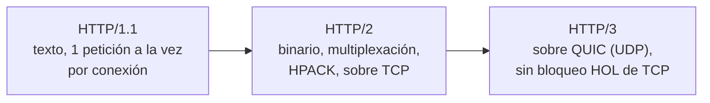
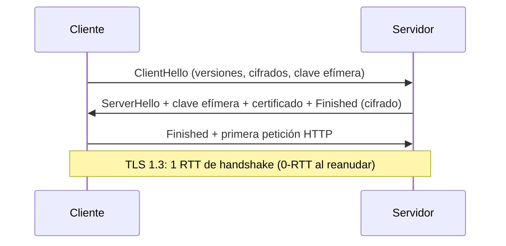

# Redes <span class="nivel medio">Medio</span>

Casi todos los problemas de sistemas distribuidos acaban siendo, en parte, problemas de red: latencia, pérdidas,
*timeouts*, DNS, certificados. Un arquitecto debe poder razonar sobre ellos sin depender de nadie.

## 1. Modelo de capas

| Capa (TCP/IP) | OSI | Protocolos | Qué resuelve | Dispositivo / componente |
|---|---|---|---|---|
| Aplicación | 5-7 | HTTP, gRPC, DNS, MQTT, SMTP, SSH | Semántica de la comunicación | Balanceador L7, API gateway, proxy |
| Seguridad (entre medias) | 6 | TLS 1.2 / 1.3 | Cifrado, integridad, autenticación | Terminador TLS |
| Transporte | 4 | TCP, UDP, QUIC | Entrega entre procesos (puertos) | Balanceador L4, firewall *stateful* |
| Red | 3 | IPv4, IPv6, ICMP | Direccionamiento y enrutado entre redes | Router, NAT |
| Enlace | 2 | Ethernet, Wi-Fi, VLAN | Transmisión en el segmento local | Switch |
| Física | 1 | Cobre, fibra, radio | Bits por el medio | Cable, antena |

## 2. Direccionamiento IP y CIDR

- **IPv4**: 32 bits. Rangos privados (RFC 1918): `10.0.0.0/8`, `172.16.0.0/12`, `192.168.0.0/16`.
- **CIDR**: `/n` = bits fijos de red. `/24` = 256 direcciones; `/16` = 65 536; `/28` = 16.
- **IPv6**: 128 bits; sin escasez, sin NAT necesario; cada vez más importante (las IPv4 públicas ya se cobran en cloud).

!!! tip "Planificación de direcciones"
    Reserva rangos que **no se solapen** entre VPCs, CPDs, oficinas, sitios edge y las redes internas de Kubernetes
    (Pods y Services). Un solapamiento descubierto tarde obliga a NAT o a rehacer redes: es de las decisiones más caras de revertir.

| Uso | Ejemplo de reparto |
|---|---|
| Hub cloud | `10.0.0.0/16` |
| Sitios edge | `10.64.0.0/10` → un `/24` por sitio (hasta 16 384 sitios) |
| Pods de Kubernetes | `100.64.0.0/16` (CGNAT, fuera de lo enrutado) |
| Services de Kubernetes | `10.96.0.0/12` (por defecto) |

## 3. TCP vs. UDP

| | TCP | UDP |
|---|---|---|
| Conexión | Sí: *handshake* de 3 pasos (SYN, SYN-ACK, ACK) | No |
| Garantías | Entrega fiable, en orden, sin duplicados | Ninguna |
| Control de flujo y congestión | Sí | No (la aplicación decide) |
| Latencia inicial | 1 RTT antes de enviar datos | 0 |
| Usos | HTTP/1-2, bases de datos, SSH | DNS, *streaming*, VoIP, juegos, **QUIC** |

Conceptos clave de TCP: **ventana** (cuántos datos sin confirmar), **retransmisiones** con *timeouts*, **control de
congestión** (*slow start*, CUBIC, BBR), estado `TIME_WAIT` al cerrar (agota puertos efímeros con muchas conexiones
cortas → usar *keep-alive* y *pools* de conexiones).

## 4. HTTP: evolución



| Versión | Mejora | Problema que queda |
|---|---|---|
| **HTTP/1.1** | *Keep-alive*, *chunked* | Una petición por conexión a la vez → los navegadores abren 6 conexiones |
| **HTTP/2** | Multiplexación de muchas peticiones en una conexión, cabeceras comprimidas, *streams* con prioridad | Un paquete TCP perdido bloquea **todos** los *streams* (*head-of-line blocking*) |
| **HTTP/3** | QUIC sobre UDP: *streams* independientes, *handshake* combinado con TLS 1.3 (1 RTT, 0-RTT al reanudar), **migración de conexión** al cambiar de red | Algunas redes bloquean UDP; más CPU |

!!! tip "Relevancia para edge y móvil"
    En enlaces con pérdidas o que cambian de red (4G/5G, satélite), HTTP/3 reduce mucho la latencia de cola.
    gRPC usa HTTP/2; hay soporte experimental de gRPC sobre HTTP/3.

### Semántica HTTP que hay que dominar

| Método | Seguro | Idempotente | Uso |
|---|:-:|:-:|---|
| GET | ✅ | ✅ | Leer |
| PUT | ❌ | ✅ | Reemplazar |
| DELETE | ❌ | ✅ | Borrar |
| POST | ❌ | ❌ | Crear / acción |
| PATCH | ❌ | ❌* | Modificar parcialmente |

Códigos: 2xx éxito · 3xx redirección · 4xx error del cliente (400, 401 no autenticado, 403 sin permiso, 404, 409
conflicto, 422, 429 demasiadas peticiones) · 5xx error del servidor (500, 502 *bad gateway*, 503 no disponible,
504 *timeout* del *gateway*). Caché: `Cache-Control`, `ETag` + `If-None-Match` → `304 Not Modified`.

## 5. TLS



- **Certificado X.509**: clave pública + identidad (SAN con nombres DNS), firmado por una **CA**. El cliente valida la cadena hasta una raíz de confianza.
- ***Forward secrecy***: claves efímeras (ECDHE); robar la clave privada del servidor no descifra tráfico pasado.
- **mTLS**: el cliente también presenta certificado → identidad de servicio a servicio (service mesh, dispositivos edge).
- Automatización: **ACME** (Let's Encrypt), **cert-manager** en Kubernetes; certificados de corta duración y rotación automática.
- Errores típicos: certificado caducado (¡el incidente más evitable!), cadena intermedia incompleta, SAN que no coincide, relojes desincronizados.

## 6. DNS

| Registro | Contenido |
|---|---|
| A / AAAA | Nombre → IPv4 / IPv6 |
| CNAME | Alias a otro nombre |
| MX | Servidores de correo |
| TXT | Texto (verificación de dominio, SPF, DKIM) |
| SRV | Servicio → host y puerto |
| NS / SOA | Delegación y autoridad de la zona |

- Resolución: cliente → *resolver* recursivo → raíz → TLD (`.com`) → servidor autoritativo. Todo cacheado según el **TTL**.
- DNS como herramienta de arquitectura: balanceo global (GeoDNS, por latencia), *failover*, descubrimiento de servicios (CoreDNS en Kubernetes).
- **TTL bajo antes de una migración**: si el TTL es 24 h, un cambio tarda hasta 24 h en propagarse.
- Kubernetes: `mi-svc.mi-ns.svc.cluster.local`; ojo con `ndots:5`, que multiplica las consultas para nombres externos.

## 7. Balanceo, proxies y NAT

| Componente | Qué hace |
|---|---|
| **Proxy directo** (*forward*) | Los clientes salen a través de él (control de salida, caché) |
| **Proxy inverso** | Recibe tráfico en nombre de servidores: TLS, enrutado, caché, *rate limiting* (NGINX, Envoy, HAProxy) |
| **Balanceador L4** | Reparte conexiones TCP/UDP sin mirar el contenido |
| **Balanceador L7** | Enruta por ruta, cabecera o cookie; reintentos, *circuit breaking* |
| **NAT** | Traduce direcciones privadas a públicas; las conexiones entrantes no llegan salvo reglas explícitas → por eso los sitios edge usan modelos **pull** |
| **Service mesh** | Proxies *sidecar* (o en el nodo, modo *ambient*) que dan mTLS, reintentos y telemetría entre servicios |

## 8. Redes en Kubernetes

- **Modelo**: cada Pod tiene su IP; todos los Pods se ven entre sí sin NAT (lo implementa el **CNI**: Calico, Cilium, Flannel).
- **Service**: IP virtual estable. **kube-proxy** (iptables/IPVS) o **eBPF** (Cilium) reparten hacia los Pods.
- **Ingress / Gateway API**: entrada HTTP(S) desde fuera; Gateway API es el sucesor, más expresivo y con roles separados.
- **NetworkPolicy**: firewall entre Pods; empezar por *default deny* y abrir lo necesario.

```yaml
apiVersion: networking.k8s.io/v1
kind: NetworkPolicy
metadata: { name: default-deny, namespace: java-api }
spec:
  podSelector: {}                 # todos los Pods del namespace
  policyTypes: [Ingress, Egress]  # sin reglas → todo denegado
```

## 9. ¿Qué ocurre al escribir una URL?

1. El navegador resuelve el **DNS** (cachés locales → *resolver* → autoritativo), quizá devolviendo un nodo de **CDN** cercano.
2. Abre conexión **TCP** (o QUIC) y negocia **TLS**, validando el certificado.
3. Envía la petición **HTTP**; un **balanceador L7** la enruta a una instancia sana.
4. La aplicación consulta caché y base de datos y genera la respuesta.
5. La respuesta vuelve (comprimida, con cabeceras de caché); el navegador pide recursos adicionales (CSS, JS, imágenes), muchos desde la CDN.
6. El navegador construye el DOM, aplica estilos, ejecuta JS y pinta.

## 10. Caja de herramientas de diagnóstico

| Herramienta | Para |
|---|---|
| `dig` / `nslookup` | Resolución DNS (`dig +trace ejemplo.com`) |
| `curl -v` / `curl -w` | Ver *handshake*, cabeceras y tiempos (`-w "%{time_connect} %{time_starttransfer}\n"`) |
| `openssl s_client -connect host:443` | Inspeccionar certificados y TLS |
| `ss -tanp` / `netstat` | Conexiones y puertos abiertos |
| `mtr` / `traceroute` | Ruta y pérdida de paquetes por salto |
| `tcpdump` / Wireshark | Captura de paquetes |
| `kubectl exec … -- nslookup` | DNS dentro del clúster |

## Preguntas de repaso

??? question "¿Qué problema de HTTP/2 resuelve HTTP/3?"
    El bloqueo *head-of-line* de TCP: en HTTP/2 todos los *streams* comparten una conexión TCP y la pérdida de un
    paquete los detiene a todos. QUIC gestiona cada *stream* de forma independiente sobre UDP.

??? question "¿Por qué un sitio edge detrás de NAT se lleva bien con GitOps pull?"
    Porque el NAT permite conexiones **salientes** pero no entrantes. Con pull, el agente del sitio sale hacia Git y el
    registro; no hace falta abrir puertos ni una VPN hacia el sitio.

??? question "¿Para qué sirve bajar el TTL antes de una migración?"
    Para que las cachés DNS expiren rápido y el cambio de IP se propague en minutos en lugar de horas.

??? question "¿Qué aporta mTLS entre servicios?"
    Cifrado y **autenticación mutua**: cada servicio prueba su identidad con un certificado, base del modelo *zero trust*
    (autorización por identidad, no por IP).

## Ejercicios

!!! exercise "Ejercicio 1 · Básico — Calcular rangos CIDR"
    ¿Cuántas direcciones tiene `10.20.0.0/22`? ¿Cuál es la primera y la última? ¿Se solapa con `10.20.3.0/24`?

    ??? success "Solución"
        /22 deja 32 − 22 = 10 bits para hosts → 2¹⁰ = **1 024 direcciones**: de `10.20.0.0` a `10.20.3.255`
        (el tercer octeto recorre 0, 1, 2, 3). `10.20.3.0/24` va de `10.20.3.0` a `10.20.3.255`: **sí se solapa**, está
        contenido en el /22. En cloud, además, cada subred reserva algunas direcciones (AWS reserva 5 por subred).

!!! exercise "Ejercicio 2 · Básico — Leer los tiempos de curl"
    Ejecutas `curl -w "dns=%{time_namelookup} tcp=%{time_connect} tls=%{time_appconnect} ttfb=%{time_starttransfer}\n" -o /dev/null -s https://api.acme.com/health`
    y obtienes `dns=0.250 tcp=0.270 tls=0.320 ttfb=1.900`. ¿Dónde está el problema?

    ??? success "Solución"
        Los tiempos son **acumulados** desde el inicio. DNS: 250 ms (alto: con caché debería ser de pocos ms; revisar el
        *resolver*). TCP: 270 − 250 = 20 ms (bien). TLS: 320 − 270 = 50 ms (normal). Primer byte: 1 900 − 320 = **1 580 ms**
        de procesamiento en el servidor → el grueso del problema está en la aplicación o sus dependencias, no en la red.
        Dos acciones: investigar el servidor con trazas y revisar por qué el DNS tarda 250 ms.

!!! exercise "Ejercicio 3 · Medio — Diagnosticar un certificado"
    Un servicio empieza a fallar con `x509: certificate signed by unknown authority` solo en algunos clientes. ¿Qué
    comprobarías y en qué orden?

    ??? success "Solución"
        1. `openssl s_client -connect host:443 -servername host -showcerts`: ver la **cadena** que envía el servidor.
        2. Lo más frecuente: falta el **certificado intermedio** (los navegadores a veces lo completan solos; clientes
           como Java o Go no), o se renovó con otra CA.
        3. Comprobar que el cliente confía en la raíz: almacén de confianza de la imagen de contenedor desactualizado
           (`ca-certificates`), `cacerts` de la JVM.
        4. Revisar fechas (caducidad) y que el SAN incluya el nombre usado.

        Solución típica: servir la cadena completa (`fullchain.pem`) y mantener actualizado el almacén de confianza.

!!! exercise "Ejercicio 4 · Medio — DNS lento en Kubernetes"
    Un Pod tarda ~100 ms extra en cada llamada a `api.externa.com`. Con `ndots:5` en `/etc/resolv.conf`, ¿qué está
    pasando y cómo lo arreglas?

    ??? success "Solución"
        Con `ndots:5`, un nombre con menos de 5 puntos se prueba primero con cada dominio de búsqueda
        (`api.externa.com.mi-ns.svc.cluster.local`, `….svc.cluster.local`, `….cluster.local`…), y cada intento fallido es
        una consulta más (a menudo por duplicado, A y AAAA). Soluciones: usar el nombre completo con punto final
        (`api.externa.com.`), bajar `ndots` en el `dnsConfig` del Pod (p. ej. `ndots: 2`), y activar **NodeLocal DNSCache**
        para cachear en cada nodo.

!!! exercise "Ejercicio 5 · Avanzado — Plan de direcciones de una flota edge"
    Tienes un hub en AWS (`10.0.0.0/16`) y 5 000 sitios con K3s. Cada sitio necesita una red de nodos, una de Pods y una
    de Services, y algunos servicios del sitio deben ser accesibles desde el hub por VPN. Propón el plan.

    ??? success "Solución"
        - Red de nodos de cada sitio **única y enrutable**: bloque `10.64.0.0/10` repartido en un /24 por sitio (hasta 16 384 sitios).
        - Redes de Pods y Services **iguales en todos los sitios** (p. ej. Pods `100.64.0.0/16`, Services `100.65.0.0/16`):
          no necesitan ser únicas porque **no se enrutan** fuera del sitio.
        - Lo que el hub deba alcanzar se expone por la IP del nodo o un balanceador local (dentro de la red única del sitio),
          nunca por IPs de Pods.
        - El plan se guarda en Git (IPAM como código) y se valida en CI para impedir solapamientos al dar de alta sitios.
