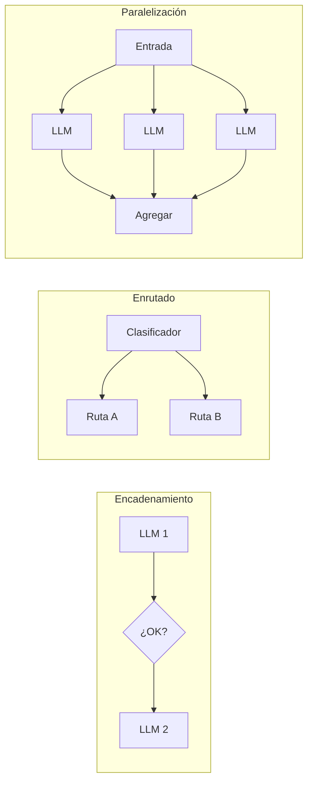
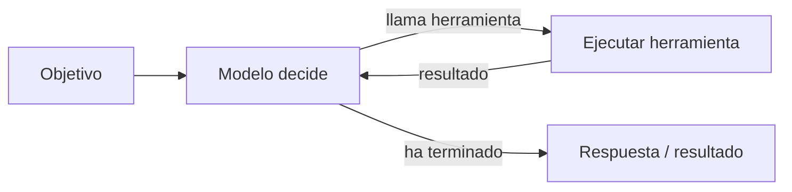
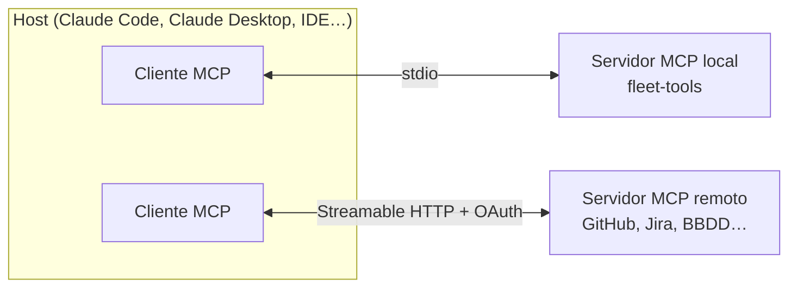
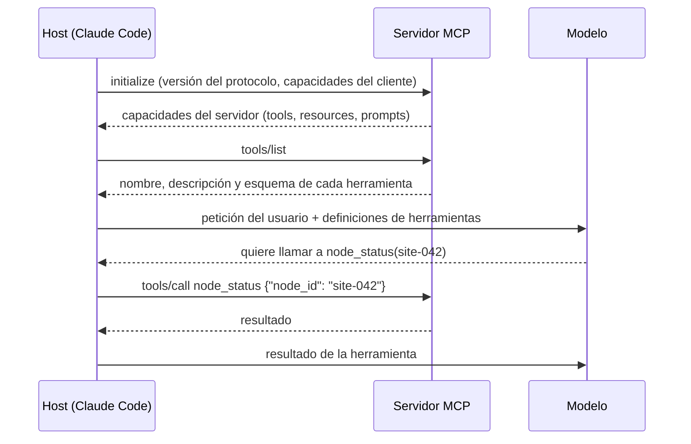

# Agentes, MCP y Skills <span class="nivel avanzado">Avanzado</span>

Un **agente** es un sistema en el que el **modelo dirige su propio proceso**: decide qué herramientas usar, en qué
orden, observa los resultados y continúa hasta cumplir el objetivo. Un ***workflow***, en cambio, sigue un camino
definido en tu código.

## 1. ¿Workflow o agente?

| | Workflow | Agente |
|---|---|---|
| Control del flujo | Tu código | El modelo |
| Predecible, barato, depurable | ✅ | ⚠️ |
| Resuelve tareas abiertas y cambiantes | ⚠️ | ✅ |
| Ejemplo | Clasificar un ticket → extraer datos → enrutar | "Averigua por qué fallan los despliegues en la región norte y propón un arreglo" |

!!! tip "Antes de construir un agente, comprueba cuatro cosas"
    **Complejidad**: ¿la tarea es de varios pasos y difícil de especificar de antemano? · **Valor**: ¿justifica más
    coste y latencia? · **Viabilidad**: ¿el modelo es capaz en ese tipo de tarea? · **Coste del error**: ¿se pueden
    detectar y revertir los errores (tests, revisión, *rollback*)? Si alguna respuesta es "no", usa un *workflow*.

## 2. Patrones de workflow



| Patrón | Cómo | Cuándo |
|---|---|---|
| **Encadenamiento** (*prompt chaining*) | La salida de un paso es la entrada del siguiente, con validaciones entre medias | Tareas descomponibles en pasos fijos |
| **Enrutado** (*routing*) | Clasificar la entrada y mandarla a un *prompt* o modelo especializado | Tipos de petición distintos; modelos baratos para lo fácil |
| **Paralelización** | Subtareas independientes en paralelo, o varias respuestas y votación | Velocidad, o más confianza |
| **Orquestador-trabajadores** | Un LLM divide la tarea dinámicamente y delega en otros | Subtareas no conocidas de antemano |
| **Evaluador-optimizador** | Un LLM genera y otro evalúa y pide mejoras, en bucle | Hay criterios claros de calidad |

## 3. El bucle del agente



```python
messages = [{"role": "user", "content": "Encuentra por qué site-042 no reconcilia y propón un arreglo."}]

while True:
    response = client.messages.create(
        model="claude-opus-5", max_tokens=16000, tools=TOOLS, messages=messages,
    )
    messages.append({"role": "assistant", "content": response.content})   # conservar todos los bloques
    if response.stop_reason != "tool_use":
        break                                                             # terminó (o fue rechazado/cortado)
    results = [
        {"type": "tool_result", "tool_use_id": block.id, "content": run_tool(block.name, block.input)}
        for block in response.content if block.type == "tool_use"
    ]
    messages.append({"role": "user", "content": results})                 # todos los resultados en un mensaje
```

Los SDKs ofrecen este bucle ya hecho (*tool runners*), y existen *harnesses* completos que añaden herramientas,
gestión de contexto y permisos → [Harnesses](harness.md).

### Diseño de agentes: lo que marca la diferencia

| Aspecto | Buenas prácticas |
|---|---|
| **Herramientas** | Pocas y bien descritas; errores explicativos; resultados concisos (no volcar 10 000 líneas) |
| **Criterio de parada** | Objetivo verificable (tests pasan, métrica alcanzada), límite de pasos y de presupuesto de tokens |
| **Memoria** | Corto plazo = ventana de contexto; largo plazo = ficheros, BBDD o herramienta de memoria que el agente lee y escribe |
| **Contexto** | Compactación, limpieza de resultados antiguos, subagentes para aislar exploraciones |
| **Control humano** | Aprobación en acciones irreversibles o con efecto externo |
| **Observabilidad** | Trazar cada paso: razonamiento resumido, llamadas, resultados, tokens y coste |
| **Recuperación** | Estado en ficheros o *checkpoints* para reanudar tareas largas |

### Memoria de un agente

Un modelo no recuerda nada entre peticiones: todo lo que "sabe" en cada paso es lo que hay en su ventana de contexto.
La memoria de un agente es, por tanto, un problema de **diseño**:

| Tipo | Dónde vive | Ejemplo | Riesgo |
|---|---|---|---|
| **De trabajo** (corto plazo) | La ventana de contexto: instrucciones, historial, resultados de herramientas | Lo que ha leído en esta investigación | Se llena; hay que compactar o limpiar |
| **Episódica** | Ficheros o base de datos que el agente escribe y lee | Notas de progreso de una tarea larga ("hecho: pasos 1-4; pendiente: 5") | Notas desordenadas o contradictorias |
| **Semántica** (conocimiento) | Documentos, RAG, `CLAUDE.md`, skills | Convenciones del proyecto, decisiones previas | Información desactualizada |
| **Procedimental** | Skills, *runbooks* | Cómo desplegar, cómo dar de alta un sitio | — |

Técnicas para tareas largas: **compactar** la conversación (resumir lo antiguo), **limpiar** resultados de herramientas
ya usados, guardar el **estado en ficheros** (plan, progreso, decisiones) para poder retomarlo, y **delegar** en
subagentes lo que genera mucha lectura.

## 4. Sistemas multiagente

Un **orquestador** reparte trabajo entre **subagentes**, cada uno con su propia ventana de contexto, instrucciones
y herramientas, que devuelven solo un resumen.

- **Ventajas**: paralelismo, contexto limpio por subtarea, especialización (y modelos más baratos para los trabajadores).
- **Costes**: más tokens en total, coordinación, errores que se propagan entre agentes.
- **Encaja** en tareas que se reparten bien: investigar varias fuentes, revisar muchos ficheros, analizar N sitios.
- **No encaja** en tareas muy acopladas donde todos necesitan el mismo contexto.

## 5. MCP: Model Context Protocol { #mcp }

Protocolo **abierto** (presentado por Anthropic en noviembre de 2024 y cedido en 2025 a la Agentic AI Foundation de la
Linux Foundation) para conectar aplicaciones de IA con herramientas y datos de forma estándar. Es el "USB-C" de los
agentes: escribes un servidor MCP una vez y lo usan Claude, IDEs y otros clientes compatibles.



| Concepto | Qué es |
|---|---|
| **Host** | La aplicación de IA que el usuario usa |
| **Cliente** | Conexión 1:1 del host con un servidor |
| **Servidor** | Expone capacidades |
| ***Tools*** | Funciones que el modelo puede invocar |
| ***Resources*** | Datos que se pueden leer (ficheros, registros) |
| ***Prompts*** | Plantillas reutilizables que ofrece el servidor |
| **Transportes** | `stdio` (proceso local) y **Streamable HTTP** (remoto, con autorización OAuth) |

```python
# Servidor MCP mínimo con el SDK oficial de Python
from mcp.server.fastmcp import FastMCP

mcp = FastMCP("fleet-tools")

@mcp.tool()
def node_status(node_id: str) -> dict:
    """Estado de un nodo edge: Ready, motivo y última revisión reconciliada por Flux."""
    return fleet_api.status(node_id)

if __name__ == "__main__":
    mcp.run()          # stdio por defecto
```

```bash
claude mcp add fleet-tools -- python fleet_server.py      # registrarlo en Claude Code
```

### Cómo funciona una sesión MCP



1. **Negociación**: cliente y servidor acuerdan versión y capacidades.
2. **Descubrimiento**: el cliente pide la lista de herramientas (y recursos o *prompts*); sus descripciones se pasan al modelo.
3. **Uso**: cuando el modelo decide usar una herramienta, el host la invoca en el servidor y le devuelve el resultado.
4. Los mensajes siguen el formato **JSON-RPC 2.0**; con muchas herramientas, los hosts las cargan **bajo demanda** para no
   llenar el contexto con definiciones que no se usan.

!!! warning "MCP amplía la superficie de ataque"
    Cada servidor es código con acceso a tus sistemas y sus respuestas entran en el contexto del modelo.
    Usa servidores de confianza, credenciales de mínimo privilegio y revisa qué herramientas expone.

**A2A** (*Agent2Agent*, impulsado por Google y cedido a la Linux Foundation en 2025) es complementario: estandariza la
comunicación **entre agentes** (descubrimiento mediante *agent cards*, delegación de tareas), mientras MCP conecta un
agente con **herramientas y datos**.

## 6. Agent Skills { #agent-skills }

Una **skill** es una carpeta con instrucciones, scripts y recursos que un agente carga **solo cuando la necesita**.
Anthropic las presentó en octubre de 2025 y las publicó como **estándar abierto** en diciembre de 2025; varias
herramientas de agentes las soportan.

```text
.claude/skills/start-project/
├── SKILL.md            ← obligatorio: metadatos + instrucciones
├── scripts/check.sh    ← opcional: código que el agente ejecuta
└── reference.md        ← opcional: detalle que solo se lee si hace falta
```

```markdown
---
name: start-project
description: Start, restart, or check the crypto-multiagent-lab dashboard locally. Trigger whenever the
  user wants to run, launch, preview or "see" this project... (resumen de tu skill real)
---

# Start / restart the dashboard locally

This is a FastAPI app that must run inside WSL, never as native Windows Python...
```

**Divulgación progresiva** (*progressive disclosure*), la clave del diseño:

| Nivel | Qué se carga | Cuándo |
|---|---|---|
| 1 | `name` + `description` de todas las skills (unas decenas de tokens cada una) | Siempre, al empezar |
| 2 | El cuerpo de `SKILL.md` | Cuando la tarea encaja con la descripción |
| 3 | Ficheros adicionales y scripts | Solo si las instrucciones lo requieren |

Así un agente puede tener cientos de skills disponibles sin llenar el contexto.

| | Skill | Servidor MCP | Subagente |
|---|---|---|---|
| Aporta | **Conocimiento procedimental**: cómo hacer algo aquí | **Acceso** a sistemas y datos | **Un contexto aislado** para una subtarea |
| Forma | Markdown + scripts | Proceso/servicio con protocolo | Instrucciones + herramientas propias |
| Ejemplo | "Cómo desplegar este proyecto", "checklist de seguridad" | "Consultar Jira", "leer métricas de Prometheus" | "Revisor de manifiestos" |

!!! tip "Cómo escribir una buena skill"
    La **descripción** decide cuándo se activa: incluye qué hace y las situaciones y palabras que deben dispararla.
    El cuerpo, conciso y orientado a pasos; explica los **porqués** y los **errores ya sufridos** (lo que no se deduce
    del código). Mueve el detalle a ficheros aparte y el trabajo determinista a scripts.

### El formato del estándar

El estándar abierto ([agentskills.io](https://agentskills.io)) define los campos básicos del *frontmatter* de `SKILL.md`:
`name`, `description`, `license`, `compatibility`, `metadata` y `allowed-tools`. Cada herramienta puede añadir los suyos;
Claude Code, por ejemplo, añade:

| Campo | Para qué |
|---|---|
| `disable-model-invocation: true` | Solo la persona puede invocarla con `/nombre` (el agente no la activa solo) |
| `user-invocable: false` | Conocimiento de fondo que el agente usa, pero que no aparece como comando |
| `paths` | Activarla solo al trabajar con ciertos ficheros (`src/**`, `clusters/**`) |
| `context: fork` | Ejecutarla en un subagente aislado |
| `arguments` | Parámetros con nombre al invocarla como comando |

En Claude Code, los antiguos comandos personalizados (`.claude/commands/*.md`) se han fusionado con las skills: ambos
crean un `/nombre`, pero la skill añade carpeta de recursos, control de invocación y carga automática por descripción.

## 7. Agentes gestionados

Además de construir tu bucle, los proveedores ofrecen agentes **alojados**: el proveedor ejecuta el bucle y un
entorno aislado (*sandbox*) con ficheros, terminal y ejecución de código, con sesiones persistentes, versiones de la
configuración del agente, ejecución programada y conectores MCP (por ejemplo, Claude Managed Agents, y ofertas
equivalentes en AWS, Azure y Google Cloud).

| Opción | Tú escribes | Quién aloja |
|---|---|---|
| Bucle manual con la API | Todo el bucle | Tú |
| *Tool runner* del SDK | Solo las herramientas | Tú |
| SDK de agente (p. ej. Claude Agent SDK) | Un *prompt* y opciones; trae herramientas de ficheros, terminal y búsqueda | Tú |
| Agente gestionado | Configuración del agente y resultados de tus herramientas | El proveedor |

## Preguntas de repaso

??? question "¿Qué diferencia un agente de un workflow?"
    En el *workflow* el flujo lo define tu código; en el agente lo decide el modelo en cada paso según los resultados.
    El agente es más flexible y el *workflow* más predecible, barato y fácil de depurar.

??? question "¿Qué problema resuelve MCP?"
    El problema N×M de integraciones: sin estándar, cada aplicación de IA necesita un conector propio para cada sistema.
    Con MCP, cada sistema expone un servidor y cada aplicación implementa un cliente.

??? question "¿Por qué las skills no llenan la ventana de contexto?"
    Por la divulgación progresiva: al inicio solo se cargan nombre y descripción; el contenido se lee cuando la tarea lo
    requiere, y los ficheros auxiliares solo bajo demanda.

??? question "¿Cuándo usarías subagentes?"
    Para subtareas que generan mucha lectura o exploración (buscar en un repositorio grande, analizar muchos sitios)
    y cuyo resultado se puede resumir, o para trabajo paralelo independiente. Mantienen limpio el contexto del agente principal.

## Ejercicios

!!! exercise "Ejercicio 1 · Básico — ¿Workflow o agente?"
    Decide para cada caso: (a) cada ticket nuevo se clasifica, se extraen sus datos y se enruta a un equipo; (b)
    "investiga por qué ha subido un 30 % el coste de la región norte este mes"; (c) generar las notas de versión a partir
    de los commits de una release.

    ??? success "Solución"
        (a) ***Workflow*** (encadenamiento + enrutado): pasos fijos y conocidos. (b) **Agente**: tarea abierta; hay que
        explorar facturación, métricas y cambios hasta encontrar la causa, sin saber de antemano los pasos. (c) ***Workflow***:
        obtener commits → agrupar → redactar; una o dos llamadas bastan.

!!! exercise "Ejercicio 2 · Medio — Límites de un agente"
    Vas a dar a un agente acceso a `kubectl` en un clúster de staging para diagnosticar incidentes. Define sus límites.

    ??? success "Solución"
        - **Permisos**: ServiceAccount con RBAC de solo lectura (`get`, `list`, `watch`, `logs`) en los *namespaces* necesarios;
          nada de `exec`, `delete` ni acceso a Secrets.
        - **Herramientas**: mejor herramientas específicas (`get_pod_status`, `get_logs(pod, tail=200)`) que un `kubectl`
          genérico: menos superficie y resultados acotados.
        - **Presupuesto**: máximo de pasos (p. ej. 30) y de tokens por investigación.
        - **Humano en el bucle**: cualquier acción que modifique (reiniciar, escalar) se propone, no se ejecuta.
        - **Registro**: cada llamada y resultado queda trazado para auditoría.
        - **Contenido no confiable**: los logs pueden contener texto malicioso; por eso los permisos son el control real, no las instrucciones.

!!! exercise "Ejercicio 3 · Medio — Escribir una skill"
    Escribe el `SKILL.md` de una skill que enseñe a un agente a añadir una aplicación nueva al repositorio GitOps de la
    plataforma siguiendo las convenciones del equipo.

    ??? success "Solución"
        ```markdown
        ---
        name: add-gitops-app
        description: Añadir una aplicación nueva al repositorio cac-gitops-platform (Flux + Kustomize). Úsala cuando el
          usuario pida desplegar, dar de alta o incorporar un servicio o aplicación en algún clúster, o crear sus manifiestos.
        ---

        # Añadir una aplicación al repositorio GitOps

        1. Crea `apps/base/<app>/` con `deployment.yaml`, `service.yaml` y `kustomization.yaml`.
           - Obligatorio: `resources.requests`, `limits.memory`, probes, etiquetas `app`, `owner`, `cost-center`.
           - Imagen fijada por versión, nunca `latest`.
        2. Crea el overlay de cada entorno en `apps/overlays/<entorno>/<app>/` solo con las diferencias.
        3. Añade la app a `clusters/<cluster>/apps/kustomization.yaml`.
        4. Si necesita secretos: ficheros `*.sops.yaml` cifrados (`sops -e`); nunca en claro.
        5. Valida antes de terminar:
           `kustomize build clusters/kind-dev | kubeconform -strict -summary -`

        Por qué: los límites y etiquetas los exige Kyverno en el clúster (el despliegue fallaría sin ellos), y la
        validación local evita PRs rotas.
        ```
        Claves: la descripción dice **cuándo** activarla; el cuerpo, pasos concretos y los porqués; lo largo (plantillas)
        iría en ficheros aparte dentro de la carpeta de la skill.

!!! exercise "Ejercicio 4 · Avanzado — Servidor MCP seguro"
    Diseña un servidor MCP que exponga a los agentes de tu empresa el estado de la flota. ¿Qué herramientas, qué
    transporte y qué controles de seguridad?

    ??? success "Solución"
        - **Herramientas** de solo lectura y acotadas: `list_sites(region, status)`, `get_site(site_id)`,
          `get_rollout(rollout_id)`; resultados paginados y resumidos.
        - **Transporte**: *Streamable HTTP* desplegado como servicio interno, con **OAuth**: cada usuario se autentica y el
          servidor aplica **sus** permisos (qué regiones puede ver), no los de una cuenta de servicio global.
        - **Controles**: validación estricta de parámetros, límites de uso por usuario, registro de auditoría de cada
          llamada, y nada de acciones de escritura (si se añaden en el futuro, en un servidor aparte y con confirmación humana).
        - **Datos**: no devolver secretos ni datos personales; tratar los textos libres (descripciones de incidentes) como
          contenido no confiable que el cliente debe mostrar como datos.
