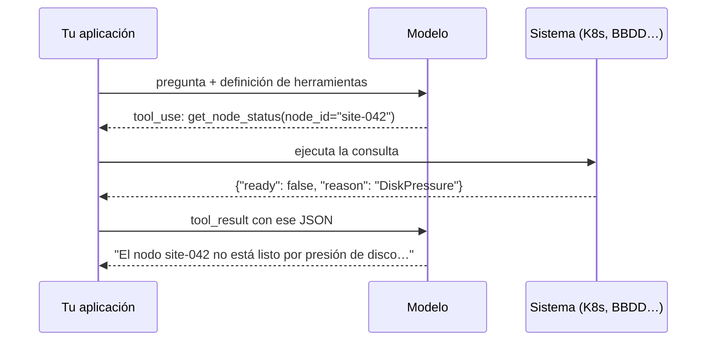
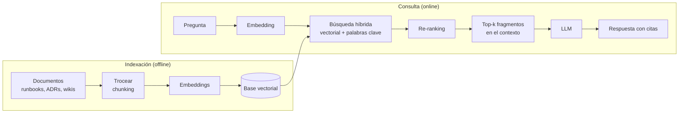

# Construir aplicaciones con LLMs <span class="nivel medio">Medio</span>

Integrar un LLM es fácil; hacerlo **fiable, barato y seguro** es ingeniería. Esta página cubre las piezas que
aparecen en casi cualquier sistema con IA.

!!! tip "Empieza por lo más simple"
    Una llamada bien diseñada resuelve la mayoría de casos. Sube a *workflows* (varias llamadas orquestadas por tu
    código) y solo después a [agentes](agentes.md), cuando la tarea sea abierta y el error sea recuperable.

## 1. Anatomía de una llamada

```python
import anthropic

client = anthropic.Anthropic()          # lee la clave de ANTHROPIC_API_KEY

response = client.messages.create(
    model="claude-opus-5",
    max_tokens=16000,
    system="Eres un asistente de operaciones de una plataforma GitOps en el edge. Responde en español.",
    messages=[
        {"role": "user", "content": "Resume este log de Flux y dime la causa probable:\n\n" + log},
    ],
)
print(response.content[0].text)
print(response.usage)                   # tokens de entrada y salida → coste
```

| Elemento | Para qué |
|---|---|
| `system` | Rol, contexto estable, reglas y formato. Es la parte que más conviene cachear |
| `messages` | Conversación alterna `user` / `assistant`. La API no guarda estado: **reenvías el historial** en cada llamada |
| `max_tokens` | Techo de salida; si se alcanza, la respuesta queda cortada (`stop_reason = "max_tokens"`) |
| `stop_reason` | Por qué terminó: fin natural, límite, llamada a herramienta, rechazo… **Compruébalo siempre** |

## 2. Prompting y context engineering { #context-engineering }

**Prompt engineering** es escribir buenas instrucciones. **Context engineering** es la disciplina más amplia de decidir
**qué información entra en la ventana de contexto** en cada paso: instrucciones, ejemplos, documentos, herramientas,
memoria e historial. En aplicaciones y agentes, esto determina la calidad más que ninguna otra cosa.

### Buenas prácticas de instrucciones

- **Contexto y propósito**: explica *para qué* es la tarea y quién la usará; el modelo decide mejor con el porqué.
- **Claridad sobre brevedad**: escribe como para un colega brillante que no conoce tu sistema.
- **Estructura**: separa instrucciones, datos y ejemplos (por ejemplo con etiquetas XML: `<log>…</log>`).
- **Ejemplos** (*few-shot*): 2-5 ejemplos variados del formato o criterio deseado.
- **Pide lo que quieres, no solo lo que no quieres**.
- **Deja espacio para razonar** en tareas complejas (o usa el modo de razonamiento del modelo).
- **Versiona los *prompts*** como código y evalúalos antes de cambiarlos.

```text
<contexto>
Plataforma GitOps con Flux en ~300 sitios edge. Los operadores de guardia leen tu respuesta en el móvil.
</contexto>

<tarea>
Analiza el log y responde con: causa probable (una frase), evidencia (líneas concretas del log) y
siguiente acción recomendada. Si el log no permite determinar la causa, dilo explícitamente.
</tarea>

<log>
{log}
</log>
```

### Principios de context engineering

| Principio | Cómo |
|---|---|
| **Mínimo contexto suficiente** | Solo lo relevante para este paso; el ruido degrada la calidad |
| **Estable primero, variable al final** | Maximiza la caché de *prompts* y reduce coste y latencia |
| **Recuperar bajo demanda** | RAG o herramientas de búsqueda en lugar de cargarlo todo |
| ***Progressive disclosure*** | Mostrar primero un índice o resumen; el detalle solo si hace falta (así funcionan las [Skills](agentes.md#agent-skills)) |
| **Aislar** | Subtareas en subagentes con su propio contexto, que devuelven solo el resultado |
| **Compactar** | Resumir historia antigua en conversaciones largas |

## 3. Salida estructurada

Para integrar la respuesta en un sistema, pide **JSON conforme a un esquema**. Las APIs actuales pueden
**garantizar** que la salida cumple el esquema (*structured outputs*), sin depender de que el modelo "lo intente".

```python
from pydantic import BaseModel

class Diagnosis(BaseModel):
    probable_cause: str
    evidence_lines: list[int]
    severity: str            # "low" | "medium" | "high"
    next_action: str
# El SDK valida la respuesta contra este modelo y devuelve un objeto tipado
```

## 4. Uso de herramientas (tool use / function calling)

Defines herramientas con nombre, descripción y esquema de entrada. El modelo **decide** cuándo llamarlas y con qué
argumentos; **tu código las ejecuta** y le devuelve el resultado.



```python
tools = [{
    "name": "get_node_status",
    "description": "Devuelve el estado de un nodo edge: condición Ready, motivo y últimas reconciliaciones de Flux. "
                   "Úsala cuando el usuario pregunte por la salud de un sitio o nodo concreto.",
    "input_schema": {
        "type": "object",
        "properties": {"node_id": {"type": "string", "description": "Identificador, p. ej. site-042"}},
        "required": ["node_id"],
    },
}]
```

!!! tip "Las descripciones son el prompt de la herramienta"
    Explica **qué hace, cuándo usarla y qué devuelve**. Nombres claros, pocos parámetros, errores útiles
    ("nodo no encontrado; los IDs tienen formato site-NNN"). Diseña herramientas como diseñarías una API para un
    compañero nuevo.

Además de tus herramientas, los proveedores ofrecen **herramientas de servidor** ya gestionadas: búsqueda web,
lectura de URLs, ejecución de código en un *sandbox*, memoria, etc.

## 5. RAG (Retrieval-Augmented Generation) { #rag }

Recuperar información relevante y dársela al modelo en el contexto, para responder sobre **datos propios o recientes**
con menos alucinaciones y con **citas**.



| Decisión | Opciones y consejos |
|---|---|
| **Troceado** (*chunking*) | Por estructura (secciones, funciones) mejor que por tamaño fijo; algo de solapamiento; guardar metadatos (fuente, fecha, permisos) |
| **Contexto del fragmento** | Añadir a cada trozo una frase que lo sitúe en su documento mejora mucho la recuperación |
| **Búsqueda** | **Híbrida**: vectorial (significado) + BM25 (términos exactos: IDs, nombres de error) |
| ***Re-ranking*** | Un modelo reordena los candidatos; mejora la precisión del top-k |
| **Permisos** | Filtrar por lo que el usuario puede ver **antes** de dárselo al modelo |
| **Frescura** | Reindexar incrementalmente; metadatos de fecha |
| **Alternativa agéntica** | Dar al agente herramientas de búsqueda (grep, SQL, API) y dejar que busque iterativamente |

```sql
-- pgvector: los 5 fragmentos más cercanos a la pregunta, filtrando por permisos
SELECT id, source, content
FROM chunks
WHERE tenant_id = :tenant
ORDER BY embedding <=> :query_embedding      -- distancia coseno
LIMIT 5;
```

### El troceado con un ejemplo

Un *runbook* de 3 páginas no se indexa entero (demasiado grande y con temas mezclados) ni frase a frase (se pierde el
contexto). Se divide por su estructura:

```text
Documento: runbooks/flux-troubleshooting.md

Fragmento 1 → "Runbook de Flux › Kustomization no lista › Síntomas"
Fragmento 2 → "Runbook de Flux › Kustomization no lista › Causas frecuentes: CRD que falta, dependsOn, errores de SOPS"
Fragmento 3 → "Runbook de Flux › Kustomization no lista › Pasos: flux get, flux logs, flux reconcile"
Fragmento 4 → "Runbook de Flux › Fuente no disponible › …"
```

- Cada fragmento lleva delante su **ruta de títulos**: así, aunque el fragmento 3 no diga "Flux", la búsqueda lo asocia.
- Tamaño típico: unos cientos de tokens por fragmento, con algo de solapamiento para no cortar ideas por la mitad.
- Metadatos junto al vector: fichero, sección, repositorio, fecha, equipo propietario y **quién puede verlo**.

### Por qué falla un RAG (y cómo detectarlo)

| Síntoma | Causa típica | Solución |
|---|---|---|
| No encuentra el documento correcto | Troceado malo, falta búsqueda por palabras exactas | Troceado por estructura, búsqueda híbrida, *re-ranking* |
| Encuentra el documento pero responde mal | Demasiados fragmentos irrelevantes en el contexto | Menos fragmentos y mejor ordenados; instrucciones de citar |
| Responde con información antigua | Índice desactualizado | Reindexado incremental en cada cambio |
| Muestra datos que el usuario no debería ver | Sin filtrado por permisos | Filtrar **antes** de la búsqueda |

Evalúa por separado la **recuperación** (¿estaba el fragmento correcto entre los recuperados?) y la **generación** (¿la
respuesta es correcta y fiel a los fragmentos?): así sabes qué parte arreglar.

## 6. Evaluación (evals)

Los LLMs no son deterministas y un cambio de *prompt* o de modelo puede mejorar un caso y romper otros.
**Sin evals no hay ingeniería, solo intuición.**

| Tipo de evaluación | Cómo | Para |
|---|---|---|
| **Basada en código** | Comprobaciones exactas: JSON válido, contiene la cifra correcta, los tests pasan | Todo lo verificable |
| **LLM como juez** | Otro modelo puntúa con una rúbrica clara | Calidad, tono, completitud |
| **Humana** | Expertos revisan una muestra | Calibrar al juez, casos críticos |

- Construye un **conjunto dorado** con casos reales, incluidos casos límite y ataques.
- Ejecuta las evals en **CI** ante cada cambio de *prompt*, modelo o herramienta (regresión).
- Mide también **coste y latencia por tarea**.
- En producción: trazas, *feedback* de usuarios y muestreo para ampliar el conjunto de evaluación.

## 7. Coste y latencia

| Palanca | Efecto |
|---|---|
| Caché de *prompts* | Gran ahorro en prefijos repetidos (sistema, herramientas, documentos) |
| Modelo adecuado | Modelos pequeños para clasificar o extraer; frontera para razonar |
| Nivel de esfuerzo | Menos razonamiento en tareas fáciles |
| *Streaming* | Mejor latencia percibida |
| Lotes (*batch*) | ~50 % más barato para trabajos diferidos |
| Limitar salida | Formatos concisos; `max_tokens` adecuado |
| Caché semántica propia | Reutilizar respuestas a preguntas equivalentes (con cuidado) |

### Streaming

Sin *streaming*, el usuario espera a que el modelo genere **toda** la respuesta (a veces decenas de segundos) antes de ver
nada. Con *streaming*, la API envía los tokens a medida que se generan (por *Server-Sent Events*) y la interfaz los
muestra al momento.

- Mejora mucho la **latencia percibida** (el primer texto aparece en uno o dos segundos), aunque el tiempo total sea igual.
- Evita *timeouts* en respuestas largas.
- Complica un poco el procesamiento: si la salida debe validarse (JSON, políticas), hay que esperar al final o validar por partes.
- Métricas a vigilar: **TTFT** (*time to first token*, tiempo hasta el primer token) y **tokens por segundo**.

## 8. Guardrails

- **Entrada**: validar tamaño, detectar intentos de *prompt injection*, filtrar datos sensibles (PII) antes de enviarlos.
- **Salida**: validar esquema, comprobar políticas, verificar citas, nunca ejecutar directamente código o SQL generado sin controles.
- **Acciones**: mínimo privilegio en herramientas, confirmación humana en operaciones irreversibles.

Ver [Seguridad, riesgos y regulación](seguridad.md).

## Preguntas de repaso

??? question "¿Por qué la API se considera sin estado y qué implica?"
    Cada petición debe incluir todo el contexto (historial, documentos, herramientas). La aplicación gestiona la
    memoria de la conversación, y el coste crece con el historial; de ahí la importancia de la caché y la compactación.

??? question "¿Cuándo RAG y cuándo ajuste fino (fine-tuning)?"
    RAG para **conocimiento** (hechos propios, actualizados, con citas y permisos). Ajuste fino para **comportamiento**
    (formato o estilo muy específico, tareas estrechas y de alto volumen). Casi siempre se empieza por *prompting* + RAG.

??? question "¿Por qué búsqueda híbrida y no solo vectorial?"
    Los *embeddings* capturan el significado pero fallan con términos exactos (códigos de error, IDs, nombres propios);
    BM25 los encuentra. Combinarlos mejora la recuperación.

??? question "¿Cómo pruebas un sistema cuyo resultado no es determinista?"
    Con evaluaciones sobre un conjunto de casos: comprobaciones automáticas donde se pueda, LLM como juez con rúbrica
    para el resto, métricas agregadas (tasa de acierto) y umbrales de regresión en CI.

## Ejercicios

!!! exercise "Ejercicio 1 · Básico — Mejorar un prompt"
    Reescribe este *prompt*: `"Analiza el log y dime qué pasa."`

    ??? success "Solución"
        ```text
        <contexto>
        Eres el asistente de guardia de una plataforma GitOps (Flux v2) con ~300 sitios edge. Quien lee tu respuesta es un
        operador en el móvil que necesita decidir en minutos si escala el incidente.
        </contexto>

        <tarea>
        Analiza el log de reconciliación y responde con:
        1. Causa probable (una frase).
        2. Evidencia: las líneas del log que la sustentan (cítalas).
        3. Siguiente acción recomendada.
        Si el log no permite determinar la causa, dilo y sugiere qué dato adicional revisar. No inventes información que no
        esté en el log.
        </tarea>

        <log>
        {log}
        </log>
        ```
        Mejoras: contexto y destinatario, formato de salida, qué hacer ante la incertidumbre, separación clara entre
        instrucciones y datos.

!!! exercise "Ejercicio 2 · Medio — Diseñar las herramientas de un asistente"
    Diseña 3 herramientas para un asistente que responde "¿por qué no se ha desplegado la versión X en el sitio Y?".
    Incluye nombre, descripción y parámetros.

    ??? success "Solución"
        ```json
        [
          { "name": "get_site_sync_status",
            "description": "Estado de reconciliación de Flux en un sitio: revisión aplicada, revisión esperada, Kustomizations no listas y su mensaje. Úsala primero para cualquier pregunta sobre despliegues de un sitio.",
            "input_schema": { "type": "object", "properties": { "site_id": { "type": "string", "description": "Formato site-NNN" } }, "required": ["site_id"] } },
          { "name": "get_rollout_ring",
            "description": "Anillo de despliegue al que pertenece un sitio y versión fijada en ese anillo. Úsala para saber si la versión X debería haber llegado ya al sitio.",
            "input_schema": { "type": "object", "properties": { "site_id": { "type": "string" } }, "required": ["site_id"] } },
          { "name": "get_recent_events",
            "description": "Últimos eventos de Flux y Kubernetes del sitio (máx. 50), ordenados del más reciente al más antiguo. Úsala cuando get_site_sync_status muestre un error.",
            "input_schema": { "type": "object", "properties": { "site_id": { "type": "string" }, "since_minutes": { "type": "integer", "default": 60 } }, "required": ["site_id"] } }
        ]
        ```
        Todas de solo lectura, con descripciones que dicen **cuándo** usarlas, y resultados acotados (máximo de eventos).

!!! exercise "Ejercicio 3 · Medio — Construir una evaluación"
    Para el asistente anterior, define un conjunto de evaluación: tipos de casos, cómo se puntúa y cuándo se ejecuta.

    ??? success "Solución"
        - **Casos** (30-50): sitio sincronizado (respuesta: "ya tiene la versión"); sitio en un anillo que aún no ha recibido
          la versión; Kustomization fallando por un CRD que falta; sitio desconectado; ID de sitio inexistente; pregunta
          ambigua; y casos adversarios (instrucciones inyectadas en los mensajes de eventos).
        - **Puntuación**: comprobaciones automáticas (¿llamó a `get_site_sync_status`?, ¿menciona la causa correcta?, ¿no
          inventa IDs?) + LLM como juez con rúbrica (claridad, acción correcta) calibrado con una muestra revisada por humanos.
        - **Cuándo**: en CI ante cada cambio de *prompt*, herramientas o modelo, con umbral mínimo de acierto; y muestreo
          semanal de conversaciones reales para añadir casos nuevos.

!!! exercise "Ejercicio 4 · Avanzado — RAG sobre la documentación de la plataforma"
    Diseña un RAG sobre READMEs, ADRs y *runbooks* de 40 repositorios. Decide troceado, búsqueda, permisos y actualización.

    ??? success "Solución"
        - **Troceado por estructura**: por secciones Markdown (títulos `##`), con el título del documento y la ruta de la
          sección añadidos a cada fragmento como contexto; metadatos: repositorio, ruta, fecha del commit, equipo propietario.
        - **Búsqueda híbrida**: vectorial (pgvector) + BM25 (para términos exactos como `HelmRelease` o `ADR-007`) y
          *re-ranking* de los 20 mejores para quedarse con 5.
        - **Permisos**: filtrar por los repositorios que el usuario puede leer **antes** de pasar nada al modelo.
        - **Actualización**: un *webhook* en cada *push* a `main` reindexa solo los ficheros cambiados; borrar los fragmentos de ficheros eliminados.
        - **Respuesta**: con citas (enlace al fichero y sección); si no hay fragmentos relevantes, decir que no se sabe.
        - **Evaluación**: preguntas reales con la respuesta y el documento esperados; medir tanto la recuperación (¿trajo el
          documento correcto?) como la respuesta.
