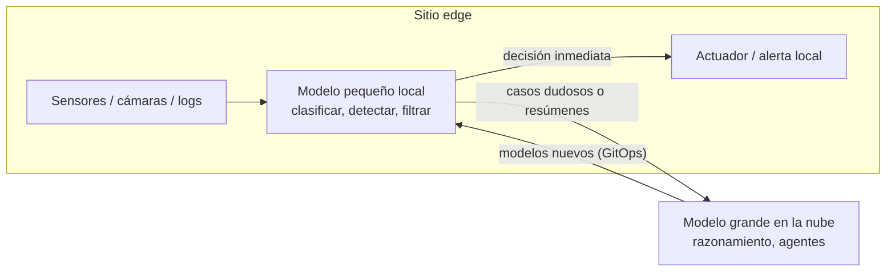

# IA en el edge <span class="nivel avanzado">Avanzado</span>

Ejecutar inferencia **en el propio sitio** (tienda, fábrica, vehículo, antena) en lugar de en la nube. Une dos áreas:
[edge computing](../plataforma/edge.md) y modelos de IA.

## ¿Por qué en el edge?

| Motivo | Ejemplo |
|---|---|
| **Latencia** | Inspección visual en una línea de producción: decisiones en milisegundos |
| **Ancho de banda y coste** | Analizar vídeo localmente y enviar solo eventos, no el flujo completo |
| **Autonomía** | Seguir funcionando sin conexión |
| **Privacidad y soberanía** | Imágenes o audio que no deben salir del sitio |

## Opciones de arquitectura



| Patrón | Descripción |
|---|---|
| **Todo local** | Modelo completo en el sitio; la nube solo distribuye versiones |
| **Cascada edge → nube** | Modelo pequeño decide lo fácil; lo dudoso (baja confianza) sube a un modelo grande |
| **Preprocesado local** | El edge filtra, anonimiza y resume; la nube analiza |
| **Aprendizaje federado** | Cada sitio entrena con sus datos y solo comparte actualizaciones del modelo, no datos |

## Qué modelos caben

| Tipo | Ejemplos de uso | Tamaño típico |
|---|---|---|
| Visión (detección, clasificación) | Defectos, ocupación, seguridad | Decenas de MB |
| Anomalías sobre series temporales | Predicción de fallos de equipos | Muy pequeño |
| SLM (modelos de lenguaje pequeños) | Asistente local, resumir logs, lenguaje natural sin conexión | 1-8 000 M parámetros cuantizados (1-5 GB) |
| Voz | Transcripción local | Cientos de MB |

Técnicas para que quepan: **cuantización**, **poda**, **destilación**, formatos y runtimes optimizados.

## Runtimes y hardware

| Runtime | Para |
|---|---|
| **ONNX Runtime** | Modelos exportados desde cualquier framework, en CPU/GPU/NPU |
| **TensorRT** | Máximo rendimiento en GPUs NVIDIA (Jetson) |
| **OpenVINO** | CPUs, GPUs y NPUs de Intel |
| **TensorFlow Lite / LiteRT** | Móviles y microcontroladores |
| **llama.cpp / Ollama** | LLMs pequeños en CPU, Apple Silicon o GPUs modestas |

| Hardware | Notas |
|---|---|
| NVIDIA Jetson | GPU embebida, visión y modelos medianos |
| NPUs en CPUs modernas | Inferencia eficiente en PCs industriales |
| Aceleradores USB/PCIe (Coral, Hailo) | Visión con muy bajo consumo |
| Servidores edge con GPU | Varios flujos de vídeo o LLMs medianos |

## Operar modelos en una flota edge con GitOps

Los mismos principios que para las aplicaciones:

- **Modelos como artefactos OCI** firmados en el registro; el manifiesto referencia la versión por *digest*.
- **Flux** reconcilia en cada sitio la versión declarada; el **rollout por anillos** también aplica a modelos.
- **Caché local** del registro para no descargar varios GB en cada sitio a la vez.
- **Hardware heterogéneo**: *overlays* de Kustomize por tipo de dispositivo (con o sin GPU, runtime distinto).
- **Telemetría de calidad**: distribución de predicciones y confianza por sitio para detectar **deriva** local.
- **Rollback** inmediato: revertir la versión del modelo en Git.

```yaml
# Overlay para sitios con GPU: misma app, runtime y modelo optimizados
apiVersion: kustomize.config.k8s.io/v1beta1
kind: Kustomization
resources: [../../base]
patches:
  - target: { kind: Deployment, name: defect-detector }
    patch: |-
      - op: replace
        path: /spec/template/spec/containers/0/image
        value: registry.acme.com/defect-detector-tensorrt@sha256:3f1a…
      - op: add
        path: /spec/template/spec/containers/0/resources/limits/nvidia.com~1gpu
        value: "1"
```

## Preguntas de repaso

??? question "¿Qué ventaja tiene la cascada edge → nube?"
    Resuelve localmente, rápido y barato, la mayoría de casos; solo los dudosos consumen ancho de banda y un modelo grande.
    Equilibra latencia, coste y calidad.

??? question "¿Qué es el aprendizaje federado y qué problema resuelve?"
    Entrenar un modelo con datos repartidos en muchos sitios sin centralizarlos: cada sitio entrena localmente y envía solo
    los cambios del modelo, que se agregan. Resuelve privacidad y ancho de banda.

??? question "¿Cómo detectarías que un modelo funciona peor en un sitio concreto?"
    Monitorizando por sitio la distribución de entradas y de predicciones y la confianza media, y comparándolas con la
    referencia de entrenamiento y con otros sitios (deriva local).

## Ejercicios

!!! exercise "Ejercicio 1 · Básico — ¿Edge o nube?"
    Decide dónde ejecutar la inferencia: (a) detectar defectos en una cinta que avanza a 2 m/s; (b) generar el informe
    semanal de incidencias de la flota; (c) transcribir las notas de voz de los técnicos en fábricas sin buena cobertura.

    ??? success "Solución"
        (a) **Edge**: la decisión debe tomarse en milisegundos y no puede depender de la red. (b) **Nube**: no hay urgencia y
        se beneficia de un modelo grande con todos los datos. (c) **Edge** (modelo de voz pequeño en el dispositivo o en el
        servidor local), sincronizando el texto cuando haya conexión.

!!! exercise "Ejercicio 2 · Medio — Distribuir un modelo con GitOps"
    Diseña cómo desplegar la versión 2 de un modelo de visión (400 MB) a 3 000 sitios con hardware heterogéneo
    (con y sin GPU), con posibilidad de volver atrás.

    ??? success "Solución"
        - Publicar **dos artefactos OCI firmados** por versión: `defect-detector-model:2.0-tensorrt` (GPU) y `:2.0-onnx` (CPU).
        - En Git, la base declara la versión del modelo y los *overlays* por tipo de hardware eligen el artefacto.
        - Despliegue **por anillos** cambiando la versión en la carpeta de cada anillo; criterios para avanzar: tasa de
          detección y de falsos positivos por sitio similar o mejor que la v1 (medido en paralelo si es posible).
        - Precarga del artefacto en el *registry mirror* local fuera de horario.
        - *Rollback*: `git revert` de la versión en el anillo; el artefacto v1 sigue en la caché local, así que la vuelta atrás es inmediata.
