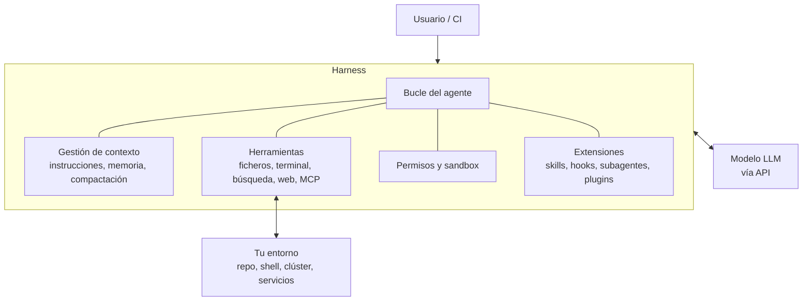
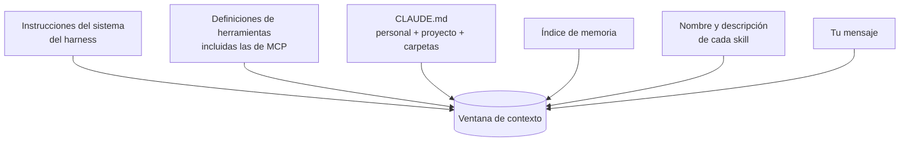

# Harnesses y agentes de código <span class="nivel avanzado">Avanzado</span>

## 1. ¿Qué es un harness?

El **modelo** aporta la inteligencia; el ***harness*** (arnés) es todo el software que lo convierte en un agente útil:



| Componente | Responsabilidad |
|---|---|
| **Bucle** | Enviar contexto al modelo, ejecutar las herramientas que pide, devolver resultados, repetir |
| **Herramientas** | Leer y editar ficheros, ejecutar comandos, buscar, navegar, conectarse a MCP |
| **Contexto** | Cargar instrucciones del proyecto, memoria, skills; compactar cuando se llena |
| **Permisos** | Qué puede hacer sin preguntar, qué requiere aprobación, qué está prohibido; *sandbox* |
| **Extensiones** | Puntos de personalización del comportamiento |
| **Interfaz** | Terminal, IDE, web, escritorio, modo *headless* para CI |

!!! tip "Mismo modelo, resultados distintos"
    La calidad de un agente depende tanto del *harness* como del modelo: qué herramientas tiene, cómo gestiona el contexto,
    y cuánto conocimiento del proyecto recibe. Por eso invertir en `CLAUDE.md`, skills y hooks tiene tanto retorno.

## 2. Panorama de harnesses de código

| Herramienta | Tipo | Notas |
|---|---|---|
| **Claude Code** (Anthropic) | CLI, extensiones de IDE (VS Code, JetBrains), escritorio, web | Muy extensible: CLAUDE.md, skills, hooks, subagentes, plugins, MCP. También como librería: **Claude Agent SDK** |
| **Codex** (OpenAI) | CLI, IDE, nube | Usa `AGENTS.md` para instrucciones del proyecto |
| **Gemini CLI** (Google) | CLI de código abierto | `GEMINI.md`, extensiones, MCP |
| **GitHub Copilot** | IDE (modo agente) y agente en la nube que abre PRs | Integrado en GitHub |
| **Cursor, Windsurf** | IDEs basados en VS Code con agente | Reglas de proyecto propias |
| **Cline, Roo, Aider, OpenCode, goose, Amp** | Código abierto / CLI / extensiones | Varios soportan múltiples proveedores de modelos |

`AGENTS.md` (cedido a la Linux Foundation en 2025) es la convención abierta para instrucciones de proyecto que leen
muchos agentes; Claude Code usa `CLAUDE.md`, que puede importar otros ficheros.

## 3. Claude Code a fondo

### Mapa de extensiones

| Mecanismo | Dónde vive | Qué aporta | Se carga |
|---|---|---|---|
| **CLAUDE.md** | `~/.claude/CLAUDE.md` (personal), `./CLAUDE.md` (proyecto, en Git), subcarpetas | Instrucciones y convenciones permanentes | Siempre, al inicio |
| **Memoria automática** | Carpeta de memoria del proyecto | Hechos aprendidos entre sesiones (preferencias, decisiones) | Índice al inicio |
| **Skills** | `.claude/skills/<nombre>/SKILL.md` (o `~/.claude/skills/`) | Procedimientos y conocimiento especializado; invocables como `/nombre` (los antiguos comandos de `.claude/commands/` se han fusionado con las skills) | Metadatos al inicio; cuerpo bajo demanda |
| **Subagentes** | `.claude/agents/<nombre>.md` | Agentes especializados con contexto, herramientas y modelo propios | Cuando se delega |
| **Hooks** | `settings.json` | Comandos **deterministas** en eventos del ciclo de vida | En cada evento |
| **Servidores MCP** | `.mcp.json` (proyecto) o configuración de usuario | Herramientas externas | Al inicio (con carga diferida de herramientas si son muchas) |
| **Plugins** | *Marketplaces* | Paquetes que agrupan skills, agentes, hooks y servidores MCP | Al instalarlos |
| **Settings** | `~/.claude/settings.json`, `.claude/settings.json`, `.claude/settings.local.json` | Permisos, variables de entorno, hooks, modelo | Siempre |

!!! tip "¿Qué uso para qué?"
    **Siempre relevante y breve** → CLAUDE.md. **Procedimiento para ciertas tareas** → skill.
    **Tiene que ocurrir sí o sí** (formatear, validar, bloquear) → hook: el modelo puede olvidar una instrucción; un hook no.
    **Exploración que ensucia el contexto** → subagente. **Acceso a un sistema externo** → MCP.

### CLAUDE.md

```markdown
# cac-gitops-platform

Repositorio GitOps (Flux v2 + Kustomize) que define la plataforma de todos los clústeres.

## Estructura
- `clusters/<cluster>/` punto de entrada que Flux sincroniza por clúster
- `infrastructure/` controladores, namespaces y políticas comunes
- Las apps se añaden en `clusters/<cluster>/apps/` referenciando overlays

## Reglas
- Nunca secretos en claro: usar SOPS (`.sops.yaml` en la raíz)
- Tras editar YAML: `kustomize build clusters/kind-dev | kubeconform -strict -summary -`
- Cambios de `infrastructure/` afectan a todos los clústeres: explícalo en la descripción del PR

## Por qué
- Flux por clúster (pull) y no Argo central: los sitios edge tienen conectividad intermitente (ver docs/adr/007)
```

Buenas prácticas: corto y específico; lo que **no** se deduce leyendo el código (comandos, convenciones, porqués,
trampas); actualízalo cuando el agente se equivoque dos veces en lo mismo.

### Hooks

Un **hook** es una acción **determinista** que el *harness* ejecuta automáticamente cuando ocurre un evento. La
configuración tiene tres niveles: el **evento**, un ***matcher*** que filtra (por ejemplo, qué herramienta: `Edit|Write`)
y los **manejadores** que se ejecutan.

| Grupo | Eventos principales |
|---|---|
| Sesión | `SessionStart`, `SessionEnd` |
| Turno | `UserPromptSubmit` (antes de procesar lo que escribes), `Stop` (cuando el agente termina) |
| Herramientas | `PreToolUse` (antes: puede **bloquear**), `PostToolUse` (después), `PostToolUseFailure`, `PermissionRequest` |
| Subagentes y contexto | `SubagentStart`, `SubagentStop`, `PreCompact`, `PostCompact` |
| Otros | `Notification`, `FileChanged`, `ConfigChange`, `InstructionsLoaded`… (consulta la documentación: la lista crece) |

| Tipo de manejador | Qué hace |
|---|---|
| `command` | Ejecuta un comando o script (el más habitual) |
| `http` | Envía el evento por POST a un *endpoint* |
| `mcp_tool` | Llama a una herramienta de un servidor MCP |
| `prompt` | Pide a un modelo que evalúe el evento |
| `agent` | Lanza un subagente para verificar algo |

El manejador recibe un JSON por la entrada estándar (con `hook_event_name`, `tool_name`, `tool_input`, `cwd`…). En
`PreToolUse`, salir con código **2** **bloquea** la herramienta y el texto de error llega al modelo como explicación; ese
bloqueo no se puede anular desde la salida JSON. Con código 0 sigue el flujo normal de permisos.

```json
{
  "hooks": {
    "PostToolUse": [
      {
        "matcher": "Edit|Write",
        "hooks": [{ "type": "command", "command": "kustomize build clusters/kind-dev > /dev/null" }]
      }
    ],
    "PreToolUse": [
      {
        "matcher": "Edit|Write",
        "hooks": [{ "type": "command", "command": "python .claude/hooks/block_plain_secrets.py" }]
      }
    ]
  }
}
```

```python
# .claude/hooks/block_plain_secrets.py — impide escribir Secrets de Kubernetes sin cifrar
import json, sys

event = json.load(sys.stdin)
content = event.get("tool_input", {}).get("content", "") or event.get("tool_input", {}).get("new_string", "")
if "kind: Secret" in content and "sops:" not in content:
    print("Secret sin cifrar: cifra el fichero con SOPS antes de guardarlo.", file=sys.stderr)
    sys.exit(2)          # bloquea la herramienta y explica el motivo al modelo
```

### Subagentes

```markdown
---
name: manifest-reviewer
description: Revisa manifiestos de Kubernetes, Kustomize y Flux en busca de errores, riesgos de seguridad
  y desviaciones de las convenciones. Úsalo después de modificar YAML en clusters/ o infrastructure/.
tools: Read, Grep, Glob, Bash
model: sonnet
---

Eres un revisor de plataforma. Para cada cambio comprueba: que `kustomize build` funciona, límites de
recursos, `prune` y `dependsOn` correctos, ausencia de secretos en claro e impacto en todos los clústeres.
Devuelve una lista priorizada de hallazgos con fichero y línea. No edites ficheros.
```

El subagente trabaja en su **propia ventana de contexto** y devuelve solo el informe: el agente principal no se
llena con todo lo que ha leído. Se guardan en `.claude/agents/` (proyecto) o `~/.claude/agents/` (personal). Solo `name`
y `description` son obligatorios; otros campos útiles:

| Campo | Para qué |
|---|---|
| `tools` / `disallowedTools` | Qué herramientas puede usar (si se omite, hereda todas) |
| `model` | `haiku`, `sonnet`, `opus`, `fable`, un ID concreto o `inherit` |
| `permissionMode` | Modo de permisos propio del subagente |
| `maxTurns` / `effort` | Límite de pasos y nivel de razonamiento |
| `skills` / `mcpServers` / `hooks` | Skills precargadas, servidores MCP y hooks propios |
| `isolation: worktree` | Trabajar en un *worktree* de Git aislado |

### Permisos y modos

| Modo | Comportamiento |
|---|---|
| Por defecto | Pide aprobación para editar ficheros y ejecutar comandos no permitidos |
| Aceptar ediciones | Edita sin preguntar; los comandos siguen necesitando aprobación |
| **Plan** | Solo lee e investiga; propone un plan antes de tocar nada |
| **Auto** | Actúa con autonomía dentro de límites de seguridad y confirma lo arriesgado |
| No preguntar (*dontAsk*) | Solo usa lo que ya está permitido en la configuración; lo demás se deniega sin preguntar |
| Sin permisos (*bypass*) | Todo permitido: solo en entornos aislados y desechables |

```json
{
  "permissions": {
    "allow": ["Bash(kustomize build:*)", "Bash(git status)", "Bash(git diff:*)"],
    "deny":  ["Bash(kubectl delete:*)", "Read(./.env)", "Read(./secrets/**)"]
  }
}
```

### Otros usos

- **Headless / CI**: `claude -p "revisa este PR y comenta los riesgos"` en un *pipeline*; integración con GitHub Actions.
- **Claude Agent SDK**: el mismo *harness* como librería (Python/TypeScript) para construir tus propios agentes con
  herramientas de ficheros, terminal y búsqueda, hooks, subagentes y permisos.
- **Sesiones en la nube y en paralelo**: varias tareas a la vez en *worktrees* o entornos remotos.

### Cómo gestiona el contexto un harness

Lo que el modelo "ve" al empezar una sesión en Claude Code no es solo tu mensaje:



A medida que trabaja, se añaden los ficheros que lee, las salidas de los comandos y sus propias respuestas. Cuando la
ventana se acerca a su límite, el *harness* **compacta**: resume la conversación anterior y continúa con ese resumen.

Consecuencias prácticas:

- Un `CLAUDE.md` enorme se paga en **todas** las sesiones: mantenlo breve y mueve lo detallado a skills.
- Pedir al agente que lea un fichero de 20 000 líneas llena el contexto: mejor que busque (`grep`) o delegar en un subagente.
- En tareas largas, pide que guarde el **plan y el progreso** en un fichero: sobrevive a las compactaciones.
- Empezar una sesión nueva para una tarea nueva evita arrastrar contexto irrelevante.

## 4. Buenas prácticas de desarrollo asistido por agentes

| Práctica | Por qué |
|---|---|
| **Explorar → planificar → implementar → verificar** | Pedir primero que lea y proponga un plan (modo plan) evita soluciones precipitadas |
| **Dar la forma de verificarse** | Tests, *linters*, `kustomize build`, capturas: un agente que puede comprobar su trabajo itera solo hasta que funciona |
| **Especificación antes que código** (*spec-driven*) | En tareas grandes, acordar requisitos y diseño en un documento que el agente sigue |
| **Contexto del proyecto versionado** | CLAUDE.md, skills y hooks en Git: todo el equipo (y el CI) se beneficia |
| **Tareas acotadas y revisables** | *Diffs* pequeños; PRs revisados por humanos como cualquier otro |
| **Tú sigues siendo el responsable** | El agente propone; la responsabilidad del código que se fusiona es de quien lo aprueba |
| **Seguridad** | Mínimo privilegio, sin credenciales de producción en la máquina del agente, *sandbox* para modos autónomos, cuidado con el contenido no confiable (issues, webs) que lee el agente |
| **Medir** | *Lead time*, tasa de defectos, retrabajo: si la calidad baja, ajustar el proceso, no solo el *prompt* |

!!! tip "Para un arquitecto, el cambio de rol"
    Con agentes, el cuello de botella pasa de **escribir código** a **especificar bien, dar contexto y verificar**.
    Las habilidades de arquitectura (límites claros, ADRs, *fitness functions*, tests como contrato) son justo las que
    hacen que los agentes funcionen bien en un código base.

## Preguntas de repaso

??? question "¿Qué diferencia hay entre un modelo y un harness?"
    El modelo genera texto y decide acciones; el *harness* ejecuta el bucle, proporciona herramientas, gestiona el
    contexto y los permisos, y conecta con tu entorno. Claude Code es un *harness*; Claude Opus o Sonnet son modelos.

??? question "¿Por qué un hook y no una instrucción en CLAUDE.md para validar YAML?"
    Una instrucción es una petición que el modelo puede olvidar u omitir; el hook es **determinista**: se ejecuta
    siempre en el evento y puede bloquear la acción.

??? question "¿Qué pondrías en una skill y qué en CLAUDE.md?"
    En CLAUDE.md, lo breve y relevante en casi toda sesión (estructura, comandos, reglas). En una skill, procedimientos
    largos o específicos de ciertas tareas (desplegar, auditar seguridad, medir rendimiento), que solo se cargan cuando hacen falta.

??? question "¿Qué riesgo introduce darle a un agente acceso a issues públicos y a la terminal?"
    *Prompt injection*: un texto malicioso en el issue puede intentar que el agente ejecute comandos o filtre datos.
    Mitigación: permisos restrictivos, *sandbox*, sin secretos accesibles y aprobación humana para acciones sensibles.

## Ejercicios

!!! exercise "Ejercicio 1 · Básico — ¿Dónde va cada cosa?"
    Decide si va en `CLAUDE.md`, una skill, un hook, un subagente o un servidor MCP: (a) "usamos Conventional Commits";
    (b) formatear con `spotless` cada vez que se edita un fichero Java; (c) procedimiento de 40 pasos para migrar un servicio
    a Spring Boot 4; (d) consultar incidentes en PagerDuty; (e) revisar a fondo los cambios de seguridad de una PR.

    ??? success "Solución"
        (a) **CLAUDE.md**: breve y relevante siempre. (b) **Hook** `PostToolUse` sobre `Edit|Write`: debe ocurrir siempre.
        (c) **Skill**: procedimiento largo que solo se carga cuando toca. (d) **Servidor MCP**: acceso a un sistema externo.
        (e) **Subagente** revisor: tarea con mucho contexto que conviene aislar y que devuelve solo el informe.

!!! exercise "Ejercicio 2 · Medio — Hook de protección"
    Escribe un hook `PreToolUse` que impida al agente ejecutar `kubectl` contra cualquier contexto cuyo nombre contenga `prod`.

    ??? success "Solución"
        ```json
        {
          "hooks": {
            "PreToolUse": [
              { "matcher": "Bash",
                "hooks": [{ "type": "command", "command": "python .claude/hooks/no_prod_kubectl.py" }] }
            ]
          }
        }
        ```
        ```python
        # .claude/hooks/no_prod_kubectl.py
        import json, subprocess, sys

        event = json.load(sys.stdin)
        command = event.get("tool_input", {}).get("command", "")
        if "kubectl" in command:
            ctx = subprocess.run(["kubectl", "config", "current-context"], capture_output=True, text=True).stdout
            if "prod" in ctx or "--context" in command and "prod" in command:
                print(f"Bloqueado: kubectl contra un contexto de producción ({ctx.strip()}).", file=sys.stderr)
                sys.exit(2)   # bloquea la herramienta y el motivo llega al modelo
        ```
        Complemento necesario: que la máquina donde trabaja el agente **no tenga** credenciales de producción. El hook es
        una red de seguridad, no el control principal.

!!! exercise "Ejercicio 3 · Avanzado — Adoptar agentes en un equipo"
    Tu equipo de plataforma (8 personas) quiere empezar a usar agentes de código. Propón un plan de adopción de 3 meses
    con salvaguardas y métricas.

    ??? success "Solución"
        - **Mes 1 — base**: `CLAUDE.md` en los repositorios principales (estructura, comandos, reglas), hooks de validación
          (`kustomize build`, *linters*), permisos restrictivos compartidos en `.claude/settings.json`, sin credenciales de
          producción en los portátiles. Uso en tareas acotadas: tests, *refactors*, documentación.
        - **Mes 2 — ampliación**: skills para los procedimientos repetitivos (alta de apps, alta de sitios), subagente revisor
          de manifiestos, servidor MCP de solo lectura de la flota. Revisión humana de todas las PRs como hasta ahora.
        - **Mes 3 — medición y ajuste**: comparar con la línea base *lead time*, tasa de PRs rechazadas o revertidas,
          defectos en producción, tiempo de revisión; retrospectiva sobre qué tareas funcionan bien y cuáles no.
        Salvaguardas en todo momento: el agente propone y la persona que aprueba es responsable; tareas pequeñas; el CI es el árbitro.
