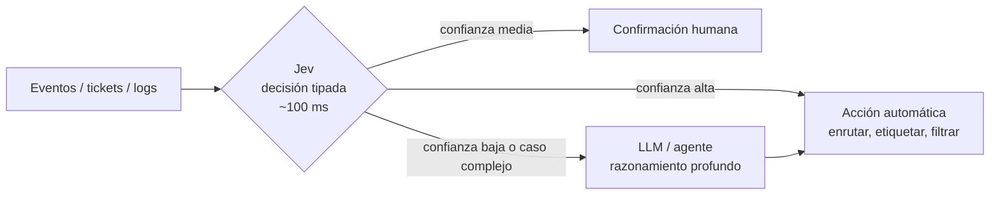

# Jev y los modelos "System One" <span class="nivel medio">Medio</span>

!!! warning "Novedad de septiembre de 2026"
    Jev se lanzó el **15 de septiembre de 2026** en acceso anticipado limitado. Las cifras de rendimiento y precio
    son **del propio fabricante** y no hay aún evaluaciones independientes publicadas. Revisa las
    [fuentes](#fuentes) antes de tomar decisiones.

**Jev** es un modelo de IA propietario de **TypeSafe AI**, empresa de San Francisco fundada en 2024 por Diogo Almeida
(CEO; unos cuatro años en OpenAI trabajando en RLHF, InstructGPT, ChatGPT y GPT-4), Erik Gafni y Sasha Sheng.
Salió de modo sigiloso con una ronda semilla de **40 M$** liderada por DCVC.

Su idea central: **no genera texto**. Recibe estado no estructurado y devuelve **valores tipados con probabilidades
calibradas y un nivel de confianza**, pensados para que los consuma **software**, no una persona.

## ¿Qué es un modelo "System One"?

El nombre viene de la distinción de Daniel Kahneman entre **Sistema 1** (pensamiento rápido e intuitivo) y
**Sistema 2** (lento y deliberado). TypeSafe posiciona:

| | LLM (Sistema 2) | Modelo System One (Jev) |
|---|---|---|
| Salida | Texto libre, token a token | Valores tipados según un esquema, con probabilidades y confianza |
| Pensado para | Personas y agentes: razonar, redactar, programar | Código: decisiones rápidas dentro de un programa |
| Latencia | Segundos (o minutos) | 70-500 ms de extremo a extremo (≈ 100 ms típico) |
| Errores de formato | Posibles (salvo salida estructurada garantizada) | Imposibles por diseño: siempre devuelve un valor del tipo pedido |
| Coste (según el fabricante) | Referencia | 40-400 veces más barato en sus pruebas |

El nombre "Jev" viene del economista **William Stanley Jevons** y su paradoja: cuando algo se vuelve mucho más
eficiente, su consumo total **aumenta**. La apuesta es que decisiones con IA casi gratis y en milisegundos se usarán
en todas partes del código.

## Cómo funciona

- Arquitectura basada en *transformer*, con un muestreador **paralelo** (no genera token a token).
- Entrenado con datos sintéticos mediante **RLCD** (*Reinforcement Learning for Calibrated Decisions*): optimiza
  que las probabilidades coincidan con los resultados reales (**calibración**), no la preferencia humana.
- Pesos, arquitectura detallada y *paper* técnico **no publicados**.

### Los tres tipos de pregunta

| Tipo | Para | Devuelve |
|---|---|---|
| **Noul** | Juicio sí/no | Una probabilidad entre 0 y 1 |
| **Choice** | Elegir una opción entre varias definidas | La opción, la probabilidad de cada una y la confianza |
| **Score** | Situar algo en una escala ordenada | Puntuación ponderada, probabilidad por nivel y confianza |

Petición (`POST https://api.typesafe.ai/v1/systemone`, con `Authorization: Bearer <API_KEY>`):

```json
{
  "model": "jev-latest",
  "state": { "ticket": "Desde la actualización de anoche, el nodo site-042 no reconcilia y el dashboard sale en blanco" },
  "questions": {
    "team": {
      "type": "choice",
      "instructions": "¿Qué equipo debe atender `ticket`?",
      "criteria": { "platform": "Clústeres, Flux, despliegues", "frontend": "Interfaz y dashboards", "billing": "Facturación" }
    },
    "severity": {
      "type": "score",
      "instructions": "¿Gravedad del problema en `ticket`?",
      "criteria": ["Cosmético", "Funcionalidad rota con alternativa", "Bloqueante sin alternativa"]
    },
    "is_regression": { "type": "noul", "instructions": "¿`ticket` indica que empezó tras un cambio reciente?" }
  }
}
```

```json
{
  "model": "jev-1.13.0",
  "answers": {
    "team":          { "type": "choice", "choice": "platform", "probabilities": { "platform": 0.81, "frontend": 0.17, "billing": 0.02 }, "confidence": 0.78 },
    "severity":      { "type": "score", "score": 1.62, "probabilities": { "0": 0.05, "1": 0.28, "2": 0.67 }, "confidence": 0.52 },
    "is_regression": { "type": "noul", "noul": 0.94 }
  },
  "usage": { "input_tokens": 240, "output_tokens": 35 }
}
```

(Ejemplo ilustrativo construido con el formato de la API; los números de la respuesta son inventados.)

Hay SDKs para JavaScript/TypeScript (`@typesafe-ai/sdk`) y Python (`typesafe_sdk`), e integración con el Vercel AI SDK.

## Precio y límites anunciados

| Concepto | Valor anunciado |
|---|---|
| Entrada | 0,042 $ por millón de tokens |
| Salida | Gratis |
| Latencia | 70-500 ms de extremo a extremo |
| Límites de uso | 250 000 tokens/s y 1 200 peticiones/min |
| Opciones por decisión | Hasta 255 en una decisión de una sola etapa |
| Modalidades | Texto (sin imágenes por ahora) |

## Patrones de uso

| Patrón | Idea |
|---|---|
| **"If" inteligente** | Sustituir reglas frágiles (regex, listas de palabras) por un juicio semántico dentro del flujo del programa |
| ***Fan-out* especulativo** | Hacer todas las preguntas independientes en **una** llamada: más rápido y barato que en secuencia |
| **Umbral de confianza** | < 0,5 → a un humano · 0,5-0,9 → pedir confirmación · > 0,9 → actuar automáticamente |
| **Puntuación compuesta** | Varias preguntas simples de tipo *score* combinadas con pesos **en tu código**, en lugar de una pregunta compleja |
| ***Map-reduce*** | Clasificar o filtrar grandes volúmenes (logs, tickets, eventos) a coste muy bajo |
| **Guardarraíl de LLMs** | Verificar rápidamente la salida de un LLM (¿cumple la política?, ¿responde a la pregunta?) |

## Lo que no hace bien

Según las guías publicadas por desarrolladores con acceso anticipado: **contar**, **comparar fechas**, **aritmética**,
**razonamiento de varios saltos** y, por definición, **generar texto**. La regla: el modelo juzga; **los cálculos y la
lógica exacta, en tu código**.

## Dónde encaja en una arquitectura



Una arquitectura en **cascada** usa el modelo rápido y barato para la gran mayoría de decisiones simples y escala al
LLM (o a una persona) solo cuando la confianza es baja o la tarea requiere razonar o redactar. Es el mismo principio
que el enrutado por modelos de la página de [agentes](agentes.md#2-patrones-de-workflow).

!!! tip "Cómo evaluarlo antes de adoptarlo"
    Toma 200-500 casos reales etiquetados, compara con tu solución actual (reglas o LLM) en **acierto, calibración**
    (¿cuando dice 0,9, acierta el 90 % de las veces?), **latencia y coste**, y ten en cuenta los riesgos de un
    proveedor recién nacido: disponibilidad, continuidad del servicio, *lock-in* y tratamiento de datos.

## Preguntas de repaso

??? question "¿En qué se diferencia la salida de Jev de la salida estructurada de un LLM?"
    Un LLM con salida estructurada genera texto que se ajusta a un esquema, token a token. Jev devuelve directamente
    valores de un conjunto cerrado junto con una **distribución de probabilidad calibrada**, en una sola pasada y en milisegundos.

??? question "¿Qué significa que un modelo esté calibrado y por qué importa?"
    Que sus probabilidades se corresponden con la frecuencia real de acierto. Permite fijar umbrales fiables para
    decidir qué se automatiza y qué se revisa, y calcular el riesgo esperado.

??? question "¿Qué tarea NO le darías a Jev?"
    Cualquier cosa que requiera generar texto, contar, operar con números o fechas, o encadenar varios pasos de
    razonamiento. Para eso, código determinista o un LLM.

## Ejercicios

!!! exercise "Ejercicio 1 · Básico — Elegir el tipo de pregunta"
    ¿Qué tipo de pregunta de Jev (*noul*, *choice* o *score*) usarías para: (a) "¿este log contiene un error de
    certificado?"; (b) "¿qué equipo debe atender esta alerta?"; (c) "¿cómo de urgente es este incidente?"?

    ??? success "Solución"
        (a) ***noul***: sí/no con probabilidad. (b) ***choice***: una opción entre equipos definidos. (c) ***score***:
        posición en una escala ordenada (baja, media, alta, crítica).

!!! exercise "Ejercicio 2 · Medio — Diseñar la cascada"
    Diseña el flujo de triaje de 50 000 alertas diarias combinando reglas, un modelo de decisión tipada y un LLM, con
    umbrales de confianza.

    ??? success "Solución"
        1. **Reglas** primero: lo que se decide con certeza (alertas conocidas y repetitivas) se enruta sin modelo.
        2. **Modelo de decisión** para el resto: equipo (*choice*), gravedad (*score*) y "¿es duplicado de una abierta?" (*noul*).
        3. **Umbrales**: confianza > 0,9 → enrutar automáticamente; 0,5-0,9 → enrutar pero marcar para revisión; < 0,5 →
           pasar a un **LLM** (o a una persona) que analiza con más contexto y redacta el resumen.
        4. **Medición**: tasa de reasignaciones manuales por umbral, para ajustar los umbrales con datos.

!!! exercise "Ejercicio 3 · Avanzado — Evaluar la calibración"
    ¿Cómo comprobarías que las probabilidades de Jev están bien calibradas en tu caso de uso?

    ??? success "Solución"
        Con un conjunto etiquetado de casos reales (varios cientos): agrupar las predicciones por tramos de probabilidad
        (0-0,1, 0,1-0,2…), y en cada tramo comparar la probabilidad media predicha con la frecuencia real de acierto
        (**diagrama de fiabilidad**). Si en el tramo 0,8-0,9 acierta el 85 %, está bien calibrado; si acierta el 60 %, está
        sobreconfiado y los umbrales deben subir. Métricas resumen: *Expected Calibration Error* (ECE) y *Brier score*.

## Fuentes { #fuentes }

- [Introducing System One Models & Jev — blog de TypeSafe AI](https://typesafe.ai/blog/introducing-system-one-models-and-jev)
- [Jev (AI model) — Wikipedia](https://en.wikipedia.org/wiki/Jev_(AI_model))
- [A deep dive into Jev — Flavio Copes](https://flaviocopes.com/jev/)
- [TypeSafe AI emerges from stealth with $40M — AIwire](https://www.hpcwire.com/aiwire/2026/09/16/typesafe-ai-emerges-from-stealth-with-40m-in-funding-with-new-model-for-composable-ai/)
- [TypeSafe AI debuts model for machines — The Register](https://www.theregister.com/ai-and-ml/2026/09/16/typesafe-ai-debuts-model-for-machines-that-plays-doom/5296711)
