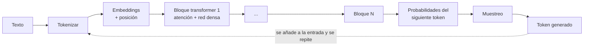

# Cómo funcionan los LLMs <span class="nivel medio">Medio</span>

Un **Large Language Model** es una red neuronal (casi siempre un *transformer*) entrenada para predecir el
**siguiente token** de un texto. De esa tarea tan simple, a escala enorme, emergen capacidades como traducir,
resumir, programar o razonar.

## 1. Tokens

El modelo no ve letras ni palabras, sino **tokens**: fragmentos de texto de un vocabulario fijo (decenas de miles
a cientos de miles de entradas), obtenidos con algoritmos como BPE.

- Regla aproximada: en inglés, 1 token ≈ 4 caracteres ≈ ¾ de palabra. En español y en código suele haber **más tokens** por palabra.
- Todo se mide en tokens: la **ventana de contexto**, el **precio** (por millón de tokens de entrada y de salida) y la **latencia**.
- Cada familia de modelos tiene su *tokenizador*: el mismo texto puede costar distinto número de tokens en modelos distintos.

## 2. Embeddings

Cada token se convierte en un **vector** de miles de dimensiones. Textos con significado parecido quedan cerca en
ese espacio, lo que permite la **búsqueda semántica** (base del [RAG](aplicaciones.md#rag)).

```text
similitud("reiniciar el nodo", "rebootear el equipo")  ≈ 0,86   ← cerca
similitud("reiniciar el nodo", "receta de paella")     ≈ 0,05   ← lejos
```

## 3. El transformer y la atención



- **Autoatención**: para cada token, el modelo calcula cuánto debe "fijarse" en cada uno de los tokens anteriores.
  Así "lo" en "reinicia el nodo y compruébalo" se relaciona con "nodo".
- Varias **cabezas de atención** capturan relaciones distintas (sintaxis, referencias, tema…) en paralelo.
- Decenas o cientos de **bloques** apilados; los **parámetros** (pesos) se cuentan en miles de millones.
- **Generación autoregresiva**: se produce un token, se añade a la entrada y se repite. Por eso la salida es más
  lenta y cara que la entrada: la entrada se procesa en paralelo; la salida, token a token.
- El coste de la atención crece con la longitud del contexto; técnicas como la **caché KV** evitan recalcular lo ya procesado.

## 4. Cómo se entrena

| Fase | Qué se hace | Resultado |
|---|---|---|
| **Preentrenamiento** | Predecir el siguiente token sobre billones de tokens (web, libros, código) | Modelo base: sabe mucho, pero solo "continúa texto" |
| **Ajuste supervisado (SFT)** | Ejemplos de instrucción → respuesta de calidad | Sigue instrucciones, formato de conversación |
| **Aprendizaje por refuerzo** | RLHF (preferencias humanas), RLAIF / *Constitutional AI* (feedback de IA guiado por principios), RL con recompensas verificables (tests que pasan, matemáticas correctas) | Útil, honesto, seguro; aprende a razonar y a usar herramientas |
| **Ajuste fino** (opcional, por el cliente) | Pocos miles de ejemplos propios | Estilo o tarea muy específicos |

!!! tip "Conocimiento congelado"
    El modelo solo "sabe" lo que había en sus datos hasta su **fecha de corte**. Lo posterior o lo privado hay que
    dárselo en el contexto (RAG, herramientas de búsqueda, documentos adjuntos).

## 5. Inferencia: parámetros que controlan la salida

| Parámetro | Efecto |
|---|---|
| **Temperatura** | 0 = casi determinista; alta = más variada y creativa. (En los modelos más recientes con razonamiento, los parámetros de muestreo se fijan internamente y ya no se exponen) |
| **top-p / top-k** | Limitan los tokens candidatos al muestrear |
| **Máximo de tokens de salida** | Corta la respuesta si se alcanza (la respuesta queda incompleta) |
| **Secuencias de parada** | Detienen la generación al aparecer un texto concreto |
| **Esfuerzo / razonamiento** | Cuánto "piensa" el modelo antes de responder: más calidad a cambio de latencia y tokens |

## 6. Razonamiento ("thinking")

Los modelos de razonamiento generan una **cadena de pensamiento** interna antes de la respuesta final: descomponen
el problema, prueban hipótesis y se corrigen. Mejora mucho en código, matemáticas, planificación y agentes.

- En la API de Claude, el modo **adaptativo** deja que el modelo decida cuánto pensar, y el nivel de **esfuerzo**
  (`low`, `medium`, `high`, `xhigh`, `max`) regula la profundidad y el gasto de tokens.
- El pensamiento **se factura** como tokens de salida aunque no se muestre (se puede pedir un resumen).
- Regla: esfuerzo bajo para clasificación y tareas simples; alto para código y agentes largos.

## 7. Ventana de contexto

Es todo lo que el modelo "ve" en una petición: instrucciones de sistema, definiciones de herramientas, historial,
documentos y la respuesta que está generando.

- En 2026, los modelos frontera manejan **1 millón de tokens** (varios libros o un repositorio mediano).
- Que quepa no significa que se use bien: con contextos muy largos y ruidosos la calidad baja (*context rot*).
  Por eso importa el [context engineering](aplicaciones.md#context-engineering).
- Técnicas para conversaciones largas: **compactación** (resumir lo antiguo), **edición de contexto** (borrar resultados
  de herramientas viejos), **memoria externa** (ficheros o bases de datos que el modelo consulta).

## Del texto a la respuesta, paso a paso

Ejemplo simplificado de lo que ocurre cuando envías `"El sitio 42 no reconcilia porque"`:

1. **Tokenización**: el texto se divide en tokens, por ejemplo `["El", " sitio", " 42", " no", " recon", "cilia", " porque"]`,
   y cada uno se convierte en un número de su vocabulario.
2. ***Embeddings***: cada número se transforma en un vector; se le suma información de su **posición** en la frase.
3. **Capas del transformer**: en cada capa, la atención mezcla la información de todos los tokens anteriores (" porque"
   "mira" a " no" y " recon…" para entender que viene una causa), y una red densa transforma el resultado.
4. **Probabilidades**: la última capa produce una puntuación para **cada token del vocabulario** como posible siguiente:

    | Siguiente token | Probabilidad |
    |---|---|
    | " falta" | 0,31 |
    | " el" | 0,22 |
    | " no" | 0,12 |
    | " hay" | 0,08 |
    | … (el resto del vocabulario) | 0,27 |

5. **Muestreo**: se elige un token según esas probabilidades. Con **temperatura** baja casi siempre sale el más probable
   (" falta"); con temperatura alta se eligen más a menudo opciones menos probables (más variedad, más riesgo de error).
6. El token elegido se **añade** a la entrada y se repite todo el proceso para el siguiente, hasta un token de fin o el
   límite de salida.

!!! tip "Consecuencias prácticas"
    El modelo no "consulta" una base de datos de hechos: genera el texto más plausible dado el contexto. Por eso puede
    **alucinar** con total seguridad, y por eso dar **contexto correcto** (documentos, resultados de herramientas) es la
    forma más eficaz de que acierte.

## Cómo se mide la calidad de un modelo

| Tipo de evaluación | Qué mide | Límite |
|---|---|---|
| ***Benchmarks* públicos** (programación, matemáticas, razonamiento, uso de herramientas) | Comparar modelos en tareas estándar | Pueden estar "contaminados" (ejemplos parecidos en los datos de entrenamiento) y no reflejan **tu** caso |
| **Clasificaciones por preferencia humana** | Qué respuesta prefieren las personas en comparaciones a ciegas | Premian el estilo además de la corrección |
| **Evaluaciones propias** | Acierto en **tus** tareas con **tus** datos | Hay que construirlas, pero son las únicas que deciden |

La regla para un arquitecto: los *benchmarks* sirven para preseleccionar; la decisión se toma con
[evaluaciones propias](aplicaciones.md#6-evaluacion-evals) que midan calidad, coste y latencia en el caso real.

## 8. Limitaciones que un arquitecto debe asumir

| Limitación | Consecuencia de diseño |
|---|---|
| **Alucinaciones**: respuestas plausibles pero falsas | Anclar en fuentes (RAG con citas), validar salidas, humano en decisiones críticas |
| **No determinismo** | Tests con evaluaciones estadísticas, no con igualdad exacta |
| **Conocimiento con fecha de corte** | Herramientas de búsqueda o RAG para datos actuales |
| **Sensibilidad al *prompt*** | Versionar *prompts* y evaluarlos como código |
| **Latencia** de segundos (o minutos en tareas largas) | *Streaming*, procesos asíncronos, colas |
| **Coste por token** | Caché de *prompts*, modelos más pequeños donde basten, lotes |
| **Vulnerable a *prompt injection*** | Tratar contenido externo como no confiable → [Seguridad](seguridad.md) |

## 9. Precio y modelos (ejemplo: Claude, septiembre de 2026)

| Modelo | Perfil | Contexto | Entrada $/M tokens | Salida $/M tokens |
|---|---|---|---|---|
| Claude Fable 5.1 | El más capaz disponible de forma general: razonamiento y agentes de muy larga duración | 1 M | 10 | 50 |
| Claude Opus 5.5 / Opus 5 | Frontera de uso general: código y agentes | 1 M | 4 / 5 | 20 / 25 |
| Claude Sonnet 5 | Equilibrio entre capacidad, velocidad y coste | 1 M | 2 | 10 |
| Claude Haiku 4.5 | Rápido y económico: clasificación, extracción, subagentes | 200 K | 1 | 5 |

Palancas de coste comunes a los grandes proveedores:

- **Caché de *prompts***: el prefijo repetido (instrucciones, documentos, herramientas) se cobra a una fracción del precio
  al reutilizarlo. Requiere que el prefijo sea **idéntico byte a byte**: lo estable primero, lo variable al final.
- **API por lotes** (*batch*): ~50 % más barato para trabajos no urgentes.
- **Elegir el modelo y el esfuerzo por tarea**, midiendo el **coste por tarea completada**, no por petición.

!!! note "Otros proveedores"
    OpenAI (GPT), Google (Gemini), Meta (Llama), Mistral, DeepSeek, Qwen (Alibaba) y xAI (Grok) publican familias
    similares, con modelos grandes, medianos y pequeños, y algunos con pesos abiertos. Ver [Ecosistema](ecosistema.md).

## Preguntas de repaso

??? question "¿Por qué la salida cuesta más que la entrada?"
    La entrada se procesa en paralelo en una sola pasada; la salida se genera token a token, cada uno con una pasada
    completa por el modelo. Más cómputo y más tiempo por token.

??? question "¿Qué es la caché KV y la caché de prompts?"
    La **caché KV** guarda los cálculos de atención de los tokens ya procesados para no repetirlos al generar el siguiente.
    La **caché de prompts** extiende la idea entre peticiones: si un prefijo ya se procesó, se reutiliza con descuento y menos latencia.

??? question "¿Por qué no basta con meter toda la documentación de la empresa en la ventana de contexto?"
    Coste y latencia por petición, límite de tamaño, y pérdida de calidad con contexto largo y ruidoso. Es mejor
    recuperar solo lo relevante (RAG) o dejar que un agente busque bajo demanda.

??? question "¿Qué aporta el aprendizaje por refuerzo con recompensas verificables?"
    Permite entrenar en tareas con respuesta comprobable (tests que pasan, resultados matemáticos) sin depender del juicio
    humano en cada ejemplo; es clave en la mejora de los modelos de razonamiento y de código.

## Ejercicios

!!! exercise "Ejercicio 1 · Básico — Calcular el coste de una funcionalidad"
    Un asistente de logs recibe de media 6 000 tokens de entrada (instrucciones + log) y genera 500 de salida. Se usa
    20 000 veces al mes con un modelo de 2 $/M de entrada y 10 $/M de salida. ¿Cuánto cuesta al mes? ¿Cómo lo reducirías?

    ??? success "Solución"
        Entrada: 20 000 × 6 000 = 120 M tokens × 2 $ = **240 $**. Salida: 20 000 × 500 = 10 M × 10 $ = **100 $**.
        Total ≈ **340 $/mes**. Reducciones: **caché de *prompts*** para las instrucciones fijas (si son 2 000 de los 6 000
        tokens, esa parte se cobra a una fracción del precio); **recortar el log** a las líneas relevantes antes de enviarlo
        (filtrar errores y contexto: quizá 1 500 tokens en lugar de 4 000); salida más concisa; y modelo más pequeño si las
        evaluaciones muestran que basta.

!!! exercise "Ejercicio 2 · Medio — Diseñar para las limitaciones"
    Vas a integrar un LLM que propone cambios en manifiestos de Kubernetes a partir de una petición en lenguaje natural.
    Enumera las limitaciones del modelo que afectan al diseño y cómo mitigas cada una.

    ??? success "Solución"
        | Limitación | Mitigación |
        |---|---|
        | Alucinaciones (campos o APIs que no existen) | Validar la salida con `kubeconform` y políticas; si falla, devolver el error al modelo para que corrija |
        | No determinismo | La salida es una **propuesta** en forma de PR, nunca un cambio aplicado directamente |
        | Conocimiento desactualizado (versiones de API) | Dar en el contexto los esquemas y ejemplos del propio repositorio |
        | *Prompt injection* desde el texto del usuario o del repositorio | Sin permisos de escritura directa; revisión humana obligatoria |
        | Coste y latencia | Caché del contexto del repositorio; tarea asíncrona |

!!! exercise "Ejercicio 3 · Medio — Elegir modelo y esfuerzo"
    Tienes tres tareas: (a) clasificar 1 M de eventos al día en 6 categorías; (b) un agente que refactoriza un servicio
    completo; (c) responder dudas de operadores sobre *runbooks*. ¿Qué tamaño de modelo y nivel de razonamiento usarías?

    ??? success "Solución"
        (a) Modelo **pequeño y rápido**, sin razonamiento extendido, con salida estructurada y por lotes (*batch*) si no es
        urgente; o un modelo de decisión tipada. (b) Modelo **frontera** con **esfuerzo alto**: tarea larga donde la calidad
        importa más que el coste. (c) Modelo **mediano** con RAG y esfuerzo bajo o medio. En todos los casos, confirmar con
        evaluaciones midiendo el **coste por tarea completada**, no por petición.
