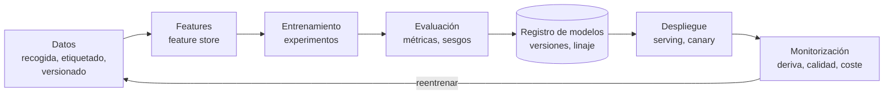
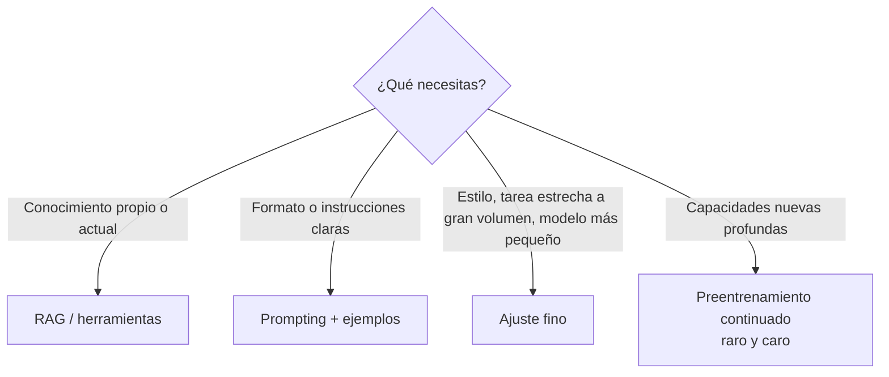

# MLOps, ajuste fino y servir modelos <span class="nivel avanzado">Avanzado</span>

Llevar modelos a producción y mantenerlos sanos es un problema de **ingeniería de plataforma**: versionado,
automatización, despliegue, observabilidad. Con LLMs se habla también de **LLMOps**.

## 1. Ciclo de vida de un modelo



| Pieza | Para qué | Herramientas |
|---|---|---|
| Versionado de datos | Reproducir qué datos entrenaron cada modelo | DVC, lakeFS, Delta Lake / Iceberg |
| Seguimiento de experimentos | Comparar ejecuciones: parámetros, métricas, artefactos | MLflow, Weights & Biases |
| *Feature store* | Mismas variables en entrenamiento y en inferencia (evita *training-serving skew*) | Feast, servicios cloud |
| Orquestación de *pipelines* | Entrenar y evaluar de forma reproducible | Kubeflow Pipelines, Airflow, Argo Workflows, SageMaker/Vertex Pipelines |
| Registro de modelos | Versiones, estado (staging/producción), linaje | MLflow Model Registry, registros cloud |
| *Serving* | Exponer el modelo con latencia y escala adecuadas | KServe, Seldon, BentoML, Triton, vLLM |
| Monitorización | Deriva, calidad, latencia, coste | Evidently, Arize, Prometheus |

### Deriva (*drift*)

| Tipo | Qué cambia | Ejemplo |
|---|---|---|
| **Deriva de datos** | La distribución de las entradas | Nuevos modelos de hardware en la flota con otras métricas típicas |
| **Deriva de concepto** | La relación entrada → salida | Tras una actualización del SO, los mismos síntomas ya no predicen fallo |

Se detecta comparando distribuciones (PSI, KS) y vigilando métricas de negocio; se corrige reentrenando.

!!! tip "GitOps para modelos"
    Los mismos principios de tu plataforma aplican: el modelo desplegado se declara en Git (versión del artefacto en un
    registro OCI o de modelos), un controlador lo reconcilia (KServe `InferenceService` vía Flux), y la promoción es una PR.

## 2. Adaptar un LLM: ¿qué técnica?



Orden recomendado: **prompting → RAG / herramientas → ajuste fino**. Cada escalón cuesta más y exige evaluaciones sólidas.

### Técnicas de ajuste fino

| Técnica | Qué hace | Coste |
|---|---|---|
| **Ajuste completo** | Actualiza todos los pesos | Muy alto (GPUs, memoria) |
| **LoRA** | Entrena pequeñas matrices adicionales de bajo rango; el modelo base queda congelado | Bajo; varios adaptadores sobre un mismo modelo |
| **QLoRA** | LoRA sobre un modelo cuantizado a 4 bits | Permite ajustar modelos grandes en una sola GPU |
| **SFT** | Ajuste supervisado con pares instrucción → respuesta | Depende de la técnica anterior |
| **Preferencias (DPO, RLHF)** | Enseña qué respuesta es mejor entre varias | Requiere pares de preferencias |
| **Destilación** | Un modelo grande genera datos para entrenar uno pequeño | Modelos baratos y rápidos para una tarea concreta |

!!! warning "Riesgos del ajuste fino"
    Necesita datos de calidad (cientos o miles de ejemplos limpios), puede **degradar capacidades generales**
    (*catastrophic forgetting*), queda atado a una versión del modelo base y hay que repetirlo al actualizarlo.
    Con los modelos frontera actuales, un buen *prompt* con ejemplos suele rendir igual para muchas tareas.

## 3. Servir modelos de lenguaje

| Concepto | Qué es |
|---|---|
| **Cuantización** | Pesos en 8 o 4 bits en lugar de 16: menos memoria y más velocidad, algo menos de calidad |
| ***Continuous batching*** | Agrupar peticiones de distintos usuarios en cada paso de generación (vLLM) |
| **PagedAttention / caché KV** | Gestionar eficientemente la memoria de atención de muchas conversaciones |
| **Decodificación especulativa** | Un modelo pequeño propone tokens y el grande los verifica en bloque |
| **TTFT / TPOT** | *Time to first token* (latencia percibida) y tiempo por token de salida (velocidad) |
| **Paralelismo** | Tensorial o por *pipeline* para repartir un modelo entre varias GPUs |

### Dimensionado aproximado de memoria

Memoria de pesos ≈ **parámetros × bytes por parámetro**:

| Modelo | FP16 (2 bytes) | 8 bits | 4 bits |
|---|---|---|---|
| 8 000 M parámetros | ~16 GB | ~8 GB | ~5 GB |
| 70 000 M parámetros | ~140 GB | ~70 GB | ~40 GB |

Más la **caché KV**, que crece con la longitud de contexto y el número de peticiones concurrentes.

### En Kubernetes

```yaml
apiVersion: serving.kserve.io/v1beta1
kind: InferenceService
metadata: { name: runbook-assistant, namespace: ml }
spec:
  predictor:
    model:
      modelFormat: { name: huggingface }
      args: ["--model_name=runbook-assistant"]
      storageUri: oci://registry.acme.com/models/runbook-assistant:1.3.0
      resources:
        limits: { nvidia.com/gpu: "1", memory: 24Gi }
```

- GPU Operator de NVIDIA, *device plugins*, particionado MIG o *time-slicing* para compartir GPUs.
- Escalado por métricas propias (cola de peticiones, tokens/s) con KEDA; el escalado a cero ahorra, pero la carga del modelo tarda.
- Imágenes y modelos enormes: precarga en nodos, cachés locales, almacenamiento rápido.

## 4. LLMOps

| Práctica | Qué implica |
|---|---|
| **Prompts versionados** | En Git, con revisión y evaluación antes de cambiar |
| **Evaluación continua** | Conjunto dorado en CI; evaluación en producción por muestreo |
| **Pasarela de modelos** (*AI gateway*) | Punto único para autenticación, cuotas, *fallback* entre modelos, caché y registro de costes (LiteLLM, gateways de los proveedores cloud) |
| **Trazas** | Cada llamada con *prompt*, respuesta, tokens, latencia, coste y herramientas usadas |
| **Gestión de versiones de modelo** | Fijar versiones; probar las nuevas con evaluaciones antes de migrar |
| **Control de costes** | Presupuestos por equipo y alertas, igual que en FinOps |

## Preguntas de repaso

??? question "¿Qué es el training-serving skew?"
    Diferencias entre cómo se calculan las variables al entrenar y al servir (código distinto, datos distintos), que
    degradan el modelo en producción aunque las métricas de entrenamiento fueran buenas. Un *feature store* compartido lo evita.

??? question "¿Por qué LoRA ha popularizado el ajuste fino?"
    Porque entrena solo una fracción mínima de parámetros: necesita mucha menos memoria y GPU, y los adaptadores son
    pequeños y combinables sobre el mismo modelo base.

??? question "¿Cuánta memoria necesita un modelo de 8 000 M de parámetros cuantizado a 4 bits?"
    Unos 4-5 GB para los pesos, más la caché KV según el contexto y la concurrencia. Cabe en GPUs de consumo o incluso en CPU con llama.cpp.

??? question "¿Qué aporta una pasarela de modelos?"
    Centraliza acceso, credenciales, cuotas, registro de costes, caché y *fallback* entre proveedores; desacopla las
    aplicaciones de un proveedor concreto.

## Ejercicios

!!! exercise "Ejercicio 1 · Básico — Memoria para servir un modelo"
    Quieres servir un modelo de 14 000 M de parámetros en una GPU de 24 GB. ¿Cabe en 16 bits? ¿Y en 4 bits?

    ??? success "Solución"
        16 bits: 14 × 10⁹ × 2 B = **28 GB** → no cabe (y falta sitio para la caché KV). 4 bits: 14 × 10⁹ × 0,5 B ≈
        **7 GB** (≈ 8-9 GB con sobrecarga) → cabe, con ~15 GB libres para la caché KV y varias peticiones concurrentes.
        8 bits (~14 GB) también cabría con menos margen.

!!! exercise "Ejercicio 2 · Medio — ¿Ajuste fino?"
    Un equipo quiere hacer *fine-tuning* de un LLM para que "conozca la plataforma". ¿Qué le preguntarías y qué propondrías?

    ??? success "Solución"
        Preguntas: ¿qué debe hacer exactamente mejor (responder dudas, generar manifiestos, seguir un formato)? ¿Cuánto cambia
        la información (versiones, *runbooks*)? ¿Hay evaluaciones? Propuesta: "conocer" información cambiante es un problema
        de **RAG** (datos actualizados, citas, permisos), no de ajuste fino, que congela el conocimiento en la fecha del
        entrenamiento. Empezar con *prompting* + RAG + evaluaciones; considerar ajuste fino solo si, tras eso, falla un
        **comportamiento** concreto (formato, estilo, tarea muy repetitiva) y hay cientos de ejemplos de calidad.

!!! exercise "Ejercicio 3 · Avanzado — Detectar deriva en producción"
    Tu modelo de predicción de fallos lleva 6 meses en producción. ¿Qué monitorizarías para saber si hay que reentrenarlo?

    ??? success "Solución"
        - **Deriva de datos**: distribución de cada variable de entrada (PSI o prueba KS) frente a la de entrenamiento, por
          región y modelo de hardware.
        - **Deriva de predicciones**: proporción de nodos marcados en riesgo y confianza media.
        - **Rendimiento real**: cuando se conoce el resultado (a las 24 h), precision y recall en ventanas móviles.
        - **Negocio**: fallos no anticipados y visitas preventivas innecesarias.
        Alertas con umbrales y reentrenamiento programado (p. ej. mensual) o disparado cuando la deriva o la caída de recall
        superen el umbral; el modelo nuevo se valida con los mismos datos y se despliega por anillos.
