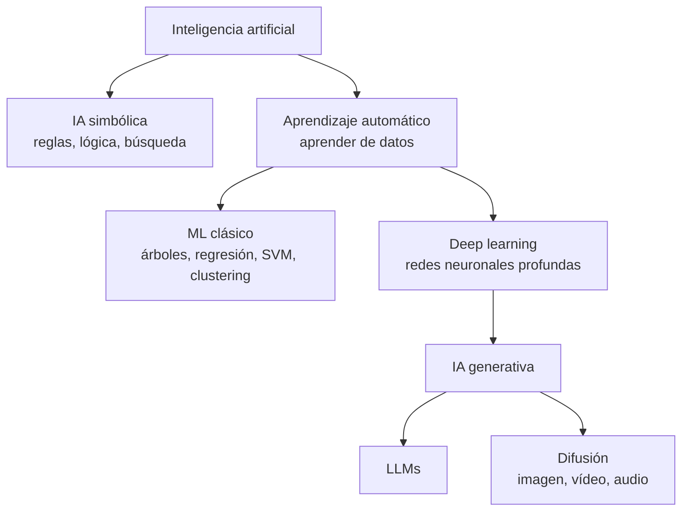

# Tipos de IA y aprendizaje automático <span class="nivel basico">Básico</span>

"IA" es un paraguas enorme. Saber situar cada técnica evita dos errores caros: usar un LLM donde bastaba una
regresión, y usar reglas donde hacía falta aprendizaje.



## Por capacidad

| Tipo | Qué es | Estado |
|---|---|---|
| **IA estrecha (ANI)** | Resuelve tareas concretas (traducir, clasificar, programar) | Toda la IA actual, incluidos los LLMs, aunque cada vez más general |
| **IA general (AGI)** | Rendimiento humano o superior en prácticamente cualquier tarea cognitiva | Objetivo declarado de varios laboratorios; sin definición ni fecha consensuadas |
| **Superinteligencia (ASI)** | Supera ampliamente a los humanos en todo | Hipotética; motiva la investigación en seguridad y alineamiento |

## Por enfoque

| Enfoque | Cómo funciona | Pros | Contras | Ejemplos |
|---|---|---|---|---|
| **Simbólica** | Reglas y conocimiento explícitos, lógica, búsqueda | Explicable, determinista, sin datos de entrenamiento | No escala a problemas difusos (visión, lenguaje) | Motores de reglas, sistemas expertos, planificadores, *solvers* |
| **Estadística / ML** | Aprende patrones a partir de datos | Maneja ruido y complejidad | Necesita datos; menos explicable | Detección de fraude, recomendadores, LLMs |
| **Neuro-simbólica** | Combina redes neuronales con razonamiento simbólico | Lo mejor de ambos | Complejidad | Un LLM que usa un *solver* o ejecuta código como herramienta |

!!! tip "Regla práctica"
    Si puedes escribir la regla, escríbela (más barata, rápida y auditable). Usa ML cuando la regla es desconocida o
    demasiado compleja, y un LLM cuando el problema es de **lenguaje**, **conocimiento general** o **razonamiento abierto**.

## Paradigmas de aprendizaje

| Paradigma | Datos | Tareas | Ejemplo |
|---|---|---|---|
| **Supervisado** | Ejemplos etiquetados (entrada → salida correcta) | Clasificación, regresión | ¿Este nodo edge fallará en 24 h? |
| **No supervisado** | Sin etiquetas | *Clustering*, reducción de dimensionalidad, anomalías | Agrupar sitios por patrón de uso |
| **Autosupervisado** | Las etiquetas salen de los propios datos (predecir la palabra siguiente o la parte oculta) | Preentrenamiento de grandes modelos | Así se preentrenan los LLMs |
| **Por refuerzo (RL)** | Recompensas por acciones en un entorno | Control, juegos, alineamiento de LLMs | AlphaGo; RLHF; entrenar razonamiento |

## ML clásico: algoritmos que siguen mandando

| Algoritmo | Tipo | Cuándo |
|---|---|---|
| Regresión lineal / logística | Supervisado | Línea base interpretable |
| Árboles de decisión | Supervisado | Reglas legibles |
| **Random forest / gradient boosting** (XGBoost, LightGBM) | Supervisado | **Datos tabulares**: suelen ganar a las redes neuronales |
| k-NN | Supervisado | Similitud simple |
| SVM | Supervisado | Conjuntos medianos, fronteras claras |
| k-means, DBSCAN | No supervisado | Segmentación |
| PCA, UMAP | No supervisado | Reducir dimensiones, visualizar |
| Isolation Forest | No supervisado | Detección de anomalías (telemetría) |

```python
# Predicción de fallo de nodos edge a partir de telemetría (scikit-learn)
from sklearn.ensemble import GradientBoostingClassifier
from sklearn.model_selection import train_test_split
from sklearn.metrics import classification_report

X = df[["cpu_p95", "mem_p95", "disk_errors", "reboots_7d", "temp_max"]]
y = df["failed_next_24h"]

X_train, X_test, y_train, y_test = train_test_split(X, y, test_size=0.2, stratify=y, random_state=42)
model = GradientBoostingClassifier().fit(X_train, y_train)
print(classification_report(y_test, model.predict(X_test)))   # precision, recall, F1 por clase
```

### Conceptos que hay que dominar

- **Entrenamiento / validación / test**: el test solo se usa al final; si lo miras para ajustar, deja de medir nada.
- ***Overfitting*** (memoriza el entrenamiento) vs. ***underfitting*** (demasiado simple). Remedios: más datos, regularización, validación cruzada.
- **Métricas**: *accuracy* engaña con clases desbalanceadas → **precision** (de lo que marqué, cuánto era cierto),
  **recall** (de lo cierto, cuánto marqué), **F1**, AUC-ROC; en regresión, MAE/RMSE.
- ***Data leakage***: información del futuro o de la etiqueta que se cuela en las variables → resultados irreales.
- **MLOps**: versionado de datos y modelos, *feature stores*, despliegue, monitorización de deriva (*data/model drift*).

## Deep learning: arquitecturas

| Arquitectura | Idea | Uso típico |
|---|---|---|
| **MLP** (perceptrón multicapa) | Capas densas | Bloque básico |
| **CNN** (convolucionales) | Filtros que detectan patrones locales | Visión artificial |
| **RNN / LSTM** | Procesan secuencias paso a paso | Series temporales (hoy, a menudo sustituidas por *transformers*) |
| **Transformer** | **Atención**: cada elemento mira a todos los demás en paralelo | LLMs, visión, audio, casi todo |
| **Mixture of Experts (MoE)** | Solo se activa una parte de la red por token | LLMs grandes con menor coste de inferencia |
| **Modelos de difusión** | Aprenden a quitar ruido paso a paso | Generación de imagen, vídeo, audio |
| **GAN** | Generador contra discriminador | Generación de imagen (antes de la difusión) |
| **Autoencoders / VAE** | Comprimen y reconstruyen | Anomalías, representaciones latentes |
| **GNN** | Redes sobre grafos | Moléculas, redes sociales, topologías |
| **State Space Models** (Mamba) | Secuencias largas en tiempo lineal | Alternativa o complemento a la atención |

## Discriminativa vs. generativa

| | Discriminativa | Generativa |
|---|---|---|
| Aprende | La frontera entre clases: P(y \| x) | La distribución de los datos: puede crear nuevos |
| Salida | Etiqueta, número, puntuación | Texto, imagen, código, audio… |
| Ejemplos | Clasificador de spam, detector de anomalías | LLMs, difusión |

## Tipos de modelos generativos actuales

| Tipo | Qué hace |
|---|---|
| **LLM** | Genera texto (y código) prediciendo el siguiente *token* → [Cómo funcionan](llms.md) |
| **Modelo de razonamiento** | LLM entrenado para "pensar" antes de responder; mejor en matemáticas, código y planificación |
| **Multimodal (VLM)** | Entiende imagen, audio o vídeo además de texto |
| **SLM** (modelo pequeño) | Pocos miles de millones de parámetros; se ejecuta en portátiles, móviles o **edge** |
| **Modelo de *embeddings*** | Convierte texto o imágenes en vectores para búsqueda semántica → [RAG](aplicaciones.md#rag) |
| **Difusión** | Imagen, vídeo y audio a partir de texto |
| **VLA** (*vision-language-action*) | Percibe, entiende instrucciones y actúa: robótica |

## World models y JEPA { #world-models-y-jepa }

Una línea de investigación que cuestiona que predecir texto baste para llegar a una inteligencia general.

- **World model**: un modelo interno de cómo funciona el mundo que permite **predecir las consecuencias de las acciones** y planificar.
  Ejemplos: modelos que generan entornos interactivos (Genie de Google DeepMind), simuladores para robótica y conducción.
- **JEPA** (*Joint-Embedding Predictive Architecture*), propuesta por **Yann LeCun** (2022): en lugar de predecir cada
  píxel o *token* (generativo), predice la **representación abstracta** de la parte que falta. Así ignora detalles
  impredecibles y aprende lo esencial. Variantes: I-JEPA (imágenes), V-JEPA y V-JEPA 2 (vídeo, con aplicación en robótica).
- LeCun sostiene que los LLMs autoregresivos no bastan para razonar y planificar como los humanos; a finales de 2025
  anunció su salida de Meta para centrarse en este enfoque. Es un debate abierto, no una conclusión.

| | LLM autoregresivo | JEPA / world model |
|---|---|---|
| Predice | El siguiente *token* | Representaciones abstractas del estado del mundo |
| Aprende principalmente de | Texto (y multimodal) | Vídeo, interacción, sensores |
| Punto fuerte | Lenguaje, conocimiento, código | Física intuitiva, planificación, robótica |

## Preguntas de repaso

??? question "¿Por qué el gradient boosting suele ganar a las redes neuronales en datos tabulares?"
    Los datos tabulares tienen variables heterogéneas y poco estructura espacial o secuencial que una red pueda
    explotar; los árboles manejan bien escalas distintas, valores ausentes e interacciones con menos datos y ajuste.

??? question "Un clasificador de fallos tiene 99 % de accuracy. ¿Es bueno?"
    No se sabe: si solo el 1 % de los nodos falla, un modelo que siempre dice "no falla" también tiene 99 %.
    Hay que mirar precision, recall y la matriz de confusión.

??? question "¿Qué tipo de aprendizaje se usa para preentrenar un LLM?"
    Autosupervisado: predecir el siguiente *token* sobre enormes cantidades de texto. Después se ajusta con ejemplos
    supervisados y con aprendizaje por refuerzo (feedback humano o de IA, y recompensas verificables).

??? question "¿Qué diferencia a JEPA de un modelo generativo?"
    El generativo reconstruye la entrada (píxeles, *tokens*); JEPA predice solo la representación abstracta de la parte
    que falta, sin tener que modelar detalles impredecibles.

## Ejercicios

!!! exercise "Ejercicio 1 · Básico — ¿Reglas, ML o LLM?"
    Elige el enfoque para: (a) rechazar manifiestos con la etiqueta `:latest`; (b) predecir qué nodos fallarán mañana a
    partir de su telemetría; (c) resumir para un operador un log de 2 000 líneas; (d) clasificar tickets de soporte en 5
    categorías con 50 000 ejemplos etiquetados.

    ??? success "Solución"
        (a) **Reglas**: la condición es exacta y conocida (una política de Kyverno/Conftest). (b) **ML clásico** supervisado
        (gradient boosting sobre variables de telemetría). (c) **LLM**: lenguaje y resumen de texto libre. (d) Depende de
        coste y volumen: un **clasificador ML** entrenado con los 50 000 ejemplos (barato y rápido en producción), o un LLM
        con ejemplos (*few-shot*) si hay pocos datos o las categorías cambian a menudo; un modelo de decisión tipada como
        [Jev](jev.md) también encaja.

!!! exercise "Ejercicio 2 · Medio — Interpretar métricas"
    Un modelo de detección de fallos da: 100 fallos reales en el conjunto de prueba; el modelo marca 150 nodos, de los que
    80 fallan de verdad. Calcula precision, recall y F1. ¿Es bueno?

    ??? success "Solución"
        Precision = 80 / 150 = **53 %** (de lo que marca, algo más de la mitad es cierto). Recall = 80 / 100 = **80 %**
        (detecta 8 de cada 10 fallos). F1 = 2 × 0,53 × 0,80 / (0,53 + 0,80) ≈ **0,64**. Depende del coste de cada error:
        si una revisión preventiva es barata y un fallo muy caro, un recall alto con precision moderada puede ser aceptable;
        si cada alerta moviliza a un técnico, hay que subir la precision (ajustar el umbral de decisión).

!!! exercise "Ejercicio 3 · Avanzado — Detectar data leakage"
    Un modelo predice con 99 % de acierto si un despliegue fallará. Entre sus variables está `rollback_count` (número de
    *rollbacks* del despliegue). ¿Qué problema hay?

    ??? success "Solución"
        ***Data leakage***: `rollback_count` solo se conoce **después** de que el despliegue haya fallado; el modelo "hace
        trampa" usando información del futuro. En producción, al predecir antes del despliegue, esa variable vale 0 y el
        modelo no sirve. Regla: cada variable debe estar disponible **en el momento de la predicción**. Revisar todas las
        variables con esa pregunta y validar con una separación temporal (entrenar con el pasado, probar con el futuro).
