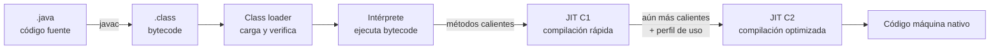
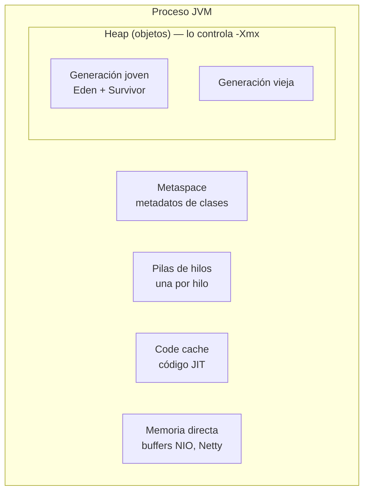

# La JVM por dentro <span class="nivel avanzado">Avanzado</span>

La **Java Virtual Machine** es el programa que ejecuta tu código Java. Entenderla explica por qué una aplicación
tarda en "calentarse", por qué se pausa, por qué la mata Kubernetes por memoria o por qué consume más CPU de la esperada.

## 1. Del código fuente a la ejecución



1. **`javac` compila** el código fuente a **bytecode**: instrucciones para una máquina "virtual", independientes del
   procesador. Por eso el mismo `.jar` funciona en Linux, Windows, x86 o ARM.
2. El **class loader** carga cada clase la primera vez que se usa, **verifica** que el bytecode es seguro y la enlaza.
3. Al principio, la JVM **interpreta** el bytecode instrucción a instrucción: arranca rápido pero ejecuta lento.
4. Mientras interpreta, **cuenta** cuántas veces se ejecuta cada método y bucle. Los "calientes" se compilan a código
   máquina nativo con el **compilador JIT** (*Just-In-Time*):
    - **C1**: compila deprisa con pocas optimizaciones.
    - **C2**: compila despacio pero con optimizaciones agresivas, usando el **perfil** recogido (qué ramas se toman,
      qué tipos llegan realmente).
5. Esto se llama **compilación escalonada** (*tiered compilation*). Consecuencia práctica: una aplicación Java es
   **más lenta en sus primeros minutos** (fase de *warm-up*) y alcanza su rendimiento máximo después.

### Optimizaciones JIT que conviene conocer

| Optimización | Qué hace | Consecuencia |
|---|---|---|
| ***Inlining*** | Sustituye la llamada a un método pequeño por su cuerpo | Los métodos pequeños no cuestan: escribe código limpio sin miedo |
| **Análisis de escape** | Si un objeto no sale del método, no lo crea en el *heap* (lo descompone en variables) | Menos basura para el GC |
| **Desvirtualización** | Si en la práctica solo llega una implementación de una interfaz, llama directamente a ella | Las interfaces tampoco cuestan en caliente |
| **Eliminación de código muerto y de comprobaciones** | Quita ramas y comprobaciones que nunca se usan | Por eso los *microbenchmarks* ingenuos mienten |
| **Desoptimización** | Si una suposición deja de cumplirse (llega otro tipo), vuelve a interpretar y recompila | Picos puntuales de latencia |

!!! warning "Medir rendimiento en Java"
    Un bucle con `System.nanoTime()` no mide nada fiable: el JIT puede eliminar el código, y la primera medición incluye
    interpretación y compilación. Usa **JMH** (*Java Microbenchmark Harness*), que gestiona calentamiento, iteraciones
    y evita que el JIT elimine el trabajo.

## 2. Carga de clases

| Class loader | Carga |
|---|---|
| **Bootstrap** | Clases del núcleo de Java (`java.lang`, `java.util`…) |
| **Platform** | Módulos de la plataforma (`java.sql`, …) |
| **Application** (*system*) | Tu código y tus dependencias (el *classpath*) |
| Personalizados | Servidores de aplicaciones, *plugins*, Spring Boot (carga los *jars* anidados del *fat jar*) |

Funcionan por **delegación**: cada *loader* pregunta primero a su padre. Errores típicos:

- `ClassNotFoundException`: la clase no está en el *classpath* al buscarla por nombre (reflexión, `Class.forName`).
- `NoClassDefFoundError`: estaba al compilar pero no al ejecutar (dependencia que falta o de otra versión).
- `NoSuchMethodError`: hay **dos versiones** de una librería y se cargó la que no tiene el método → conflicto de dependencias
  (revisa con `mvn dependency:tree`).

## 3. Memoria de la JVM



| Zona | Contenido | Error si se agota |
|---|---|---|
| ***Heap*** | Todos los objetos (`new`) | `OutOfMemoryError: Java heap space` |
| **Metaspace** | Definiciones de clases | `OutOfMemoryError: Metaspace` (típico con fugas de class loaders) |
| **Pilas de hilos** | Variables locales y llamadas de cada hilo | `StackOverflowError` (recursión infinita) |
| ***Code cache*** | Código compilado por el JIT | El JIT deja de compilar → la app se vuelve lenta |
| **Memoria directa** | *Buffers* fuera del *heap* | `OutOfMemoryError: Direct buffer memory` |

!!! tip "La memoria del proceso es mayor que el heap"
    Memoria total ≈ *heap* + *metaspace* + pilas + *code cache* + memoria directa + la propia JVM. Si el límite del
    contenedor es 1 GiB y pones `-Xmx1g`, el proceso lo superará y Kubernetes lo matará (**OOMKilled**) sin que la JVM
    lance ningún `OutOfMemoryError`. Regla: *heap* ≈ 70-75 % del límite del contenedor.

## 4. Recolección de basura (GC)

La JVM libera automáticamente los objetos que ya no son **alcanzables** desde las "raíces" (variables locales de los
hilos, campos estáticos…).

### La hipótesis generacional

La mayoría de objetos **mueren jóvenes** (objetos temporales de una petición). Por eso el *heap* se divide:

1. Los objetos nuevos se crean en **Eden** (muy rápido: solo avanzar un puntero).
2. Cuando Eden se llena → **GC menor**: se copian los supervivientes a un espacio *Survivor*; el resto se descarta de golpe.
3. Los que sobreviven varios GC menores se **promueven** a la **generación vieja**.
4. Cuando la generación vieja se llena → **GC mayor** (más caro).

### Recolectores disponibles

| Recolector | Objetivo | Pausas | Cuándo usarlo |
|---|---|---|---|
| **G1** (por defecto) | Equilibrio entre *throughput* y latencia | Decenas de ms, con objetivo configurable (`-XX:MaxGCPauseMillis=200`) | La mayoría de servicios |
| **ZGC** (generacional desde Java 21) | Latencia mínima | **Por debajo del milisegundo**, independiente del tamaño del *heap* | APIs sensibles a latencia, *heaps* grandes |
| **Shenandoah** | Latencia baja | Muy cortas | Alternativa a ZGC (disponible en builds de OpenJDK como Temurin/Red Hat) |
| **Parallel** | Máximo *throughput* | Largas | Procesos *batch* donde la pausa no importa |
| **Serial** | Mínimo consumo | Largas, un hilo | Contenedores muy pequeños (< 2 CPU y poca memoria: la JVM lo elige sola) |

!!! note "Ergonomía en contenedores"
    Si el contenedor tiene menos de 2 CPU o menos de ~1,8 GB, la JVM elige automáticamente **Serial GC**. Con 1 CPU de
    límite puede que no quieras eso: indica el recolector explícitamente (`-XX:+UseG1GC`) o da al menos 2 CPU.

### Síntomas y causas

| Síntoma | Causa probable |
|---|---|
| Uso de *heap* que sube tras cada GC mayor hasta el OOM | **Fuga de memoria**: algo retiene objetos (cachés sin límite, colecciones estáticas, *listeners* no eliminados) |
| Pausas largas frecuentes | *Heap* pequeño para la carga, o recolector inadecuado |
| CPU alta sin tráfico alto | GC trabajando constantemente (mira el log de GC) |
| Mucha basura de vida corta | Objetos temporales innecesarios en bucles calientes |

## 5. La JVM en contenedores

```bash
java -XX:MaxRAMPercentage=75 \        # heap = 75 % del límite de memoria del contenedor
     -XX:+UseG1GC \
     -XX:+ExitOnOutOfMemoryError \     # si hay OOM, terminar: Kubernetes lo reinicia limpio
     -Xlog:gc*:stdout:time,uptime \     # log de GC a la salida estándar
     -jar app.jar
```

- Desde Java 10, la JVM **detecta los límites del contenedor** (cgroups) para memoria y CPU.
- Usa `MaxRAMPercentage` en lugar de un `-Xmx` fijo: así el *heap* se adapta si cambias el límite en el manifiesto.
- **Límite de CPU bajo** → la JVM crea menos hilos de GC y de JIT → arranque lento. Un Pod Java con `limits.cpu: 500m`
  puede tardar mucho en arrancar y fallar la *startup probe*.

## 6. Arranque rápido: AOT, CDS, GraalVM y CRaC

El arranque lento y el *warm-up* son un problema en *serverless*, escalado rápido y CLIs. Soluciones:

| Técnica | Cómo | Beneficio | Coste |
|---|---|---|---|
| **CDS / AppCDS** | Guardar en un fichero las clases ya cargadas y verificadas | Arranque 20-40 % más rápido | Paso extra en el build |
| **AOT cache** (Java 24-25, proyecto Leyden) | Guardar además clases cargadas y enlazadas (JEP 483) y perfiles de ejecución de métodos (JEP 515) de una ejecución de entrenamiento | Arranque y *warm-up* notablemente más rápidos | Ejecución de entrenamiento en el build |
| **GraalVM Native Image** | Compilar todo a un ejecutable nativo antes de ejecutar | Arranque en milisegundos, poca memoria | Build lento; reflexión y proxies requieren configuración; menor rendimiento máximo sin PGO |
| **CRaC** | Guardar una "foto" del proceso ya calentado y restaurarla | Arranque casi instantáneo con rendimiento en caliente | Soporte limitado (Linux, JDKs concretos); cuidado con secretos y conexiones en la foto |

## 7. Diagnóstico en producción

| Herramienta | Para qué | Comando |
|---|---|---|
| **JFR** (*Java Flight Recorder*) | Grabar CPU, memoria, GC, bloqueos, E/S con ~1 % de sobrecarga | `jcmd <pid> JFR.start duration=60s filename=rec.jfr` |
| **JDK Mission Control** | Analizar grabaciones JFR | Interfaz gráfica |
| ***Thread dump*** | Ver qué hace cada hilo (bloqueos, *deadlocks*) | `jcmd <pid> Thread.print` |
| ***Heap dump*** | Ver qué objetos ocupan memoria | `jcmd <pid> GC.heap_dump /tmp/heap.hprof` → Eclipse MAT |
| **async-profiler** | *Flame graphs* de CPU y asignaciones | `asprof -d 30 -f flame.html <pid>` |
| Métricas | *Heap*, GC, hilos en Prometheus | Micrometer + Actuator |

!!! tip "Captura automática del heap en caso de OOM"
    `-XX:+HeapDumpOnOutOfMemoryError -XX:HeapDumpPath=/dumps` con un volumen montado: así tienes la evidencia aunque
    el Pod se reinicie.

## Preguntas de repaso

??? question "¿Por qué una aplicación Java es más lenta justo después de arrancar?"
    Porque al principio el bytecode se **interpreta**; el JIT compila a código nativo optimizado solo los métodos que se
    usan mucho, y necesita un tiempo para recoger el perfil de uso. Tras el *warm-up* alcanza su rendimiento máximo.

??? question "¿Por qué Kubernetes puede matar un Pod Java sin que la JVM dé OutOfMemoryError?"
    Porque el límite del contenedor se aplica a **toda** la memoria del proceso, no solo al *heap*. Si *heap* + metaspace
    + pilas + memoria directa superan el límite, el kernel mata el proceso (OOMKilled) antes de que la JVM detecte nada.

??? question "¿Qué diferencia hay entre NoClassDefFoundError y ClassNotFoundException?"
    `ClassNotFoundException` ocurre al buscar una clase por nombre en tiempo de ejecución (reflexión) y no encontrarla.
    `NoClassDefFoundError` ocurre cuando una clase que existía al compilar no está disponible (o falló su inicialización) al ejecutar.

??? question "¿Cuándo elegirías ZGC en lugar de G1?"
    Cuando la latencia de cola (p99, p999) es crítica o el *heap* es muy grande: ZGC mantiene pausas por debajo del
    milisegundo a cambio de algo más de CPU y memoria.

## Ejercicios

!!! exercise "Ejercicio 1 · Básico — Dimensionar la memoria de un Pod"
    Un servicio Spring Boot corre en un Pod con `limits.memory: 2Gi`. Usa unos 150 MB de metaspace, 200 hilos y unos
    100 MB de memoria directa. ¿Qué `-Xmx` o `MaxRAMPercentage` pondrías y por qué?

    ??? success "Solución"
        Memoria no-heap aproximada: metaspace 150 MB + pilas 200 × 1 MB = 200 MB + memoria directa 100 MB + *code cache*
        y JVM ~100 MB ≈ **550 MB**. Quedan ~1,45 GB para el *heap*, pero conviene margen para picos:
        `-XX:MaxRAMPercentage=65` (≈ 1,3 GB). Con hilos virtuales (menos hilos de plataforma) el porcentaje podría subir a 70-75 %.
        Verifica después con métricas reales (`jvm_memory_used_bytes` por área) y la memoria RSS del contenedor.

!!! exercise "Ejercicio 2 · Básico — Interpretar un error"
    En producción aparece `java.lang.NoSuchMethodError: 'void com.fasterxml.jackson.databind.ObjectMapper.xxx()'`, pero
    en local funciona. ¿Qué ha pasado y cómo lo investigas?

    ??? success "Solución"
        Hay **dos versiones** de Jackson en el *classpath* de producción (o una distinta a la de compilación), y se cargó
        la que no tiene ese método. Pasos: `mvn dependency:tree -Dincludes=com.fasterxml.jackson.core` para ver quién
        trae cada versión; alinear con el BOM de Spring Boot o `dependencyManagement`; comprobar que la imagen de producción
        se construye con el mismo *lockfile*. Añadir el plugin *enforcer* con la regla `dependencyConvergence` evita que se repita.

!!! exercise "Ejercicio 3 · Medio — Microbenchmark correcto"
    Un compañero mide así si `String.format` es más lento que concatenar:
    ```java
    long t = System.nanoTime();
    for (int i = 0; i < 1000; i++) String.format("%s-%d", "site", i);
    System.out.println(System.nanoTime() - t);
    ```
    Explica por qué el resultado no es fiable y escribe la versión con JMH.

    ??? success "Solución"
        Problemas: mide durante la fase interpretada (sin JIT), 1 000 iteraciones son muy pocas, el resultado no se usa
        (el JIT podría eliminar el cálculo) y una sola medición no da varianza.

        ```java
        @State(Scope.Thread)
        @Warmup(iterations = 5) @Measurement(iterations = 10)
        @BenchmarkMode(Mode.AverageTime) @OutputTimeUnit(TimeUnit.NANOSECONDS)
        public class FormatBenchmark {
            int i = 42;

            @Benchmark
            public String format() { return String.format("%s-%d", "site", i); }

            @Benchmark
            public String concat() { return "site-" + i; }
        }
        ```
        Devolver el valor hace que JMH lo "consuma" (`Blackhole`) y el JIT no lo elimine. Resultado típico: la
        concatenación es un orden de magnitud más rápida porque `String.format` interpreta el patrón en cada llamada.

!!! exercise "Ejercicio 4 · Medio — Fuga de memoria"
    El *heap* de un servicio crece tras cada GC mayor hasta el OOM a los 3 días. Describe el procedimiento completo para
    encontrar la causa.

    ??? success "Solución"
        1. Confirmar el patrón con métricas: el uso de la generación vieja **tras** cada GC mayor sube (si bajara, no sería fuga).
        2. Activar `-XX:+HeapDumpOnOutOfMemoryError` o tomar dos *heap dumps* separados unas horas (`jcmd <pid> GC.heap_dump`).
        3. Abrir en **Eclipse MAT**: informe *Leak Suspects* y *Dominator Tree* para ver qué objeto retiene más memoria.
        4. Seguir el **camino hasta la raíz** (*path to GC roots*) del objeto sospechoso: suele ser un `static Map` usado como
           caché sin límite, un `ThreadLocal` que no se limpia, o *listeners* registrados que nunca se eliminan.
        5. Corregir (caché con tamaño máximo y expiración, p. ej. Caffeine) y verificar que la memoria tras GC se estabiliza.

!!! exercise "Ejercicio 5 · Avanzado — Arranque lento en Kubernetes"
    Un servicio Spring Boot tarda 90 s en arrancar en Kubernetes (`limits.cpu: 500m`) y 12 s en tu portátil. La
    *liveness probe* lo reinicia en bucle. Propón un diagnóstico y tres soluciones ordenadas por esfuerzo.

    ??? success "Solución"
        Diagnóstico: con 0,5 CPU la JVM compila con muy pocos recursos (JIT y class loading dependen de CPU), sufre
        *throttling* de CFS, y la *liveness probe* empieza a comprobar antes de que termine el arranque.

        1. **Sin tocar código**: añadir una `startupProbe` con margen (p. ej. `failureThreshold: 30`, `periodSeconds: 5`) para
           que la *liveness* no actúe hasta que arranque; subir `requests.cpu` y quitar o subir `limits.cpu` (la CPU extra solo se usa al arrancar).
        2. **Poco esfuerzo**: activar **AppCDS / caché AOT** en el build de la imagen; revisar el arranque con
           `spring.main.lazy-initialization` en entornos de desarrollo o `ApplicationStartup` para ver qué *beans* tardan.
        3. **Más esfuerzo**: compilar a **GraalVM Native Image** (arranque en < 1 s) o usar CRaC, asumiendo sus restricciones.
