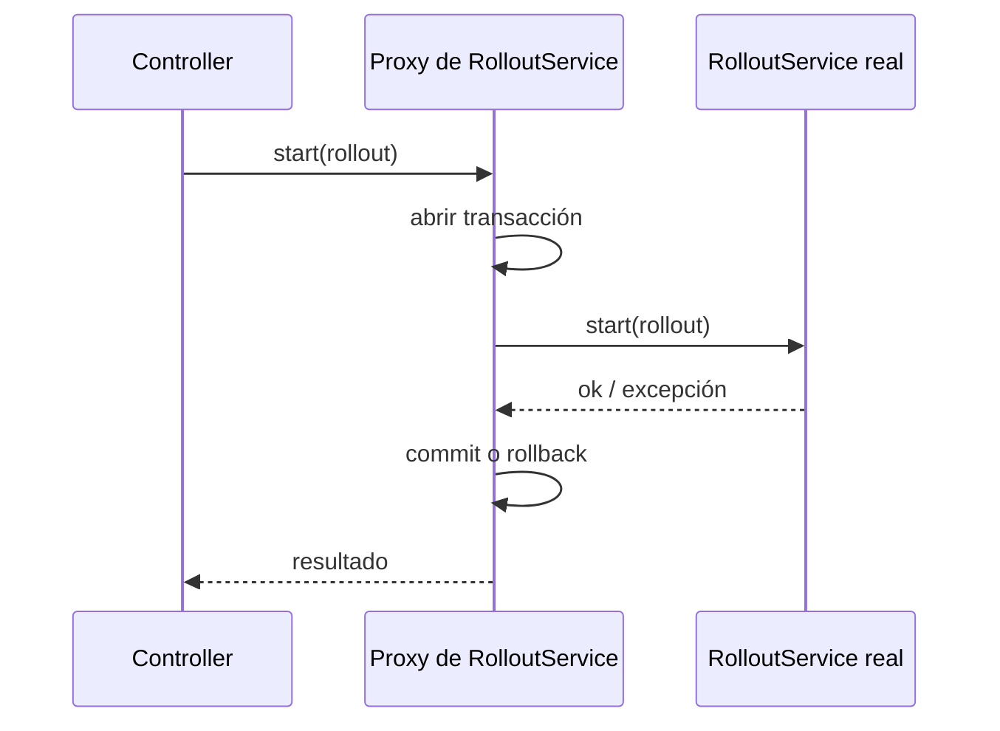

# Spring y Spring Boot <span class="nivel medio">Medio</span>

**Spring Framework** es un contenedor de **inversión de control** más un conjunto de módulos (web, datos, seguridad,
mensajería). **Spring Boot** añade **autoconfiguración** y convenciones para arrancar una aplicación lista para
producción con muy poca configuración.

## 1. Inversión de control e inyección de dependencias

**Problema**: si cada clase crea sus dependencias con `new`, queda acoplada a implementaciones concretas, no se puede
probar aislada y cambiar una pieza obliga a tocar muchas.

**Solución**: un **contenedor** crea los objetos (*beans*), resuelve sus dependencias y se las **inyecta**. Tu clase solo
declara qué necesita.

```java
@Service
public class RolloutService {
    private final NodeRegistry registry;       // interfaz: no sabe qué implementación recibirá
    private final Notifier notifier;

    public RolloutService(NodeRegistry registry, Notifier notifier) {   // inyección por constructor
        this.registry = registry;
        this.notifier = notifier;
    }
}
```

| Forma de inyección | Recomendación |
|---|---|
| **Por constructor** | ✅ La preferida: dependencias obligatorias, campos `final`, fácil de probar sin Spring |
| Por *setter* | Solo para dependencias opcionales |
| Por campo (`@Autowired` en el campo) | ❌ Oculta dependencias y obliga a usar reflexión en los tests |

### Cómo registra Spring los beans

- **Escaneo de componentes**: clases con `@Component` o sus especializaciones (`@Service`, `@Repository`, `@Controller`)
  dentro del paquete de la clase principal y subpaquetes.
- **Configuración explícita**: métodos `@Bean` en clases `@Configuration` (útil para clases de librerías que no puedes anotar).
- **Autoconfiguración** de Spring Boot (ver más abajo).

```java
@Configuration
class ClientsConfig {
    @Bean
    KubernetesClient kubernetesClient() {
        return new KubernetesClientBuilder().build();
    }
}
```

Si hay **varias** implementaciones de una interfaz: `@Primary` marca la preferida y `@Qualifier("nombre")` elige una concreta.

### Ámbitos (*scopes*)

| Ámbito | Instancias | Uso |
|---|---|---|
| **singleton** (por defecto) | Una por contenedor | Servicios sin estado: **la mayoría** |
| prototype | Una nueva cada vez que se pide | Objetos con estado de corta vida |
| request / session | Una por petición / sesión HTTP | Datos de la petición |

!!! warning "Los singletons deben ser sin estado"
    Un *bean* singleton lo usan todos los hilos a la vez. Un campo mutable (`private List<X> pendientes`) es una
    condición de carrera garantizada. El estado va en variables locales, en la base de datos o en estructuras concurrentes.

## 2. Proxies y AOP: cómo funcionan `@Transactional`, `@Cacheable`, `@Async`

Spring no modifica tu clase: crea un **proxy** que la envuelve e intercepta las llamadas **que llegan desde fuera**.



!!! warning "La trampa de la autoinvocación"
    Si un método de la clase llama a otro método **de la misma clase** anotado con `@Transactional`, la llamada **no pasa
    por el proxy** y la anotación **se ignora**. Solución: mover el método a otro *bean*, o diseñar la transacción en el
    método público que se llama desde fuera. Lo mismo aplica a `@Cacheable`, `@Async` y `@Retryable`.

Otras consecuencias del proxy: las anotaciones no funcionan en métodos `private`, y la clase no puede ser `final` si se
usa proxy por subclase (CGLIB).

## 3. Spring Boot: autoconfiguración

1. Añades un ***starter*** (`spring-boot-starter-web`, `-data-jpa`, `-actuator`…): trae dependencias coherentes y versionadas.
2. Al arrancar, Boot evalúa **clases de autoconfiguración** con condiciones: `@ConditionalOnClass` (¿está la librería?),
   `@ConditionalOnMissingBean` (¿el usuario ya definió el suyo?), `@ConditionalOnProperty`…
3. Si se cumplen, registra *beans* con valores por defecto sensatos (un `DataSource` con HikariCP, un servidor Tomcat…).
4. **Tú puedes sobrescribir** cualquier cosa definiendo tu propio *bean* o cambiando propiedades.

Para ver qué se configuró y por qué: arrancar con `--debug` (informe de condiciones) o el *endpoint* `/actuator/conditions`.

### Configuración externa

Orden de prioridad (de mayor a menor, simplificado): argumentos de línea de comandos → variables de entorno →
`application-{perfil}.yml` → `application.yml`. Así la misma imagen se configura distinto en cada entorno (principio *12-factor*).

```java
@ConfigurationProperties(prefix = "fleet")
public record FleetProperties(Duration reconcileTimeout, int maxParallelSites, URI registryUrl) { }
```

```yaml
fleet:
  reconcile-timeout: 10m
  max-parallel-sites: 50
  registry-url: https://registry.acme.com
```

Propiedades **tipadas y validadas** (`@Validated`) en lugar de `@Value` repartidos por el código.

## 4. Datos: Spring Data JPA y transacciones

### Transacciones

| Atributo | Opciones clave |
|---|---|
| `propagation` | `REQUIRED` (por defecto: usa la existente o crea una), `REQUIRES_NEW` (siempre una nueva, suspende la actual), `MANDATORY`, `NOT_SUPPORTED` |
| `readOnly` | `true` en consultas: permite optimizaciones (sin *dirty checking*, réplicas de lectura) |
| `rollbackFor` | Por defecto **solo** hace *rollback* con excepciones no comprobadas (`RuntimeException`) y `Error` |
| `timeout` | Límite de duración |

!!! warning "Transacciones largas"
    No llames a APIs externas (HTTP, colas) **dentro** de una transacción de base de datos: mantienes conexiones y *locks*
    ocupados mientras esperas a la red. Haz la llamada fuera, o usa el patrón *outbox*.

### El problema N+1

```java
List<Site> sites = siteRepository.findAll();               // 1 consulta
for (Site s : sites) {
    s.getDeployments().size();                             // 1 consulta POR sitio → N consultas más
}
```

Soluciones: `JOIN FETCH` en la consulta, `@EntityGraph(attributePaths = "deployments")`, o **proyecciones** (DTOs) con
solo los campos necesarios. Detección: activar el log de SQL en tests o usar herramientas que cuenten consultas por petición.

### Carga perezosa y `LazyInitializationException`

Las relaciones `@OneToMany` son perezosas: se cargan al acceder. Si accedes **fuera** de la transacción, falla. No lo
arregles con `open-in-view` (mantiene la conexión abierta durante toda la petición, desactívalo:
`spring.jpa.open-in-view=false`); carga lo necesario explícitamente en el servicio.

## 5. Web: MVC, WebFlux y clientes

| | Spring MVC | Spring WebFlux |
|---|---|---|
| Modelo | Un hilo por petición (bloqueante) | *Event loop* no bloqueante (reactivo) |
| Con hilos virtuales | Escala a mucha concurrencia de E/S con código simple | — |
| Cuándo | **La mayoría de servicios** | *Streaming*, contrapresión, todo el stack reactivo |

Con hilos virtuales (`spring.threads.virtual.enabled=true`), MVC cubre casi todos los casos que antes empujaban a WebFlux.

Clientes HTTP: **`RestClient`** (síncrono, moderno), `WebClient` (reactivo) e **interfaces HTTP declarativas**:

```java
@HttpExchange("/api/v1")
interface FleetApi {
    @GetExchange("/nodes/{id}")
    NodeStatus node(@PathVariable String id);
}
```

Manejo de errores centralizado con `@RestControllerAdvice` devolviendo `ProblemDetail` (RFC 9457).

## 6. Seguridad (Spring Security)

- Una **cadena de filtros** intercepta cada petición: autenticación → autorización.
- Para APIs: **servidor de recursos OAuth2** que valida JWT del proveedor de identidad.

```java
@Bean
SecurityFilterChain api(HttpSecurity http) throws Exception {
    return http
        .authorizeHttpRequests(auth -> auth
            .requestMatchers("/actuator/health/**").permitAll()
            .requestMatchers(HttpMethod.POST, "/rollouts/**").hasAuthority("SCOPE_rollouts:write")
            .anyRequest().authenticated())
        .oauth2ResourceServer(o -> o.jwt(Customizer.withDefaults()))
        .build();
}
```

```yaml
spring.security.oauth2.resourceserver.jwt.issuer-uri: https://login.acme.com/realms/platform
```

## 7. Pruebas

| Anotación | Carga | Para |
|---|---|---|
| (ninguna) | Nada de Spring | Tests unitarios del dominio: los más rápidos |
| `@WebMvcTest` | Solo la capa web | Controladores, validación, serialización, seguridad |
| `@DataJpaTest` | Solo JPA | Repositorios y consultas (con Testcontainers) |
| `@SpringBootTest` | Todo el contexto | Tests de integración de extremo a extremo |

Testcontainers + `@ServiceConnection` para bases de datos y *brokers* reales → ver [Testing](../diseno/testing.md).

## 8. Operación: Actuator y Micrometer

- **Actuator** expone `/actuator/health` (con grupos `liveness` y `readiness` para Kubernetes), `/metrics`, `/prometheus`, `/info`.
- **Micrometer** es la fachada de métricas (y *observations* que generan métricas + trazas a la vez), exportable a
  Prometheus y OpenTelemetry.
- Expón solo lo necesario y protege el resto: `management.endpoints.web.exposure.include=health,prometheus`.

```yaml
management:
  endpoint.health.probes.enabled: true      # /actuator/health/liveness y /readiness
  endpoints.web.exposure.include: health,prometheus
```

## 9. Versiones

- **Spring Boot 3.x** (2022-2025): Java 17+, Jakarta EE (paquetes `jakarta.*` en lugar de `javax.*`), observabilidad con Micrometer, soporte de GraalVM.
- **Spring Boot 4 / Spring Framework 7** (Spring Framework 7 GA el 13 de noviembre de 2025; Spring Boot 4.0 el 20 de noviembre
  de 2025): soporte de primera clase para Java 25 manteniendo Java 17 como mínimo, base Jakarta EE 11, código de Spring Boot
  totalmente modularizado en *jars* más pequeños, anotaciones de nulabilidad JSpecify,
  soporte de versionado de APIs, mejoras en clientes HTTP declarativos y modularización de la autoconfiguración.
  Revisa la guía de migración oficial antes de actualizar.

## Preguntas de repaso

??? question "¿Por qué @Transactional no funciona al llamar a un método de la misma clase?"
    Porque la transacción la aplica un **proxy** que envuelve el *bean*; una llamada interna (`this.metodo()`) no pasa por
    el proxy. Hay que llamar al método a través de otro *bean*.

??? question "¿Por qué se prefiere la inyección por constructor?"
    Hace explícitas y obligatorias las dependencias, permite campos `final` (inmutabilidad) y facilita crear el objeto en
    tests sin Spring. Además, un constructor con demasiados parámetros delata una clase con demasiadas responsabilidades.

??? question "¿Qué es el problema N+1 y cómo lo detectas?"
    Una consulta para obtener N entidades y una consulta adicional por cada una al acceder a una relación perezosa.
    Se detecta viendo el SQL generado (logs, contadores de consultas en tests) y se resuelve con *fetch joins*, *entity graphs* o proyecciones.

??? question "¿Por qué desactivar open-in-view?"
    Porque mantiene la sesión y la conexión a la base de datos abiertas hasta que se renderiza la respuesta, ocultando
    consultas perezosas en la capa web y agotando el *pool* de conexiones bajo carga.

## Ejercicios

!!! exercise "Ejercicio 1 · Básico — Encontrar el fallo"
    ```java
    @Service
    public class SiteService {
        public void registerAll(List<Site> sites) {
            sites.forEach(this::register);
        }
        @Transactional
        public void register(Site site) { repository.save(site); auditRepository.save(new Audit(site)); }
    }
    ```
    Si `auditRepository.save` falla, ¿se deshace el `repository.save`? ¿Por qué?

    ??? success "Solución"
        **No**, si se llama desde `registerAll`: `this::register` es una autoinvocación, no pasa por el proxy y no hay
        transacción; cada `save` se confirma por separado. Solución: poner `@Transactional` en `registerAll` (una transacción
        para todo) o mover `register` a otro *bean* si se quiere una transacción por sitio.

!!! exercise "Ejercicio 2 · Básico — Propiedades tipadas"
    Sustituye estos `@Value` por una clase de propiedades validada:
    `@Value("${fleet.timeout}") String timeout; @Value("${fleet.max-sites}") int maxSites;`

    ??? success "Solución"
        ```java
        @Validated
        @ConfigurationProperties(prefix = "fleet")
        public record FleetProperties(
            @NotNull Duration timeout,          // "10m" se convierte a Duration automáticamente
            @Min(1) @Max(500) int maxSites) { }

        @SpringBootApplication
        @ConfigurationPropertiesScan
        public class App { }
        ```
        Ventajas: tipos reales (`Duration` en vez de `String`), validación al arrancar (falla pronto si falta o es inválida),
        autocompletado en el IDE y un único punto con toda la configuración del módulo.

!!! exercise "Ejercicio 3 · Medio — Eliminar un N+1"
    Un endpoint que lista 200 sitios con su último despliegue ejecuta 201 consultas. Propón dos soluciones con código.

    ??? success "Solución"
        Opción A — *fetch join* (carga entidades completas):
        ```java
        @Query("select distinct s from Site s left join fetch s.deployments")
        List<Site> findAllWithDeployments();
        ```
        Opción B — proyección con solo lo necesario (mejor para listados):
        ```java
        public record SiteSummary(String code, String region, String lastRevision, Instant lastDeployAt) { }

        @Query("""
            select new com.acme.fleet.SiteSummary(s.code, s.region, d.revision, d.startedAt)
            from Site s left join s.deployments d
            where d.startedAt = (select max(d2.startedAt) from Deployment d2 where d2.site = s)
               or d is null
            """)
        List<SiteSummary> findSummaries();
        ```
        La B trae solo 4 columnas en **una** consulta y no carga todos los despliegues históricos en memoria.

!!! exercise "Ejercicio 4 · Medio — Probes de Kubernetes"
    Configura un servicio Spring Boot para Kubernetes: *probes* de *liveness* y *readiness* separadas, métricas para
    Prometheus y un apagado ordenado que termine las peticiones en curso.

    ??? success "Solución"
        ```yaml
        # application.yml
        server.shutdown: graceful                       # deja de aceptar peticiones y termina las activas
        spring.lifecycle.timeout-per-shutdown-phase: 20s
        management:
          endpoint.health.probes.enabled: true
          endpoints.web.exposure.include: health,prometheus
        ```
        ```yaml
        # Deployment
        livenessProbe:  { httpGet: { path: /actuator/health/liveness,  port: 8080 }, periodSeconds: 10 }
        readinessProbe: { httpGet: { path: /actuator/health/readiness, port: 8080 }, periodSeconds: 5 }
        startupProbe:   { httpGet: { path: /actuator/health/liveness,  port: 8080 }, failureThreshold: 30, periodSeconds: 5 }
        terminationGracePeriodSeconds: 30               # mayor que el timeout de apagado
        ```
        La *liveness* no debe depender de la base de datos (si la BBDD cae, reiniciar no ayuda); la *readiness* sí puede
        incluir dependencias críticas para dejar de recibir tráfico mientras no estén disponibles.

!!! exercise "Ejercicio 5 · Avanzado — Llamada externa dentro de una transacción"
    Este método crea un *rollout* y llama a una API externa para notificar a los sitios. Explica los dos problemas y rediseña.
    ```java
    @Transactional
    public void start(Rollout r) {
        repository.save(r);
        fleetApi.notifySites(r);      // HTTP, puede tardar 5 s o fallar
    }
    ```

    ??? success "Solución"
        Problemas: (1) la transacción y su conexión permanecen abiertas mientras se espera a la red, agotando el *pool*
        bajo carga; (2) si la notificación tiene éxito pero el *commit* falla (o al revés), el estado queda **inconsistente**
        (*dual write*).

        Rediseño con **outbox transaccional**:
        ```java
        @Transactional
        public void start(Rollout r) {
            repository.save(r);
            outbox.save(new OutboxEvent("RolloutStarted", r.id(), toJson(r)));   // misma transacción
        }

        @Scheduled(fixedDelay = 1000)
        public void publishPending() {                                            // fuera de la transacción de negocio
            for (OutboxEvent e : outbox.findPending(100)) {
                fleetApi.notifySites(e);          // idempotente en destino (clave = e.id)
                outbox.markSent(e.id());
            }
        }
        ```
        Guardar y registrar la intención es atómico; el envío se reintenta hasta tener éxito (*at-least-once*), y el
        receptor usa el ID del evento para no procesarlo dos veces.
