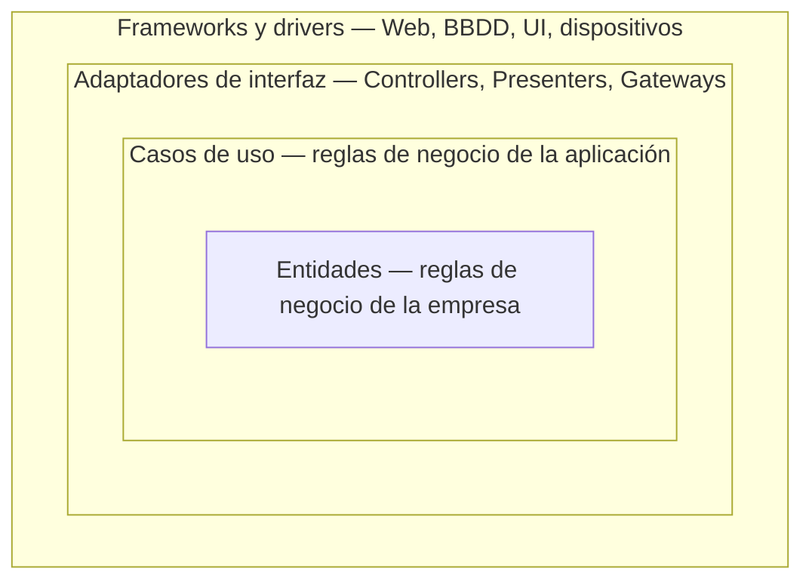
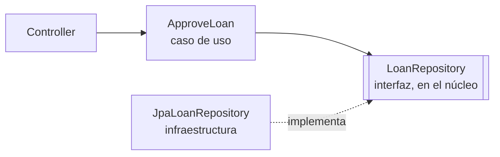

# Arquitectura Limpia (Clean Architecture) <span class="nivel medio">Medio</span>

> *Robert C. Martin, 2017.* Idea central: la arquitectura consiste en **trazar límites** para que las **reglas de
> negocio** no dependan de los detalles (frameworks, base de datos, interfaz, red), de modo que esos detalles puedan
> cambiar sin tocar el negocio.

!!! tip "En una frase"
    El objetivo de la arquitectura es **minimizar el esfuerzo humano** necesario para construir y mantener el sistema.
    Se consigue protegiendo el núcleo de negocio y **retrasando** las decisiones sobre detalles hasta que haya
    información suficiente.

## 1. Los dos valores del software

- **Comportamiento**: que el programa haga hoy lo que tiene que hacer.
- **Estructura** (arquitectura): que sea fácil de cambiar mañana.

Martin sostiene que la **estructura es el más importante**: un programa que funciona pero no se puede cambiar deja de
ser útil en cuanto cambian los requisitos (y siempre cambian); un programa que no funciona pero es fácil de cambiar se
puede arreglar. Negocio siempre presionará por comportamiento; defender la estructura es responsabilidad de ingeniería.

## 2. La regla de dependencias



!!! tip "La regla"
    Las dependencias de **código fuente** solo pueden apuntar **hacia dentro**. Nada de un círculo interior puede
    mencionar el nombre de algo de un círculo exterior: ni clases, ni funciones, ni anotaciones, ni formatos de datos.

| Capa | Contiene | Ejemplo | Cambia cuando… |
|---|---|---|---|
| **Entidades** | Reglas de negocio críticas, que existirían aunque no hubiera software | `Loan`, `Money`, `EdgeNode` con sus invariantes | Cambia el negocio de fondo (raro) |
| **Casos de uso** | Reglas propias de **esta aplicación**: orquestan entidades para un objetivo | `ApproveLoan`, `RolloutToEdgeFleet` | Cambia lo que la aplicación debe hacer |
| **Adaptadores** | Convierten datos entre el formato de los casos de uso y el del exterior | `LoanController`, `JpaLoanRepository` | Cambia la API, la base de datos, la UI |
| **Frameworks y drivers** | Detalles: Spring, PostgreSQL, Kafka, la API de Kubernetes | Configuración, código de arranque | Cambia la tecnología |

Consecuencia: puedes cambiar de base de datos, de framework web o de proveedor de colas modificando **solo** los
círculos exteriores. Y puedes probar entidades y casos de uso **sin** base de datos, servidor web ni framework.

## 3. Cómo se cruza un límite: inversión de dependencias

El caso de uso necesita guardar datos, pero **no puede depender de la base de datos** (está en un círculo exterior).
Solución: el caso de uso **define una interfaz** en su propia capa (un **puerto**) y la capa exterior la **implementa**
(un **adaptador**). En ejecución, el flujo va de dentro hacia fuera; en el código, la dependencia apunta hacia dentro.



```java
// --- núcleo: no importa nada de Spring ni de JPA ---
public interface LoanRepository {                 // puerto de salida, en el lenguaje del negocio
    Optional<Loan> findById(LoanId id);
    void save(Loan loan);
}

public class ApproveLoan {                         // caso de uso
    private final LoanRepository loans;
    private final CreditPolicy policy;

    public ApproveLoan(LoanRepository loans, CreditPolicy policy) {
        this.loans = loans;
        this.policy = policy;
    }

    public void execute(LoanId id) {
        Loan loan = loans.findById(id).orElseThrow(() -> new LoanNotFound(id));
        loan.approve(policy);                      // la regla vive en la entidad
        loans.save(loan);
    }
}

// --- infraestructura: depende del núcleo, nunca al revés ---
@Repository
class JpaLoanRepository implements LoanRepository {
    private final SpringDataLoanJpa jpa;           // repositorio de Spring Data con la entidad JPA
    public Optional<Loan> findById(LoanId id) { return jpa.findById(id.value()).map(LoanMapper::toDomain); }
    public void save(Loan loan) { jpa.save(LoanMapper.toEntity(loan)); }
}
```

Fíjate en que existen **dos modelos**: `Loan` (dominio, sin anotaciones) y `LoanEntity` (JPA). El *mapper* traduce entre ellos.

!!! warning "Trade-off"
    Más interfaces y *mappers* = más código. Compensa cuando el dominio tiene lógica rica o la infraestructura puede
    cambiar. Para un CRUD sencillo es sobreingeniería: se puede empezar con **límites parciales** (una interfaz donde
    haga falta) y endurecerlos cuando el dominio crezca.

### Cruzar el límite hacia fuera: el presentador

Los datos que salen del caso de uso tampoco deben ser objetos del framework. El caso de uso devuelve una estructura
propia (o llama a un "puerto de salida" de presentación) y el adaptador la convierte en JSON, HTML o lo que toque.

## 4. Principios de componentes

Un **componente** es la unidad de despliegue o de publicación (un *jar*, un módulo). Martin propone principios para
decidir qué va en cada componente y cómo se relacionan.

**Cohesión: qué va junto**

| Principio | Idea | Tensión |
|---|---|---|
| **REP** — Reuse/Release Equivalence | Lo que se reutiliza junto se versiona y publica junto | Tiende a componentes grandes |
| **CCP** — Common Closure | Agrupa lo que cambia **por las mismas razones y a la vez** (SRP a nivel de componente) | Tiende a componentes grandes |
| **CRP** — Common Reuse | No obligues a depender de cosas que no usas (ISP a nivel de componente) | Tiende a componentes pequeños |

**Acoplamiento: cómo se relacionan**

| Principio | Idea | Cómo se aplica |
|---|---|---|
| **ADP** — Acyclic Dependencies | **Sin ciclos** en el grafo de dependencias entre componentes | Romper ciclos con DIP (extraer una interfaz) o creando un componente nuevo del que dependan ambos |
| **SDP** — Stable Dependencies | Depender en la dirección de la **estabilidad** | Lo volátil depende de lo estable, nunca al revés |
| **SAP** — Stable Abstractions | Un componente muy estable debe ser **abstracto** | Si todos dependen de él, que sean interfaces: así se extiende sin modificarlo |

**Estabilidad** aquí no significa "que no falla", sino "difícil de cambiar porque muchos dependen de él".

## 5. Otras ideas clave

- **Arquitectura que grita** (*screaming architecture*): la estructura de carpetas debe "gritar" el dominio (`billing/`,
  `fleet/`, `rollout/`), no el framework (`controllers/`, `services/`, `repositories/`). Al abrir el proyecto se debe
  entender **de qué va**, no con qué está hecho.
- **Los detalles son detalles**: la base de datos, la web y los frameworks son *plugins* del negocio, no su centro.
- **El framework es un matrimonio asimétrico**: tú te comprometes con él para siempre; él no se compromete contigo
  (cambia sus APIs cuando quiere). Mantenlo en el borde del sistema.
- ***Humble Object***: separar lo difícil de probar (UI, E/S) en una capa mínima y "tonta" sin lógica; la lógica queda
  en objetos fáciles de probar.
- **Límites parciales**: no siempre hace falta un límite completo (con dos modelos y *mappers*); a veces basta una
  interfaz (*Strategy*) o una fachada. Es una decisión consciente de coste.
- **Main es un *plugin***: el punto de arranque (la "composición raíz", donde se crean y conectan los objetos) es el
  componente más sucio y concreto; conoce todo para ensamblarlo y nadie depende de él.

## 6. Relación con otros estilos

Hexagonal (*Ports & Adapters*, Alistair Cockburn, 2005), Onion (Jeffrey Palermo, 2008) y Clean (Martin, 2012) son
**la misma idea** con distinto dibujo: dominio en el centro, dependencias hacia dentro, infraestructura como adaptadores.
Ver [Estilos de arquitectura](../arquitectura/estilos.md#hexagonal-ports-adapters).

## Estructura de paquetes de ejemplo (Java)

```text
src/main/java/com/acme/fleet/
├── domain/                 # Entidades, value objects, eventos (Java puro, sin anotaciones de frameworks)
│   ├── EdgeNode.java
│   └── RolloutPolicy.java
├── application/            # Casos de uso + puertos
│   ├── RolloutToFleet.java
│   └── port/
│       ├── in/  StartRollout.java                     # lo que la aplicación ofrece
│       └── out/ NodeRegistry.java, GitRepository.java # lo que necesita
└── infrastructure/         # Adaptadores (Spring, JPA, clientes)
    ├── web/ RolloutController.java
    ├── persistence/ JpaNodeRegistry.java
    └── git/ JGitRepository.java
```

## Preguntas de repaso

??? question "Enuncia la regla de dependencias"
    Las dependencias de código fuente solo pueden apuntar **hacia dentro**, hacia políticas de más alto nivel. Lo interno
    no conoce nada de lo externo.

??? question "¿Cómo llama un caso de uso a la base de datos sin depender de ella?"
    Con **inversión de dependencias**: el caso de uso declara una interfaz (puerto) en su propia capa y la infraestructura
    la implementa. En ejecución el flujo va hacia fuera, pero la dependencia de código apunta hacia dentro.

??? question "¿Qué es screaming architecture?"
    Que al ver la estructura del proyecto se entienda **de qué va el negocio**, no qué framework usa.

??? question "¿Cuándo NO aplicarías Clean Architecture completa?"
    En CRUDs simples, prototipos o servicios pequeños y de vida corta: el coste de capas y *mappers* supera el beneficio.
    Se puede empezar con límites parciales y reforzarlos cuando el dominio crece.

??? question "¿Qué dice el principio de dependencias acíclicas y cómo se rompe un ciclo?"
    No debe haber ciclos entre componentes. Se rompe con **DIP** (extraer una interfaz que invierta una de las flechas) o
    creando un **componente nuevo** del que dependan los dos.

## Ejercicios

!!! exercise "Ejercicio 1 · Básico — Encontrar la violación"
    ¿Qué incumple la regla de dependencias?
    ```java
    package com.acme.fleet.domain;
    import jakarta.persistence.Entity;
    import org.springframework.web.client.RestClient;

    @Entity
    public class EdgeNode {
        public void refreshStatus(RestClient client) { ... }
    }
    ```

    ??? success "Solución"
        Dos violaciones: la entidad de dominio depende de **JPA** (`@Entity`, un detalle de persistencia) y de **Spring Web**
        (`RestClient`, un detalle de comunicación). Corrección: `EdgeNode` como clase de dominio pura; una `EdgeNodeEntity`
        con `@Entity` en infraestructura con su *mapper*; y el refresco de estado en un caso de uso que usa un puerto
        `NodeStatusSource` implementado por un adaptador HTTP.

!!! exercise "Ejercicio 2 · Medio — Diseñar un caso de uso con puertos"
    Diseña el caso de uso "Promover una versión al siguiente anillo" de tu plataforma: qué puertos de entrada y salida
    necesita y qué adaptadores los implementan.

    ??? success "Solución"
        - **Puerto de entrada**: `PromoteRelease { PromotionResult promote(ReleaseId release, RingId from, RingId to); }`.
        - **Puertos de salida**: `RingHealth` (¿cumple el anillo los criterios? → métricas), `FleetConfigRepository`
          (leer y proponer el cambio de versión del anillo destino → Git), `PromotionLog` (registrar la promoción),
          `Notifier` (avisar del resultado).
        - **Adaptadores**: entrada → controlador REST y un *job* programado; salida → `PrometheusRingHealth`,
          `GitHubFleetConfigRepository` (abre una PR), `JpaPromotionLog`, `SlackNotifier`.
        - **Prueba** del caso de uso con *fakes* de los cuatro puertos: sin Prometheus, GitHub ni base de datos.

!!! exercise "Ejercicio 3 · Medio — Romper un ciclo"
    El módulo `rollout` depende de `fleet` (para obtener sitios) y `fleet` depende de `rollout` (para mostrar la versión
    desplegada en cada sitio). ¿Cómo rompes el ciclo?

    ??? success "Solución"
        Opción 1 (DIP): `fleet` define una interfaz `DeployedVersionProvider` que `rollout` implementa; `fleet` ya no depende
        de `rollout`. Opción 2: invertir el flujo con eventos: `rollout` publica `VersionDeployed(siteId, version)` y `fleet`
        guarda la versión en su propio modelo. Opción 3: la vista que combina ambos (la ficha del sitio con su versión) pasa
        a un tercer módulo de presentación que depende de los dos. La 2 reduce además el acoplamiento temporal.

!!! exercise "Ejercicio 4 · Avanzado — Hacer cumplir la arquitectura"
    Escribe reglas de ArchUnit que hagan fallar el build si: (a) `domain` depende de Spring o JPA; (b) `application`
    depende de `infrastructure`; (c) hay ciclos entre los paquetes de primer nivel.

    ??? success "Solución"
        ```java
        @AnalyzeClasses(packages = "com.acme.fleet")
        class ArchitectureTest {
            @ArchTest
            static final ArchRule domainIsPure = noClasses().that().resideInAPackage("..domain..")
                .should().dependOnClassesThat()
                .resideInAnyPackage("org.springframework..", "jakarta.persistence..");

            @ArchTest
            static final ArchRule applicationDoesNotKnowInfrastructure = noClasses()
                .that().resideInAPackage("..application..")
                .should().dependOnClassesThat().resideInAPackage("..infrastructure..");

            @ArchTest
            static final ArchRule noCycles = slices().matching("com.acme.fleet.(*)..").should().beFreeOfCycles();

            // Alternativa integral: la regla predefinida de arquitectura en capas / onion
            @ArchTest
            static final ArchRule onion = Architectures.onionArchitecture()
                .domainModels("..domain..")
                .applicationServices("..application..")
                .adapter("web", "..infrastructure.web..")
                .adapter("persistence", "..infrastructure.persistence..");
        }
        ```
        Son *fitness functions*: la arquitectura deja de ser un dibujo y pasa a ser una restricción verificada en cada build.
