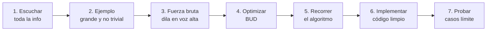

# Cracking the Coding Interview <span class="nivel medio">Medio</span>

> *Gayle Laakmann McDowell, 6ª ed.* Idea central: resolver problemas algorítmicos es un **proceso**
> sistemático (entender, ejemplificar, optimizar, implementar, probar), no inspiración.

!!! tip "En una frase"
    Escucha → ejemplo → fuerza bruta → optimiza (BUD) → recorre → implementa → prueba.
    Explicita tu razonamiento: te obliga a detectar huecos.

## 1. El proceso de resolución en 7 pasos



### Técnica BUD para optimizar

- **B**ottlenecks (cuellos de botella): ¿qué parte domina la complejidad?
- **U**nnecessary work (trabajo innecesario): ¿calculas algo que podrías deducir?
- **D**uplicated work (trabajo duplicado): ¿repites cálculos? → memoriza / hash map.

!!! tip "Pistas que suelen funcionar"
    ¿Array ordenado? → búsqueda binaria o two pointers. ¿"Encuentra pares/duplicados"? → hash set.
    ¿"Top k"? → heap. ¿"Todas las combinaciones"? → backtracking. ¿Subproblemas que se repiten? → DP.

## 2. Big O { #big-o }

Mide cómo **crece** el tiempo (o espacio) con la entrada. Se quitan constantes y términos no dominantes.

| Complejidad | Nombre | Ejemplo |
|---|---|---|
| O(1) | Constante | Acceso a array por índice, get en HashMap |
| O(log n) | Logarítmica | Búsqueda binaria, operación en árbol balanceado |
| O(n) | Lineal | Recorrer una lista |
| O(n log n) | Lineal-logarítmica | Merge sort, heap sort, sort de Java |
| O(n²) | Cuadrática | Dos bucles anidados |
| O(2ⁿ) | Exponencial | Fibonacci recursivo ingenuo, subconjuntos |
| O(n!) | Factorial | Permutaciones |

```java
// O(a + b): bucles consecutivos se SUMAN
for (int x : arrA) print(x);
for (int y : arrB) print(y);

// O(a * b): bucles anidados se MULTIPLICAN
for (int x : arrA)
    for (int y : arrB) print(x + y);

// O(log n): el problema se divide a la mitad en cada paso
while (n > 1) n = n / 2;

// O(2^n): recursión con 2 ramas y profundidad n
int fib(int n) { return n <= 1 ? n : fib(n - 1) + fib(n - 2); }
```

??? question "¿Complejidad de fib con memoización?"
    **O(n)** en tiempo y espacio: cada valor se calcula una sola vez.

??? question "Un bucle i de 0..n y dentro j de i..n, ¿qué complejidad?"
    n + (n-1) + … + 1 = n(n+1)/2 → **O(n²)**.

## 3. Estructuras de datos imprescindibles

| Estructura | Acceso | Búsqueda | Inserción | Uso típico |
|---|---|---|---|---|
| Array / ArrayList | O(1) | O(n) | O(1) amort. al final | Datos indexados |
| LinkedList | O(n) | O(n) | O(1) con referencia | Colas, LRU |
| HashMap / HashSet | — | O(1) media | O(1) media | Conteos, duplicados, índices |
| Stack / Deque | O(1) tope | O(n) | O(1) | Paréntesis, DFS iterativo, *undo* |
| Queue | O(1) frente | O(n) | O(1) | BFS, productores/consumidores |
| Heap (PriorityQueue) | O(1) min | O(n) | O(log n) | Top-k, Dijkstra, *scheduling* |
| Árbol BST balanceado (TreeMap) | O(log n) | O(log n) | O(log n) | Datos ordenados, rangos |
| Trie | — | O(L) | O(L) | Autocompletado, prefijos |
| Grafo (lista de adyacencia) | — | O(V+E) recorrer | O(1) | Redes, dependencias |

Los **patrones** para resolver problemas (two pointers, sliding window, BFS/DFS, DP…) con código están en
[Algoritmos y estructuras de datos](../fundamentos/algoritmos.md).

## 4. Buenas prácticas al implementar

- Escribe código **modular** desde el principio (funciones auxiliares con buen nombre).
- Comprueba casos límite: vacío, un elemento, duplicados, negativos, desbordamiento, `null`.
- Tras escribir, **prueba a mano** con un ejemplo pequeño antes de dar el código por terminado.
- Si te atascas, vuelve al ejemplo y busca patrones; simplifica el problema y generaliza después.

## 5. Más allá del libro

El libro nació para preparar entrevistas, pero su método sirve a diario: al revisar el rendimiento de un
*endpoint*, al elegir una estructura de datos para una caché, o al estimar si un algoritmo aguantará ×100 datos.

## Ejercicios

!!! exercise "Ejercicio 1 · Básico — Aplicar BUD"
    Tienes `boolean hasDuplicates(int[] a)` implementado con dos bucles anidados (O(n²)). Aplica BUD para mejorarlo.

    ??? success "Solución"
        **Cuello de botella**: el bucle interno busca si el elemento ya apareció (O(n) por elemento). **Trabajo duplicado**:
        esa búsqueda repite comparaciones ya hechas. Solución: recordar lo visto en un `HashSet` → O(n) en tiempo, O(n) en
        memoria.
        ```java
        boolean hasDuplicates(int[] a) {
            Set<Integer> seen = new HashSet<>();
            for (int x : a) if (!seen.add(x)) return true;     // add devuelve false si ya estaba
            return false;
        }
        ```
        Alternativa sin memoria extra: ordenar (O(n log n)) y comparar vecinos.

!!! exercise "Ejercicio 2 · Medio — Proceso completo en un problema"
    Aplica los 7 pasos al problema: "dada una lista de intervalos de mantenimiento `[inicio, fin]` de sitios, fusiona los
    que se solapan".

    ??? success "Solución"
        1-2. **Ejemplo** no trivial: `[[1,3],[8,10],[2,6],[15,18],[17,20]]` → `[[1,6],[8,10],[15,20]]`.
        3. **Fuerza bruta**: comparar cada par y fusionar repetidamente → O(n²) o peor.
        4. **Optimizar**: si se **ordenan por inicio**, un intervalo solo puede solaparse con el último fusionado → un recorrido.
        5-6. **Implementar**:
        ```java
        int[][] merge(int[][] intervals) {
            Arrays.sort(intervals, Comparator.comparingInt(i -> i[0]));
            List<int[]> result = new ArrayList<>();
            for (int[] cur : intervals) {
                if (result.isEmpty() || result.getLast()[1] < cur[0]) result.add(cur);   // no solapa
                else result.getLast()[1] = Math.max(result.getLast()[1], cur[1]);        // extender
            }
            return result.toArray(new int[0][]);
        }
        ```
        7. **Probar**: lista vacía, un intervalo, intervalos que se tocan (`[1,2],[2,3]` → se fusionan con `<`), uno
        contenido en otro (`[1,10],[2,3]` → `[1,10]` gracias a `Math.max`). Complejidad: O(n log n) por la ordenación.

!!! exercise "Ejercicio 3 · Avanzado — Explicar una solución"
    Explica por escrito, como lo harías a un compañero, por qué la búsqueda binaria de la "primera versión defectuosa"
    termina siempre y devuelve la respuesta correcta.

    ??? success "Solución"
        Invariante: la primera versión defectuosa está siempre en el intervalo `[lo, hi]`. Al inicio es cierto (`[1, n]`).
        En cada paso, si `mid` es defectuosa, la primera defectuosa es `mid` o anterior → `hi = mid` mantiene el invariante;
        si no lo es, está después → `lo = mid + 1` también. **Termina** porque el intervalo se reduce en cada vuelta
        (`mid < hi` siempre, ya que `mid` redondea hacia abajo), y cuando `lo == hi` el intervalo contiene un único candidato,
        que por el invariante es la respuesta. Explicar invariante + terminación es la forma rigurosa de justificar cualquier bucle.
