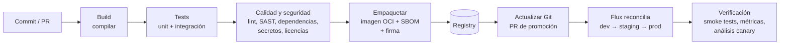

# CI/CD <span class="nivel basico">Básico</span>

La entrega continua convierte cada cambio en algo **pequeño, verificado y desplegable**. Es la práctica técnica con
más impacto demostrado en el rendimiento de los equipos (investigación DORA).

## 1. Conceptos

| Término | Significado |
|---|---|
| **Integración continua (CI)** | Integrar en la rama principal varias veces al día; cada cambio se construye y prueba automáticamente |
| **Entrega continua** (*Continuous Delivery*) | Cada cambio que pasa el *pipeline* está **listo** para producción; el despliegue puede requerir aprobación |
| **Despliegue continuo** (*Continuous Deployment*) | Cada cambio que pasa el *pipeline* llega a producción **sin intervención** |
| **Desplegar ≠ liberar** | El código puede estar en producción desactivado (*feature flags*) y liberarse después |

## 2. Métricas DORA

| Métrica | Mide | Equipos de alto rendimiento (aprox.) |
|---|---|---|
| **Frecuencia de despliegue** | Velocidad | Bajo demanda, varias veces al día |
| ***Lead time* de cambios** | Velocidad | Menos de un día desde el commit a producción |
| **Tasa de fallos de cambios** | Estabilidad | Baja (un pequeño porcentaje de despliegues requiere corrección) |
| **Tiempo de recuperación** | Estabilidad | Menos de una hora |

La investigación muestra que **velocidad y estabilidad no se oponen**: los mejores equipos destacan en las dos,
precisamente porque despliegan cambios pequeños con frecuencia.

## 3. Estrategia de ramas

| Estrategia | Descripción | Cuándo |
|---|---|---|
| ***Trunk-based development*** | Ramas de vida corta (horas, 1-2 días) que se fusionan a `main`; lo incompleto, tras *feature flags* | Recomendada para CI/CD real |
| GitHub Flow | Rama por cambio + PR + fusionar a `main` + desplegar | Equipos pequeños y medianos, muy extendida |
| GitFlow | Ramas `develop`, `release`, `hotfix` de larga duración | Software con versiones empaquetadas; frena la integración continua |

## 4. Anatomía de un pipeline



Principios:

- **Rápido**: *feedback* en menos de 10 minutos (paralelizar, cachear dependencias, tests selectivos).
- **Construir una vez, promover el mismo artefacto**: la imagen que pasó las pruebas es la que llega a producción (por *digest*, no por *tag* mutable).
- **Todo como código**: el *pipeline* versionado junto al código.
- **Reproducible**: versiones fijadas de herramientas e imágenes base.
- **Seguro**: credenciales efímeras (OIDC hacia la nube), mínimos permisos, dependencias fijadas por hash.

### Ejemplo: GitHub Actions + GitOps

```yaml
name: ci
on:
  push: { branches: [main] }
  pull_request:

permissions:
  contents: read
  packages: write
  id-token: write          # OIDC: firmar sin claves y autenticarse en la nube sin secretos

jobs:
  build:
    runs-on: ubuntu-latest
    steps:
      - uses: actions/checkout@v4
      - uses: actions/setup-java@v4
        with: { distribution: temurin, java-version: "21", cache: maven }
      - run: ./mvnw -B verify                            # tests unitarios + integración (Testcontainers)

      - name: Build and push image
        if: github.ref == 'refs/heads/main'
        id: push
        uses: docker/build-push-action@v6
        with:
          push: true
          tags: ghcr.io/${{ github.repository }}:${{ github.sha }}
          sbom: true
          provenance: true

      - uses: sigstore/cosign-installer@v3
        if: github.ref == 'refs/heads/main'
      - name: Sign image (keyless)
        if: github.ref == 'refs/heads/main'
        run: cosign sign --yes ghcr.io/${{ github.repository }}@${{ steps.push.outputs.digest }}
```

Después, el cambio de versión en el repositorio GitOps se hace con una **PR automática** (Renovate, o
*image automation* de Flux) y Flux lo despliega. El CI **nunca** necesita credenciales del clúster.

## 5. Estrategias de despliegue

| Estrategia | Cómo | Ventajas | Coste / riesgo |
|---|---|---|---|
| **Recreate** | Parar la versión vieja, arrancar la nueva | Simple | Caída durante el cambio |
| **Rolling update** | Sustituir instancias poco a poco | Por defecto en K8s, sin caída | Conviven dos versiones; *rollback* lento |
| **Blue-green** | Dos entornos completos; se cambia el tráfico de golpe | *Rollback* instantáneo | Doble infraestructura durante el cambio |
| **Canary** | Un pequeño % del tráfico a la nueva versión, subiendo si las métricas son buenas | Limita el impacto de un fallo | Necesita enrutado fino y métricas fiables |
| ***Feature flags*** | El código nuevo se activa por configuración, por usuario o por porcentaje | Desacopla desplegar y liberar | "Deuda de *flags*" si no se limpian |
| **Oleadas / anillos** (edge) | Lab → sitios piloto → región → toda la flota | Encaja con flotas grandes | Despliegues más largos |

### Progressive delivery con Flagger

```yaml
apiVersion: flagger.app/v1beta1
kind: Canary
metadata: { name: java-api, namespace: java-api }
spec:
  targetRef: { apiVersion: apps/v1, kind: Deployment, name: java-api }
  service: { port: 8080 }
  analysis:
    interval: 1m
    threshold: 5                 # 5 comprobaciones fallidas → rollback automático
    maxWeight: 50
    stepWeight: 10               # 10 % → 20 % → … → 50 % → promoción
    metrics:
      - name: request-success-rate
        thresholdRange: { min: 99 }
      - name: request-duration
        thresholdRange: { max: 500 }
```

## 6. Seguridad de la cadena de suministro

| Práctica | Herramientas |
|---|---|
| **SBOM** (inventario de componentes) | Syft, `docker buildx --sbom`, CycloneDX, SPDX |
| **Escaneo de vulnerabilidades** | Trivy, Grype, Dependabot, Renovate |
| **Firma de artefactos** | **cosign** / Sigstore (sin claves, con OIDC) |
| **Procedencia** (*provenance*) | Atestaciones SLSA generadas por el CI |
| **Verificación en el despliegue** | Kyverno / Sigstore Policy Controller: solo imágenes firmadas por tu CI; Flux verifica artefactos OCI firmados |
| **Secretos** | Nunca en el repo; detección con Gitleaks o *push protection* del proveedor |

**SLSA** (*Supply-chain Levels for Software Artifacts*): niveles progresivos de garantías sobre cómo se construyó un
artefacto (build automatizado, procedencia firmada, build aislado y reproducible).

## Preguntas de repaso

??? question "¿Por qué 'construir una vez y promover'?"
    Para que lo que se prueba sea exactamente lo que se despliega. Reconstruir por entorno puede introducir diferencias
    (dependencias nuevas, otra imagen base) que invalidan las pruebas.

??? question "¿Qué diferencia hay entre entrega continua y despliegue continuo?"
    En la entrega continua cada cambio queda listo para producción, pero desplegar puede requerir una decisión humana.
    En el despliegue continuo, todo cambio que pasa el *pipeline* se despliega automáticamente.

??? question "¿Qué necesita un canary para funcionar bien?"
    Tráfico suficiente para que las métricas sean significativas, métricas que reflejen la salud real (errores, latencia,
    negocio), enrutado por peso y un *rollback* automático si se superan los umbrales.

??? question "¿Por qué referenciar imágenes por digest y no por tag?"
    Un *tag* puede moverse a otra imagen (incluso de forma maliciosa); el *digest* identifica un contenido inmutable. Así
    lo desplegado es verificable y la firma corresponde exactamente a lo que se ejecuta.

## Ejercicios

!!! exercise "Ejercicio 1 · Básico — Calcular las métricas DORA"
    En un mes: 40 despliegues a producción; 4 requirieron *rollback* o parche; el tiempo medio desde commit hasta producción
    fue de 3 días; los incidentes se resolvieron de media en 5 horas. Calcula las métricas y di qué mejorarías primero.

    ??? success "Solución"
        Frecuencia: 40/mes ≈ 2 por día laborable (buena). Tasa de fallos de cambios: 4/40 = **10 %** (aceptable). *Lead time*:
        3 días (mejorable). Tiempo de recuperación: 5 h (mejorable). Prioridad: el **tiempo de recuperación** (mejor
        observabilidad, *rollback* en un paso, *runbooks*) y el ***lead time*** (qué etapa espera más: revisiones, entornos,
        aprobaciones manuales). Medir primero dónde se va el tiempo antes de cambiar nada.

!!! exercise "Ejercicio 2 · Básico — Acelerar un pipeline"
    El *pipeline* de un servicio Java tarda 25 minutos: descarga de dependencias (6 min), compilación (3), tests unitarios
    (4), tests de integración secuenciales (10), construcción de imagen (2). Propón mejoras.

    ??? success "Solución"
        - **Caché de dependencias** Maven/Gradle entre ejecuciones: 6 → ~0,5 min.
        - **Paralelizar** tests de integración (varios *forks* o *jobs* en paralelo) y reutilizar contenedores de
          Testcontainers: 10 → ~4 min.
        - Construcción de imagen con **caché de capas** (dependencias en una capa separada del código): 2 → ~0,5 min.
        - Ejecutar unitarios e integración en *jobs* paralelos tras compilar.
        Resultado aproximado: 25 → **8-9 minutos**.

!!! exercise "Ejercicio 3 · Medio — Elegir estrategia de despliegue"
    Elige estrategia para: (a) una API con mucho tráfico y métricas fiables; (b) un servicio con migración de base de datos
    incompatible; (c) una función nueva que negocio quiere activar para 3 clientes piloto; (d) una actualización de 5 000 sitios edge.

    ??? success "Solución"
        (a) **Canary** con análisis automático (Flagger/Argo Rollouts). (b) **Expand/contract** en la base de datos para que
        ambas versiones convivan, y luego *rolling update* normal; si no es posible, *blue-green* con ventana de mantenimiento.
        (c) **Feature flag** por cliente: se despliega a todos pero se activa solo para los pilotos. (d) **Anillos** (canario
        del 1 %, 10 %, resto) con criterios de salud para avanzar.

!!! exercise "Ejercicio 4 · Avanzado — Cadena de suministro verificable"
    Diseña los controles para que en tus clústeres solo pueda ejecutarse una imagen construida por tu CI desde la rama
    `main` de tus repositorios, sin vulnerabilidades críticas conocidas.

    ??? success "Solución"
        1. **CI**: construye la imagen, genera SBOM y atestación de procedencia (SLSA), escanea con Trivy (falla con CVEs
           críticos) y **firma sin claves** con cosign usando la identidad OIDC del *workflow* (que incluye repositorio y rama).
        2. **Registro**: la imagen se referencia siempre por *digest*.
        3. **Clúster**: política de admisión (Kyverno `verifyImages` o Sigstore Policy Controller) que exige firma válida cuyo
           emisor sea tu proveedor OIDC del CI y cuyo sujeto sea `repo:acme/*` en `refs/heads/main`; rechaza el resto.
        4. **Continuo**: re-escaneo periódico de las imágenes en ejecución para detectar CVEs nuevos y abrir tareas.
