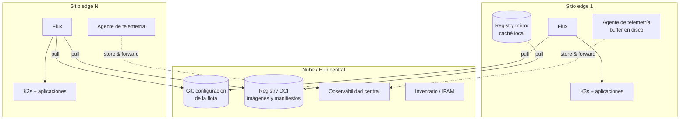

# Edge computing Avanzado

**Edge computing** consiste en ejecutar cómputo **cerca de donde se generan o se usan los datos** (tiendas, fábricas,
antenas, vehículos, oficinas) en lugar de hacerlo solo en un centro de datos central o en la nube.

## 1. Por qué edge

| Motivo | Explicación | Ejemplo |
|---|---|---|
| **Latencia** | La luz tarda ~5 ms por cada 1 000 km de fibra (ida); ir a una región cloud lejana añade decenas de ms | Control de maquinaria, visión artificial en una línea de producción |
| **Ancho de banda y coste** | Enviar todo a la nube es caro (salida de datos, enlaces) | Analizar vídeo en el sitio y enviar solo eventos |
| **Autonomía** | El sitio debe funcionar aunque se corte la conexión | Tiendas que siguen cobrando sin Internet |
| **Soberanía y privacidad** | Algunos datos no deben salir del lugar | Datos sanitarios, industriales o de clientes |

## 2. Niveles de "edge"

| Nivel | Dónde | Ejemplo |
|---|---|---|
| **Dispositivo** | El propio sensor o equipo | Microcontrolador, cámara inteligente |
| **Edge local** (*on-premises*) | Servidores en el sitio | Clúster K3s en una tienda o fábrica |
| **Edge de red / operador** | Centros de datos de operadores, 5G | AWS Wavelength, Azure Operator Nexus |
| **Edge regional / CDN** | Puntos de presencia de proveedores | Cloudflare Workers, Lambda@Edge |

## 3. Retos arquitectónicos

| Reto | Por qué es difícil | Tácticas |
|---|---|---|
| **Conectividad intermitente** | El sitio puede estar horas o días sin enlace | Modelo **pull** (GitOps), colas locales *store-and-forward*, diseño *offline-first* |
| **Escala de flota** | Miles de sitios: nada se puede hacer a mano | Gestión **declarativa** por grupos/etiquetas, automatización total, *zero-touch provisioning* |
| **Recursos limitados** | Pocos núcleos y GB de memoria | Distribuciones ligeras: **K3s**, k0s, MicroK8s, KubeEdge; controladores de bajo consumo |
| **Seguridad física** | Un atacante puede tener el equipo en la mano | *Secure boot*, TPM, cifrado de disco, identidad de dispositivo, *zero trust* |
| **Despliegues arriesgados** | Un error se multiplica por miles de sitios y arreglarlo in situ es carísimo | **Rollouts por anillos**, *rollback* automático, cambios pequeños |
| **Observabilidad** | Mucho dato, poco ancho de banda, conectividad intermitente | Agregación local, *downsampling*, envío diferido |
| **Heterogeneidad** | Distintos modelos de hardware y generaciones | *Overlays* por tipo de hardware, etiquetas de capacidades |

## 4. Arquitectura de referencia: hub & spoke con GitOps

1. El **estado deseado** de todos los sitios vive en Git (base común + particularidades por grupo o sitio).
2. Cada sitio ejecuta su propio **agente GitOps** (Flux) que **tira** de Git y del registro: funciona detrás de NAT y
   sigue operando con el último estado conocido si pierde la conexión.
3. Un **registry mirror** local evita que cientos de nodos descarguen las mismas imágenes a través de enlaces lentos.
4. La telemetría se **agrega y almacena localmente** y se envía cuando hay conexión.

## 5. Patrones útiles

| Patrón | Qué resuelve |
|---|---|
| **Base + overlays por grupo** | Configuración común con diferencias explícitas por región, hardware o anillo |
| **Rollout por anillos** | Laboratorio → sitios piloto (1 %) → primeros (10 %) → resto. Cada anillo es una carpeta con su versión; la promoción es una PR |
| ***Zero-touch provisioning*** | El equipo llega al sitio, se enciende, se identifica (TPM + certificado) y se configura solo |
| **Artefactos OCI firmados** | El sitio verifica que lo que va a ejecutar lo firmó tu CI (cosign) |
| **Actualizaciones A/B del sistema operativo** | Dos particiones: se actualiza la inactiva y se arranca en ella; si falla, se vuelve a la anterior |
| ***Store & forward*** | Datos locales en cola persistente hasta que hay conexión |

## 6. Gestión de flotas: opciones del mercado

| Opción | Enfoque |
|---|---|
| Flux / Argo CD + automatización propia | Máximo control; lo que muchas plataformas edge construyen |
| **Azure Arc** | Plano de control de Azure para clústeres en cualquier sitio; GitOps con Flux integrado |
| **GKE Enterprise / Google Distributed Cloud** | Gestión de flotas de Google, Config Sync |
| **AWS EKS Anywhere / Hybrid Nodes, IoT Greengrass** | Kubernetes de AWS en tus instalaciones; runtime de edge para dispositivos |
| **Rancher Fleet** | GitOps a escala de miles de clústeres (SUSE) |
| **SUSE Edge, Red Hat Device Edge, Canonical** | Pilas completas de SO + Kubernetes para edge |

## Preguntas de repaso

??? question "¿Qué pasa si un sitio edge pierde la conexión una semana?"
    Sigue ejecutando el último estado reconciliado (Flux no borra nada si no puede leer la fuente). Al reconectar,
    reconcilia con el último commit. La telemetría se guarda localmente y se envía después. Hay que vigilar la caducidad de
    credenciales y certificados para que no expiren durante la desconexión.

??? question "¿Cómo despliegas una actualización a miles de sitios sin riesgo?"
    Por anillos, con criterios de salud automáticos (errores, métricas de negocio) para avanzar, capacidad de parar y
    revertir (`git revert` de la promoción), y ventanas de mantenimiento por zona horaria.

??? question "¿Cómo identificas y autenticas un dispositivo?"
    Identidad anclada en hardware (TPM) y certificados X.509 emitidos en el alta, con rotación automática; mTLS hacia el
    hub; credenciales de solo lectura hacia Git y el registro, limitadas a lo que necesita cada sitio y revocables individualmente.

## Ejercicios

!!! exercise "Ejercicio 1 · Básico — Calcular el tráfico de una actualización"
    Una nueva imagen de 800 MB debe llegar a 5 000 sitios. Cada sitio tiene 3 nodos y un enlace de 20 Mbps. ¿Cuánto
    tráfico total y cuánto tarda cada sitio? ¿Qué cambia con un *registry mirror* local?

    ??? success "Solución"
        Sin *mirror*: 3 descargas por sitio → 2,4 GB × 5 000 = **12 TB** de salida desde el registro central (coste de
        salida y carga enorme). Por sitio: 2,4 GB × 8 = 19,2 Gb / 20 Mbps ≈ **16 minutos** (compartiendo el enlace).
        Con *mirror* local: 1 descarga por sitio → 4 TB en total y ~5,5 minutos por sitio; los nodos la toman de la red
        local. Mejoras adicionales: imágenes más pequeñas (distroless), capas compartidas entre versiones, pre-descarga
        antes de la ventana de despliegue.

!!! exercise "Ejercicio 2 · Medio — Diseñar los anillos"
    Tienes 5 000 sitios en 4 regiones y 3 modelos de hardware. Diseña los anillos de despliegue y los criterios para avanzar.

    ??? success "Solución"
        - **Anillo 0 — laboratorio**: un sitio de cada modelo de hardware en tu oficina.
        - **Anillo 1 — canario (~1 %)**: 50 sitios elegidos para cubrir las 4 regiones y los 3 modelos, preferiblemente con
          personal cercano o tolerante.
        - **Anillo 2 — temprano (~10 %)**: 500 sitios representativos.
        - **Anillo 3 — general**: el resto, quizá por región y zona horaria (fuera de horario comercial local).
        Criterios automáticos para avanzar: ≥ 98 % de sitios del anillo con la revisión reconciliada, tasa de errores y de
        reinicios no peor que la línea base, sin alertas críticas nuevas durante 24 h (anillo 1) o 48 h (anillo 2).

!!! exercise "Ejercicio 3 · Avanzado — Sitio comprometido"
    Sospechas que el equipo de un sitio ha sido robado o manipulado. ¿Qué debe permitir tu arquitectura hacer, y cómo?

    ??? success "Solución"
        1. **Revocar su identidad**: revocar su certificado (CRL/OCSP o lista de denegación en el hub) para que no pueda
           autenticarse con mTLS.
        2. **Revocar sus credenciales de solo lectura** hacia Git y el registro (claves de *deploy* por sitio).
        3. **Rotar secretos** que conocía ese sitio (por eso los secretos deben ser por sitio o por grupo pequeño, no globales).
        4. **Aislar** en el inventario y en los tableros (marcar como comprometido; ignorar su telemetría).
        5. **Análisis**: si el disco estaba cifrado con claves ligadas al TPM y *secure boot*, extraer datos es muy difícil.
        Todo esto debe ser un procedimiento automatizado (*runbook* como código), no una improvisación.
