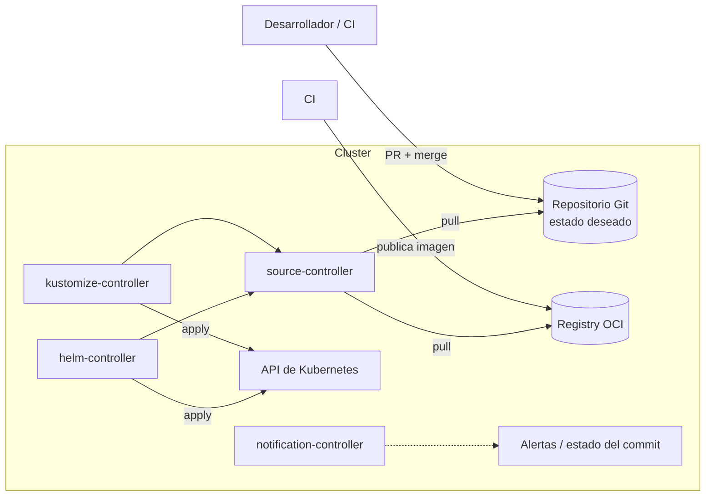

# GitOps <span class="nivel medio">Medio</span>

**GitOps** es un modelo operativo en el que **Git es la fuente de verdad** del estado deseado de la infraestructura y
las aplicaciones, y un **agente dentro del entorno** (el clúster) **reconcilia continuamente** el estado real con lo que
dice Git. Para cambiar algo en producción no se ejecutan comandos: se hace un **commit** (normalmente vía *pull request*).

## 1. Los 4 principios (OpenGitOps, CNCF)

| Principio | Qué significa | Qué aporta |
|---|---|---|
| **1. Declarativo** | El sistema se describe por su **estado deseado** ("3 réplicas de v1.4"), no por pasos ("escala a 3, luego actualiza") | Se puede comparar lo deseado con lo real |
| **2. Versionado e inmutable** | El estado deseado se guarda con **historial completo** e inmutable (Git) | Auditoría, revisión por PR, `git revert` como *rollback* |
| **3. Obtenido automáticamente (*pull*)** | Los agentes **obtienen** el estado deseado de la fuente; nadie lo "empuja" al entorno | El entorno no necesita exponer credenciales ni puertos hacia fuera |
| **4. Reconciliado continuamente** | Los agentes **comparan y corrigen** sin parar, no solo cuando hay un cambio | La deriva (cambios manuales, fallos) se detecta y se corrige |



## 2. Push vs. pull

| | Push (el CI ejecuta `kubectl apply`) | Pull (GitOps) |
|---|---|---|
| **Credenciales** | El CI necesita credenciales con permisos de escritura en el clúster (un objetivo muy valioso para un atacante) | El clúster solo necesita **leer** Git y el registro |
| **Deriva** | Si alguien cambia algo a mano, nadie se entera | Se detecta y se corrige en el siguiente ciclo |
| **Clústeres tras NAT / edge** | El CI tiene que alcanzar cada clúster (VPN, puertos abiertos) | El clúster **sale** hacia Git: funciona detrás de NAT e intermitentemente conectado |
| **Auditoría** | Logs del CI, dispersos | Historial de Git: quién, qué, cuándo, aprobado por quién |
| **Rollback** | Relanzar un *pipeline* anterior | `git revert` |
| **Escala** | El CI debe conocer y alcanzar todos los clústeres | Cada clúster se ocupa de sí mismo |

## 3. Flux vs. Argo CD

| | Flux v2 | Argo CD |
|---|---|---|
| Arquitectura | Conjunto de controladores independientes (GitOps Toolkit) | Aplicación con servidor de API, servidor de repositorios y controlador |
| Interfaz | Sin UI propia (UIs de terceros, Grafana, Headlamp) | **UI web** muy completa |
| Modelo de objetos | CRDs: `GitRepository`, `OCIRepository`, `Kustomization`, `HelmRelease` | CRD `Application` / `ApplicationSet` |
| Multi-clúster | Habitualmente una instancia **en cada clúster** | Habitualmente **una instancia central** que gestiona muchos (hub-spoke) |
| Consumo | Ligero | Mayor |
| Multi-tenancy | Por *namespace* y ServiceAccount de cada `Kustomization` | Por proyectos (`AppProject`) y RBAC propio |
| Encaja en | Edge, todo como código, automatización | Equipos que valoran la visibilidad y la UI |

Ambos son proyectos graduados de la CNCF y cumplen los principios de GitOps. Azure (extensión GitOps de AKS/Arc) usa
Flux por debajo.

## 4. Flux en detalle

### Fuentes y aplicación

```yaml
apiVersion: source.toolkit.fluxcd.io/v1
kind: GitRepository
metadata:
  name: platform
  namespace: flux-system
spec:
  interval: 5m                 # cada cuánto comprueba si hay commits nuevos
  url: https://github.com/acme/cac-gitops-platform
  ref: { branch: main }
---
apiVersion: kustomize.toolkit.fluxcd.io/v1
kind: Kustomization
metadata:
  name: apps
  namespace: flux-system
spec:
  interval: 10m                # cada cuánto reconcilia aunque no haya cambios (corrige la deriva)
  sourceRef: { kind: GitRepository, name: platform }
  path: ./clusters/kind-dev/apps
  prune: true                  # borra del clúster lo que se elimina de Git
  wait: true                   # espera a que los recursos estén sanos para marcar Ready
  timeout: 5m
  dependsOn:
    - name: infrastructure     # no aplicar apps hasta que la infraestructura esté lista
```

| Campo | Para qué |
|---|---|
| `interval` | Frecuencia de reconciliación; también se puede disparar al instante con un *webhook* (`Receiver`) |
| `prune` | *Garbage collection*: sin él, lo que borras de Git se queda huérfano en el clúster |
| `dependsOn` | Orden entre `Kustomizations` (CRDs y controladores antes que las apps que los usan) |
| `wait` / `healthChecks` | No dar por buena una reconciliación hasta que los recursos estén sanos |
| `suspend` | Pausar la reconciliación (emergencias) |
| `serviceAccountName` | Aplicar con los permisos de una cuenta concreta (multi-tenancy) |
| `decryption` | Descifrar secretos SOPS al aplicar |

### Comandos útiles

```bash
flux get kustomizations -A                 # estado de todas las Kustomizations
flux reconcile kustomization apps --with-source   # forzar reconciliación ahora
flux logs --level=error                    # errores de los controladores
flux diff kustomization apps --path ./clusters/kind-dev/apps   # qué cambiaría antes de hacer merge
flux suspend kustomization apps            # pausar (y flux resume para reanudar)
flux tree kustomization apps               # qué recursos gestiona
```

## 5. Estructura de repositorios

| Estrategia | Descripción | Cuándo |
|---|---|---|
| **Monorepo** | Infraestructura, apps y clústeres en un solo repositorio | Equipos pequeños o medianos; visión global |
| **Repositorio por equipo o app** | Cada equipo gestiona sus manifiestos; el repositorio de plataforma los referencia | Organizaciones grandes; autonomía |
| **Repositorio por entorno** | `staging` y `prod` separados | Control de acceso estricto por entorno |
| **Base + overlays** (Kustomize) | `base/` común y un *overlay* por clúster o grupo con solo las diferencias | Flotas de clústeres parecidos (edge) |

```text
├── clusters/                  # punto de entrada por clúster: lo que Flux sincroniza
│   ├── kind-dev/
│   │   ├── flux-system/       # la propia instalación de Flux
│   │   ├── infrastructure.yaml    # Kustomization → ./infrastructure
│   │   └── apps.yaml              # Kustomization → ./apps/overlays/dev (dependsOn infrastructure)
│   └── edge-site-042/
├── infrastructure/            # controladores, CRDs, namespaces, políticas comunes
└── apps/
    ├── base/                  # manifiestos comunes
    └── overlays/
        ├── dev/               # parches: réplicas, recursos, imagen
        └── edge/
```

!!! warning "Evita ramas por entorno"
    Tener ramas `dev`, `staging`, `prod` y "promocionar" con *merges* entre ramas genera divergencias difíciles de
    reconciliar. Es preferible **una rama** y **carpetas por entorno**: la promoción es un cambio explícito y revisable
    en una carpeta.

## 6. Promoción entre entornos

1. El CI construye la imagen `java-api:1.5.0` y la publica.
2. Una herramienta abre una **PR** que cambia la versión en `apps/overlays/dev` (Flux *image automation* o Renovate).
3. Tras el *merge*, Flux la despliega en dev; se ejecutan pruebas automáticas.
4. Otra PR (automática o manual) copia la versión a `staging`, y después a `prod` (o a los anillos de la flota edge).

Cada paso es un commit revisable y reversible.

## 7. Secretos

Nunca en claro en Git. Opciones:

| Opción | Cómo | Cuándo |
|---|---|---|
| **SOPS** (+ age o KMS) | Ficheros cifrados en Git; Flux los descifra al aplicar | Autonomía total (edge), sin servicios adicionales |
| **Sealed Secrets** | Cifrados con la clave pública del controlador de cada clúster | Pocos clústeres |
| **External Secrets Operator** | En Git solo la **referencia**; el valor se lee de Vault o del gestor de secretos cloud | Rotación centralizada; clústeres con conectividad |

## 8. Temas avanzados

- **Progressive delivery**: Flagger o Argo Rollouts despliegan *canary* o *blue-green* analizando métricas y revierten solos.
- **Artefactos OCI**: publicar los manifiestos como artefactos OCI **firmados** (cosign) y que Flux verifique la firma
  antes de aplicar; el clúster ya no necesita acceso a Git.
- **Multi-tenancy**: cada equipo con su `Kustomization`, su *namespace* y una ServiceAccount con permisos limitados.
- ***Break-glass***: en una emergencia se puede suspender la reconciliación, arreglar a mano y **reflejar después el
  cambio en Git**; si no, Flux lo revertirá en el siguiente ciclo.
- **Notificaciones**: `Alert` y `Provider` de Flux envían eventos a Slack, Teams o actualizan el estado del commit en GitHub.

## Preguntas de repaso

??? question "¿Qué ventaja de seguridad tiene el modelo pull?"
    El CI no necesita credenciales del clúster; el clúster solo necesita **leer** de Git y del registro. Se reduce la
    superficie de ataque y no hay que abrir el API server hacia fuera.

??? question "¿Qué hace prune: true?"
    Elimina del clúster los recursos que se han borrado de Git (*garbage collection*), para que el clúster refleje
    exactamente lo declarado.

??? question "¿Qué pasa si alguien cambia un Deployment a mano con kubectl?"
    En la siguiente reconciliación, Flux detecta la diferencia con Git y **revierte** el cambio. Si el cambio era
    necesario, debe hacerse en Git.

??? question "¿Cómo gestionas secretos en GitOps?"
    Nunca en claro. Cifrados en Git (SOPS, Sealed Secrets) o referenciados desde un gestor externo (External Secrets +
    Vault/KMS). Flux descifra SOPS de forma nativa.

## Ejercicios

!!! exercise "Ejercicio 1 · Básico — Ordenar la instalación"
    Tu plataforma necesita: los CRDs de cert-manager, el controlador de cert-manager, un `ClusterIssuer` y las aplicaciones
    que piden certificados. Diseña las `Kustomizations` y sus dependencias.

    ??? success "Solución"
        ```yaml
        # 1. infra-controllers: CRDs + controlador de cert-manager (HelmRelease), wait: true
        # 2. infra-configs: ClusterIssuer             → dependsOn: [infra-controllers]
        # 3. apps: aplicaciones con Certificate       → dependsOn: [infra-configs]
        apiVersion: kustomize.toolkit.fluxcd.io/v1
        kind: Kustomization
        metadata: { name: infra-configs, namespace: flux-system }
        spec:
          interval: 10m
          sourceRef: { kind: GitRepository, name: platform }
          path: ./infrastructure/configs
          prune: true
          dependsOn: [{ name: infra-controllers }]
        ```
        Sin separar, Flux intentaría crear el `ClusterIssuer` antes de que exista su CRD y fallaría la reconciliación entera.

!!! exercise "Ejercicio 2 · Básico — Rollback"
    Una versión desplegada en producción vía GitOps provoca errores. Describe el *rollback* correcto y qué NO hacer.

    ??? success "Solución"
        Correcto: `git revert` del commit que cambió la versión, PR rápida (o *merge* directo según la política de
        emergencias) y `flux reconcile` para no esperar al intervalo. Así el historial refleja lo ocurrido.
        No hacer: `kubectl rollout undo` o editar el Deployment a mano sin tocar Git: Flux lo revertiría a la versión mala
        en el siguiente ciclo. Si hay que actuar a mano por urgencia, primero `flux suspend`, y reflejar el cambio en Git después.

!!! exercise "Ejercicio 3 · Medio — Overlay para la flota edge"
    Con una base común, crea un *overlay* para los sitios edge que reduzca réplicas a 1, baje los recursos y añada una
    tolerancia para nodos marcados `edge=true:NoSchedule`.

    ??? success "Solución"
        ```yaml
        # apps/overlays/edge/kustomization.yaml
        apiVersion: kustomize.config.k8s.io/v1beta1
        kind: Kustomization
        resources: [../../base]
        replicas:
          - name: java-api
            count: 1
        patches:
          - target: { kind: Deployment, name: java-api }
            patch: |-
              - op: replace
                path: /spec/template/spec/containers/0/resources
                value: { requests: { cpu: 100m, memory: 256Mi }, limits: { memory: 256Mi } }
              - op: add
                path: /spec/template/spec/tolerations
                value: [{ key: edge, operator: Equal, value: "true", effect: NoSchedule }]
        ```
        Verificación en CI: `kustomize build apps/overlays/edge | kubeconform -strict -`.

!!! exercise "Ejercicio 4 · Medio — Multi-tenancy"
    Dos equipos (pagos y catálogo) comparten clúster. Cada uno debe poder desplegar solo en su *namespace* desde su propio
    repositorio. Diseña la configuración de Flux.

    ??? success "Solución"
        Para cada equipo: un *namespace*, una ServiceAccount con un `RoleBinding` que le da permisos **solo** en ese
        *namespace*, un `GitRepository` apuntando a su repositorio, y una `Kustomization` con `targetNamespace` y
        `serviceAccountName` de esa cuenta.
        ```yaml
        apiVersion: kustomize.toolkit.fluxcd.io/v1
        kind: Kustomization
        metadata: { name: payments, namespace: payments }
        spec:
          interval: 5m
          sourceRef: { kind: GitRepository, name: payments-repo }
          path: ./deploy
          prune: true
          targetNamespace: payments
          serviceAccountName: payments-reconciler     # Flux aplica con SUS permisos, no con los de administrador
        ```
        Además, en los controladores de Flux, `--no-cross-namespace-refs=true` impide que un equipo referencie fuentes de otro.

!!! exercise "Ejercicio 5 · Avanzado — Promoción por anillos en la flota"
    Diseña cómo una nueva versión llega a 5 000 sitios edge en anillos (laboratorio → 1 % → 10 % → 100 %) solo con Git y
    Flux, con parada automática si algo va mal.

    ??? success "Solución"
        - Estructura: `fleet/rings/{lab,canary,early,general}/kustomization.yaml`, cada anillo con su versión fijada.
          Cada sitio pertenece a un anillo (su `clusters/site-NNN/apps.yaml` apunta a la carpeta de su anillo).
        - Promoción: PR que cambia la versión en el anillo siguiente. Un **bot** la abre automáticamente cuando el anillo
          anterior cumple criterios: X % de sitios con la revisión reconciliada (métricas de Flux) y tasa de errores bajo
          el umbral durante N horas.
        - Parada: si las métricas del anillo superan el umbral, el bot no promociona y abre una PR de `revert` en ese anillo.
        - Todo queda en Git: qué versión tiene cada anillo, quién aprobó cada promoción, y el *rollback* es un `revert`.
