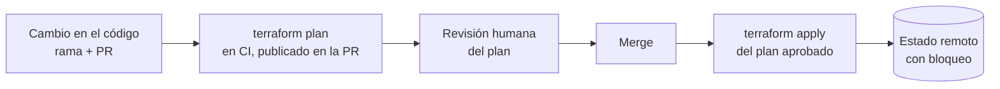

# IaC y Config as Code <span class="nivel medio">Medio</span>

- **Infrastructure as Code (IaC)**: la infraestructura (redes, máquinas, clústeres, bases de datos, permisos) se define
  en **ficheros de código** versionados, revisados y aplicados por herramientas, en lugar de crearse a mano en una consola.
- **Configuration as Code (CaC)**: lo mismo para la **configuración** de sistemas y aplicaciones: ficheros declarativos,
  validados en CI y desplegados de forma automática (por ejemplo vía GitOps).

## 1. Por qué

| Problema de lo manual | Cómo lo resuelve el código |
|---|---|
| Nadie sabe exactamente qué hay ni por qué | El repositorio **es** la documentación, con historial |
| Entornos que "casi" son iguales (y fallan distinto) | El mismo código crea entornos idénticos, con diferencias explícitas |
| Cambios sin revisión que rompen producción | Revisión por *pull request* y validación automática |
| Recrear un entorno tras un desastre lleva semanas | Se vuelve a aplicar el código |
| Cambios manuales que se olvidan (**deriva**) | Detección automática de diferencias entre código y realidad |

## 2. Declarativo vs. imperativo

| | Declarativo | Imperativo |
|---|---|---|
| Describes | **Qué** estado quieres ("una VPC con 3 subredes") | **Cómo** llegar ("crea la VPC, luego la subred 1…") |
| Repetir la ejecución | No cambia nada si ya está en ese estado (**idempotente** por naturaleza) | Puede duplicar recursos si no se programa con cuidado |
| La herramienta | Calcula la diferencia y los pasos | Ejecuta tus pasos |
| Ejemplos | Terraform, manifiestos de Kubernetes, CloudFormation, Crossplane | Scripts bash, SDKs; Ansible es mayormente procedimental pero con módulos idempotentes |

## 3. Herramientas y cuándo usar cada una

| Herramienta | Para qué | Notas |
|---|---|---|
| **Terraform / OpenTofu** | Aprovisionar infraestructura en cualquier nube u on-prem | Lenguaje HCL, enorme ecosistema de *providers*. OpenTofu es la bifurcación abierta tras el cambio de licencia de Terraform |
| **Pulumi / AWS CDK** | Lo mismo con lenguajes de programación (TypeScript, Python, Java) | Útil con lógica compleja y para reutilizar tests y abstracciones del lenguaje |
| **CloudFormation / Bicep / ARM** | IaC nativo de AWS / Azure | Sin estado que gestionar; solo para su nube |
| **Crossplane** | Infraestructura cloud gestionada como **recursos de Kubernetes** | La infraestructura también se reconcilia continuamente (GitOps para la infra) |
| **Ansible** | Configurar sistemas operativos y *bootstrapping* | Sin agente (SSH); útil para preparar nodos edge antes de Kubernetes |
| **Kustomize / Helm** | Configuración de aplicaciones en Kubernetes | Kustomize: parches sobre YAML sin plantillas; Helm: plantillas + paquetes versionados |
| **CUE / KCL / Jsonnet** | Lenguajes de configuración con tipos y validación | Generan YAML/JSON sin errores de tipo |

## 4. Terraform en profundidad

### Conceptos

| Concepto | Qué es |
|---|---|
| ***Provider*** | *Plugin* que sabe hablar con una API (AWS, Azure, Kubernetes, GitHub…) |
| ***Resource*** | Un objeto que Terraform gestiona (`aws_vpc`, `azurerm_storage_account`) |
| ***Data source*** | Lectura de algo que existe pero Terraform no gestiona |
| **Módulo** | Grupo reutilizable de recursos con variables de entrada y salidas |
| **Estado (`tfstate`)** | Fichero que **mapea** cada recurso del código con el objeto real (su ID) y guarda sus atributos |
| ***Plan*** | Cálculo de la diferencia entre código, estado y realidad: qué se creará, cambiará o destruirá |

### Flujo de trabajo



```hcl
terraform {
  required_version = ">= 1.6"
  required_providers {
    aws = { source = "hashicorp/aws", version = "~> 5.0" }   # fijar versiones evita sorpresas
  }
  backend "s3" {                       # estado remoto compartido + bloqueo: imprescindible en equipo
    bucket         = "acme-tfstate"
    key            = "edge/network.tfstate"
    region         = "eu-west-1"
    dynamodb_table = "tf-locks"        # evita dos apply simultáneos
    encrypt        = true
  }
}

variable "environment" { type = string }

module "vpc" {
  source  = "terraform-aws-modules/vpc/aws"
  version = "~> 5.0"
  name    = "edge-hub-${var.environment}"
  cidr    = "10.20.0.0/16"
  azs             = ["eu-west-1a", "eu-west-1b", "eu-west-1c"]
  private_subnets = ["10.20.1.0/24", "10.20.2.0/24", "10.20.3.0/24"]
  public_subnets  = ["10.20.101.0/24", "10.20.102.0/24", "10.20.103.0/24"]
  tags = { environment = var.environment, owner = "platform" }
}

output "vpc_id" { value = module.vpc.vpc_id }
```

### Buenas prácticas de Terraform

- **Estado remoto con bloqueo y cifrado**; nunca el `tfstate` en Git (contiene secretos en claro).
- **Estados pequeños**: separar por entorno y por capa (red, clúster, aplicaciones). Un estado gigante hace los *plans*
  lentos y aumenta el radio de impacto de un error.
- **Módulos versionados** para reutilizar; no copiar y pegar.
- **Revisar siempre el plan**: prestar especial atención a las líneas `-/+` (**destruir y recrear**), que en una base de
  datos significan perder los datos.
- `prevent_destroy` en recursos críticos; `terraform import` o bloques `import` para adoptar recursos creados a mano.
- **Detectar deriva**: ejecutar `terraform plan` programado y alertar si hay cambios no esperados.

## 5. Buenas prácticas de Configuration as Code

- **Todo en Git**, todo cambio por PR. Nada de cambios manuales (y si los hay, se detectan como deriva).
- **Validación en CI** antes de fusionar: sintaxis, esquemas, políticas.
- **DRY con moderación**: base + *overlays*; demasiadas capas de abstracción hacen ilegible qué se despliega realmente.
- **Separar configuración y secretos**.
- **Diferencias entre entornos explícitas y mínimas**: si producción es muy distinta de pruebas, las pruebas no prueban nada.
- **Renderizar y revisar el resultado final** (`kustomize build`, `helm template`) en la PR, no solo el código fuente.

```bash
# Validación típica en CI para un repositorio GitOps
kustomize build clusters/kind-dev | kubeconform -strict -summary -
kustomize build clusters/kind-dev | conftest test --policy policy/ -
```

## 6. Policy as Code

Las **políticas** (reglas de cumplimiento, seguridad, costes) se escriben como código y se aplican automáticamente, en
dos momentos: en **CI** (antes de fusionar) y en la **admisión** del clúster (antes de crear el recurso).

| Herramienta | Lenguaje | Dónde |
|---|---|---|
| **OPA / Conftest / Gatekeeper** | Rego | CI y admisión en Kubernetes; también Terraform |
| **Kyverno** | YAML | Admisión en Kubernetes y CI (CLI) |
| **Checkov / tfsec / Trivy** | Reglas predefinidas | Escaneo de Terraform, Kubernetes, Dockerfiles |
| **Sentinel** | Propio | Terraform Enterprise / HCP |

```yaml
# Kyverno: exigir límites de memoria en todos los Pods
apiVersion: kyverno.io/v1
kind: ClusterPolicy
metadata:
  name: require-memory-limits
spec:
  validationFailureAction: Enforce        # Audit solo avisaría
  rules:
    - name: memory-limits
      match: { any: [{ resources: { kinds: [Pod] } }] }
      validate:
        message: "Todos los contenedores deben declarar limits.memory"
        pattern:
          spec:
            containers:
              - resources: { limits: { memory: "?*" } }
```

```rego
# Conftest (Rego): prohibir la etiqueta :latest en las imágenes
package main

deny[msg] {
  input.kind == "Deployment"
  container := input.spec.template.spec.containers[_]
  endswith(container.image, ":latest")
  msg := sprintf("El contenedor %s usa la etiqueta latest", [container.name])
}
```

## Preguntas de repaso

??? question "¿Por qué es crítico el estado remoto con bloqueo en Terraform?"
    El `tfstate` mapea el código con los recursos reales. Sin estado compartido, cada persona tendría una visión distinta y
    Terraform intentaría crear duplicados; sin bloqueo, dos `apply` simultáneos pueden corromperlo.

??? question "Helm vs. Kustomize"
    Helm: plantillas con variables, paquetes versionados (*charts*), ideal para **distribuir** software a terceros.
    Kustomize: parches sobre YAML plano sin plantillas, ideal para **variantes** por entorno de tu propia configuración.
    Se combinan a menudo (Flux `HelmRelease` + parches de Kustomize).

??? question "¿Qué es la deriva y cómo se combate?"
    La diferencia entre el estado declarado y el real, normalmente por cambios manuales. Se combate con reconciliación
    continua (GitOps, Crossplane), `terraform plan` programado con alertas, y restringiendo los permisos de escritura manual.

## Ejercicios

!!! exercise "Ejercicio 1 · Básico — Leer un plan"
    El plan de Terraform muestra: `-/+ resource "aws_db_instance" "main" { ~ engine_version = "15.4" -> "16.2" # forces replacement }`.
    ¿Qué significa y qué haces?

    ??? success "Solución"
        `-/+` significa **destruir y volver a crear** la base de datos: se perderían los datos. Algunos cambios de atributos
        no se pueden aplicar "en caliente" y fuerzan el reemplazo. Acciones: **no aplicar**; investigar si el *provider*
        permite la actualización sin recrear (por ejemplo `allow_major_version_upgrade = true` en RDS para actualizar en el
        sitio), planificar la actualización mayor con copia de seguridad y ventana de mantenimiento, y proteger el recurso
        con `lifecycle { prevent_destroy = true }`.

!!! exercise "Ejercicio 2 · Básico — Organizar el estado"
    Un único estado de Terraform gestiona la red, 3 clústeres EKS, 12 bases de datos y los permisos IAM de todos los
    entornos. Un `plan` tarda 20 minutos y todos temen tocarlo. ¿Cómo lo reorganizas?

    ??? success "Solución"
        Separar en estados por **entorno** (dev/staging/prod) y por **capa** con distinto ritmo de cambio: `network`,
        `clusters`, `data`, `iam`. Las capas superiores leen las salidas de las inferiores (`terraform_remote_state` o, mejor,
        *data sources* por etiquetas). Migrar con bloques `moved`/`import` o `terraform state mv` sin recrear recursos.
        Resultado: *plans* rápidos, permisos por capa y un error en una capa no amenaza a las demás.

!!! exercise "Ejercicio 3 · Medio — Política en CI"
    Escribe una política Conftest que exija que todos los Deployments tengan las etiquetas `owner` y `cost-center`.

    ??? success "Solución"
        ```rego
        package main

        required := {"owner", "cost-center"}

        deny[msg] {
          input.kind == "Deployment"
          labels := object.get(input.metadata, "labels", {})
          missing := required - {k | labels[k]}
          count(missing) > 0
          msg := sprintf("%s: faltan las etiquetas %v", [input.metadata.name, missing])
        }
        ```
        En CI: `kustomize build apps/overlays/prod | conftest test --policy policy/ -`. La misma regla en Kyverno con
        `Enforce` impide además crearlos en el clúster si alguien los aplicara fuera del *pipeline*.

!!! exercise "Ejercicio 4 · Avanzado — IaC para una flota edge"
    Tienes que dar de alta 50 sitios nuevos al mes. Cada uno necesita: rango IP, certificados, registro DNS, directorio en
    el repositorio GitOps y entrada en el inventario. Diseña el proceso como código.

    ??? success "Solución"
        - Un fichero declarativo por sitio (`sites/site-051.yaml`: código, región, hardware, anillo) es la **fuente de verdad**.
        - Al fusionar la PR del sitio, el CI: (1) valida el fichero (esquema, que el rango IP no se solape); (2) ejecuta
          Terraform (o Crossplane) para IP, DNS y registro en inventario; (3) genera `clusters/site-051/` desde una plantilla
          (Kustomize con el *overlay* de su anillo); (4) emite o solicita los certificados.
        - El sitio arranca con una imagen genérica que, con su identidad, instala Flux y se sincroniza con su directorio (*zero-touch*).
        - Dar de baja = PR que elimina el fichero: el mismo proceso en sentido inverso (y `prune` en GitOps).
