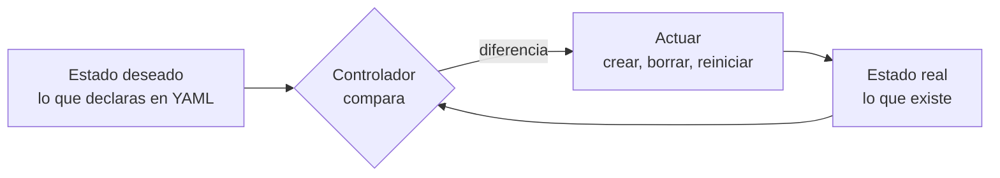
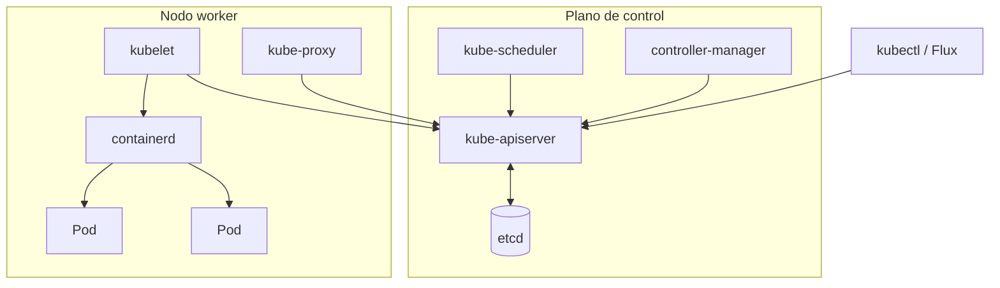
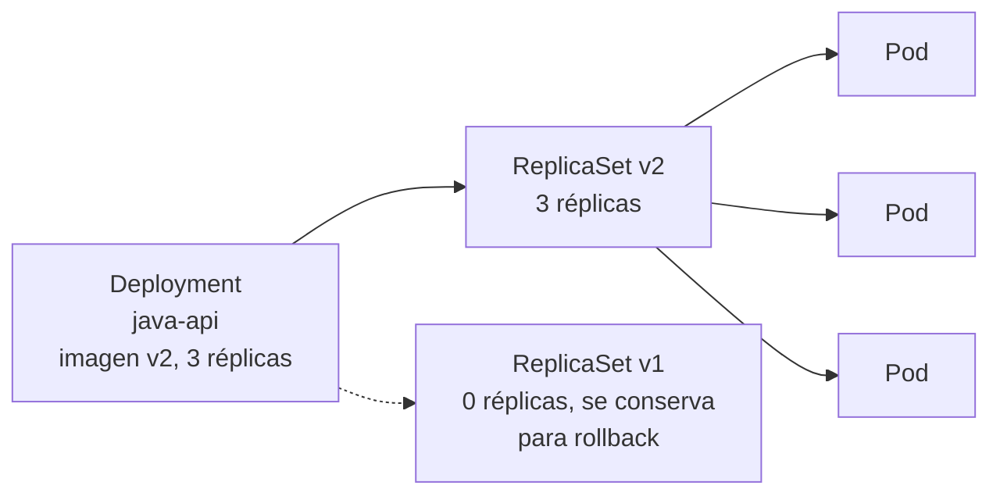

# Kubernetes <span class="nivel medio">Medio</span>

Kubernetes es un **orquestador de contenedores declarativo**: tú describes el **estado deseado** ("quiero 3 réplicas de
esta imagen, con estos recursos, accesibles en este puerto") y un conjunto de **controladores** trabaja continuamente
para que el estado real coincida con el deseado, reaccionando a fallos sin intervención humana.

## 1. La idea central: el bucle de reconciliación



Cada controlador repite indefinidamente: **observar** el estado real, **compararlo** con el deseado, **actuar** para
reducir la diferencia. Si un nodo muere y se pierden 2 réplicas, el controlador ve "hay 1, deberían ser 3" y crea 2 nuevas
en otros nodos. Este mismo patrón es la base de **GitOps**: Flux es un controlador cuyo estado deseado está en Git.

## 2. Arquitectura



| Componente | Qué hace |
|---|---|
| **kube-apiserver** | La **única puerta de entrada**: todos (kubectl, controladores, kubelets) hablan con él. Autentica, autoriza, valida y guarda en etcd |
| **etcd** | Base de datos clave-valor distribuida (consenso Raft) con **todo** el estado del clúster. Si se pierde sin copia, se pierde el clúster |
| **kube-scheduler** | Decide en qué nodo se ejecuta cada Pod nuevo según recursos libres, afinidades, restricciones |
| **controller-manager** | Ejecuta los controladores integrados (Deployment, ReplicaSet, Node, Job…) |
| **kubelet** | Agente en cada nodo: arranca los contenedores de los Pods asignados y vigila su salud |
| **Runtime de contenedores** | containerd o CRI-O: ejecuta realmente los contenedores |
| **kube-proxy** | Programa las reglas de red para que los Services lleguen a los Pods (iptables/IPVS; o eBPF con Cilium) |

## 3. Objetos principales

| Objeto | Para qué | Detalle clave |
|---|---|---|
| **Pod** | Unidad mínima de despliegue: uno o varios contenedores que comparten red (misma IP) y volúmenes | Efímero: si muere, no "revive"; lo sustituye otro nuevo con otra IP |
| **Deployment** | Aplicaciones **sin estado**: mantiene N réplicas y gestiona actualizaciones | Crea un **ReplicaSet** por versión; *rolling update* y *rollback* |
| **StatefulSet** | Aplicaciones **con estado** (bases de datos) | Nombres estables (`db-0`, `db-1`), volumen propio por réplica, arranque ordenado |
| **DaemonSet** | Un Pod **en cada nodo** | Agentes de logs, métricas, CNI |
| **Job / CronJob** | Tareas que terminan / programadas | Reintentos, paralelismo, historial |
| **Service** | Dirección **estable** para un grupo de Pods (que cambian de IP) | `ClusterIP` (interno), `NodePort`, `LoadBalancer` |
| **Ingress / Gateway API** | Entrada HTTP(S) desde fuera, enrutado por host y ruta | Gateway API es el sucesor, con más capacidades |
| **ConfigMap / Secret** | Configuración / datos sensibles, montados como variables o ficheros | Los Secrets solo están en base64: ver [Seguridad](seguridad.md) |
| **PersistentVolume / Claim / StorageClass** | Almacenamiento que sobrevive a los Pods | El *Claim* pide; la *StorageClass* aprovisiona dinámicamente |
| **Namespace** | Aislamiento lógico: nombres, cuotas, permisos | No aísla la red por sí solo (para eso, NetworkPolicies) |
| **CRD + Operator** | Extender la API con tipos propios y su controlador | Así funcionan Flux, cert-manager, operadores de bases de datos |

### Cómo se relacionan Deployment, ReplicaSet y Pod



Al cambiar la imagen, el Deployment crea un ReplicaSet nuevo y va subiendo sus réplicas mientras baja las del antiguo
(según `maxSurge` y `maxUnavailable`). `kubectl rollout undo` vuelve al ReplicaSet anterior.

## 4. Un Deployment completo, explicado

```yaml
apiVersion: apps/v1
kind: Deployment
metadata:
  name: java-api
  namespace: java-api
spec:
  replicas: 3
  strategy:
    rollingUpdate:
      maxSurge: 1            # como mucho 1 Pod extra durante la actualización (4 en total)
      maxUnavailable: 0      # nunca menos de 3 Pods listos: sin pérdida de capacidad
  selector:
    matchLabels: { app: java-api }          # qué Pods gestiona este Deployment
  template:
    metadata:
      labels: { app: java-api }
    spec:
      containers:
        - name: app
          image: ghcr.io/acme/java-api:1.4.2    # en producción, mejor fijar por digest (@sha256:…)
          ports: [{ containerPort: 8080 }]
          resources:
            requests: { cpu: 250m, memory: 512Mi }   # lo que el scheduler reserva en el nodo
            limits:   { memory: 512Mi }              # techo: si lo supera, el contenedor muere (OOMKilled)
          startupProbe:                              # da tiempo a arrancar antes de aplicar las demás
            httpGet: { path: /actuator/health/liveness, port: 8080 }
            failureThreshold: 30
            periodSeconds: 5
          readinessProbe:                            # ¿puede recibir tráfico ahora?
            httpGet: { path: /actuator/health/readiness, port: 8080 }
            periodSeconds: 5
          livenessProbe:                             # ¿está bloqueado y hay que reiniciarlo?
            httpGet: { path: /actuator/health/liveness, port: 8080 }
            periodSeconds: 10
```

## 5. Recursos: requests y limits

| | `requests` | `limits` |
|---|---|---|
| Para qué | El **scheduler** lo usa para elegir un nodo con hueco; garantiza ese mínimo | **Techo** que el contenedor no puede superar |
| CPU | Reparto proporcional cuando hay contención | Si se supera la cuota, el contenedor queda **estrangulado** (*throttling*) aunque el nodo tenga CPU libre |
| Memoria | Reserva | Si se supera, el kernel **mata** el contenedor (OOMKilled) |

**Clases de calidad de servicio (QoS)**, que deciden qué Pods se desalojan primero si el nodo se queda sin memoria:

| Clase | Cuándo | Prioridad al desalojar |
|---|---|---|
| **Guaranteed** | `requests` = `limits` en CPU y memoria de todos los contenedores | Los últimos en ser desalojados |
| **Burstable** | Hay `requests` pero son menores que los `limits` | Intermedia |
| **BestEffort** | Sin `requests` ni `limits` | Los primeros |

!!! tip "Práctica habitual"
    Poner siempre `requests` (sin ellos el scheduler no sabe cuánto ocupa el Pod) y límite de **memoria**. El límite de
    **CPU** provoca *throttling* y muchos equipos no lo ponen, confiando en los `requests` para el reparto.

## 6. Probes: cómo sabe Kubernetes si un Pod está bien

| Probe | Pregunta | Si falla |
|---|---|---|
| **startup** | ¿Ha terminado de arrancar? | Se sigue esperando; las otras probes no se evalúan hasta que pase |
| **readiness** | ¿Puede recibir tráfico **ahora**? | Se **saca del Service** (no recibe peticiones) pero **no se reinicia** |
| **liveness** | ¿Está bloqueado sin remedio? | Se **reinicia** el contenedor |

!!! warning "El error clásico"
    Una *liveness* que comprueba la base de datos: si la BBDD va lenta, **todos** los Pods fallan la *liveness*, se
    reinician a la vez y el servicio cae por completo (y la BBDD recibe una avalancha de conexiones al arrancar).
    La *liveness* solo debe comprobar el propio proceso; las dependencias, en todo caso, en la *readiness*.

## 7. Escalado

| Mecanismo | Escala | Según |
|---|---|---|
| **HPA** (*Horizontal Pod Autoscaler*) | Nº de réplicas de un Deployment | CPU, memoria o métricas propias (peticiones/s, cola) |
| **VPA** (*Vertical Pod Autoscaler*) | `requests` de los Pods | Consumo histórico (útil para recomendar tamaños) |
| **Cluster Autoscaler / Karpenter** | Nº de **nodos** | Pods pendientes que no caben |
| **KEDA** | Réplicas (incluido a cero) | Eventos: longitud de una cola, *lag* de Kafka, cron |

```yaml
apiVersion: autoscaling/v2
kind: HorizontalPodAutoscaler
metadata: { name: java-api, namespace: java-api }
spec:
  scaleTargetRef: { apiVersion: apps/v1, kind: Deployment, name: java-api }
  minReplicas: 3
  maxReplicas: 20
  metrics:
    - type: Resource
      resource:
        name: cpu
        target: { type: Utilization, averageUtilization: 70 }   # % respecto a los requests
```

## 8. Planificación (scheduling)

| Mecanismo | Para qué | Ejemplo |
|---|---|---|
| `nodeSelector` / *node affinity* | Poner Pods en ciertos nodos | Solo en nodos con GPU |
| *Pod anti-affinity* | Separar réplicas | No poner dos réplicas en el mismo nodo |
| **Taints y tolerations** | Reservar nodos: solo los Pods que "toleran" la marca pueden ir | Nodos dedicados a bases de datos |
| **Topology spread constraints** | Repartir réplicas entre zonas o nodos | Una réplica por zona de disponibilidad |
| **PriorityClass** | Qué Pods desalojar primero si falta sitio | Los críticos del sistema, con prioridad alta |

## 9. Disponibilidad y mantenimiento

- **PodDisruptionBudget (PDB)**: cuántas réplicas pueden estar caídas durante interrupciones **voluntarias** (drenar
  un nodo para actualizarlo). Sin él, un `kubectl drain` puede tumbar todas las réplicas a la vez.
- Réplicas repartidas entre **zonas** y nodos.
- Apagado ordenado: al recibir `SIGTERM`, la aplicación deja de aceptar peticiones y termina las activas dentro de
  `terminationGracePeriodSeconds`.

```yaml
apiVersion: policy/v1
kind: PodDisruptionBudget
metadata: { name: java-api, namespace: java-api }
spec:
  minAvailable: 2
  selector: { matchLabels: { app: java-api } }
```

## 10. Red y seguridad (resumen)

- **Red**: cada Pod tiene su IP y todos se ven entre sí (lo implementa el **CNI**: Calico, Cilium, Flannel). Detalle en
  [Redes](../fundamentos/redes.md#8-redes-en-kubernetes).
- **NetworkPolicy**: firewall entre Pods; empezar por denegar todo en cada *namespace* y abrir lo necesario.
- **RBAC**: permisos sobre la API (quién puede hacer qué, en qué *namespace*); **ServiceAccounts** para los Pods.
- **Pod Security Standards** y *admission controllers* (Kyverno, OPA Gatekeeper) para impedir configuraciones inseguras.
  Detalle en [Seguridad](seguridad.md#6-seguridad-en-kubernetes).

## 11. Qué ocurre al aplicar un Deployment, paso a paso

1. `kubectl apply` (o Flux) envía el objeto al **apiserver**, que lo autentica, autoriza (RBAC), pasa por los
   *admission controllers* (que pueden modificarlo o rechazarlo) y lo guarda en **etcd**.
2. El **controlador de Deployments** detecta el objeto nuevo y crea un **ReplicaSet**.
3. El **controlador de ReplicaSets** crea los **Pods** (sin nodo asignado).
4. El **scheduler** asigna cada Pod a un nodo.
5. El **kubelet** de ese nodo descarga la imagen y arranca los contenedores mediante el runtime.
6. Cuando pasan las *probes* de arranque y *readiness*, el Pod queda **Ready** y el Service lo incluye en sus *endpoints*.

## Preguntas de repaso

??? question "Readiness vs. liveness"
    Si falla la *readiness*, el Pod sale del balanceo pero **no se reinicia** (útil mientras arranca o si una dependencia
    está caída). Si falla la *liveness*, el kubelet **reinicia** el contenedor (útil si el proceso se ha bloqueado).

??? question "¿Por qué el plano de control usa 3 o 5 nodos de etcd?"
    Raft necesita mayoría (quórum) para escribir. Con 3 nodos tolera 1 fallo; con 5, 2 fallos. Un número par no añade
    tolerancia (4 nodos siguen tolerando solo 1).

??? question "¿Qué es un Operator?"
    Un controlador personalizado más sus CRDs, que automatiza la operación de una aplicación (instalar, actualizar, hacer
    copias de seguridad, recuperarse de fallos) codificando el conocimiento de un operador humano. Flux es un conjunto de operadores.

??? question "¿Para qué sirve un PodDisruptionBudget?"
    Para limitar cuántas réplicas pueden estar caídas durante interrupciones voluntarias (drenado de nodos, actualizaciones),
    evitando que el mantenimiento tumbe el servicio.

## Ejercicios

!!! exercise "Ejercicio 1 · Básico — Diagnosticar un Pod"
    Un Pod está en `CrashLoopBackOff`. ¿Qué comandos ejecutas y en qué orden para encontrar la causa?

    ??? success "Solución"
        1. `kubectl describe pod <pod> -n <ns>`: eventos (imagen no encontrada, OOMKilled, *probes* fallando) y el
           `Last State` con el código de salida (137 = matado por señal, típicamente OOM; 1 = error de la aplicación).
        2. `kubectl logs <pod> -n <ns> --previous`: logs del contenedor **anterior** (el que falló), no del que está arrancando.
        3. Si es OOMKilled: revisar `limits.memory` y el consumo real (`kubectl top pod`).
        4. Si es la *liveness*: comprobar si el arranque tarda más que su margen (añadir *startupProbe*).
        5. Si es configuración: `kubectl get configmap/secret` y variables de entorno del Pod.

!!! exercise "Ejercicio 2 · Básico — Calcular el rolling update"
    Deployment con 10 réplicas, `maxSurge: 25%` y `maxUnavailable: 25%`. Durante la actualización, ¿cuántos Pods puede
    haber como máximo en total y cuántos listos como mínimo?

    ??? success "Solución"
        `maxSurge` 25 % de 10 = 2,5 → se **redondea hacia arriba**: 3 → máximo **13** Pods. `maxUnavailable` 25 % de 10 =
        2,5 → se **redondea hacia abajo**: 2 → mínimo **8** Pods disponibles. Con `maxUnavailable: 0` la actualización nunca
        reduce capacidad pero es más lenta y necesita hueco en los nodos para los Pods extra.

!!! exercise "Ejercicio 3 · Medio — Alta disponibilidad real"
    Tienes 3 réplicas de un servicio crítico en un clúster con 3 zonas. Escribe la configuración para que (a) haya una
    réplica por zona, (b) un drenado de nodos nunca deje menos de 2 disponibles, y (c) el tráfico solo llegue a Pods listos.

    ??? success "Solución"
        ```yaml
        # (a) en el spec del Pod template
        topologySpreadConstraints:
          - maxSkew: 1
            topologyKey: topology.kubernetes.io/zone
            whenUnsatisfiable: DoNotSchedule
            labelSelector: { matchLabels: { app: critical-api } }
        ---
        # (b)
        apiVersion: policy/v1
        kind: PodDisruptionBudget
        metadata: { name: critical-api }
        spec:
          minAvailable: 2
          selector: { matchLabels: { app: critical-api } }
        ```
        (c) Una `readinessProbe` que refleje si el Pod puede atender (y que el Service seleccione por la etiqueta
        `app: critical-api`). Con `DoNotSchedule`, si una zona cae, la réplica de esa zona queda pendiente en lugar de
        amontonarse en otra: decide si prefieres `ScheduleAnyway` para no perder capacidad.

!!! exercise "Ejercicio 4 · Medio — Probes correctas"
    Un servicio Spring tarda 60 s en arrancar y depende de PostgreSQL y de un servicio de catálogo opcional. Diseña sus
    tres *probes* explicando qué comprueba cada una.

    ??? success "Solución"
        - **startup**: `/actuator/health/liveness` cada 5 s con `failureThreshold: 24` (hasta 120 s de margen). Evita que la
          *liveness* lo mate mientras arranca.
        - **readiness**: `/actuator/health/readiness`, que incluye PostgreSQL (sin BBDD no puede atender peticiones: mejor no
          recibirlas) pero **no** el catálogo opcional (si cae, el servicio degrada sin dejar de atender).
        - **liveness**: `/actuator/health/liveness`, que solo comprueba el estado interno de la aplicación (no dependencias
          externas), para reiniciar únicamente si el proceso está realmente bloqueado.

!!! exercise "Ejercicio 5 · Avanzado — Pods pendientes"
    Tras desplegar, 4 de 10 Pods quedan en `Pending` con el evento `0/6 nodes are available: 3 Insufficient memory,
    3 node(s) had untolerated taint {dedicated: gpu}`. Explica el mensaje y propón soluciones.

    ??? success "Solución"
        El scheduler no encuentra nodo: 3 nodos no tienen memoria libre suficiente para los `requests` del Pod, y los otros 3
        tienen un *taint* `dedicated=gpu` que el Pod no tolera (están reservados para cargas de GPU). Soluciones: (1) revisar
        si los `requests.memory` son realistas (quizá están sobredimensionados, VPA ayuda a medirlo); (2) añadir nodos o
        activar el autoescalado de nodos (Cluster Autoscaler / Karpenter), que precisamente reacciona a Pods pendientes;
        (3) no tolerar el *taint* de GPU salvo que el servicio lo necesite (sería malgastar nodos caros).
