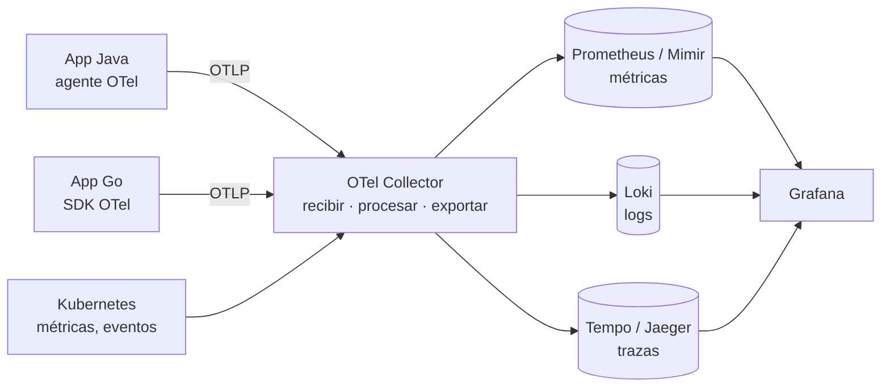
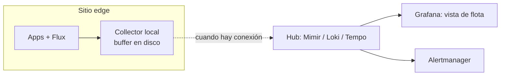

# Observabilidad <span class="nivel medio">Medio</span>

**Monitorización** responde preguntas conocidas de antemano ("¿está caído?", "¿CPU > 90 %?"). **Observabilidad** es la
capacidad de responder preguntas **nuevas** sobre el sistema a partir de las señales que emite, sin desplegar código
nuevo. En sistemas distribuidos, los fallos son casi siempre nuevos.

## 1. Las señales

| Señal | Qué es | Pregunta que responde | Coste principal |
|---|---|---|---|
| **Métricas** | Series numéricas agregadas en el tiempo | ¿Cuánto? ¿Con qué tendencia? ¿Hay que alertar? | **Cardinalidad** (combinaciones de etiquetas) |
| **Logs** | Eventos discretos con contexto | ¿Qué pasó exactamente en este caso? | Volumen (GB ingeridos y retenidos) |
| **Trazas** | Recorrido de una petición a través de servicios (*spans*) | ¿Dónde se va el tiempo? ¿Qué servicio falla? | Volumen → muestreo |
| **Perfiles** | Uso de CPU/memoria por función, continuo | ¿Qué código consume los recursos? | Bajo con eBPF |
| **Eventos** | Cambios relevantes: despliegues, reconciliaciones, *feature flags* | ¿Qué cambió justo antes del problema? | Bajo |

!!! tip "Correlación"
    El valor está en **saltar entre señales**: de una alerta de métrica a las trazas lentas de ese momento (*exemplars*),
    de una traza a los logs con su `trace_id`, y de ahí al despliegue que lo introdujo.

## 2. OpenTelemetry

Estándar abierto (CNCF) para **instrumentar, recoger y exportar** métricas, logs y trazas sin atarse a un proveedor.



- **Autoinstrumentación**: en Java, el agente (`-javaagent:opentelemetry-javaagent.jar`) instrumenta HTTP, JDBC, Kafka… sin tocar código.
- **Collector**: procesa en el camino (filtrar, muestrear, añadir atributos de Kubernetes, enrutar a varios destinos).
- **Propagación de contexto**: cabecera W3C `traceparent` entre servicios para unir los *spans* en una traza.
- **Convenciones semánticas**: nombres estándar de atributos (`http.request.method`, `db.system`…), incluidas las de IA generativa.

```yaml
# Collector (extracto): recibir OTLP, añadir metadatos de K8s, muestrear y exportar
receivers:
  otlp: { protocols: { grpc: {}, http: {} } }
processors:
  k8sattributes: {}
  batch: {}
  tail_sampling:
    policies:
      - { name: errores, type: status_code, status_code: { status_codes: [ERROR] } }
      - { name: lentas,  type: latency, latency: { threshold_ms: 500 } }
      - { name: resto,   type: probabilistic, probabilistic: { sampling_percentage: 5 } }
exporters:
  otlphttp/tempo: { endpoint: http://tempo:4318 }
service:
  pipelines:
    traces: { receivers: [otlp], processors: [k8sattributes, tail_sampling, batch], exporters: [otlphttp/tempo] }
```

## 3. Métodos: qué medir

| Método | Para | Señales |
|---|---|---|
| **RED** | Servicios (peticiones) | *Rate* (peticiones/s), *Errors* (% fallidas), *Duration* (latencia p50/p95/p99) |
| **USE** | Recursos (CPU, memoria, disco, red) | *Utilization*, *Saturation* (colas, *throttling*), *Errors* |
| **4 golden signals** (Google SRE) | Todo | Latencia, tráfico, errores, saturación |

!!! warning "Medias que mienten"
    La latencia media oculta la experiencia de los usuarios más afectados. Usa **percentiles** (p95, p99) calculados con
    **histogramas**, nunca promedios de percentiles entre instancias.

### Prometheus en 1 minuto

- Modelo *pull*: Prometheus rasca `/metrics` de cada objetivo (en K8s, vía ServiceMonitor/PodMonitor).
- Tipos: **counter** (solo crece: peticiones), **gauge** (sube y baja: memoria), **histogram** (distribuciones: latencia).
- Etiquetas = dimensiones. **Nunca** IDs de usuario, URLs completas o *timestamps* como etiqueta (explosión de cardinalidad).

```promql
# Tasa de errores 5xx por servicio (últimos 5 min)
sum by (service) (rate(http_server_requests_seconds_count{status=~"5.."}[5m]))
  / sum by (service) (rate(http_server_requests_seconds_count[5m]))

# Latencia p99 a partir de un histograma
histogram_quantile(0.99, sum by (le, service) (rate(http_server_requests_seconds_bucket[5m])))

# Kustomizations de Flux que no están listas
gotk_resource_info{customresource_kind="Kustomization", ready="False"}
```

## 4. Logs útiles

- **Estructurados** (JSON), con campos consistentes: `timestamp`, `level`, `service`, `trace_id`, `span_id`, y contexto de negocio (`site_id`).
- Niveles con criterio: `ERROR` = requiere acción; `WARN` = anómalo pero gestionado; `INFO` = hitos; `DEBUG` desactivado en producción.
- **Nada de secretos ni datos personales** en logs.
- Controlar el coste: muestreo de logs repetitivos, retención por nivel, archivar en almacenamiento de objetos.

```json
{"ts":"2026-09-26T10:14:03Z","level":"ERROR","service":"rollout-api","trace_id":"4bf92f35…",
 "site_id":"site-042","msg":"Reconciliation failed","reason":"HealthCheckFailed","revision":"def456"}
```

## 5. SLI, SLO, SLA y presupuesto de errores

| Concepto | Qué es | Ejemplo |
|---|---|---|
| **SLI** | Indicador medido desde el punto de vista del usuario | % de peticiones de redirección con éxito y < 300 ms |
| **SLO** | Objetivo interno para el SLI en una ventana | 99,9 % en 30 días |
| **SLA** | Compromiso contractual, con penalizaciones (más laxo que el SLO) | 99,5 % mensual o descuento en factura |
| **Presupuesto de errores** | 100 % − SLO | 0,1 % ≈ 43 min al mes de "fallo permitido" |

!!! tip "El presupuesto de errores como herramienta de gestión"
    Si queda presupuesto, se puede arriesgar (desplegar más rápido, experimentar). Si se agota, se prioriza la fiabilidad
    sobre las funcionalidades. Convierte la discusión "velocidad vs. estabilidad" en datos.

### Alertas por *burn rate*

Alertar cuando el presupuesto se consume demasiado rápido, en dos ventanas (una larga y una corta, para evitar falsos positivos):

| Severidad | Condición (SLO 99,9 %) | Significa |
|---|---|---|
| Página (urgente) | *Burn rate* > 14,4 en 1 h **y** en 5 min | Se agotaría el presupuesto mensual en ~2 días |
| Página | *Burn rate* > 6 en 6 h y en 30 min | En ~5 días |
| Ticket | *Burn rate* > 1 en 3 días | Tendencia a incumplir el SLO |

Principios de alertas: alertar por **síntomas** que afectan al usuario (errores, latencia), no por causas (CPU alta);
cada alerta debe ser **accionable** y tener un *runbook* enlazado; si nadie actúa ante una alerta, bórrala.

## 6. Stack de referencia

| Función | Open source | Gestionado |
|---|---|---|
| Métricas | Prometheus + Thanos/Mimir (largo plazo, multi-clúster) | Managed Prometheus (AWS, Azure, GCP), Grafana Cloud |
| Logs | Loki, OpenSearch | CloudWatch Logs, Log Analytics, Cloud Logging |
| Trazas | Tempo, Jaeger | X-Ray, Application Insights, Cloud Trace |
| Perfiles | Pyroscope, Parca | — |
| Visualización | Grafana | Grafana gestionado |
| Todo en uno | — | Datadog, New Relic, Dynatrace, Honeycomb, Elastic |

## 7. Observabilidad de una flota edge

- **Agregación local**: un Collector/Prometheus ligero por sitio que agrega y reduce resolución (*downsampling*).
- ***Store & forward***: *buffer* en disco cuando no hay conexión; envío al recuperarla (Prometheus *remote write* con WAL, colas del Collector).
- **Pocas métricas de flota, bien elegidas**: sitio vivo (*heartbeat*), revisión reconciliada vs. esperada, *Kustomizations* no listas, salud de nodos.
- **Métricas de Flux** (`gotk_*`) y eventos (`notification-controller` → Slack, Teams, *webhooks*).
- **Cardinalidad**: `site_id` como etiqueta está bien con cientos o miles de sitios; con cientos de miles, agregar por región.



## Preguntas de repaso

??? question "¿Qué diferencia hay entre monitorización y observabilidad?"
    La monitorización comprueba condiciones conocidas; la observabilidad permite investigar comportamientos desconocidos
    explorando señales ricas y correlacionadas (trazas, logs estructurados, métricas con dimensiones).

??? question "¿Por qué no usar el ID de usuario como etiqueta de una métrica?"
    Cada valor distinto crea una serie temporal nueva: millones de usuarios = millones de series, lo que dispara memoria
    y coste del sistema de métricas. Ese detalle va en logs o trazas.

??? question "¿Qué es el tail sampling y por qué es mejor que el head sampling?"
    El *head sampling* decide al inicio de la petición (al azar) si se guarda la traza; el *tail sampling* decide al final,
    cuando ya se sabe si fue un error o lenta, y así conserva las trazas interesantes y descarta las normales.

??? question "¿Cuánto tiempo de caída permite un SLO de 99,9 % mensual?"
    Unos 43 minutos en 30 días (0,1 % de 43 200 minutos).

## Ejercicios

!!! exercise "Ejercicio 1 · Básico — ¿Métrica, log o traza?"
    ¿Qué señal usarías para: (a) saber cuántos despliegues fallan por hora; (b) entender por qué falló el despliegue de
    site-042 a las 10:14; (c) averiguar qué servicio añade 800 ms a una petición concreta; (d) ver qué función consume más CPU?

    ??? success "Solución"
        (a) **Métrica** (contador con etiqueta de resultado). (b) **Logs** (y eventos) de ese despliegue, filtrados por
        `site_id` y hora. (c) **Traza** distribuida de esa petición: el *span* más largo señala el servicio. (d) **Perfil**
        continuo (*flame graph*).

!!! exercise "Ejercicio 2 · Básico — Presupuesto de errores"
    SLO de disponibilidad del 99,5 % en 30 días. El servicio recibe 10 M de peticiones al mes. ¿Cuántas pueden fallar?
    Si en los primeros 10 días han fallado 40 000, ¿qué haces?

    ??? success "Solución"
        Presupuesto = 0,5 % de 10 M = **50 000** peticiones fallidas al mes. En 10 días se han consumido 40 000 (80 % del
        presupuesto en un tercio del periodo): a este ritmo se incumplirá el SLO. Según la política de presupuesto: congelar
        despliegues de funcionalidades no urgentes, priorizar la causa de los fallos y revisar si hubo un incidente concreto.

!!! exercise "Ejercicio 3 · Medio — Escribir PromQL"
    Escribe consultas para: (a) peticiones por segundo por servicio; (b) porcentaje de errores 5xx por servicio;
    (c) p95 de latencia por *endpoint*; (d) Pods que se han reiniciado más de 3 veces en la última hora.

    ??? success "Solución"
        ```promql
        # (a)
        sum by (service) (rate(http_server_requests_seconds_count[5m]))

        # (b)
        100 * sum by (service) (rate(http_server_requests_seconds_count{status=~"5.."}[5m]))
            / sum by (service) (rate(http_server_requests_seconds_count[5m]))

        # (c)
        histogram_quantile(0.95, sum by (le, uri) (rate(http_server_requests_seconds_bucket[5m])))

        # (d)
        increase(kube_pod_container_status_restarts_total[1h]) > 3
        ```
        Claves: `rate` sobre contadores (nunca sobre el valor bruto), `sum by (le, …)` antes de `histogram_quantile`, e
        `increase` para "cuántos en un periodo".

!!! exercise "Ejercicio 4 · Medio — Alerta mal diseñada"
    Tienes esta alerta: "CPU del nodo > 80 % durante 5 minutos → avisar a la persona de guardia". Salta varias veces por
    semana de madrugada y casi nunca hay nada que hacer. ¿Cómo la rediseñas?

    ??? success "Solución"
        Es una alerta por **causa**, no por **síntoma**: una CPU alta no significa que los usuarios estén afectados. Sustituir
        por alertas de síntoma basadas en SLO (tasa de errores y latencia con *burn rate*) que sí avisan de noche. La CPU
        alta pasa a ser un **ticket** o una señal en el dashboard (capacidad), y se revisa el autoescalado. Regla: si una
        alerta que despierta a alguien no requiere acción, se elimina o se degrada.

!!! exercise "Ejercicio 5 · Avanzado — Instrumentar un flujo"
    Quieres ver en una única traza todo el recorrido de un *rollout*: la petición a la API, el mensaje en Kafka y el
    procesamiento del consumidor que actualiza el estado. ¿Qué necesitas?

    ??? success "Solución"
        1. Instrumentación OpenTelemetry en ambos servicios (el agente Java instrumenta HTTP y el cliente de Kafka automáticamente).
        2. **Propagación de contexto en el mensaje**: el productor inserta `traceparent` en las **cabeceras** del registro de
           Kafka y el consumidor lo extrae (la instrumentación automática de Kafka lo hace).
        3. El *span* del consumidor se enlaza con el del productor (como hijo o mediante un *link*, porque el procesamiento es asíncrono).
        4. Atributos de negocio en los *spans* (`rollout.id`, `site.id`) para buscar la traza por ellos.
        5. *Tail sampling* que conserve siempre las trazas con error o lentas.
