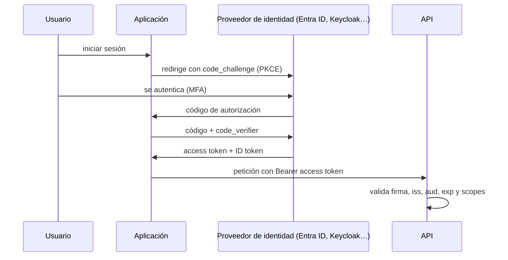

# Seguridad <span class="nivel medio">Medio</span>

La seguridad es una **característica de la arquitectura**, no una fase al final. Se diseña por capas, asumiendo que
alguna fallará.

## 1. Principios

| Principio | En la práctica |
|---|---|
| **Defensa en profundidad** | Varias capas independientes: red, identidad, aplicación, datos, detección |
| **Mínimo privilegio** | Cada identidad (persona o servicio) con solo los permisos que necesita, el tiempo que los necesita |
| **Zero trust** | No confiar por estar "dentro de la red": autenticar y autorizar cada petición por identidad |
| **Seguro por defecto** | La configuración por defecto es la segura (puertos cerrados, cifrado activo, *default deny*) |
| ***Shift left*** | Seguridad desde el diseño y en el CI, no solo en auditorías finales |
| **Reducir la superficie de ataque** | Menos dependencias, imágenes mínimas, menos puertos y menos privilegios |
| **Asumir la brecha** | Detección, registro, segmentación y capacidad de respuesta |

## 2. Modelado de amenazas: STRIDE

Preguntas: ¿qué estamos construyendo?, ¿qué puede salir mal?, ¿qué hacemos al respecto?, ¿lo hemos hecho bien?

| Amenaza | Viola | Ejemplo en una plataforma GitOps edge | Mitigación |
|---|---|---|---|
| **S**poofing (suplantación) | Autenticación | Un dispositivo falso se registra como sitio | Identidad de dispositivo con TPM + certificados, mTLS |
| **T**ampering (manipulación) | Integridad | Alguien modifica manifiestos o imágenes | Commits firmados, PRs obligatorias, imágenes y artefactos OCI firmados y verificados |
| **R**epudiation | No repudio | Un cambio en producción sin rastro | Auditoría: historial de Git, CloudTrail/logs de auditoría de K8s |
| **I**nformation disclosure | Confidencialidad | Secretos en el repositorio | SOPS / External Secrets, escaneo de secretos |
| **D**enial of service | Disponibilidad | Saturar el API o el registro | *Rate limiting*, cuotas, caché de imágenes local |
| **E**levation of privilege | Autorización | Un Pod escapa al nodo | Pod Security Standards, sin contenedores privilegiados, RBAC mínimo |

## 3. Identidad y acceso

### OAuth 2.0 y OpenID Connect

| Concepto | Qué es |
|---|---|
| **OAuth 2.0** | **Autorización delegada**: una aplicación obtiene un *access token* para actuar sobre recursos en nombre de alguien |
| **OpenID Connect** | Capa de **autenticación** sobre OAuth: añade el *ID token* (quién es el usuario) |
| **Authorization Code + PKCE** | Flujo recomendado para apps web, móviles y SPAs |
| **Client Credentials** | Servicio a servicio, sin usuario |
| **Device Code** | Dispositivos sin navegador (CLIs, equipos edge) |
| ***Access token*** | Corta duración (minutos); **JWT** firmado o token opaco |
| ***Refresh token*** | Obtener nuevos *access tokens*; guardado de forma segura y rotado |



### Modelos de autorización

| Modelo | Decide por | Ejemplo |
|---|---|---|
| **RBAC** | Rol del usuario | `platform-admin` puede modificar clústeres |
| **ABAC** | Atributos (usuario, recurso, contexto) | Puede ver sitios de **su región** en **horario laboral** |
| **ReBAC** | Relaciones entre entidades | Puede editar el sitio si es miembro del equipo propietario (Zanzibar, OpenFGA, SpiceDB) |
| ***Policy as code*** | Reglas externalizadas y versionadas | OPA/Rego, Cedar, Kyverno |

### Identidad de cargas de trabajo

Nada de claves estáticas: **identidades federadas** de corta duración — IRSA/Pod Identity (AWS), Workload Identity
(Azure, GCP), **SPIFFE/SPIRE** para identidades de servicio portables, OIDC desde el CI.

## 4. OWASP Top 10 (aplicaciones web, edición 2025)

La lista de referencia de los riesgos más críticos en aplicaciones web. La edición **2025** (publicada en enero de 2026)
sustituye a la de 2021.

| # | Riesgo | Qué es | Ejemplo | Mitigación |
|---|---|---|---|---|
| A01 | **Control de acceso roto** | El usuario accede a datos o acciones que no le corresponden (ahora incluye SSRF) | Cambiar `/sites/42` por `/sites/43` y ver datos ajenos | Autorización por objeto en cada petición; denegar por defecto |
| A02 | **Mala configuración de seguridad** | Valores por defecto inseguros, servicios expuestos, errores detallados | Consola de administración accesible desde Internet | Configuración endurecida como código, escaneo automático |
| A03 | **Fallos en la cadena de suministro** (nueva) | Dependencias, herramientas o procesos de build comprometidos o vulnerables | Una librería con un CVE crítico o un paquete malicioso | SBOM, escaneo, dependencias fijadas, firmas, SLSA |
| A04 | **Fallos criptográficos** | Datos sensibles sin cifrar o con algoritmos débiles | Contraseñas con MD5 | TLS en todo, cifrado en reposo, algoritmos modernos, KMS |
| A05 | **Inyección** | Datos del usuario interpretados como código o consultas | SQL concatenado | Consultas parametrizadas, validación, codificación de salida |
| A06 | **Diseño inseguro** | Fallos de diseño, no de implementación | Recuperación de contraseña adivinable | Modelado de amenazas, patrones seguros |
| A07 | **Fallos de autenticación** | Identidad mal verificada o sesiones mal gestionadas | Sin MFA, sesiones que no expiran | MFA, proveedor de identidad estándar, límites de intentos |
| A08 | **Fallos de integridad de software y datos** | Se confía en código o datos sin verificar su origen | Actualizaciones sin firma | Firmas y verificación antes de usar |
| A09 | **Fallos de registro y alertas** | Los ataques no dejan rastro o nadie recibe el aviso | Un ataque pasa desapercibido meses | Auditoría, alertas accionables, SIEM |
| A10 | **Manejo incorrecto de condiciones excepcionales** (nueva) | Errores mal tratados que dejan el sistema en un estado inseguro | Ante un fallo del servicio de permisos, dejar pasar (*fail-open*) | Fallar de forma segura, validar estados, tratar todos los errores |

!!! note "Qué cambió respecto a 2021"
    SSRF deja de ser categoría propia y se integra en A01; la mala configuración sube al 2.º puesto; los componentes
    vulnerables se amplían a toda la **cadena de suministro**; y aparece el **manejo incorrecto de condiciones
    excepcionales**, que recoge errores lógicos y sistemas que "fallan abiertos".

```java
// A05 — inyección SQL
// ❌ Vulnerable
String sql = "SELECT * FROM site WHERE code = '" + code + "'";
// ✅ Parametrizado
jdbc.query("SELECT * FROM site WHERE code = ?", mapper, code);
```

## 5. Gestión de secretos

| Enfoque | Cómo | Notas |
|---|---|---|
| **SOPS** (+ age / KMS) | Secretos cifrados dentro del repositorio Git; Flux los descifra en el clúster | Encaja con GitOps puro; rotación manual |
| **Sealed Secrets** | Cifrados con la clave pública del controlador del clúster | Simple; atado a cada clúster |
| **External Secrets Operator** | Sincroniza desde Vault, AWS Secrets Manager, Azure Key Vault, GCP Secret Manager | Fuente central, rotación, auditoría |
| **Vault** | Gestor de secretos con **secretos dinámicos** (credenciales de BBDD que caducan) | Potente; hay que operarlo |
| **CSI Secrets Store** | Monta secretos del gestor como ficheros en el Pod | Evita objetos `Secret` de K8s |

!!! warning "Los Secrets de Kubernetes no están cifrados"
    Solo están codificados en base64. Activa el **cifrado en reposo de etcd** (idealmente con KMS), restringe con RBAC
    quién puede leerlos y evita exponerlos como variables de entorno cuando sea posible (aparecen en volcados y logs).

## 6. Seguridad en Kubernetes

| Capa | Controles |
|---|---|
| **Clúster** | API server privado, RBAC mínimo, auditoría activada, versiones soportadas, CIS Benchmark (kube-bench) |
| **Admisión** | **Pod Security Standards** (`restricted`), Kyverno / OPA Gatekeeper, verificación de firmas de imágenes |
| **Carga de trabajo** | Sin root, sistema de ficheros de solo lectura, sin privilegios ni capacidades extra, *seccomp* |
| **Red** | NetworkPolicies *default deny*, mTLS (service mesh), control de salida |
| **Ejecución** | Detección en tiempo de ejecución (Falco, Tetragon) |
| **Cadena de suministro** | Imágenes mínimas (distroless, Chainguard), escaneo, firmas, SBOM |

```yaml
# Contenedor endurecido
securityContext:
  runAsNonRoot: true
  runAsUser: 10001
  allowPrivilegeEscalation: false
  readOnlyRootFilesystem: true
  capabilities: { drop: ["ALL"] }
  seccompProfile: { type: RuntimeDefault }
```

```yaml
# Namespace con Pod Security Standards "restricted"
apiVersion: v1
kind: Namespace
metadata:
  name: java-api
  labels:
    pod-security.kubernetes.io/enforce: restricted
```

## 7. Criptografía práctica

| Necesidad | Usar | Evitar |
|---|---|---|
| Contraseñas | **Argon2id**, bcrypt, scrypt (hash lento con sal) | MD5, SHA-1/SHA-256 simples |
| Cifrado simétrico | AES-256-GCM, ChaCha20-Poly1305 | ECB, algoritmos propios |
| Firmas | Ed25519, ECDSA P-256, RSA ≥ 3072 | RSA 1024 |
| Transporte | TLS 1.3 (1.2 como mínimo) | SSL, TLS 1.0/1.1 |
| Aleatoriedad | `SecureRandom` | `Random`, `Math.random` |
| Claves | KMS / HSM, rotación, cifrado *envelope* | Claves en código o en variables sin proteger |

!!! note "Criptografía post-cuántica"
    Los estándares NIST (ML-KEM, ML-DSA) ya están publicados y los navegadores y TLS empiezan a usar intercambios de
    claves híbridos. Para datos que deben seguir siendo confidenciales muchos años, conviene planificar la migración
    (**agilidad criptográfica**: poder cambiar de algoritmo sin rediseñar).

## 8. Seguridad del edge

- **Identidad del dispositivo** anclada en hardware (TPM), aprovisionada en fábrica o en el alta *zero-touch*.
- ***Secure boot*** y **cifrado de disco** (el atacante puede tener acceso físico).
- **Credenciales por sitio** de solo lectura hacia Git y el registro; revocables individualmente.
- **Actualizaciones firmadas** y verificadas en el dispositivo; capacidad de *rollback*.
- **Sin puertos entrantes**: el sitio inicia todas las conexiones (modelo pull).
- **Respuesta a incidentes**: poder aislar o dar de baja un sitio comprometido sin afectar al resto.

## Preguntas de repaso

??? question "¿Qué diferencia hay entre OAuth 2.0 y OpenID Connect?"
    OAuth 2.0 es un marco de **autorización** delegada (obtener un token para acceder a recursos). OpenID Connect añade
    **autenticación** encima: un *ID token* que dice quién es el usuario.

??? question "¿Por qué PKCE incluso en aplicaciones con backend?"
    Protege contra la interceptación del código de autorización: solo quien generó el `code_verifier` original puede
    canjear el código. Hoy se recomienda para todos los clientes.

??? question "¿Por qué no basta con base64 en los Secrets de Kubernetes?"
    Base64 es una codificación, no cifrado. Cualquiera con acceso de lectura (o a etcd o a una copia de seguridad)
    obtiene el valor. Hace falta cifrado en reposo, RBAC estricto y, mejor, un gestor de secretos externo.

??? question "Aplica STRIDE a un endpoint de subida de ficheros"
    *Spoofing*: autenticar al usuario. *Tampering*: validar tipo y contenido, escanear malware. *Repudiation*: registrar
    quién sube qué. *Information disclosure*: no servir ficheros ajenos (autorización por objeto). *DoS*: límites de tamaño
    y *rate limiting*. *Elevation*: no ejecutar ni interpretar el fichero; almacenarlo fuera del *web root*.

## Ejercicios

!!! exercise "Ejercicio 1 · Básico — Validar un JWT"
    Lista todas las comprobaciones que debe hacer una API al recibir un *access token* JWT.

    ??? success "Solución"
        1. **Firma** válida con la clave pública del emisor (obtenida de su JWKS), usando solo los algoritmos esperados (rechazar `none`).
        2. `iss` (emisor) es el proveedor de identidad esperado.
        3. `aud` (audiencia) incluye esta API: un token emitido para otra aplicación no vale aquí.
        4. `exp` no ha pasado y `nbf` (no antes de) ya se cumple, con una pequeña tolerancia de reloj.
        5. Los `scopes` o roles permiten **esta** operación.
        6. Y, en cada recurso, que el usuario puede acceder a **ese objeto concreto** (autorización a nivel de objeto).

!!! exercise "Ejercicio 2 · Básico — Encontrar la vulnerabilidad"
    ```java
    @GetMapping("/sites/{id}/report")
    public ResponseEntity<Resource> report(@PathVariable String id, @RequestParam String file) {
        Path p = Paths.get("/data/reports/" + id + "/" + file);
        return ResponseEntity.ok(new FileSystemResource(p));
    }
    ```

    ??? success "Solución"
        Dos problemas: (1) **Path traversal**: `file=../../../etc/passwd` sale del directorio de informes. (2) **Control de
        acceso roto**: no comprueba que el usuario pueda ver los informes del sitio `id`. Corrección: validar el nombre contra
        una lista de ficheros permitidos o un patrón estricto, normalizar la ruta y comprobar que sigue dentro del directorio
        base (`p.normalize().startsWith(base)`), y verificar la autorización del usuario sobre ese sitio.

!!! exercise "Ejercicio 3 · Medio — Endurecer un Deployment"
    Toma un Deployment sin ninguna configuración de seguridad y enumera los cambios para cumplir Pod Security Standards
    `restricted`.

    ??? success "Solución"
        En el `securityContext` del contenedor: `runAsNonRoot: true` (y usuario no 0), `allowPrivilegeEscalation: false`,
        `capabilities.drop: ["ALL"]`, `seccompProfile.type: RuntimeDefault`. Además, recomendable: `readOnlyRootFilesystem:
        true` (con un `emptyDir` para `/tmp` si la aplicación escribe), sin `hostNetwork`/`hostPath`/`privileged`, una
        ServiceAccount propia con `automountServiceAccountToken: false` si no llama a la API de Kubernetes, y la etiqueta
        `pod-security.kubernetes.io/enforce: restricted` en el *namespace* para que el clúster lo exija.

!!! exercise "Ejercicio 4 · Avanzado — Rotación de secretos sin parada"
    La contraseña de la base de datos que usa un servicio con 6 réplicas debe rotarse cada 30 días sin cortes. Diseña el proceso.

    ??? success "Solución"
        Opción ideal: **secretos dinámicos** (Vault genera credenciales temporales por instancia; no hay rotación global).
        Con contraseña estática, rotación en dos fases:
        1. Crear en la base de datos un **segundo usuario** (o segunda contraseña válida) sin retirar la actual.
        2. Actualizar el secreto en el gestor; External Secrets lo sincroniza; las réplicas lo recargan (reinicio gradual o
           recarga en caliente del *pool* de conexiones).
        3. Cuando todas las réplicas usan la nueva credencial (verificable por métricas o logs de conexión de la BBDD),
           **revocar** la antigua.
        Nunca cambiar la única contraseña válida de golpe: las réplicas que aún no la han leído perderían la conexión.
