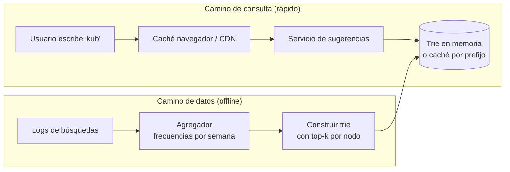

# Caso: Autocompletado de búsqueda <span class="nivel medio">Medio</span>

Mientras el usuario escribe, sugerir las **k consultas más populares** que empiezan por lo escrito.

## Paso 1 — Requisitos

- Devolver las **5 sugerencias** más populares para un prefijo, en **< 100 ms** (se consulta en cada tecla).
- 10 M usuarios activos al día, 10 búsquedas por usuario, ~20 caracteres por búsqueda → una petición por carácter.
- La popularidad se actualiza periódicamente (no hace falta tiempo real estricto).

??? question "Estima las peticiones"
    10 M × 10 × 20 / 10⁵ s ≈ **20 000 peticiones/s** (pico ~40 000). Por eso la respuesta debe salir de memoria o caché.

## Paso 2 — Diseño de alto nivel

Dos caminos independientes:



## Paso 3 — Profundizar

### El trie con top-k precalculado

Un **trie** es un árbol en el que cada nodo representa un prefijo. Buscar las consultas que empiezan por `kub` es bajar
3 niveles: O(longitud del prefijo).

```text
(raíz)
 └─ k
    └─ ku
       └─ kub   → top-5 guardado aquí: [kubernetes, kubectl, kubeflow, kubecon, kube-proxy]
          └─ kube …
```

- Recorrer todo el subárbol en cada petición para encontrar los más populares sería lento.
- **Precalcular y guardar el top-k en cada nodo**: la consulta es O(longitud del prefijo) y devuelve directamente la lista.
- Coste: más memoria y reconstruir el top-k al actualizar frecuencias → se hace **offline**, periódicamente.

```java
class TrieNode {
    final Map<Character, TrieNode> children = new HashMap<>();
    List<String> topK = List.of();               // precalculado offline
}

List<String> suggest(TrieNode root, String prefix) {
    TrieNode node = root;
    for (char c : prefix.toLowerCase().toCharArray()) {
        node = node.children.get(c);
        if (node == null) return List.of();
    }
    return node.topK;
}
```

### Actualización

1. Los servicios registran cada búsqueda completada en un log (Kafka).
2. Un trabajo agrega frecuencias por ventana (p. ej. semanal, con más peso a lo reciente).
3. Se construye un **nuevo trie** completo y se sustituye el antiguo de forma atómica (despliegue *blue-green* del índice).

### Escalado y latencia

- **Caché en el navegador** (las sugerencias de un prefijo cambian poco: `Cache-Control: max-age=3600`) y en CDN.
- **Particionar** el trie por primer carácter (o rangos de prefijo) si no cabe en una máquina; reequilibrar según la
  distribución real (hay muchas más palabras que empiezan por "s" que por "x").
- En el cliente: esperar unos 100-150 ms sin teclear antes de pedir (***debounce***) y cancelar peticiones obsoletas.

### Filtros

Eliminar sugerencias ofensivas, peligrosas o con datos personales mediante listas y filtros **antes** de construir el
trie (y una lista de bloqueo en caliente para casos urgentes).

## Paso 4 — Cierre

- **Tendencias en tiempo real**: complementar el trie semanal con un contador en *streaming* de las últimas horas y mezclar.
- **Personalización**: combinar sugerencias globales con el historial del usuario (en el cliente o en un servicio aparte).
- **Multi-idioma**: un trie por idioma o región.

## Ejercicios

!!! exercise "Ejercicio 1 · Básico — Implementar el trie"
    Implementa `insert(query, frequency)` y la construcción del top-3 de cada nodo tras insertar todas las consultas.

    ??? success "Solución"
        ```java
        class TrieNode {
            final Map<Character, TrieNode> children = new TreeMap<>();
            boolean isWord;                       // aquí termina una consulta completa
            List<String> topK = List.of();
        }

        class Trie {
            private final TrieNode root = new TrieNode();
            private final Map<String, Long> freq = new HashMap<>();

            void insert(String query, long frequency) {
                freq.merge(query, frequency, Long::sum);
                TrieNode n = root;
                for (char c : query.toCharArray()) n = n.children.computeIfAbsent(c, k -> new TrieNode());
                n.isWord = true;
            }

            void buildTopK(int k) { collect(root, new StringBuilder(), k); }

            // Devuelve todas las palabras del subárbol y guarda el top-k en cada nodo
            private List<String> collect(TrieNode n, StringBuilder prefix, int k) {
                List<String> words = new ArrayList<>();
                if (n.isWord) words.add(prefix.toString());
                for (var e : n.children.entrySet()) {
                    prefix.append(e.getKey());
                    words.addAll(collect(e.getValue(), prefix, k));
                    prefix.deleteCharAt(prefix.length() - 1);
                }
                n.topK = words.stream()
                    .sorted(Comparator.comparingLong((String w) -> freq.get(w)).reversed())
                    .limit(k).toList();
                return words;
            }
        }
        ```
        Para un trie enorme se evita devolver todas las palabras: cada nodo combina solo los top-k de sus hijos (mezcla de
        listas ordenadas), con coste proporcional a k × número de hijos.

!!! exercise "Ejercicio 2 · Medio — Memoria del trie"
    Tienes 50 M de consultas distintas, de 20 caracteres de media, y guardas el top-5 en cada nodo. Estima el orden de
    magnitud de nodos y memoria, y propón cómo reducirla.

    ??? success "Solución"
        Peor caso 50 M × 20 = 1 000 M nodos, pero los prefijos se comparten mucho: en la práctica quizá 200-400 M nodos.
        Si cada nodo ocupa ~100 B más 5 referencias (40 B), son decenas de GB. Reducciones: (1) filtrar consultas con
        frecuencia muy baja (la cola larga no aparece en ningún top-5); (2) **compactar** cadenas de nodos con un solo hijo
        (*radix tree*); (3) guardar el top-k como índices a una tabla de consultas en lugar de cadenas; (4) limitar la
        profundidad (los prefijos de más de ~15 caracteres rara vez ayudan).

!!! exercise "Ejercicio 3 · Avanzado — Autocompletado para la consola de la flota"
    En tu dashboard quieres autocompletar códigos de sitio (20 000) y nombres de despliegues mientras se escribe. ¿Usarías
    esta arquitectura?

    ??? success "Solución"
        No: con 20 000 elementos todo cabe en **memoria del propio servicio** (o incluso en el navegador: unos cientos de KB).
        Basta un trie en memoria o una consulta con índice de prefijo en PostgreSQL (`WHERE code LIKE 'site-04%'` con un
        índice `text_pattern_ops`). La arquitectura distribuida con trabajos offline solo compensa a gran escala: dimensiona
        según los números, no según el caso de libro.
