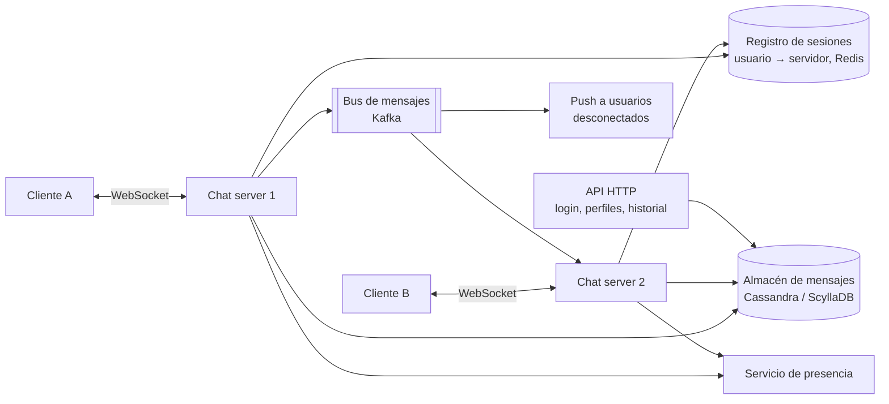

# Caso: Sistema de chat Avanzado

## Paso 1 — Requisitos

- Chats 1 a 1 y grupos pequeños (hasta 100 miembros); estado en línea (presencia); historial persistente; varios dispositivos por usuario.
- Escala: 50 M usuarios activos al día, 40 mensajes por usuario y día.
- Latencia de entrega < 500 ms; **orden** de mensajes dentro de cada conversación; no perder mensajes.

??? question "Estima el volumen"
    50 M × 40 = 2 000 M mensajes/día ≈ **23 000 mensajes/s** de media (pico ~50 000). Con ~100 bytes de media:
    200 GB/día ≈ 73 TB/año de mensajes. Además, decenas de millones de **conexiones persistentes** simultáneas.

## Paso 2 — Diseño de alto nivel

- **Conexión persistente** (WebSocket) entre cliente y un *chat server*: permite al servidor empujar mensajes.
- **Servicios HTTP sin estado** para lo demás (login, perfiles, historial, subida de ficheros).
- Los *chat servers* **sí tienen estado** (las conexiones abiertas) → un registro de sesiones indica en qué servidor está cada usuario.

## Paso 3 — Profundizar

### Flujo de un mensaje

1. A envía el mensaje por su WebSocket a CS1 con un **ID de cliente** (para idempotencia).
2. CS1 asigna un **ID ordenable** por conversación, lo **persiste** y confirma a A (✓ enviado).
3. CS1 publica en el bus; el servidor donde está conectado B (CS2) lo recibe y lo empuja a B.
4. B confirma la recepción (✓✓ entregado); más tarde, la lectura (✓✓ azul).
5. Si B no está conectado → notificación push; al reconectar, sincroniza desde su último ID recibido.

### Orden e IDs

- Orden **por conversación**, no global (sería un cuello de botella).
- IDs tipo Snowflake (ordenables por tiempo) o una secuencia por conversación.
- En Kafka, particionar por `conversation_id` garantiza el orden dentro de cada conversación.

### Almacenamiento

Patrón de acceso: "últimos N mensajes de la conversación X" y "mensajes posteriores al ID Y". Encaja con una base
**columnar ancha** (Cassandra, ScyllaDB, HBase): clave de partición `conversation_id`, clave de ordenación `message_id`.
Particionar además por periodo si una conversación es enorme.

### Varios dispositivos

Cada dispositivo guarda su último `message_id` sincronizado; al conectarse pide lo posterior. El envío se hace a todos
los dispositivos activos del usuario.

### Presencia

- *Heartbeat* del cliente cada N segundos; si deja de llegar, pasa a "desconectado" (tolerando cortes breves de red).
- Difundir cambios de presencia solo a contactos interesados; en grupos grandes, consultar bajo demanda en vez de difundir.

### Escalar las conexiones

- Decenas de miles o más de conexiones por servidor (E/S asíncrona, hilos virtuales).
- El balanceador debe soportar conexiones largas; al desplegar, **drenar** conexiones poco a poco (los clientes reconectan con *backoff*).

## Paso 4 — Cierre

| Tema | Decisión |
|---|---|
| **Cifrado de extremo a extremo** | Protocolo Signal: el servidor solo ve mensajes cifrados (limita búsqueda y moderación en el servidor) |
| **Ficheros** | Subida directa a almacenamiento de objetos con URL prefirmada; en el mensaje solo la referencia |
| **Multi-región** | Usuarios conectados a su región; enrutado entre regiones para conversaciones mixtas |
| **Monitorización** | Conexiones activas, latencia de entrega p99, mensajes pendientes, tasa de reconexión |

??? question "¿Por qué WebSocket y no sondeo HTTP?"
    El sondeo (*polling*) genera muchísimas peticiones vacías y añade latencia; el *long polling* mejora pero sigue siendo
    costoso. WebSocket mantiene una conexión bidireccional por la que el servidor empuja mensajes al instante.

??? question "¿Cómo garantizas el orden sin un secuenciador global?"
    Ordenando solo dentro de cada conversación: IDs ordenables por conversación y particionado por `conversation_id` en el
    bus y en el almacenamiento.

??? question "¿Cómo evitas duplicados si el cliente reenvía un mensaje tras perder la confirmación?"
    Con un ID generado por el cliente que el servidor usa como clave de idempotencia: si ya existe, devuelve la confirmación
    original sin duplicar el mensaje.

## Ejercicios

!!! exercise "Ejercicio 1 · Básico — Dimensionar servidores de chat"
    Hay 20 M de usuarios conectados a la vez en el pico y cada servidor soporta 50 000 conexiones WebSocket. ¿Cuántos
    servidores necesitas, con qué margen, y qué pasa al desplegar una versión nueva?

    ??? success "Solución"
        20 M / 50 000 = **400 servidores**; con margen para fallos y picos (~30 %), unos **520**. Al desplegar, cada servidor
        que se reinicia desconecta a sus 50 000 usuarios, que reconectan a la vez: hay que **drenar** poco a poco (dejar de
        aceptar conexiones nuevas, cerrar las existentes de forma escalonada) y que los clientes reconecten con *backoff* y
        *jitter* para no crear una avalancha contra los demás servidores.

!!! exercise "Ejercicio 2 · Medio — Sincronizar un dispositivo"
    Un usuario abre la app en su portátil tras 3 días desconectado; en su móvil ha seguido chateando. ¿Cómo se sincroniza
    el portátil sin descargar todo el historial?

    ??? success "Solución"
        El portátil guarda, por conversación, el último `message_id` que recibió. Al conectar, pide la lista de conversaciones
        con actividad posterior a su última sincronización y, para cada una, los mensajes con `message_id > último`, paginados.
        Las conversaciones sin actividad no se tocan. Como los IDs son ordenables por tiempo, la consulta es un rango sobre la
        clave de ordenación: eficiente en una base de datos columnar ancha.

!!! exercise "Ejercicio 3 · Avanzado — Chat de operadores de la flota"
    Quieres un canal de chat por incidente en tu plataforma, donde operadores y un bot publican eventos de la flota en
    tiempo real (máximo 200 operadores simultáneos). ¿Qué parte de la arquitectura de esta página usarías?

    ??? success "Solución"
        A esta escala sobra casi todo: un único servicio (con 2-3 réplicas) con WebSockets o *Server-Sent Events*, un
        pub/sub simple entre réplicas (Redis Pub/Sub o PostgreSQL `LISTEN/NOTIFY`) y los mensajes guardados en PostgreSQL con
        índice `(incident_id, created_at)`. El bot publica mediante la misma API. Lo que sí se mantiene: IDs ordenables,
        confirmación de recepción, reconexión con sincronización desde el último mensaje e idempotencia al enviar. Dimensiona
        según los números, no según el caso de libro.
