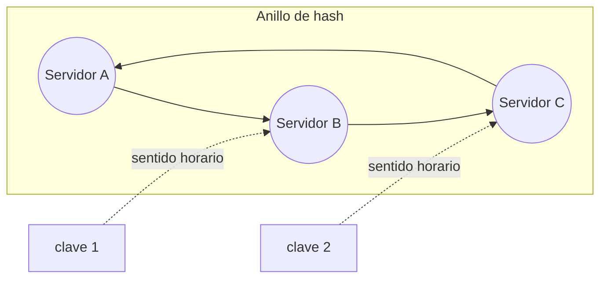

# Fundamentos de System Design <span class="nivel medio">Medio</span>

Los **bloques de construcción** que aparecen en casi cualquier sistema a escala. Para cada uno: qué problema resuelve,
cómo funciona, sus variantes y qué coste tiene.

## 1. Escalado

Cuando un sistema no da abasto, hay dos formas de darle más capacidad:

| | Vertical (*scale up*) | Horizontal (*scale out*) |
|---|---|---|
| Qué | Máquina más grande (más CPU, memoria) | Más máquinas iguales trabajando en paralelo |
| Ventajas | Simple: sin cambios en el código | Casi ilimitado; si cae una máquina, las demás siguen |
| Inconvenientes | Hay un máximo físico y económico; una sola máquina es un punto único de fallo | Exige que las instancias sean intercambiables, balanceo y datos distribuidos |
| Cuándo | Primeros pasos, bases de datos (hasta cierto punto) | Servicios web, *workers*, cualquier cosa que deba crecer mucho |

!!! tip "Requisito para escalar horizontalmente: servidores sin estado"
    Una instancia **sin estado** (*stateless*) no guarda en su memoria nada que otra no pueda reconstruir: la sesión
    del usuario, carritos, cachés locales imprescindibles… van a un almacén compartido (Redis, base de datos) o al propio
    cliente (token JWT). Así cualquier instancia puede atender cualquier petición y se pueden añadir o quitar libremente.

## 2. Balanceo de carga

Un **balanceador de carga** reparte las peticiones entre varias instancias y deja de enviar a las que no están sanas.

| Tipo | Qué ve | Puede hacer | Ejemplos |
|---|---|---|---|
| **L4** (transporte) | IPs y puertos (TCP/UDP) | Repartir conexiones, muy rápido | AWS NLB, Azure Load Balancer, IPVS |
| **L7** (aplicación) | HTTP: ruta, cabeceras, cookies | Enrutar `/api` a un servicio y `/web` a otro, reintentos, TLS, *rate limiting* | ALB, NGINX, Envoy, Ingress |

| Algoritmo | Cómo reparte | Cuándo |
|---|---|---|
| *Round robin* | Por turnos | Peticiones homogéneas |
| *Least connections* | A la instancia con menos conexiones activas | Peticiones de duración variable |
| Ponderado | Proporcional a la capacidad de cada instancia | Instancias de distinto tamaño |
| *Hash* de IP o clave / *consistent hashing* | Siempre la misma instancia para la misma clave | Afinidad (cachés locales, sesiones) |

- **Health checks**: el balanceador comprueba periódicamente un endpoint (`/health`) y saca de la rotación las instancias
  que fallan.
- El propio balanceador no puede ser un punto único de fallo: se despliega redundante (varias zonas, IP *anycast*, DNS).

## 3. Caché

Una **caché** guarda una copia de datos costosos de obtener (consulta lenta, llamada externa, cálculo) en un almacén más
rápido (memoria). Reduce latencia y carga sobre el origen. El precio: los datos pueden estar **desactualizados**.

### Dónde se cachea

| Nivel | Ejemplo |
|---|---|
| Cliente | Caché del navegador (`Cache-Control`), caché del SDK |
| CDN | Contenido estático o público cerca del usuario |
| Aplicación (local) | Caffeine en la memoria de cada instancia: rapidísima, pero cada instancia tiene su copia |
| Distribuida | Redis / Memcached compartido por todas las instancias |
| Base de datos | *Buffer pool*, vistas materializadas |

### Estrategias de lectura y escritura

| Estrategia | Cómo funciona | Cuándo |
|---|---|---|
| **Cache-aside** (*lazy loading*) | La app busca en caché; si no está (fallo), lee de la BBDD y guarda en caché | La más común; lecturas frecuentes |
| **Read-through** | La caché se encarga de leer de la BBDD en un fallo | Librerías o servicios que lo soportan |
| **Write-through** | Cada escritura va a la caché y a la BBDD a la vez | Se leen justo después de escribir |
| **Write-behind** (*write-back*) | Se escribe en caché y se persiste después, en lote | Escrituras muy intensivas; riesgo de perder datos |

```java
public Product find(ProductId id) {                     // cache-aside
    String key = "product:" + id;
    Product cached = redis.get(key);
    if (cached != null) return cached;                  // acierto
    Product p = repository.findById(id).orElseThrow();  // fallo: ir al origen
    redis.setex(key, Duration.ofMinutes(10), p);        // TTL: acota cuánto tiempo puede estar desactualizado
    return p;
}

public void update(Product p) {
    repository.save(p);
    redis.del("product:" + p.id());                     // invalidar: la próxima lectura traerá la versión nueva
}
```

### Problemas típicos

| Problema | Qué pasa | Soluciones |
|---|---|---|
| **Datos obsoletos** | La caché devuelve un valor antiguo tras cambiar el origen | TTL adecuado, invalidar al escribir, versionar claves |
| ***Cache stampede*** | Una clave popular expira y miles de peticiones van a la vez a la BBDD | Bloqueo (solo una recalcula), TTL con variación aleatoria (*jitter*), refrescar antes de expirar |
| ***Hot key*** | Una sola clave recibe tanto tráfico que satura un nodo de la caché | Replicar la clave, caché local delante |
| **Caché fría** | Tras reiniciar, todo son fallos y el origen se satura | Precalentar, arrancar instancias poco a poco |

**Políticas de expulsión** cuando la caché se llena: **LRU** (la usada hace más tiempo, la más común), LFU (la menos
usada), FIFO.

## 4. Bases de datos

### SQL vs. NoSQL

| | Relacional (PostgreSQL, MySQL) | NoSQL |
|---|---|---|
| Modelo | Tablas con esquema, relaciones y *joins* | Clave-valor (Redis, DynamoDB), documento (MongoDB), columnar ancha (Cassandra), grafo (Neo4j) |
| Garantías | Transacciones ACID | A menudo consistencia eventual o configurable |
| Escalado | Vertical + réplicas de lectura; particionar es manual y complejo | Horizontal desde el diseño |
| Consultas | Cualquier consulta (SQL ad hoc) | Rápidas para los **patrones de acceso previstos**; el resto, difícil |
| Cuándo | Datos relacionados, transacciones, consultas variadas — **la opción por defecto** | Escala masiva, esquema variable, acceso simple por clave |

### Replicación

Copiar los datos en varios servidores para **disponibilidad** (si cae uno, otro sigue) y **escalar lecturas**.

| Modelo | Cómo | Problema principal |
|---|---|---|
| **Líder-seguidores** | Las escrituras van al líder; se copian a los seguidores; las lecturas pueden ir a cualquiera | ***Replication lag***: un seguidor puede ir por detrás → lees un dato antiguo |
| **Multi-líder** | Varios nodos (p. ej. uno por región) aceptan escrituras | Conflictos si dos modifican lo mismo a la vez |
| **Sin líder** | Se escribe y lee en varias réplicas; se usa un **quórum** | Complejidad; consistencia eventual |

- **Replicación síncrona**: el líder espera a que el seguidor confirme → sin pérdida de datos, más latencia.
- **Asíncrona**: no espera → rápida, pero si el líder cae se pueden perder las últimas escrituras.
- ***Read-your-writes***: tras escribir, el usuario debe ver su cambio. Solución: leer del líder durante unos segundos
  tras escribir, o leer de réplicas que ya tengan esa versión.

### Particionado (*sharding*)

Dividir los datos entre varios servidores cuando no caben o no dan abasto en uno.

| Estrategia | Cómo | Pros | Contras |
|---|---|---|---|
| **Por rango** | `A-M` en un servidor, `N-Z` en otro (o por fechas) | Consultas por rango eficientes | *Hotspots*: si todos escriben "hoy", un servidor recibe todo |
| **Por *hash*** | `hash(clave) % N` o *consistent hashing* | Reparto uniforme | Consultas por rango van a todos los servidores |
| **Por directorio** | Una tabla dice dónde está cada clave | Flexible | La tabla es un componente crítico más |

Problemas a resolver: **reequilibrar** al añadir servidores, **consultas entre particiones** (*joins* distribuidos), y
**claves calientes** (el famoso con millones de seguidores concentra la carga en una partición).

### Índices

Estructuras (normalmente B-tree) que aceleran las lecturas a cambio de escrituras más lentas y más espacio.
Ver [Bases de datos](../fundamentos/bases-de-datos.md#4-indices).

## 5. Teorema CAP y PACELC

En un sistema distribuido, cuando hay una **partición de red** (**P**: algunos nodos no pueden comunicarse con otros),
el sistema tiene que elegir:

- **Consistencia (C)**: toda lectura devuelve la última escritura (o un error). Los nodos que no pueden sincronizarse
  **rechazan** peticiones.
- **Disponibilidad (A)**: toda petición recibe una respuesta, aunque pueda estar **desactualizada**.

| Elección | Comportamiento | Ejemplos |
|---|---|---|
| **CP** | Prefiere devolver error antes que un dato antiguo | etcd, ZooKeeper, bases de datos con consenso (Spanner) |
| **AP** | Prefiere responder siempre, aunque sea con datos antiguos | Cassandra, DynamoDB (por defecto), DNS |

**PACELC** completa CAP: si hay **P**artición → elegir **A** o **C**; **E**n otro caso (funcionamiento normal) →
elegir entre **L**atencia y **C**onsistencia (sincronizar réplicas antes de responder cuesta tiempo).

!!! tip "Para explicarlo bien"
    "CAP no es elegir 2 de 3: las particiones de red ocurren sí o sí en un sistema distribuido. La decisión real es qué
    hacer **cuando** ocurren, y en condiciones normales, cuánta latencia estoy dispuesto a pagar por consistencia."

Ejemplo cercano: **etcd** es CP. Si el plano de control de Kubernetes pierde la mayoría de sus nodos de etcd, deja de
aceptar cambios (no puedes desplegar), pero lo que ya corre sigue funcionando.

## 6. Consistent hashing { #consistent-hashing }

**Problema**: con `servidor = hash(clave) % N`, si N pasa de 4 a 5, el resultado cambia para **casi todas** las claves:
en una caché distribuida eso vacía la caché de golpe; en un almacén, obliga a mover casi todos los datos.

**Solución**: colocar servidores y claves en un **anillo** de valores de *hash*. Cada clave pertenece al **primer
servidor que encuentra avanzando en el sentido de las agujas del reloj**.



- Al **añadir** un servidor, solo se mueven las claves entre él y su predecesor en el anillo (~1/N del total).
- Al **quitar** uno, sus claves pasan al siguiente; las demás no se mueven.
- **Nodos virtuales**: cada servidor aparece en muchas posiciones del anillo (p. ej. 100). Así el reparto es uniforme y
  un servidor más potente puede tener más posiciones.
- Se usa en: DynamoDB y Cassandra (particionado), cachés distribuidas, balanceadores con afinidad, CDNs.

## 7. Mensajería y asincronía

Una **cola** o un **log de eventos** entre servicios permite que el emisor no espere al receptor.

| Beneficio | Por qué |
|---|---|
| **Desacoplamiento** | El emisor no conoce a los receptores ni depende de que estén disponibles |
| **Absorber picos** | Si llegan 10 000 trabajos de golpe, se encolan y se procesan al ritmo posible |
| **Reintentos** | Un mensaje que falla se vuelve a intentar sin que el emisor lo sepa |
| **Escalado independiente** | Más consumidores si la cola crece |

| | Cola (RabbitMQ, SQS) | Log distribuido (Kafka) |
|---|---|---|
| Modelo | Cada mensaje lo consume **un** consumidor y desaparece | Log inmutable; cada grupo de consumidores lleva su posición |
| Releer | No | Sí (*replay*) |
| Orden | Limitado | Garantizado por partición |
| Uso típico | Trabajos y tareas | Eventos entre dominios, *streaming*, CDC |

Hay que diseñar para **duplicados** (consumidores idempotentes) y para **mensajes que nunca podrán procesarse**
(*dead letter queue* tras N intentos). Ver [Kafka](../datos/kafka.md).

## 8. Fiabilidad

Técnicas para que un fallo en una pieza no derribe el sistema:

| Técnica | Qué hace | Detalle |
|---|---|---|
| ***Timeouts*** | Limitar cuánto se espera a una dependencia | **Siempre**, en toda llamada remota; sin *timeout*, un servicio lento bloquea hilos hasta agotarlos |
| **Reintentos con *backoff* y *jitter*** | Repetir fallos transitorios esperando cada vez más, con aleatoriedad | Sin *jitter*, todos los clientes reintentan a la vez y rematan al servicio |
| **Idempotencia** | Repetir una operación da el mismo resultado | Imprescindible para reintentar operaciones de escritura |
| ***Circuit breaker*** | Tras muchos fallos, dejar de llamar un tiempo y fallar rápido | Estados: cerrado (normal) → abierto (corta) → semiabierto (prueba) |
| ***Bulkhead*** (mamparo) | Aislar recursos: *pools* separados por dependencia | Una dependencia lenta no agota los hilos de todo el servicio |
| ***Rate limiting* / *load shedding*** | Rechazar exceso de carga para proteger lo esencial | Ver [rate limiter](rate-limiter.md) |
| **Degradación elegante** | Ofrecer una versión reducida si falla algo no esencial | Mostrar el pedido sin recomendaciones si ese servicio cae |
| **Redundancia** | Varias instancias, zonas y regiones | Activo-pasivo o activo-activo; definir **RPO** (datos que se pueden perder) y **RTO** (tiempo de recuperación) |

## 9. Generación de IDs únicos (Snowflake)

**Problema**: en un sistema distribuido, una secuencia autoincremental de base de datos es un cuello de botella y un
punto único de fallo; los UUID aleatorios no son ordenables y fragmentan los índices.

**Snowflake** (Twitter) genera IDs de 64 bits sin coordinación:

| Bits | Contenido | Para qué |
|---|---|---|
| 1 | Signo (0) | Número positivo |
| 41 | Milisegundos desde una época propia | ~69 años de rango; los IDs se **ordenan por tiempo** |
| 10 | ID de máquina | Hasta 1 024 generadores sin coordinarse |
| 12 | Secuencia dentro del milisegundo | 4 096 IDs por milisegundo y máquina |

Alternativas modernas: **UUIDv7** (estándar, 128 bits, ordenable por tiempo) y ULID.

## 10. Comunicación entre servicios

| | REST | gRPC | GraphQL | WebSocket |
|---|---|---|---|---|
| Transporte | HTTP/1.1-2, JSON | HTTP/2, Protobuf binario | HTTP, JSON | Conexión TCP persistente |
| Fuerte en | Simplicidad, universal, cacheable | Rendimiento, contratos tipados, *streaming* | El cliente pide exactamente lo que necesita | Tiempo real en ambos sentidos |
| Uso típico | APIs públicas | Servicio a servicio | BFF, aplicaciones móviles | Chat, notificaciones, dashboards en vivo |

Ver [Diseño de APIs](../arquitectura/apis.md).

## Preguntas de repaso

??? question "¿Cómo evitas un cache stampede?"
    Que solo una petición recalcule (bloqueo), TTL con variación aleatoria para que no expire todo a la vez, refrescar
    antes de expirar (*refresh-ahead*), o servir el valor caducado mientras se refresca (*stale-while-revalidate*).

??? question "¿Qué significa W + R > N?"
    En sistemas con quórum, si el número de réplicas que confirman una escritura (W) más las que se consultan en una lectura
    (R) supera el total de réplicas (N), al menos una réplica leída tiene la última escritura. Ejemplo: N=3, W=2, R=2.

??? question "¿Por qué etcd es CP y qué implica para Kubernetes?"
    etcd usa el algoritmo de consenso Raft y necesita mayoría para escribir. Si se pierde la mayoría, deja de aceptar
    escrituras antes que arriesgar inconsistencias. Por eso el plano de control se despliega con 3 o 5 nodos.

??? question "¿Qué ventaja tiene consistent hashing frente a hash % N?"
    Al cambiar el número de servidores solo se remapea una fracción pequeña (~1/N) de las claves, en lugar de casi todas.

??? question "¿Cuándo Kafka en vez de RabbitMQ?"
    Cuando se necesita alto volumen, retención y releer eventos, varios consumidores independientes del mismo flujo u orden
    por clave. RabbitMQ encaja mejor para colas de trabajos con enrutado flexible.

## Ejercicios

!!! exercise "Ejercicio 1 · Básico — Hacer un servicio stateless"
    Un servicio guarda en un `HashMap` en memoria el progreso de cada *rollout* que el usuario está configurando en un
    asistente de 4 pasos. Al escalar a 3 réplicas, los usuarios pierden su progreso aleatoriamente. ¿Por qué y cómo lo arreglas?

    ??? success "Solución"
        Cada petición puede llegar a una réplica distinta, que no tiene ese progreso en su memoria. Opciones: (1) guardar el
        borrador en un almacén compartido (Redis con TTL, o una tabla `rollout_draft`); (2) mantener el estado en el cliente
        y enviarlo completo en cada paso. Evitar la "sesión pegajosa" (*sticky session*) como solución: se pierde el estado si
        cae la instancia y reparte peor la carga.

!!! exercise "Ejercicio 2 · Básico — Elegir estrategia de caché"
    Elige estrategia y TTL: (a) catálogo de versiones publicadas (cambia 2 veces al día, se lee miles de veces por minuto);
    (b) estado en vivo de un nodo (cambia cada pocos segundos); (c) precio de una suscripción al cobrar.

    ??? success "Solución"
        (a) *Cache-aside* con TTL largo (p. ej. 1 h) + **invalidación** al publicar una versión. (b) Caché corta (1-5 s) o
        ninguna: el dato es volátil y un valor viejo engaña al operador. (c) **Sin caché** en la operación de cobro (o
        validar contra el origen): un precio desactualizado en un cobro es un error de negocio; se puede cachear para mostrarlo.

!!! exercise "Ejercicio 3 · Medio — Circuit breaker"
    El servicio de despliegues llama al servicio de inventario, que a veces tarda 30 s en responder. Durante esos episodios,
    el servicio de despliegues se queda sin hilos y deja de responder a todo. Propón las protecciones con valores concretos.

    ??? success "Solución"
        1. ***Timeout*** de 2 s en la llamada (más que el p99 normal del inventario).
        2. ***Circuit breaker***: si más del 50 % de las llamadas fallan en una ventana de 20, abrir 30 s (responder rápido con
           error o con el último dato conocido); luego semiabierto con unas pocas llamadas de prueba.
        3. ***Bulkhead***: limitar a 20 las llamadas concurrentes al inventario (semáforo o *pool* propio), para que nunca
           consuman todos los hilos.
        4. **Degradación**: si el inventario no responde, mostrar los despliegues sin los datos de hardware.
        Con Resilience4j, todo esto son anotaciones y configuración.

!!! exercise "Ejercicio 4 · Medio — Replication lag"
    Tras crear un sitio (escritura al líder), el usuario es redirigido a la ficha del sitio (lectura en una réplica) y ve
    "sitio no encontrado". Explica el porqué y da dos soluciones.

    ??? success "Solución"
        La réplica asíncrona aún no ha recibido la escritura (*replication lag*, normalmente milisegundos, a veces segundos).
        Soluciones: (1) ***read-your-writes***: durante unos segundos tras una escritura, las lecturas de ese usuario van al
        líder (se marca con una cookie o en la sesión); (2) devolver el recurso creado en la propia respuesta del `POST` y
        pintarlo sin volver a leer; (3) leer de réplicas indicando la posición mínima del log requerida (algunas bases de datos lo permiten).

!!! exercise "Ejercicio 5 · Avanzado — Consistent hashing en código"
    Implementa un anillo de *consistent hashing* con nodos virtuales: `addNode`, `removeNode` y `nodeFor(key)`.

    ??? success "Solución"
        ```java
        public class HashRing {
            private final TreeMap<Long, String> ring = new TreeMap<>();
            private final int virtualNodes;

            public HashRing(int virtualNodes) { this.virtualNodes = virtualNodes; }

            public void addNode(String node) {
                for (int i = 0; i < virtualNodes; i++) ring.put(hash(node + "#" + i), node);
            }

            public void removeNode(String node) {
                for (int i = 0; i < virtualNodes; i++) ring.remove(hash(node + "#" + i));
            }

            public String nodeFor(String key) {
                if (ring.isEmpty()) throw new IllegalStateException("Anillo vacío");
                Map.Entry<Long, String> e = ring.ceilingEntry(hash(key));    // primer nodo en sentido horario
                return (e != null ? e : ring.firstEntry()).getValue();       // si no hay, se da la vuelta al anillo
            }

            private static long hash(String s) {
                // cualquier hash bien distribuido; aquí, los 8 primeros bytes de MD5
                try {
                    byte[] d = MessageDigest.getInstance("MD5").digest(s.getBytes(StandardCharsets.UTF_8));
                    return ByteBuffer.wrap(d).getLong();
                } catch (NoSuchAlgorithmException e) { throw new IllegalStateException(e); }
            }
        }
        ```
        `TreeMap.ceilingEntry` encuentra en O(log n) el primer punto del anillo ≥ al *hash* de la clave. Prueba: con 4 nodos
        y 100 nodos virtuales, reparte 100 000 claves, añade un quinto nodo y comprueba que solo cambian ~20 % de las asignaciones.
