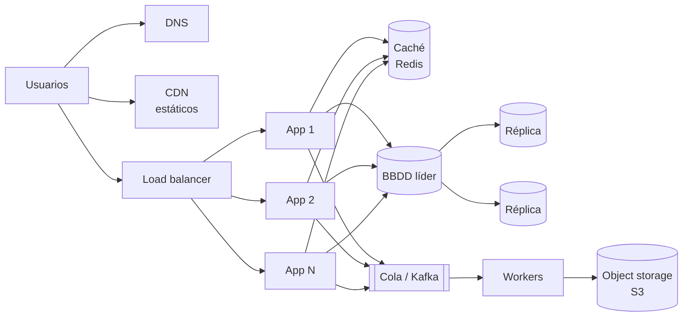

# System Design

Cómo diseñar sistemas que **escalan**, **aguantan fallos** y se pueden **operar**.

1. Empieza por el [marco de 4 pasos](../libros/system-design-interview.md#1-el-marco-de-4-pasos-45-60-min).
2. Domina los [bloques de construcción](fundamentos.md).
3. Practica con casos resueltos:

| Caso | Conceptos principales |
|---|---|
| [Rate limiter](rate-limiter.md) | Token bucket, Redis + Lua, *fail-open* |
| [Acortador de URLs](url-shortener.md) | Base62, generación de IDs, caché, analítica asíncrona |
| [Almacén clave-valor](key-value-store.md) | Consistent hashing, quórum, relojes vectoriales, gossip, Merkle, LSM |
| [Notificaciones](notificaciones.md) | Colas por canal, reintentos, idempotencia, agrupación |
| [Chat](chat.md) | WebSockets, orden por conversación, presencia, varios dispositivos |
| [Web crawler](web-crawler.md) | URL frontier, educación por host, Bloom filter, deduplicación |
| [News feed](news-feed.md) | Fan-out on write / on read, híbrido para celebridades |
| [Autocompletado](autocompletado.md) | Trie con top-k precalculado, construcción offline, caché |
| [Plataforma de vídeo](video.md) | Subida prefirmada, transcodificación en DAG, HLS/DASH, CDN |
| [Proximidad](proximidad.md) | Geohash, quadtree, PostGIS, Redis GEO |
| [Pagos](pagos.md) | Idempotencia, estados, libro de doble entrada, reconciliación |

## Diagrama base de casi cualquier sistema web

Cada caja de este diagrama es una decisión con trade-offs. Ser capaz de justificar **por qué** está
cada una (y cuándo sobra) es lo que se evalúa.
