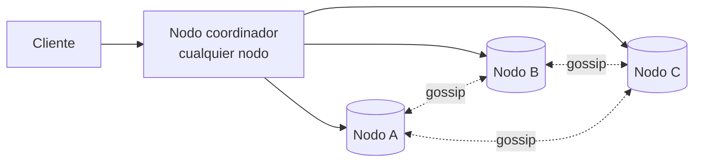
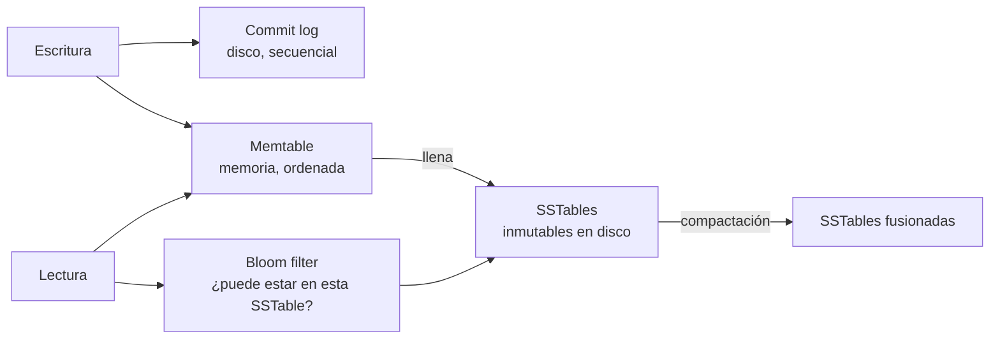

# Caso: Almacén clave-valor distribuido Avanzado

El caso que reúne casi todos los conceptos de sistemas distribuidos: particionado, replicación, consistencia,
detección de fallos y recuperación. Inspirado en Dynamo (Amazon) y Cassandra.

## Paso 1 — Requisitos

- API: `put(key, value)` y `get(key)`. Valores pequeños (< 10 KB).
- Escala: cientos de TB, millones de operaciones por segundo, latencia baja.
- **Alta disponibilidad** incluso con fallos de nodos y particiones de red → sistema **AP** con consistencia **ajustable**.
- Escalado horizontal añadiendo nodos sin parada.

## Paso 2 — Diseño de alto nivel

Arquitectura **sin líder** (*leaderless*): cualquier nodo puede coordinar una petición; todos son iguales.

## Paso 3 — Profundizar

### Particionado: consistent hashing

Claves y nodos en un [anillo de hash](fundamentos.md#consistent-hashing), con **nodos virtuales** para repartir
de forma uniforme y aprovechar nodos de distinta capacidad. Añadir un nodo mueve solo ~1/N de las claves.

### Replicación

Cada clave se replica en los **N** nodos siguientes del anillo (su *preference list*), en AZs distintas.

### Consistencia configurable: quórum

| Parámetro | Significado |
|---|---|
| **N** | Número de réplicas |
| **W** | Réplicas que deben confirmar una escritura |
| **R** | Réplicas consultadas en una lectura |

| Configuración (N = 3) | Resultado |
|---|---|
| W = 2, R = 2 (W + R > N) | Lectura y escritura solapan en al menos una réplica → se lee la última escritura |
| W = 1, R = 1 | Máxima velocidad y disponibilidad; consistencia eventual |
| W = 3, R = 1 | Lecturas rápidas; una escritura falla si cae un nodo |

### Versiones y conflictos

Sin líder, dos clientes pueden escribir la misma clave en réplicas distintas a la vez.

| Estrategia | Cómo | Contras |
|---|---|---|
| ***Last write wins*** (LWW) | Gana el *timestamp* mayor | Pierde escrituras; depende de relojes |
| **Relojes vectoriales** | Cada versión lleva un contador por nodo; se detectan versiones concurrentes | El cliente (o la app) debe fusionar |
| **CRDTs** | Tipos de datos que se fusionan solos de forma determinista (contadores, conjuntos) | Solo para ciertos tipos |

### Detección de fallos: gossip

Cada nodo intercambia periódicamente con otros al azar su lista de miembros y latidos. Si el latido de un nodo no
avanza durante un tiempo, se marca como caído. Descentralizado y escalable.

### Tolerancia a fallos

| Fallo | Técnica |
|---|---|
| Nodo caído temporalmente | ***Sloppy quorum* + *hinted handoff***: otro nodo acepta la escritura y la entrega cuando vuelve |
| Réplicas desincronizadas | **Anti-entropía** con **árboles de Merkle**: se comparan *hashes* por rangos y solo se transfiere lo distinto |
| Lectura detecta versión vieja | ***Read repair***: el coordinador actualiza las réplicas atrasadas |
| Caída de un centro de datos | Réplicas en varias AZs/regiones |

### Motor de almacenamiento: LSM-tree

Escrituras muy rápidas (solo secuenciales); lecturas aceleradas con *Bloom filters* y compactación periódica.

## Paso 4 — Cierre

- **Monitorizar**: latencia p99 por operación, *hints* pendientes, desequilibrio entre nodos, compactaciones atrasadas.
- **Riesgos**: claves calientes (réplica adicional o caché delante), relojes desincronizados si se usa LWW.
- **Alternativa CP**: si se necesita consistencia fuerte, replicación con consenso (Raft) por partición, como etcd, TiKV o CockroachDB.

## Preguntas de repaso

??? question "¿Por qué W + R > N da lecturas consistentes?"
    Porque el conjunto de réplicas que confirmó la escritura y el que se consulta en la lectura se solapan en al menos una,
    que tiene la versión más reciente.

??? question "¿Para qué sirven los árboles de Merkle en la anti-entropía?"
    Para comparar grandes volúmenes de datos entre réplicas transfiriendo solo *hashes*: si la raíz coincide, todo coincide;
    si no, se baja por las ramas distintas hasta encontrar las claves desincronizadas.

??? question "¿Qué es el hinted handoff?"
    Cuando una réplica destino está caída, otro nodo guarda la escritura con una "pista" y se la entrega cuando se recupera,
    manteniendo la disponibilidad de escritura.

## Ejercicios

!!! exercise "Ejercicio 1 · Básico — Configurar el quórum"
    Con N = 5 réplicas, propón W y R para: (a) lecturas consistentes con máxima tolerancia a fallos en escritura;
    (b) lecturas muy rápidas; (c) disponibilidad máxima aceptando consistencia eventual.

    ??? success "Solución"
        (a) W = 3, R = 3 (W + R = 6 > 5): consistente y tolera 2 nodos caídos tanto en lectura como en escritura.
        (b) W = 5, R = 1: lecturas de una sola réplica, pero cualquier nodo caído impide escribir.
        (c) W = 1, R = 1: siempre disponible mientras quede un nodo, a costa de poder leer datos antiguos.

!!! exercise "Ejercicio 2 · Medio — Relojes vectoriales"
    Una clave tiene la versión `[A:1]`. El cliente 1 escribe a través del nodo A y el cliente 2, sin haber visto esa
    escritura, escribe a través del nodo B. ¿Qué versiones resultan y cómo se detecta el conflicto?

    ??? success "Solución"
        Escritura del cliente 1 en A: `[A:2]`. Escritura del cliente 2 en B basada en `[A:1]`: `[A:1, B:1]`. Ninguna domina a
        la otra (A:2 > A:1, pero B:1 > B:0): son **concurrentes**. El sistema guarda ambas versiones (*siblings*) y, en la
        siguiente lectura, las devuelve para que la aplicación las fusione; la versión fusionada será `[A:2, B:1]`. Si una
        versión fuera ≥ en todos los contadores, dominaría y la otra se descartaría sin conflicto.

!!! exercise "Ejercicio 3 · Avanzado — Merkle tree"
    Dos réplicas tienen 1 000 M de claves cada una y difieren en 10. ¿Cómo encuentran cuáles son sin transferir todo?

    ??? success "Solución"
        Cada réplica divide su rango de claves en, por ejemplo, 1 M de cubos y calcula un *hash* por cubo; los *hashes* se
        combinan por parejas hasta una raíz (árbol de Merkle). Las réplicas comparan la raíz: si coincide, no hay nada que
        hacer. Si no, comparan los hijos y bajan solo por las ramas distintas. Con 10 diferencias se recorren ~10 caminos de
        ~20 niveles (log₂ 1 M): unos cientos de *hashes* en lugar de 1 000 M de claves; al final solo se transfieren los
        cubos distintos.
