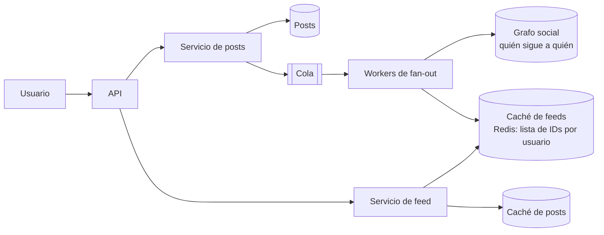
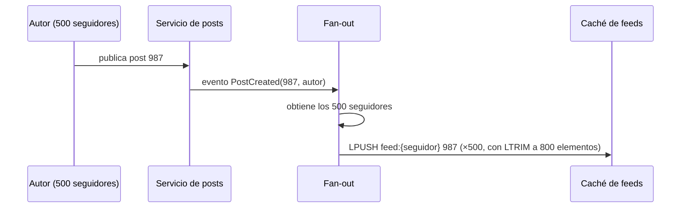

# Caso: News feed Medio

El *feed* de una red social: cada usuario ve las publicaciones recientes de las personas que sigue. El reto es
**leer rápido** un contenido que depende de muchas otras personas.

## Paso 1 — Requisitos

- Publicar posts; ver el *feed* con los posts de las cuentas seguidas, en orden cronológico inverso (o por relevancia).
- 300 M usuarios activos al día; cada uno consulta el *feed* 10 veces y publica 1 post al día; un usuario sigue de media a 200 cuentas.
- Latencia de lectura del *feed* < 200 ms. Se tolera que un post tarde unos segundos en aparecer (consistencia eventual).

??? question "Estima las cargas"
    - Lecturas de *feed*: 300 M × 10 / 10⁵ s ≈ **30 000/s** (pico ~60 000).
    - Publicaciones: 300 M / 10⁵ ≈ **3 000/s**.
    - El sistema es **muy intensivo en lectura** (10:1), lo que empuja a precalcular.

## Paso 2 — Diseño de alto nivel

## Paso 3 — Profundizar: *fan-out*

La decisión central: **¿cuándo** se construye el *feed*?

| Estrategia | Cómo | Pros | Contras |
|---|---|---|---|
| ***Fan-out on write*** (*push*) | Al publicar, se añade el ID del post al *feed* precalculado de **cada seguidor** | Lectura muy rápida (el *feed* ya está listo) | Publicar es caro para cuentas con millones de seguidores; se trabaja para usuarios inactivos |
| ***Fan-out on read*** (*pull*) | Al leer, se consultan los posts recientes de todas las cuentas seguidas y se mezclan | Publicar es barato; nada se desperdicia | Leer es caro y lento (200 consultas y una mezcla) |
| **Híbrido** | *Push* para la mayoría; *pull* para las cuentas con millones de seguidores ("celebridades") | Lo mejor de ambos | Más complejo |

Al leer: el servicio de *feed* obtiene los IDs de `feed:{usuario}`, **añade** en ese momento los posts recientes de
las celebridades que sigue (*pull*), ordena, y **rellena** el contenido de cada post desde la caché de posts.

### Detalles

- El *feed* en caché guarda **solo IDs** (8 bytes), no el contenido: ocupa poco y el contenido se actualiza en un solo sitio.
- Se limita la longitud (p. ej. 800 entradas); lo más antiguo se reconstruye bajo demanda si alguien hace mucho *scroll*.
- Usuarios inactivos: no hacer *fan-out* para quien no entra en 30 días; reconstruir su *feed* al volver.
- **Ranking**: con *feed* por relevancia, se recuperan candidatos (como arriba) y un modelo los puntúa antes de mostrarlos.

## Paso 4 — Cierre

- **Escalado**: *workers* de *fan-out* horizontales; caché particionada por usuario.
- **Borrados y privacidad**: al borrar un post, eliminar de la caché de posts (los IDs huérfanos se filtran al leer).
- **Monitorización**: latencia de *fan-out* (tiempo hasta que un post aparece), latencia de lectura p99, tasa de aciertos de caché.

## Preguntas de repaso

??? question "¿Por qué no hacer fan-out on write para una cuenta con 50 M de seguidores?"
    Cada post supondría 50 M escrituras en caché: minutos de retraso, carga enorme, y mucho trabajo para seguidores que ni
    siquiera leerán. Para esas cuentas es más eficiente mezclar sus posts al leer.

??? question "¿Por qué la caché de feed guarda IDs y no los posts completos?"
    Para ahorrar memoria (un ID frente a KB de contenido replicado en millones de *feeds*) y para que editar o borrar un
    post se haga en un único sitio.

## Ejercicios

!!! exercise "Ejercicio 1 · Básico — Memoria de la caché de feeds"
    300 M usuarios, 800 IDs de 8 bytes por *feed*, más ~40 % de sobrecarga de la estructura en Redis. ¿Cuánta memoria?

    ??? success "Solución"
        300 × 10⁶ × 800 × 8 B = 1,92 × 10¹² B ≈ **1,9 TB**, ×1,4 ≈ **2,7 TB**. Hace falta un clúster de Redis particionado
        (p. ej. 30-40 nodos de 100 GB con réplicas). Palanca: guardar solo el *feed* de usuarios activos en 30 días
        (por ejemplo la mitad) → ~1,35 TB.

!!! exercise "Ejercicio 2 · Medio — Umbral de celebridad"
    Cada escritura de *fan-out* cuesta ~0,1 ms de trabajo de worker. ¿A partir de cuántos seguidores pasarías una cuenta a
    *pull* si quieres que un post aparezca en menos de 5 s con 100 workers en paralelo?

    ??? success "Solución"
        Capacidad en 5 s: 100 workers × (5 s / 0,1 ms) = 100 × 50 000 = **5 M escrituras**. Pero esa capacidad la comparten
        todos los posts que se publican a la vez, así que el umbral debe ser mucho menor: p. ej. **~100 000 seguidores**
        deja margen para miles de publicaciones concurrentes. En la práctica se ajusta midiendo la latencia de *fan-out*.

!!! exercise "Ejercicio 3 · Avanzado — Feed de actividad de la flota"
    Aplica el patrón al *feed* de actividad de tu plataforma: 2 000 operadores siguen sitios, regiones o equipos; hay
    20 000 sitios que generan eventos. ¿*Push*, *pull* o híbrido?

    ??? success "Solución"
        Pocos lectores (2 000) y muchos productores de eventos: el volumen de *fan-out* es pequeño salvo para "seguir una
        región" (miles de sitios). Híbrido: *push* de eventos de sitios seguidos individualmente al *feed* del operador;
        *pull* al leer para las suscripciones amplias (región completa), consultando un índice por región y tiempo. Con
        estos volúmenes, incluso *pull* puro con una consulta indexada por `(region, tiempo)` sería suficiente: no hay que
        sobrediseñar.
