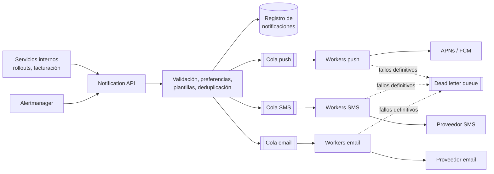

# Caso: Sistema de notificaciones Medio

## Paso 1 — Requisitos

- Canales: **push móvil** (APNs, FCM), **SMS**, **email**, y **webhooks/Slack** para alertas técnicas.
- Tipos: transaccionales (código de acceso, alerta de un sitio caído) y masivas (anuncios).
- Escala: 10 M notificaciones al día, con picos (un incidente regional genera miles de alertas a la vez).
- Requisitos no funcionales: **no perder** notificaciones críticas, **no duplicar** en lo posible, respetar
  preferencias y límites del usuario, latencia de segundos para las transaccionales.

??? question "Estima el ritmo medio y de pico"
    10 M / 10^5 s ≈ **115 por segundo** de media. Con picos ×10 durante incidentes, ~1 000-1 500/s. Moderado para
    colas, pero los proveedores externos (SMS, email) tienen sus propios límites de envío.

## Paso 2 — Diseño de alto nivel

- **Una cola por canal**: un proveedor lento (SMS) no bloquea los demás; cada canal escala por separado.
- **Workers sin estado** que consumen, envían, registran el resultado y reintentan.

## Paso 3 — Profundizar

### Fiabilidad

| Problema | Solución |
|---|---|
| El proveedor externo falla | Reintentos con *backoff* exponencial + *jitter*; *circuit breaker*; proveedor alternativo |
| Mensaje que nunca se podrá enviar | Tras N intentos → *dead letter queue* + alerta |
| El worker cae a mitad | La cola vuelve a entregar el mensaje (*at-least-once*) |
| Duplicados por reintentos | **Clave de idempotencia** por notificación; el worker comprueba si ya se envió |
| Pérdida al publicar | Patrón *outbox* en el servicio que origina el evento |

### Preferencias, límites y plantillas

- **Preferencias**: canales permitidos por usuario y tipo, horario de silencio, idioma.
- ***Rate limiting* por usuario**: no enviar 500 alertas iguales en un incidente → **agrupar** (*digest*) y deduplicar
  (Alertmanager ya agrupa por `alertname` y región).
- **Plantillas** versionadas con variables; renderizado por idioma y canal.
- **Prioridades**: colas o particiones separadas para críticas vs. masivas, para que un envío masivo no retrase una alerta.

### Seguimiento

Estado por notificación: `PENDING → SENT → DELIVERED / FAILED`, con los *callbacks* de entrega de los proveedores.
Métricas: tasa de envío, fallos por proveedor, latencia de extremo a extremo, tamaño de colas.

## Paso 4 — Cierre

- **Cuellos de botella**: límites de envío de proveedores → varios proveedores y colas con control de ritmo.
- **Seguridad**: validar destinos de *webhooks* (evitar SSRF), no incluir datos sensibles en SMS o push.
- **Cumplimiento**: consentimiento y bajas en comunicaciones de marketing.

??? question "¿Por qué una cola por canal y no una única cola?"
    Aísla fallos y ritmos: si el proveedor de SMS se degrada, su cola crece sin afectar a push o email; cada canal
    escala sus workers según su propio volumen y límites.

??? question "¿Cómo evitas inundar a los operadores durante un incidente regional?"
    Agrupando y deduplicando alertas (por región, tipo), con límites por usuario, resúmenes periódicos y enrutado por
    severidad: solo lo crítico despierta a alguien.

## Ejercicios

!!! exercise "Ejercicio 1 · Básico — Reintentos con jitter"
    Calcula los tiempos de espera para 5 reintentos con *backoff* exponencial (base 1 s, factor 2, máximo 30 s) y explica
    qué añade el *jitter*.

    ??? success "Solución"
        Sin *jitter*: 1, 2, 4, 8, 16 s (el sexto sería 32 → limitado a 30). Con *full jitter*: cada espera es un valor
        aleatorio entre 0 y ese máximo (p. ej. 0,7 s, 1,3 s, 3,1 s…). Sin aleatoriedad, miles de notificaciones que fallaron
        a la vez (el proveedor cayó) reintentan **todas en el mismo instante** y lo vuelven a tumbar; el *jitter* reparte los
        reintentos en el tiempo.

!!! exercise "Ejercicio 2 · Medio — Deduplicar alertas"
    Durante un corte regional, 300 sitios generan cada uno la alerta `SiteUnreachable` en 2 minutos. Diseña las reglas para
    que el operador de guardia reciba un único aviso útil.

    ??? success "Solución"
        Agrupar por `alertname` + `region` con una espera inicial (`group_wait: 30s`) para acumular las primeras alertas y
        un intervalo de agrupación (`group_interval: 5m`) para las siguientes; enviar **una** notificación: "Región norte:
        300 sitios inaccesibles" con enlace al dashboard. Inhibir las alertas individuales de esos sitios mientras esté
        activa la alerta regional (reglas de inhibición de Alertmanager). Repetición cada 1 h si sigue activa.

!!! exercise "Ejercicio 3 · Avanzado — Garantía de envío"
    Un servicio de facturación necesita que el email de "factura emitida" se envíe **al menos una vez** aunque se caiga
    en cualquier momento, y nunca más de una vez en la práctica. Diseña el flujo completo.

    ??? success "Solución"
        1. Facturación guarda la factura y un evento en su tabla **outbox** en la misma transacción.
        2. Un *relay* (o Debezium) publica `InvoiceIssued(invoiceId, eventId)` en la cola de notificaciones (*at-least-once*).
        3. El *worker* de email, antes de enviar, inserta `eventId` en una tabla de enviados con restricción única; si ya
           existe, descarta el duplicado.
        4. Envía con el proveedor usando `eventId` como clave de idempotencia (muchos proveedores la aceptan).
        5. Si el envío falla, reintenta con *backoff*; tras N intentos, *dead letter queue* + alerta.
        El único hueco residual (el proveedor envió pero el *worker* cayó antes de registrarlo) lo cierra la clave de
        idempotencia del proveedor.
