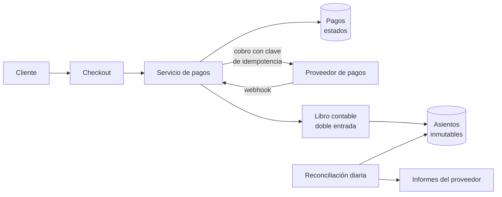
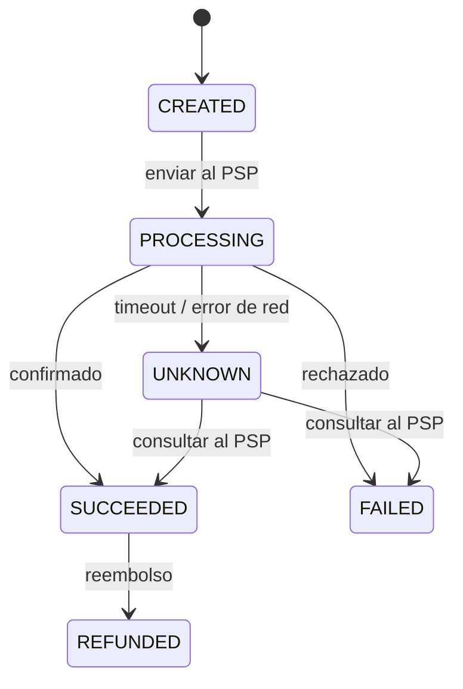

# Caso: Sistema de pagos <span class="nivel avanzado">Avanzado</span>

El caso donde la **corrección** importa más que nada: no se puede cobrar dos veces, perder un pago ni descuadrar un
saldo. Las técnicas (idempotencia, libro contable, reconciliación) aplican a cualquier sistema donde un error cuesta dinero.

## Paso 1 — Requisitos

- Cobrar a clientes por pedidos, usando un proveedor de pagos externo (PSP: Stripe, Adyen, Redsys…).
- Registrar cada movimiento y mantener saldos de cuentas correctos (por ejemplo, lo que se debe a cada vendedor).
- Volumen moderado (1 M pagos/día ≈ 12/s): **no es un problema de escala, es de corrección**.
- No almacenar datos de tarjetas (reducir el alcance de PCI DSS).

## Paso 2 — Diseño de alto nivel



- El **formulario de tarjeta** lo sirve el PSP (campos alojados o redirección): tus servidores nunca ven el número de tarjeta.
- El servicio de pagos gestiona el **ciclo de vida** del pago; el **libro contable** registra el dinero.

## Paso 3 — Profundizar

### Máquina de estados del pago



El estado **UNKNOWN** es clave: si la llamada al PSP expira, **no sabes** si se cobró. Nunca se reintenta a ciegas con una
petición nueva; se consulta al PSP o se reintenta con la **misma clave de idempotencia**.

### Idempotencia de extremo a extremo

1. El checkout genera un `paymentId` único **una vez** por intento de pago del pedido.
2. Tu API acepta `Idempotency-Key: paymentId`: un doble clic o un reintento devuelve el mismo resultado.
3. Al llamar al PSP se envía también esa clave: si reintentas tras un *timeout*, el PSP no cobra dos veces.
4. Los *webhooks* del PSP pueden llegar **duplicados y desordenados**: se procesan de forma idempotente y comprobando la
   transición de estado (un `payment.succeeded` que llega después de `refunded` no hace retroceder el estado).

### Libro contable de doble entrada

Cada movimiento se registra como un **asiento** con al menos dos apuntes que **suman cero**: el dinero no aparece ni
desaparece, solo se mueve entre cuentas.

| Asiento | Cuenta | Débito | Crédito |
|---|---|---|---|
| Cobro pedido 123 | Efectivo en el PSP | 100,00 | |
| | Deuda con el vendedor | | 95,00 |
| | Ingresos por comisión | | 5,00 |

- Los asientos son **inmutables** (solo se insertan); un error se corrige con un asiento inverso, nunca editando.
- El saldo de una cuenta es la suma de sus apuntes (o una proyección mantenida en la misma transacción).
- Importes en **enteros de la unidad mínima** (céntimos) o `BigDecimal`, nunca `double`.

```sql
CREATE TABLE ledger_entry (
  id          BIGSERIAL PRIMARY KEY,
  tx_id       UUID NOT NULL,              -- agrupa los apuntes de un asiento
  account     TEXT NOT NULL,
  amount_cents BIGINT NOT NULL,           -- positivo = débito, negativo = crédito
  currency    CHAR(3) NOT NULL,
  created_at  TIMESTAMPTZ NOT NULL DEFAULT now()
);
-- Invariante verificable: para cada tx_id, SUM(amount_cents) = 0
```

### Reconciliación

Aunque todo esté bien diseñado, **algo acabará descuadrando** (un *webhook* perdido, un cargo manual en el PSP). Cada día
se compara el libro propio con los informes de liquidación del PSP y del banco; las diferencias se investigan y se
corrigen con asientos. La reconciliación es la red de seguridad final de cualquier sistema financiero.

## Paso 4 — Cierre

- **Consistencia**: el cambio de estado del pago y los asientos del libro en la **misma transacción**; eventos hacia otros
  servicios con *outbox*.
- **Seguridad y cumplimiento**: PCI DSS (minimizado con *tokenización* del PSP), autenticación reforzada (SCA / 3-D Secure en Europa por PSD2), auditoría completa.
- **Monitorización**: pagos en UNKNOWN más de N minutos, diferencias de reconciliación, tasa de rechazos por PSP.

## Ejercicios

!!! exercise "Ejercicio 1 · Básico — ¿Por qué no double?"
    ¿Qué imprime `System.out.println(0.1 + 0.2);` en Java y por qué es un problema en pagos?

    ??? success "Solución"
        Imprime `0.30000000000000004`: los `double` son binarios y no representan exactamente la mayoría de fracciones
        decimales. Sumando millones de importes, los errores se acumulan y los saldos descuadran. Usa `long` en céntimos
        o `BigDecimal` con escala y redondeo explícitos.

!!! exercise "Ejercicio 2 · Medio — Timeout al cobrar"
    Tu servicio llama al PSP para cobrar 50 € y la llamada da *timeout* tras 30 s. El usuario pulsa "Pagar" otra vez.
    Describe paso a paso qué debe hacer el sistema.

    ??? success "Solución"
        1. Tras el *timeout*, el pago queda en estado **UNKNOWN** (no FAILED).
        2. El segundo clic llega con la **misma** clave de idempotencia del intento (el checkout no genera una nueva mientras
           el pago esté en curso): la API devuelve el estado actual ("procesando") en lugar de crear otro cobro.
        3. Un proceso de fondo **consulta al PSP** por esa clave (o reenvía la petición con la misma clave, que el PSP
           deduplica) hasta obtener el resultado definitivo; también puede llegar el *webhook*.
        4. Al resolverse, se actualiza el estado y se registran los asientos; el usuario ve el resultado.
        Nunca se lanza un cobro nuevo con otra clave mientras exista uno en UNKNOWN.

!!! exercise "Ejercicio 3 · Medio — Asiento de un reembolso"
    Escribe los apuntes del reembolso completo del pedido 123 del ejemplo (100 €, 5 € de comisión que se devuelve).

    ??? success "Solución"
        | Cuenta | Débito | Crédito |
        |---|---|---|
        | Deuda con el vendedor | 95,00 | |
        | Ingresos por comisión | 5,00 | |
        | Efectivo en el PSP | | 100,00 |

        Es el asiento **inverso**: suma cero, y el original no se modifica. El saldo de cada cuenta vuelve a su valor anterior.

!!! exercise "Ejercicio 4 · Avanzado — Webhooks desordenados"
    Llegan, en este orden, los *webhooks* `refund.succeeded` y después `payment.succeeded` del mismo pago. ¿Cómo evitas un estado incorrecto?

    ??? success "Solución"
        Tratar cada *webhook* como una **transición** de una máquina de estados validada, no como "sobrescribir el estado":
        `payment.succeeded` solo se aplica si el estado actual es PROCESSING o UNKNOWN; si ya es REFUNDED, se registra y se
        ignora. Además: verificar la firma del *webhook*, guardar el ID del evento para descartar duplicados, y ante dudas
        consultar el estado autoritativo al PSP. Si llega un reembolso de un pago que aún no consta como cobrado, se
        consulta al PSP y se aplican ambas transiciones en orden.
