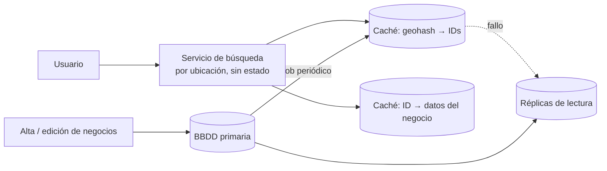

# Caso: Servicio de proximidad <span class="nivel avanzado">Avanzado</span>

Encontrar lo que está **cerca** de una posición: restaurantes a 2 km, el técnico más próximo, el sitio edge más cercano
a un incidente. El reto: una consulta por distancia no se resuelve bien con un índice normal.

## Paso 1 — Requisitos

- Dada una posición (latitud, longitud) y un radio, devolver los negocios cercanos, ordenados por distancia.
- 200 M negocios; 100 M usuarios activos al día que hacen 5 búsquedas → ~5 000 consultas/s (pico ~10 000).
- Los negocios cambian poco (altas y cambios pueden tardar minutos en reflejarse).
- Latencia < 200 ms.

## Paso 2 — Por qué no basta una consulta SQL simple

```sql
SELECT * FROM business
WHERE lat BETWEEN :lat - 0.02 AND :lat + 0.02
  AND lng BETWEEN :lng - 0.02 AND :lng + 0.02;
```

Con un índice en `lat` y otro en `lng`, la base de datos solo puede usar **uno** eficientemente: obtiene una franja
enorme (todos los negocios a esa latitud en todo el planeta) y filtra el resto. Necesitamos **indexar las dos
dimensiones a la vez**.

## Paso 3 — Índices geoespaciales

### Geohash

Divide el mundo en celdas de forma recursiva y codifica cada celda como una cadena: **cuanto más larga, más pequeña la
celda**. Celdas cercanas suelen compartir prefijo.

| Longitud del geohash | Tamaño aproximado de la celda |
|---|---|
| 4 | 39 km × 20 km |
| 5 | 4,9 km × 4,9 km |
| 6 | 1,2 km × 0,6 km |
| 7 | 153 m × 153 m |

Búsqueda en un radio de 2 km: calcular el geohash de longitud 5 de la posición, tomar esa celda **y sus 8 vecinas**
(un punto cercano puede estar al otro lado del borde de la celda), recuperar los negocios de las 9 celdas y filtrar por
distancia real.

```sql
CREATE INDEX idx_business_geohash ON business (geohash5);
SELECT * FROM business WHERE geohash5 IN (:cell, :n, :ne, :e, :se, :s, :sw, :w, :nw);
-- después, en la aplicación: calcular la distancia exacta (fórmula de haversine), filtrar y ordenar
```

!!! tip "Por qué la celda y sus vecinas"
    Dos puntos a 10 metros pueden caer en celdas con geohash completamente distinto si están a ambos lados de una
    frontera. Consultar las 8 vecinas resuelve ese problema de bordes.

### Otras técnicas

| Técnica | Idea | Cuándo |
|---|---|---|
| **Geohash** | Celdas fijas codificadas como texto | Sencillo, funciona con cualquier base de datos o caché |
| **Quadtree** | Árbol que divide cada cuadrante en 4 **solo si tiene muchos puntos** | Densidad muy desigual (ciudades vs. desierto); índice en memoria |
| **S2** (Google), **H3** (Uber) | Celdas jerárquicas sobre la esfera (H3: hexágonos de igual tamaño) | Análisis geoespacial serio, agregaciones por zona |
| **R-tree / GiST** (PostGIS) | Índice espacial de la base de datos | Consultas geográficas generales con SQL |

```sql
-- PostGIS: la opción más directa si ya usas PostgreSQL
SELECT name, ST_Distance(location, ST_MakePoint(:lng, :lat)::geography) AS meters
FROM business
WHERE ST_DWithin(location, ST_MakePoint(:lng, :lat)::geography, 2000)
ORDER BY meters
LIMIT 20;
```

## Paso 4 — Arquitectura y escalado



- **Lecturas ≫ escrituras** y los datos cambian poco → cachés y réplicas de lectura; el índice se reconstruye periódicamente.
- 200 M negocios × (geohash + ID) cabe en memoria de unas pocas máquinas: se puede replicar entero en lugar de particionar.
- **Objetos en movimiento** (repartidores, técnicos): actualizaciones de posición cada pocos segundos → índice en memoria
  (Redis `GEOADD`/`GEOSEARCH`), sin pasar por la base de datos principal en cada actualización.

## Ejercicios

!!! exercise "Ejercicio 1 · Básico — Elegir la precisión"
    Quieres buscar en un radio de 500 m. ¿Qué longitud de geohash usarías y por qué?

    ??? success "Solución"
        Longitud **6** (celdas de ~1,2 km × 0,6 km): la celda y sus vecinas cubren holgadamente un radio de 500 m. Con
        longitud 7 (153 m) habría que consultar muchas más celdas; con 5 (4,9 km) se recuperarían demasiados candidatos
        que luego se descartan.

!!! exercise "Ejercicio 2 · Medio — Distancia de haversine"
    Implementa la distancia en metros entre dos coordenadas.

    ??? success "Solución"
        ```java
        static double haversineMeters(double lat1, double lng1, double lat2, double lng2) {
            final double R = 6_371_000;                          // radio medio de la Tierra en metros
            double dLat = Math.toRadians(lat2 - lat1);
            double dLng = Math.toRadians(lng2 - lng1);
            double a = Math.pow(Math.sin(dLat / 2), 2)
                     + Math.cos(Math.toRadians(lat1)) * Math.cos(Math.toRadians(lat2)) * Math.pow(Math.sin(dLng / 2), 2);
            return 2 * R * Math.asin(Math.sqrt(a));
        }
        ```
        Tiene en cuenta la curvatura de la Tierra; para distancias de pocos km el error frente a la fórmula exacta
        (elipsoide) es despreciable.

!!! exercise "Ejercicio 3 · Avanzado — Técnico más cercano a un sitio caído"
    Tienes 3 000 técnicos que envían su posición cada 30 s y 20 000 sitios fijos. Cuando cae un sitio, quieres los 3
    técnicos disponibles más cercanos. Diseña la solución.

    ??? success "Solución"
        Posiciones de técnicos en **Redis GEO** (`GEOADD technicians <lng> <lat> <id>`, actualizado cada 30 s) con un TTL
        por técnico para descartar posiciones obsoletas, y un conjunto aparte de técnicos disponibles. Al caer un sitio:
        `GEOSEARCH technicians FROMLONLAT <lng> <lat> BYRADIUS 50 km ASC COUNT 10`, filtrar por disponibles y quedarse con
        3; si no hay suficientes, ampliar el radio. Con 3 000 técnicos incluso recorrerlos todos en memoria sería trivial:
        Redis GEO simplifica, pero no es imprescindible a esta escala. La distancia real por carretera se obtendría después
        con un servicio de rutas solo para esos candidatos.
