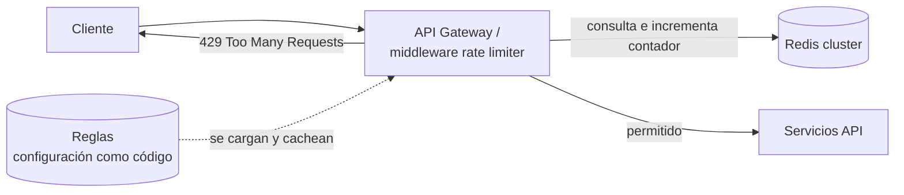

# Caso resuelto: Rate limiter <span class="nivel medio">Medio</span>

Un **rate limiter** (limitador de tasa) controla cuántas peticiones puede hacer un cliente en un periodo de tiempo.
Protege frente a abusos y ataques, evita que un cliente acapare recursos, controla costes (llamadas a APIs de pago) y
aplica los límites de cada plan comercial.

Diseño completo siguiendo el [marco de 4 pasos](../libros/system-design-interview.md).

## Paso 1 — Requisitos

??? question "¿Qué preguntarías antes de diseñar? (piensa antes de abrir)"
    - ¿Limitador en el cliente o en el servidor? → **Servidor**: el cliente se puede manipular.
    - ¿Limitar por qué? → Por **usuario / API key**, y también por IP para tráfico anónimo.
    - ¿Escala? → 10 M usuarios, sistema **distribuido** (muchas instancias de la API).
    - ¿Qué pasa al superar el límite? → Responder **HTTP 429 Too Many Requests** con información para reintentar.
    - ¿Reglas flexibles? → Sí, distintas por *endpoint* y por plan.
    - No funcionales: **latencia mínima** añadida (< 1-2 ms) y alta disponibilidad: si el limitador falla, **no debe
      tumbar la API** (dejar pasar).

## Paso 2 — Diseño de alto nivel



1. Cada petición pasa por el limitador, situado en el *gateway* o como *middleware*.
2. El limitador identifica al cliente (API key, usuario, IP) y la regla aplicable (*endpoint*, plan).
3. Consulta y actualiza el contador de ese cliente en **Redis** (compartido por todas las instancias).
4. Si está dentro del límite, deja pasar; si no, responde `429`.

Cabeceras de respuesta habituales: `X-RateLimit-Limit` (límite), `X-RateLimit-Remaining` (restantes),
`Retry-After` (segundos hasta poder reintentar).

## Paso 3 — Profundizar: los algoritmos

### Token bucket (cubo de fichas)

- Cada cliente tiene un **cubo** con capacidad máxima **B** fichas.
- El cubo se **rellena** a ritmo constante: **r** fichas por segundo (sin superar B).
- Cada petición **consume una ficha**. Si no hay fichas, se rechaza.

Resultado: se permite una **ráfaga** de hasta B peticiones seguidas y, a largo plazo, un ritmo medio de r por segundo.
Es el más usado (AWS, Stripe, NGINX) por ser simple, eficiente en memoria (2 números por cliente) y tolerante con ráfagas legítimas.

### Leaky bucket (cubo que gotea)

Las peticiones entran en una **cola FIFO** de tamaño fijo y **salen a ritmo constante**. Si la cola está llena, se
descartan. Produce un flujo de salida muy estable (útil para proteger un sistema que no tolera picos), pero las ráfagas
llenan la cola con peticiones que esperan.

### Ventana fija (fixed window counter)

Un contador por cliente y por ventana de tiempo (por ejemplo, por minuto natural: `user42:10:05`). Si supera el límite,
se rechaza hasta la siguiente ventana.

!!! warning "El problema del borde"
    Con límite 100/minuto, un cliente puede hacer 100 peticiones a las 10:05:59 y otras 100 a las 10:06:00: **200 en un
    segundo**, el doble del límite, porque caen en ventanas distintas.

### Registro deslizante (sliding window log)

Guardar el *timestamp* de cada petición; al llegar una nueva, borrar los anteriores a "ahora − 1 minuto" y contar los
restantes. Es **exacto**, pero guarda un registro por petición: mucha memoria con límites altos.

### Contador de ventana deslizante (sliding window counter)

Aproximación que combina la ventana actual y una parte proporcional de la anterior:

```text
peticiones estimadas = actual + anterior × (fracción de la ventana anterior que aún solapa)

Ejemplo: límite 100/min. Ventana anterior: 80 peticiones. Actual (llevamos 15 s): 30.
Solape de la anterior = 45/60 = 75 % → estimado = 30 + 80 × 0,75 = 90 → se permite.
```

Buen equilibrio: poca memoria (2 contadores) y sin el problema del borde (con un error pequeño aceptable).

| Algoritmo | Memoria por cliente | Permite ráfagas | Precisión | Uso típico |
|---|---|---|---|---|
| Token bucket | 2 números | Sí (hasta B) | Buena | **Por defecto** en APIs |
| Leaky bucket | Cola | No | Buena | Suavizar tráfico hacia un sistema frágil |
| Ventana fija | 1 contador | Sí, hasta 2× en el borde | Baja en bordes | Límites diarios, simplicidad extrema |
| Registro deslizante | 1 entrada por petición | No | Exacta | Límites bajos donde la exactitud importa |
| Contador deslizante | 2 contadores | Controladas | Aproximada, buena | Alternativa al token bucket |

### Token bucket en Java (una instancia)

```java
public final class TokenBucket {
    private final long capacity;             // B: tamaño máximo de la ráfaga
    private final double refillPerNano;      // r expresado en fichas por nanosegundo
    private final LongSupplier clock;        // reloj inyectable: permite probar sin esperar
    private double tokens;
    private long lastRefill;

    public TokenBucket(long capacity, double tokensPerSecond, LongSupplier nanoClock) {
        this.capacity = capacity;
        this.refillPerNano = tokensPerSecond / 1_000_000_000.0;
        this.clock = nanoClock;
        this.tokens = capacity;              // empieza lleno
        this.lastRefill = nanoClock.getAsLong();
    }

    public synchronized boolean tryConsume() {
        refill();
        if (tokens >= 1) { tokens -= 1; return true; }
        return false;
    }

    private void refill() {                  // en lugar de un temporizador, se calcula al consultar
        long now = clock.getAsLong();
        tokens = Math.min(capacity, tokens + (now - lastRefill) * refillPerNano);
        lastRefill = now;
    }
}
```

El relleno se calcula **perezosamente** en cada consulta según el tiempo transcurrido: no hace falta ningún proceso que
añada fichas periódicamente.

### Versión distribuida: Redis + Lua

Con varias instancias de la API, el contador debe ser **compartido**. Si cada instancia lee el valor, lo modifica y lo
escribe en pasos separados, dos instancias pueden leer lo mismo a la vez (**condición de carrera**) y dejar pasar más
peticiones de las permitidas. Un **script Lua** se ejecuta en Redis de forma **atómica**: nadie más modifica la clave
mientras se ejecuta.

```lua
-- KEYS[1] = clave del cubo del cliente; ARGV = capacidad, fichas/segundo, ahora (ms)
local b = redis.call('HMGET', KEYS[1], 'tokens', 'ts')
local capacity, rate, now = tonumber(ARGV[1]), tonumber(ARGV[2]), tonumber(ARGV[3])
local tokens = tonumber(b[1]) or capacity                       -- cliente nuevo: cubo lleno
local ts = tonumber(b[2]) or now
tokens = math.min(capacity, tokens + (now - ts) / 1000 * rate)  -- rellenar según el tiempo transcurrido
local allowed = 0
if tokens >= 1 then tokens = tokens - 1; allowed = 1 end
redis.call('HSET', KEYS[1], 'tokens', tokens, 'ts', now)
redis.call('PEXPIRE', KEYS[1], math.ceil(capacity / rate * 1000))   -- clientes inactivos desaparecen solos
return allowed
```

### Temas para profundizar

- **Dónde colocarlo**: en el API gateway (Kong, Envoy, NGINX) es lo más habitual; como *middleware* propio si las reglas
  dependen de lógica de negocio; en el *sidecar* de un service mesh para tráfico interno.
- **Multi-región**: un Redis global añadiría latencia; se usan contadores **por región** y se acepta algo de imprecisión
  (un cliente podría superar ligeramente el límite repartiendo tráfico entre regiones).
- **Si Redis falla**: *fail-open* (dejar pasar) para no tumbar la API por un fallo del limitador; alerta inmediata y,
  como red de seguridad, un límite **local** por instancia más generoso.
- **Reglas como código**: versionadas en Git y desplegadas vía GitOps.

```yaml
# Reglas (formato del servicio de rate limit de Envoy)
domain: public-api
descriptors:
  - key: api_key
    rate_limit: { unit: minute, requests_per_unit: 100 }
  - key: path
    value: /login
    rate_limit: { unit: minute, requests_per_unit: 5 }      # más estricto para evitar fuerza bruta
```

## Paso 4 — Cierre

- **Monitorizar**: tasa de 429 por regla y cliente, latencia añadida por el limitador, errores y latencia de Redis.
- **Mejoras**: límites por plan del cliente, cuotas diarias o mensuales además del ritmo, *load shedding* por prioridad
  (en sobrecarga, rechazar primero el tráfico menos importante).
- **Riesgos**: claves calientes en Redis (un cliente enorme) → particionar por clave, límite local previo.

## Ejercicios

!!! exercise "Ejercicio 1 · Básico — Calcular el comportamiento"
    Token bucket con capacidad 10 y relleno de 2 fichas/s, lleno al inicio. Un cliente envía 15 peticiones seguidas en
    t = 0 y otras 5 en t = 3 s. ¿Cuántas se aceptan en cada momento?

    ??? success "Solución"
        En t = 0 hay 10 fichas: se aceptan **10** y se rechazan 5. Entre t = 0 y t = 3 se rellenan 3 × 2 = 6 fichas (el
        cubo tiene 6). En t = 3 se aceptan las **5** peticiones (quedan 1 ficha). Total: 15 aceptadas de 20.

!!! exercise "Ejercicio 2 · Básico — Test sin esperas"
    Escribe un test para `TokenBucket` que compruebe: capacidad 5 y 1 ficha/s → 5 peticiones seguidas aceptadas, la 6.ª
    rechazada, y tras 1 s se acepta otra. Sin `Thread.sleep`.

    ??? success "Solución"
        ```java
        @Test
        void refillsOneTokenPerSecond() {
            AtomicLong now = new AtomicLong(0);                          // reloj controlado por el test
            TokenBucket bucket = new TokenBucket(5, 1.0, now::get);

            for (int i = 0; i < 5; i++) assertThat(bucket.tryConsume()).isTrue();
            assertThat(bucket.tryConsume()).isFalse();

            now.addAndGet(1_000_000_000L);                               // avanza 1 s
            assertThat(bucket.tryConsume()).isTrue();
            assertThat(bucket.tryConsume()).isFalse();
        }
        ```
        Inyectar el reloj hace el test instantáneo y determinista; es la razón del parámetro `LongSupplier nanoClock`.

!!! exercise "Ejercicio 3 · Medio — Elegir algoritmo"
    Elige algoritmo para: (a) API pública con límite de 1 000 peticiones/hora por cliente, tolerando ráfagas;
    (b) proteger una API heredada que colapsa con más de 50 peticiones/s; (c) límite de 5 intentos de login por minuto y usuario.

    ??? success "Solución"
        (a) **Token bucket** (capacidad p. ej. 100, relleno 1 000/3 600 por segundo): permite ráfagas y controla la media.
        (b) **Leaky bucket** / cola con salida constante a 50/s delante de la API heredada: suaviza picos que la romperían.
        (c) **Registro deslizante** o contador deslizante: con límites tan bajos, la exactitud importa (evitar que el borde de
        ventana permita 10 intentos) y la memoria es mínima.

!!! exercise "Ejercicio 4 · Avanzado — Contador deslizante en Redis"
    Implementa el contador de ventana deslizante (límite N por minuto) con Redis de forma atómica.

    ??? success "Solución"
        ```lua
        -- KEYS[1] = prefijo del cliente; ARGV = límite, ahora (ms)
        local limit, now = tonumber(ARGV[1]), tonumber(ARGV[2])
        local window = 60000
        local current = math.floor(now / window)
        local curKey = KEYS[1] .. ':' .. current
        local prevKey = KEYS[1] .. ':' .. (current - 1)
        local cur = tonumber(redis.call('GET', curKey) or '0')
        local prev = tonumber(redis.call('GET', prevKey) or '0')
        local elapsed = (now % window) / window                 -- fracción transcurrida de la ventana actual
        local estimated = cur + prev * (1 - elapsed)            -- parte de la anterior que aún solapa
        if estimated >= limit then return 0 end
        redis.call('INCR', curKey)
        redis.call('PEXPIRE', curKey, window * 2)               -- se necesita durante esta ventana y la siguiente
        return 1
        ```
        Dos claves por cliente con expiración automática; el script completo es atómico, así que no hay carreras entre instancias.
