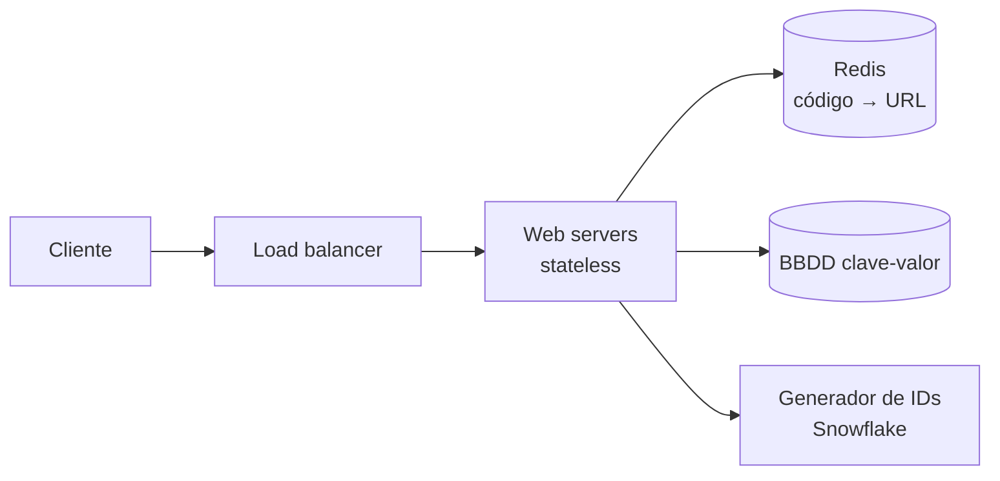
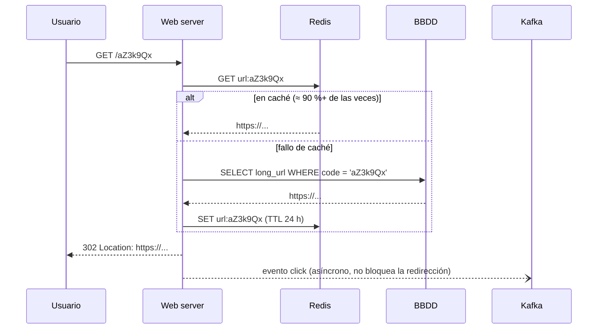

# Caso: Acortador de URLs <span class="nivel basico">Básico</span>

## Paso 1 — Requisitos y estimaciones

- Funcionales: acortar una URL larga; redirigir de la corta a la larga. (Fuera: analítica avanzada, URLs personalizadas.)
- Escala: **100 M URLs nuevas/día**, ratio lectura:escritura **10:1**, retención 10 años.

??? question "Estima QPS y almacenamiento"
    - Escrituras: 100 M / 10^5 ≈ **1 200 QPS**. Lecturas: ≈ **12 000 QPS**.
    - Registros en 10 años: 100 M × 365 × 10 ≈ **365 000 M** (3,65 × 10^11).
    - Con ~100 bytes por registro: ≈ **36,5 TB**.
    - Longitud del código en Base62 (a-z, A-Z, 0-9): 62^7 ≈ 3,5 × 10^12 > 3,65 × 10^11 → **7 caracteres**.

## Paso 2 — Diseño de alto nivel



API:

```http
POST /api/v1/urls        { "longUrl": "https://..." }   → 201 { "shortUrl": "https://sho.rt/aZ3k9Qx" }
GET  /aZ3k9Qx                                            → 301/302  Location: https://...
```

!!! warning "Trade-off 301 vs. 302"
    **301** (permanente): el navegador cachea → menos carga, pero pierdes analítica.
    **302** (temporal): cada clic pasa por el servidor → analítica posible, más carga.

## Paso 3 — Profundizar: cómo generar el código

| Opción | Cómo | Pros | Contras |
|---|---|---|---|
| **Hash + colisiones** | CRC32/MD5 de la URL, tomar 7 caracteres, si colisiona añadir sal | Misma URL → mismo código | Comprobar colisiones en BBDD (filtro de Bloom ayuda) |
| **ID único + Base62** | ID de [Snowflake](fundamentos.md#9-generacion-de-ids-unicos-snowflake) convertido a Base62 | Sin colisiones | Código predecible; depende del generador |

```java
private static final String ALPHABET = "0123456789abcdefghijklmnopqrstuvwxyzABCDEFGHIJKLMNOPQRSTUVWXYZ";

static String toBase62(long id) {
    var sb = new StringBuilder();
    do {
        sb.append(ALPHABET.charAt((int) (id % 62)));
        id /= 62;
    } while (id > 0);
    return sb.reverse().toString();
}
```

### Generar IDs sin cuello de botella

- **Snowflake** en cada instancia: sin coordinación, pero códigos de 11 caracteres (64 bits en Base62).
- **Rangos pre-asignados**: un servicio central (o una secuencia de BBDD) entrega bloques de 1 000 IDs a cada
  instancia; la instancia los consume en memoria. Códigos cortos (7 caracteres) y casi sin coordinación.
- Para que no sean **predecibles** (y no se puedan enumerar todos los enlaces): barajar los bits del ID con una
  permutación reversible antes de codificar.

### Flujo de redirección (camino caliente)



### Modelo de datos

| Campo | Tipo | Nota |
|---|---|---|
| `code` | `CHAR(7)` | Clave primaria / de partición |
| `long_url` | `TEXT` | Hasta ~2 KB |
| `owner_id` | `BIGINT` | Opcional |
| `created_at`, `expires_at` | `TIMESTAMP` | Expiración opcional |

Almacén: clave-valor (DynamoDB, Cassandra) encaja por acceso puro por clave y escala horizontal; PostgreSQL con
*sharding* por `code` también es válido para este volumen.

## Paso 4 — Cierre

| Tema | Decisión |
|---|---|
| **Caché** | Redis con LRU; el 20 % de los enlaces recibe el 80 % de los clics; caché también en CDN para los más populares (con 301 o `Cache-Control`) |
| **Analítica** | Eventos de clic a Kafka → procesamiento en *streaming* → almacén analítico (ClickHouse, BigQuery). Nunca en el camino de la redirección |
| **Expiración** | `expires_at` + TTL en caché; limpieza periódica en segundo plano; opcionalmente reutilizar códigos caducados |
| **Abuso** | *Rate limiting* por IP/usuario al crear, listas de dominios maliciosos (Safe Browsing), página intermedia de aviso |
| **Multi-región** | Lecturas servidas desde réplicas regionales + caché local; escrituras con IDs sin colisión entre regiones (prefijo de región o rangos distintos) |
| **Disponibilidad** | Web *stateless* detrás de LB en varias AZs; si cae Redis, degradar a BBDD; si cae Kafka, *buffer* local de eventos |
| **Monitorización** | Latencia p99 de redirección, tasa de aciertos de caché, 404s, tasa de creación (detectar spam) |

??? question "¿Qué pasa si dos usuarios acortan la misma URL larga?"
    Depende del requisito: con **hash** obtienen el mismo código (deduplicación natural); con **ID único**, dos códigos
    distintos (cada uno con su analítica y propietario). Se puede añadir un índice por `long_url` si se quiere deduplicar.

??? question "¿Por qué la analítica no debe ir en el camino de la redirección?"
    Porque añadiría latencia y un punto de fallo a la operación más frecuente y crítica. Se publica un evento asíncrono y
    se procesa aparte; si se pierde alguno, es tolerable.

## Ejercicios

!!! exercise "Ejercicio 1 · Básico — Longitud del código"
    ¿Cuántos caracteres Base62 necesitas para 50 000 millones de URLs? ¿Y si usaras solo minúsculas y dígitos (Base36)?

    ??? success "Solución"
        Base62: 62⁶ ≈ 5,7 × 10¹⁰ = 57 000 M ≥ 50 000 M → **6 caracteres** (justo; con margen, 7). Base36: 36⁷ ≈ 7,8 × 10¹⁰ →
        **7 caracteres**. Base36 evita confusiones entre mayúsculas y minúsculas (útil si los códigos se dictan o se escriben a mano).

!!! exercise "Ejercicio 2 · Medio — Codificar y decodificar"
    Implementa `toBase62(long)` y `fromBase62(String)` y comprueba que son inversas.

    ??? success "Solución"
        ```java
        private static final String ALPHABET = "0123456789abcdefghijklmnopqrstuvwxyzABCDEFGHIJKLMNOPQRSTUVWXYZ";

        static String toBase62(long id) {
            if (id == 0) return "0";
            var sb = new StringBuilder();
            while (id > 0) { sb.append(ALPHABET.charAt((int) (id % 62))); id /= 62; }
            return sb.reverse().toString();
        }

        static long fromBase62(String code) {
            long value = 0;
            for (char c : code.toCharArray()) {
                int digit = ALPHABET.indexOf(c);
                if (digit < 0) throw new IllegalArgumentException("Carácter no válido: " + c);
                value = value * 62 + digit;                 // mismo principio que leer un número en base 10
            }
            return value;
        }

        @Test
        void roundTrip() {
            for (long id : new long[]{0, 1, 61, 62, 123_456_789L, Long.MAX_VALUE})
                assertThat(fromBase62(toBase62(id))).isEqualTo(id);
        }
        ```

!!! exercise "Ejercicio 3 · Medio — Generador por rangos"
    Implementa un generador de IDs que pide a la base de datos bloques de 1 000 y los reparte en memoria de forma segura
    entre hilos.

    ??? success "Solución"
        ```java
        public class RangeIdGenerator {
            private final JdbcTemplate jdbc;
            private long next = 0, end = 0;                          // [next, end) disponible

            public synchronized long nextId() {
                if (next >= end) {                                    // bloque agotado: reservar otro
                    long start = jdbc.queryForObject(
                        "UPDATE id_block SET next_value = next_value + 1000 WHERE name = 'url' RETURNING next_value - 1000",
                        Long.class);
                    next = start;
                    end = start + 1000;
                }
                return next++;
            }
        }
        ```
        La reserva del bloque es atómica en la base de datos (un `UPDATE … RETURNING`), así que dos instancias nunca reciben
        el mismo rango. Si una instancia se reinicia, pierde los IDs no usados de su bloque: huecos aceptables.

!!! exercise "Ejercicio 4 · Avanzado — Evitar códigos enumerables"
    Con IDs consecutivos, los códigos son predecibles (`aZ3k9Qx`, `aZ3k9Qy`…) y cualquiera puede recorrer todos los enlaces.
    ¿Cómo lo evitas sin perder la garantía de unicidad?

    ??? success "Solución"
        Aplicar al ID una **permutación reversible** antes de codificar: por ejemplo, multiplicar por un número impar grande
        módulo 2⁴² (y usar su inverso para decodificar), o un cifrado de bloque pequeño con clave secreta (*format-preserving
        encryption*, Feistel). Como es una biyección, IDs distintos dan códigos distintos (unicidad garantizada), pero
        consecutivos producen códigos que parecen aleatorios. Alternativa más simple: generar códigos aleatorios y comprobar
        colisión con una restricción única en la base de datos (reintentar si choca).
