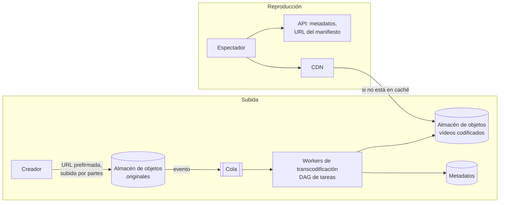
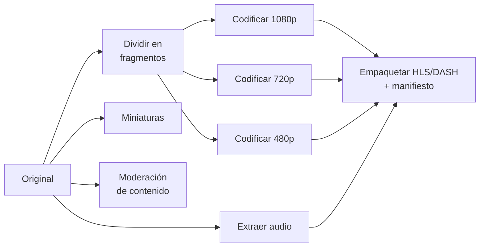

# Caso: Plataforma de vídeo (tipo YouTube) Avanzado

Subir, procesar y reproducir vídeo a escala. El reto está en el **volumen de datos**: almacenamiento, procesamiento
(transcodificación) y, sobre todo, **ancho de banda** de salida.

## Paso 1 — Requisitos

- Subir vídeos (hasta varios GB); reproducirlos con calidad adaptada a la red y al dispositivo.
- 5 M usuarios activos al día, cada uno ve 5 vídeos; el 10 % sube 1 vídeo al día de 300 MB de media.
- Reproducción fluida en todo el mundo; subida fiable incluso con conexiones malas.

??? question "Estima almacenamiento y ancho de banda"
    - Subidas: 5 M × 10 % × 300 MB = **150 TB/día** de originales; con varias resoluciones transcodificadas, ×2 o ×3.
    - Visionado: 5 M × 5 = 25 M reproducciones/día. Si cada una transfiere ~100 MB → **2,5 PB/día** de salida.
    - Conclusión: el coste dominante es la **entrega (CDN)**, seguido del almacenamiento.

## Paso 2 — Diseño de alto nivel

## Paso 3 — Profundizar

### Subida

- El cliente pide una **URL prefirmada** y sube **directamente al almacenamiento de objetos** (no pasa por tus servidores).
- **Subida por partes** (*multipart*) y **reanudable**: si falla la parte 37 de 60, solo se reenvía esa.
- Al completarse, un evento dispara el procesamiento.

### Transcodificación

Convertir el original a varios **formatos, resoluciones y tasas de bits** (240p … 4K; códecs H.264, VP9, AV1) y
trocearlo en segmentos de pocos segundos para *streaming* adaptativo.

- Se modela como un **DAG** de tareas paralelizables (fragmentos × resoluciones), ejecutado por *workers* que escalan
  según la cola (muy apropiado para instancias **Spot**: son tareas reintentables).
- Coste de cómputo alto: codificar en AV1 ahorra ancho de banda pero cuesta mucha más CPU → se reserva para vídeos populares.

### Reproducción: streaming adaptativo (HLS / DASH)

1. El reproductor descarga un **manifiesto** que lista las calidades disponibles y sus segmentos.
2. Descarga segmentos de pocos segundos; según la velocidad medida, **cambia de calidad** en el siguiente segmento.
3. Todo son ficheros estáticos servidos por **CDN** → escala enormemente y es cacheable.

### Optimización de coste

- **Popularidad muy desigual**: la mayoría de visionados se concentran en pocos vídeos. Los populares, en todas las
  ubicaciones de la CDN y en códecs eficientes; la cola larga, bajo demanda desde el origen o en menos calidades.
- Clases de almacenamiento frías para originales y vídeos que nadie ve.
- CDN propia o acuerdos con operadores (cachés dentro de sus redes) a gran escala.

## Paso 4 — Cierre

- **Seguridad**: URLs firmadas con caducidad, DRM para contenido protegido.
- **Fiabilidad**: tareas de transcodificación idempotentes y reintentables; estado del procesamiento en metadatos.
- **Monitorización**: tiempo hasta disponibilidad tras subir, tasa de *rebuffering*, calidad media servida, coste por hora vista.

## Ejercicios

!!! exercise "Ejercicio 1 · Básico — ¿Por qué no subir a través del API?"
    Un compañero propone que los vídeos se suban mediante `POST /videos` a tus servidores, que los guardan en S3. ¿Qué
    problemas tiene frente a las URLs prefirmadas?

    ??? success "Solución"
        Tus servidores reciben y reenvían GB de datos: consumen ancho de banda, memoria y conexiones largas, necesitan
        escalar solo por las subidas y se convierten en un punto de fallo; las subidas largas chocan con *timeouts* de
        balanceadores. Con URL prefirmada el cliente sube **directamente** al almacenamiento (que escala solo), por partes
        y reanudable, y tu API solo emite la URL con permisos limitados y caducidad.

!!! exercise "Ejercicio 2 · Medio — Segmentos y cambio de calidad"
    ¿Qué efecto tiene usar segmentos de 2 s frente a 10 s en la experiencia y en la infraestructura?

    ??? success "Solución"
        Segmentos cortos: el reproductor **se adapta antes** a cambios de red y el arranque es más rápido, pero hay **más
        peticiones** HTTP, manifiestos más largos y algo peor de compresión (cada segmento empieza con un fotograma clave).
        Segmentos largos: menos sobrecarga y mejor compresión, pero reacción lenta ante bajadas de ancho de banda
        (más *rebuffering*). Valores típicos: 2-6 s.

!!! exercise "Ejercicio 3 · Avanzado — Distribuir vídeos de formación a la flota edge"
    Tienes que distribuir vídeos de formación (2 GB cada uno) a 20 000 sitios con conexiones lentas para que se vean
    localmente. ¿Cómo lo diseñas?

    ??? success "Solución"
        No hacer *streaming* desde la nube: **pre-posicionar** los ficheros en cada sitio. Publicarlos como artefactos
        (almacenamiento de objetos u OCI) con una lista declarativa en Git de qué vídeos debe tener cada grupo de sitios;
        un agente local los descarga fuera de horario, con límite de ancho de banda, reanudable y verificando el *hash*.
        Servir en el sitio desde un servidor local. Para reducir tráfico, descarga **por niveles**: un sitio por región
        descarga del origen y los demás de él (o P2P). Es el mismo modelo pull que GitOps.
