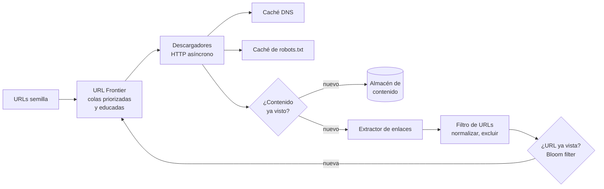
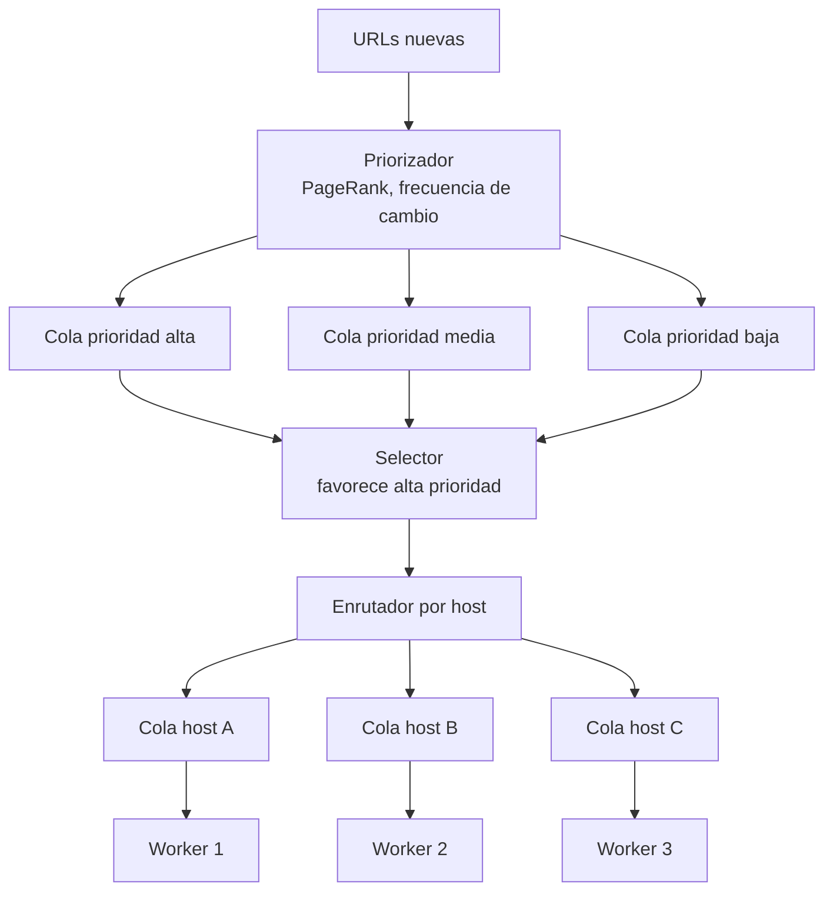

# Caso: Web crawler Medio

Un *crawler* descarga páginas web, extrae sus enlaces y los descarga a su vez, para indexar la web (buscadores),
archivarla o recopilar datos (por ejemplo, para entrenar modelos).

## Paso 1 — Requisitos

- Descargar **1 000 millones de páginas al mes**, solo HTML, guardándolas 5 años.
- Detectar contenido duplicado y no descargar dos veces la misma URL.
- **Educado** (*polite*): no saturar ningún servidor y respetar `robots.txt`.
- Robusto ante HTML malformado, servidores lentos, trampas (URLs infinitas) y fallos propios.
- Escalable horizontalmente.

??? question "Estima el ritmo y el almacenamiento"
    - 1 000 M / (30 × 86 400 s) ≈ **400 páginas/s** de media; pico ×2 ≈ 800/s.
    - Página media de 500 KB → 1 000 M × 500 KB = **500 TB/mes** → 500 TB × 12 × 5 = **30 PB** en 5 años (sin comprimir;
      el HTML comprime ~5-10×, así que en la práctica 3-6 PB).

## Paso 2 — Diseño de alto nivel

1. El ***URL Frontier*** decide **qué** descargar y **cuándo**.
2. Los **descargadores** obtienen la página (resolviendo DNS con caché, comprobando `robots.txt`).
3. Se detecta si el **contenido** es duplicado (*hash* o *simhash*); si es nuevo, se guarda.
4. Se **extraen los enlaces**, se normalizan y se filtran.
5. Si la **URL** no se ha visto antes, vuelve al *frontier*.

## Paso 3 — Profundizar

### El URL Frontier: prioridad y educación

- **Colas delanteras (prioridad)**: se atienden más a menudo las páginas importantes o que cambian con frecuencia.
- **Colas traseras (educación)**: **una cola por host**, y cada cola la atiende **un solo worker** con una pausa entre
  peticiones. Así nunca hay dos descargas simultáneas al mismo servidor.
- El *frontier* no cabe en memoria (miles de millones de URLs): se guarda en disco con *buffers* en memoria.

### Deduplicación

| Qué | Técnica |
|---|---|
| **URL ya vista** | Normalizar (minúsculas en el host, quitar fragmentos `#`, ordenar parámetros) + **Bloom filter** (memoria mínima; algún falso positivo aceptable) |
| **Contenido idéntico** | *Hash* del contenido (SHA-256) |
| **Contenido casi idéntico** | *Simhash* / *MinHash*: firmas similares para textos similares (misma página con distinta fecha o publicidad) |

### Robustez

| Problema | Solución |
|---|---|
| **Trampas** (calendarios infinitos, URLs generadas) | Límite de profundidad y de longitud de URL, límite de páginas por host |
| Servidores lentos | *Timeouts* cortos, E/S asíncrona |
| Contenido basura / spam | Filtros de calidad, listas de exclusión |
| Caída de un worker | Estado del *frontier* persistido; las URLs asignadas se reasignan |
| DNS lento | Caché DNS propia (el DNS puede ser el cuello de botella) |

### Recrawling

Las páginas cambian a ritmos distintos: se estima la **frecuencia de cambio** de cada una (comparando versiones) y se
vuelve a visitar en consecuencia; se usan cabeceras `If-Modified-Since`/`ETag` para no descargar lo que no ha cambiado.

## Paso 4 — Cierre

- **Escalado**: particionar el *frontier* por *hash* del host entre muchos servidores; descargadores distribuidos
  geográficamente cerca de los servidores que visitan.
- **Almacenamiento**: contenido comprimido en almacenamiento de objetos; metadatos en una base clave-valor.
- **Extensiones**: renderizar JavaScript (navegador sin interfaz, mucho más caro), descargar otros tipos de fichero.
- **Monitorización**: páginas/s, tasa de errores por host, tamaño del *frontier*, proporción de duplicados.

## Preguntas de repaso

??? question "¿Por qué una cola por host?"
    Para garantizar la educación: un único worker por host, con pausas entre peticiones, evita saturar un servidor y
    cumplir los límites de `robots.txt` (`Crawl-delay`).

??? question "¿Por qué un Bloom filter para las URLs vistas y no un HashSet?"
    Con miles de millones de URLs, un `HashSet` ocuparía cientos de GB. Un Bloom filter ocupa una fracción (≈ 1,2 GB para
    1 000 M URLs con 1 % de falsos positivos); el coste de un falso positivo (no visitar alguna URL nueva) es aceptable.

## Ejercicios

!!! exercise "Ejercicio 1 · Básico — Normalizar URLs"
    ¿Cuáles de estas URLs son la misma página y cuál sería su forma normalizada?
    `HTTP://Example.com/a/../b/?y=2&x=1#top`, `http://example.com/b/?x=1&y=2`, `http://example.com:80/b?x=1&y=2`

    ??? success "Solución"
        Las tres son la misma: `http://example.com/b/?x=1&y=2` (esquema y host en minúsculas, resolver `..`, quitar el
        puerto por defecto 80, quitar el fragmento `#top`, ordenar parámetros). La tercera difiere en la barra final de `/b`,
        que en general **no** se puede asumir equivalente; un *crawler* prudente la trata como distinta salvo que el
        servidor redirija.

!!! exercise "Ejercicio 2 · Medio — Dimensionar el Bloom filter"
    Necesitas un Bloom filter para 5 000 millones de URLs con 1 % de falsos positivos. ¿Cuánta memoria ocupa?
    (Fórmula: bits por elemento ≈ −ln(p) / (ln 2)² ≈ 9,6 para p = 0,01.)

    ??? success "Solución"
        5 × 10⁹ × 9,6 bits ≈ 4,8 × 10¹⁰ bits = **6 GB**. Cabe en memoria de una máquina grande o repartido entre varias
        (particionado por *hash* de la URL). Con 0,1 % de falsos positivos: ~14,4 bits/elemento → 9 GB.

!!! exercise "Ejercicio 3 · Avanzado — Educación con 10 000 workers"
    Tienes 10 000 workers y 50 millones de hosts. ¿Cómo aseguras que ningún host recibe más de una petición cada 2 s sin
    coordinar todos los workers entre sí?

    ??? success "Solución"
        **Asignación determinista de hosts a workers**: `worker = hash(host) % 10 000` (o *consistent hashing* para tolerar
        altas y bajas). Cada host tiene un único dueño, que mantiene localmente un *heap* de sus hosts ordenado por "próxima
        hora permitida"; al descargar, reprograma el host a `ahora + max(2 s, crawl-delay)`. Sin coordinación global: la
        exclusividad la garantiza la asignación.
